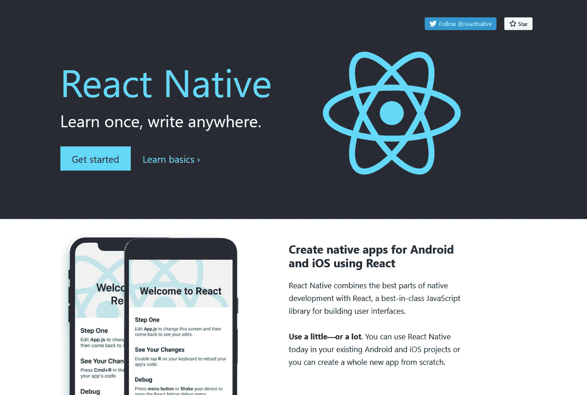

# 我立刻喜欢和讨厌的东西反应自然

> 原文：<https://javascript.plainenglish.io/things-i-instantly-loved-and-hated-about-react-native-c145f1f04392?source=collection_archive---------13----------------------->

## 这将是我构建原生应用的首选。

The best part is, it uses React. [Screenshot from the official React Native Website](https://reactnative.dev/).

# 我喜欢的东西

## 1.[它使用 React](https://reactjs.org/) 。

这意味着我对 React Native 的学习曲线不到一周。React 是我最喜欢的库，原因有很多。主要原因是它的组件驱动方法。您可以轻松地将复杂的 ui 分解成简单的组件。虽然它可能会创建更多的文件，但它极大地提高了代码库的可读性和可管理性！

因为 React Native 也使用 React，它附带了我喜欢 React 的所有东西。此外，不要忘记，如果您了解 JavaScript，React 是一项很容易掌握的技能。

## 2.[它有样式表](https://reactnative.dev/docs/stylesheet)。

我总是喜欢在 React 中使用 CSS 模块，因为它们保持特定于组件的样式，并且不会污染全局样式。由于 CSS 不能在你的移动设备上运行，React Native 使用类似的方法来设计你的移动应用。

虽然您可以放置内联样式，但是更好的和推荐的方法是使用样式表。这些样式表就像组件本地的 CSS 模块一样工作。此外，您可以自由使用其他样式工具，如[***样式化组件***](https://styled-components.com/docs/basics#react-native) 。

Also, give CSS modules a try if you do not use it.

## 3.[使用 Flexbox](https://reactnative.dev/docs/flexbox) 。

如上所述，React Native 使用了与 CSS 类似的方法。为了我的喜欢，他们还带来了大部分的 **flexbox** ，内部使用的东西被称为 [***瑜伽***](https://yogalayout.com/docs) 。*[***Flexbox 是我在 web 项目中构建布局的首选方式***](https://css-tricks.com/snippets/css/a-guide-to-flexbox/) 。事实上，flexbox 对移动布局很有意义，因为它给你的设计带来了很好的流畅性。*

## *4.它有博览会。*

*什么是世博会？它是一个框架，也是一个完整的平台，可以为你的用户构建和发布移动应用。这意味着大多数时候，你不必运行 Android Studio 或 Xcode 来测试你的应用，而是可以使用 Expo Go 应用在开发期间实时查看应用，甚至 [***将你的应用的预发布版本分享给客户***](https://docs.expo.dev/guides/sharing-preview-releases/) 。相信我，世博会的体验会很好，而且只会在未来有所改善。*

# *我讨厌的事情*

## *这是一项艰巨的工作。*

*显然，这种情况会发生，因为你要为 Android 和 IOS 处理一个单一的代码库。你可以用不同的方式来处理同一件事情，比如在处理 [***安全区域视图***](https://reactnative.dev/docs/safeareaview) 或者设计按钮的样式，因为它们在各自的操作系统上看起来不同。*

*这将会使你感到沮丧，因为你在这里浪费了很多时间，而不是编写业务逻辑。但是，这难道不比完全编写两个独立的代码库要好吗？如果你是一个自由开发者，React Native 是你的武器库中一个非凡的武器。完善的组织通常会通过在 Kotlin 或 Swift 中本地构建应用程序来获得更好的控制和性能，如果需要，还可以将*[***spray React Native***](https://reactnative.dev/showcase)*融入其中。***

****更多内容请看*[***plain English . io***](http://plainenglish.io/)*。报名参加我们的* [***免费周报***](http://newsletter.plainenglish.io/) *。在我们的* [***社区不和谐***](https://discord.gg/GtDtUAvyhW) *获取独家写作机会和建议。****