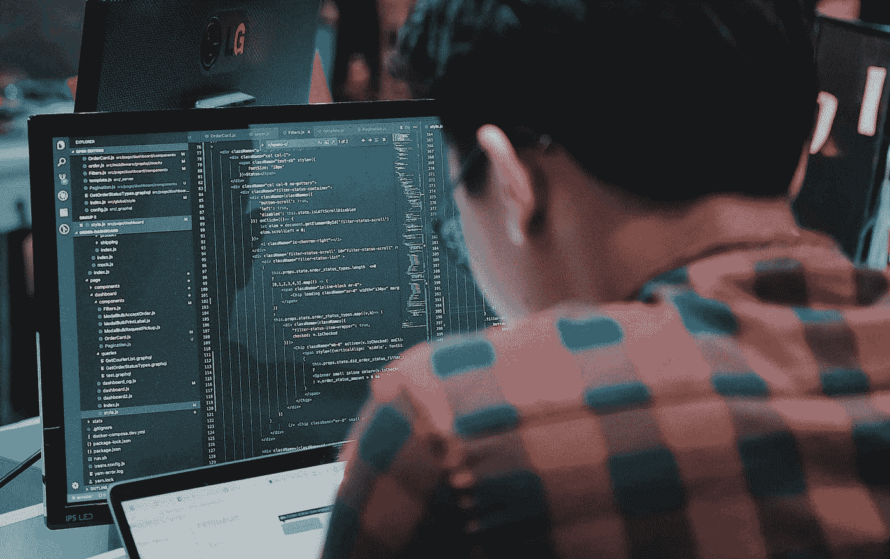

# 成为 Fullstack 开发人员的必备知识。

> 原文：<https://javascript.plainenglish.io/things-youre-actually-meant-to-know-to-get-hired-as-a-fullstack-developer-28a9534af2d4?source=collection_archive---------4----------------------->

# 以最少的经验获得工作

首先，你需要经验，但这是一个漫长的过程，所以你如何在经验最少的情况下被录用。

# **大多数大三学生需要知道的事情**

如果我雇佣一个初级开发人员加入我的核心团队，遵循首席开发人员的指示，有效地完成工作，而不需要不断地被指导。虽然他们可以依赖一个高级人员，但是这个人必须能够执行日常工作并修改主要代码库。

但是你需要知道什么？

**CRUD —** 拥有创建、读取、更新和删除操作的工作知识。这向我表明，您熟悉项目设置、基本原则、数据库和视图用法，可能还熟悉模板引擎。

**认证、授权&用户角色—** 与 CRUD 类似，管理用户角色和执行基本操作(如用户注册)以及了解如何使用会话是大多数应用程序中的关键组件。

**静态文件—** 附加的静态文件，如 CSS 和 JavaScript 脚本、pdf 和图像。你知道如何设置你的应用程序来处理用户上传的内容，以及在哪里存储这些文件吗？

**项目结构—** 我会原谅这里的大多数初级人员，但是我希望您能够根据用例和分类将您的项目适当地划分到应用程序中。例如，您何时以及如何决定将您的代码拆分到一个新的应用程序中？你为什么把你的模板放在那个地方？你的网址是如何划分和组织的？

**构建 API—**通常的做法是利用一个框架来开发一个 API，与 React、Vue 或 Svelte 等前端框架一起使用，甚至只是公开一些公共数据。但是，并不是每个 app 都会有 API。除了了解 API 如何操作之外，我肯定希望您对实现 REST 实践以及如何使用 Django REST framework 或 nodejs 开发 Restful API 有一个基本的了解。

**Web 开发基础—** 我可能不需要提这个，但无论如何我都会提。请熟悉网站的基本功能，并花些时间了解以下内容:

*   基本 Python
*   超文本标记语言
*   半铸钢ˌ钢性铸铁(Cast Semi-Steel)
*   Git & GitHub
*   请求响应周期和 Http 方法
*   基本 JavaScript

## **您应该能够构建的应用:**

*   待办事项应用程序
*   电子商务网站
*   社交网络
*   等等

从 Todo 应用程序开始构建这些应用程序，你会学到很多东西。

*更多内容请看*[***plain English . io***](https://plainenglish.io/)*。报名参加我们的* [***免费周报***](http://newsletter.plainenglish.io/) *。关注我们关于*[***Twitter***](https://twitter.com/inPlainEngHQ)[***LinkedIn***](https://www.linkedin.com/company/inplainenglish/)*[***YouTube***](https://www.youtube.com/channel/UCtipWUghju290NWcn8jhyAw)*[***不和***](https://discord.gg/GtDtUAvyhW) ***。*****

*****对缩放您的软件启动感兴趣*** *？检查* [***电路***](https://circuit.ooo?utm=publication-post-cta) *。***