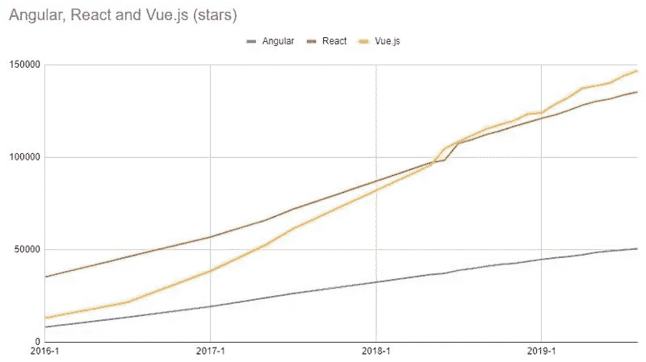
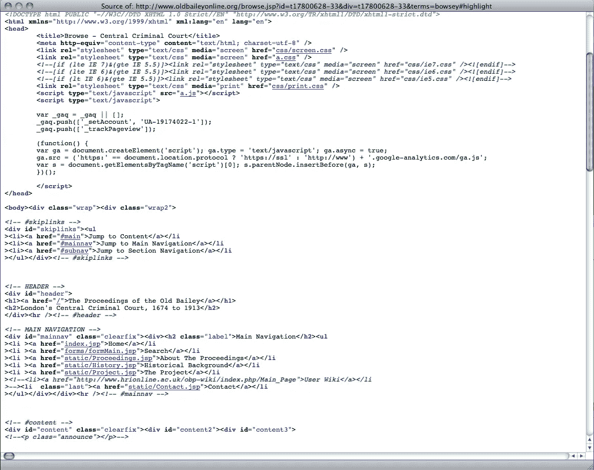

# 在您的下一个项目中使用 Vue.js 之前，请三思

> 原文：<https://javascript.plainenglish.io/think-again-before-using-vue-for-your-next-project-999bb8c556bf?source=collection_archive---------3----------------------->

Source: Wikimedia Commons

早在 2014 年，与 AngularJS 等现有解决方案相比，Vue.js 作为一种更轻、更快、更简单的水疗中心开发方法进入了 NPM 生态系统。

从那时起，它已经证明了它有能力为现代企业开发强大的应用程序。像阿里巴巴、任天堂和 Gitlab 这样的公司已经将它用于他们的一些服务。

对于新的网络项目来说，这也是一个受欢迎的选择。我最近的三个软件开发职位——其中两个是在初创公司——都大量使用了 Vue.js。

Source: [Mohammad Kermani](https://www.freecodecamp.org/news/angular-react-vue/)

不幸的是，我的经历并不完全乐观。

不久前我写了一篇文章，讨论了我对 React 和 Vue 的看法。剧透:我更喜欢 React。虽然我知道我当时的观点，但我的观点在那篇文章中并没有被考虑，这和我对反应的偏好没有任何关系。

事实上，我在生产应用中使用 Vue 的令人失望的经历并不是因为框架本身的缺点，而是因为使用(和滥用)它的开发人员。

但是在我开始之前，先介绍一下 spa 和基于组件的 web 开发。

# 现在已经不是 2000 年了

二十年前，web 开发要简单得多。服务器将接收带有一些参数的请求，并返回一个基于某个模板的 HTML 页面，其中填充了动态内容。

这有两个明显的问题:任何新内容都需要重新加载页面，更重要的是，几乎不可能写出简洁明了的 HTML。

What HTML development used to look like (source: [Programming Historian](https://programminghistorian.org/en/lessons/viewing-html-files))

单页应用程序解决了定义中的第一个问题。他们也很容易解决第二个问题，因为开发人员意识到，如果页面完全是 Javascript，他们也可以使用 Javascript 来动态生成可以组合成更大页面的组件。

组件让网站变得更好的原因和模块让软件变得更好的原因一样。它们可重复使用，更容易概念化和推理，添加、删除或替换也毫不费力。

但是模块化有一个重要的指导原则，尽管基本上是不言自明的，但即使是有经验的程序员也经常忽略或忘记它。更小、更通用的组件比更大的组件更具可重用性，并提供更多的功能。

在我使用 Vue 的职业经历中，这是我经常看到违反的原则。但是为什么与其他 SPA 框架相比，Vue 经常被违反呢？

# 这不是 Vue 的错…或者是吗？

在 Vue 中编写小且高度可重用的组件并不困难。也有可能编写大而笨拙的 React 组件。把使用 Vue 的开发者的错误归咎于 Vue，这公平吗？

它不是。实际上，与其说这是对 Vue 的谴责，不如说这是一个假设，解释了为什么这个库比 React(和其他一些框架)更容易编写大型的防干燥组件。

与此相关，一个类似的论点经常被用来批评 Javascript。我一直坚持认为，一种容易被滥用的语言不一定会变坏——只是一种需要额外努力才能正确使用的语言。当涉及到 Vue 时，应用同样的原则是公平的。

但是为什么在 Vue 中更容易写出不好的组件呢？我很快想到了几个主要原因。

## 模板语法

Vue 的模板系统简单易用。很容易切换组件的存在，或者从一个列表中生成一堆组件，或者使用任何其他常见的模板模式，只需简单的指令，如`v-if`和`v-for`。

在 React 中，这并不容易，也不美观——这些模式需要 Javascript 逻辑，比如三元运算符(`?`和`.map`)。

这一切意味着什么？在 React 中，不断向组件添加东西比在 Vue 中要难得多。

这使得开发对于初学者来说更加容易，对于快速原型开发来说更好。但是对于更大的应用程序，这意味着开发人员更有可能使用`v-something`黑客来使他们的代码正常工作，而不是重构他们的组件来使他们的代码更干燥，使组件更小。

## 组件定义

Vue 组件使用一种特殊的文件格式——`.vue`——这也促使开发人员编写越来越大的组件，并避免重构。

大多数现代的 React 应用程序使用功能组件，这些组件必须计算它们所有的内部逻辑，并在单个函数范围内返回一个 React 节点。当向 React 功能组件添加行为或内容时，这会导致回报迅速减少(并增加技术债务)。

Vue 恰恰相反。(Vue 支持功能组件，但实际上很少用到。)逻辑基本上与模板分离，继续添加越来越多的方法和计算函数非常容易。

同样，对于初学者和快速原型制作来说，这没有问题，甚至是一件好事。但是当在一个更大的代码库上工作时，试图最大化他们冲刺速度的开发人员会说“去他妈的”，只是在现有的组件上添加一堆方法，而不是将常见的行为重构到更小的组件中。

这一切的最终结果？Vue 组件长达数千行，每一行都有几十个方法和计算函数，还有一个带有足够多 XML 缩进的模板，让您眼花缭乱。几乎不可能理解组件的所有功能和工作原理。但是它太大了(对整个应用程序来说太关键了)，以至于不值得花时间去重构这个千行组件。

根据我的经验，这种不愿将代码重构为更小、更可重用的模块是技术债务的最大原因。

虽然这个问题肯定不是 Vue 独有的，但 Vue 的设计也没有帮助你避免这种技术债务。

这些都不是不使用 Vue 的好理由，尤其是如果你的团队由经验丰富的软件工程师组成，他们了解过大模块的危险以及经常和尽早重构的重要性。

但是，如果你管理的开发人员有偷工减料的倾向，或者缺乏避免沉重的技术债务的远见，这当然是重新考虑你为下一个 SPA 选择哪个库的理由。

*更多内容请看*[***plain English . io***](https://plainenglish.io/)*。报名参加我们的* [***免费周报***](http://newsletter.plainenglish.io/) *。关注我们关于*[***Twitter***](https://twitter.com/inPlainEngHQ)*和*[***LinkedIn***](https://www.linkedin.com/company/inplainenglish/)*。加入我们的* [***社区不和谐***](https://discord.gg/GtDtUAvyhW) *。*