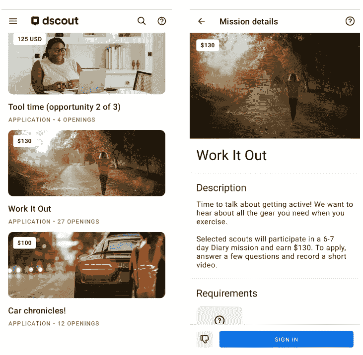
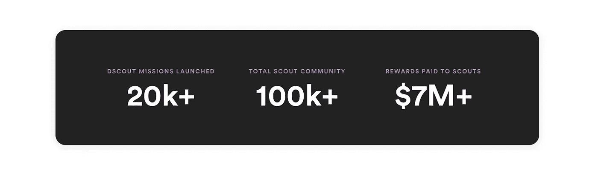

# 这款应用为你做简单的调查支付数百美元——值得你花时间吗？

> 原文：<https://javascript.plainenglish.io/this-app-pays-you-hundreds-of-dollars-for-taking-simple-surveys-is-it-worth-your-time-f54cfeb4b9e5?source=collection_archive---------4----------------------->

Photo by [mohamed_hassan](https://pixabay.com/users/mohamed_hassan-5229782/) on [Pixabay](https://pixabay.com/?utm_source=medium&utm_medium=referral)

我们都想在舒适的家中赚钱。

许多公司在花费大量资源来解决问题之前，需要研究某些主题来了解市场。因此，他们进行调查，以了解当前市场中的痛点。

参与研究活动/调查是网上赚钱最简单的方式之一。

作为用户，你需要的只是一个互联网连接和基本的写作或口语技能。

问题是，没有多少网站愿意花大价钱进行调查。花几个小时做调查只能赚几美元。

**这里就是** [**dscout**](https://dscout.com/) **脱颖而出的地方。在这个应用程序上做调查，你实际上可以赚很多钱。**

***注意:在我们做详细介绍之前，注意这不是一篇付费文章。当我偶然发现这个应用程序和它可以帮助一个人赚钱时，我想与我的观众分享这个。***

# 什么是 dscout？

它基本上是一个帮助企业进行有影响力的研究调查的应用程序。

你可以为你的企业进行研究，也可以参与研究以换取金钱。

一旦你下载了他们的应用程序，你就可以看到你在这个时间点可以进行的所有公开调查。

您可以看到有 27 个**空缺**用于 ***解决*** 调查。参加这项调查需要支付 130 美元。在这个特别的调查中，他们想知道你锻炼时需要的不同装备。就这么简单！

您需要首先申请调查。只有被选中的参与者才能参与调查并获得**130 美元！**

申请过程非常简单。你需要回答一些问题。在某些情况下，你需要上传你的照片和你谈论某个话题的小视频。

一旦你申请，研究人员将审查你的申请，并让你知道你是否被选中参加。

一个简单的调查 130 美元是一笔大数目。许多这样的研究调查通常只支付几美元来换取你的时间。

这就是 dscout 给我留下深刻印象的地方。

# 能赚多少钱？

***我个人没有参加过这些调查。***

但当我偶然发现这个应用程序时，我做了一些研究，我可以看到它在**谷歌**和**苹果应用商店**上获得了不错的评级。

我甚至了解到，许多人实际上已经在这个应用程序上持续每月赚了 1000 美元。

这是 dscout 放在他们网站上的内容。

他们已经为在他们的平台上完成的大约 20000 项调查支付了超过 700 万美元。

如果你做简单的计算，一个调查大约需要**350 美元！**

当然，不是所有的调查都付这么多。有的付出多，有的付出少。但是这些数字非常有希望。

# 这对你辞职有帮助吗？

嗯，这取决于你目前的工资是多少。

例如，如果你从事技术行业，并且已经赚了很多钱，那么这个应用程序肯定不能代替你的工作。

它可以帮助你在周末获得不错的额外收入。

但是对于一个低薪工作的人来说，这绝对可以帮助他们辞掉工作，开始做简单的调查赚钱。

你能挣多少钱也取决于你参与的任务的持续时间。

**尽管如此，我认为这是一个探索的好机会，如果你现在没有任何其他的方法来获得额外收入的话。**

# 如何在 Dscout 上获得报酬？

现在让我们进入最重要的部分。怎么才能拿到工资？

到今天为止， **dscout** 只支持 PayPal 作为支付球探的方式。所以在你注册这个平台之前，确保你有一个经过验证的 PayPal 账户。

你完成的每一个任务都会为你赢得一定的数量。而且 **dscout** 的妙处在于，你不需要达到一定的门槛就可以提取你已经赚到的。任务结束后，Dscout 会付给你钱。

如果你在截止日期前完成了任务，**你必须等到截止日期过后才能拿到报酬**。然后，通常需要 **10 个工作日**付款才会反映到您的 PayPal 账户中。

# 结论

Dscout 是一个合法的网站，可以帮你兼职赚钱。这无疑为你提供了另一种额外收入。

也就是说，人们应该考虑在这个平台上花费时间吗？

让我们看看。以下是我看到的该平台的一些优势:

1.  通过 PayPal 支付
2.  全球可用
3.  无支付阈值
4.  每个任务都有好价钱

但是这个平台也有一些缺点。现在任务的数量是有限的。所以会有竞争。

另一个缺点是你需要花一些时间申请每个任务。**这并不保证您会被选中参加调查。然而，你必须花时间去申请。**

在决定这是否是一个值得探索的平台时，请记住以上几点。

# 相关文章:

1.  软件开发人员赚钱的 6 个简单方法(2022 年)
2.  [软件开发商的 6 个流行被动收入点子](https://sunilcs.com/6-popular-passive-income-ideas-for-software-developers/)
3.  [网上写作赚钱的 6 种最佳方式](https://sunilcs.com/6-best-ways-to-make-money-writing-online/)
4.  [我花了 35 个小时写了一本电子书，前 6 个月赚了 2723 美元](https://sunilcs.com/i-spent-35-hours-writing-an-ebook-and-earned-2723-usd/)
5.  通过增加网上曝光率辞去工作:掌控自己生活的有效方法

*更多内容看* [***说白了。报名参加我们的***](https://plainenglish.io/) **[***免费周报***](http://newsletter.plainenglish.io/) *。关注我们关于* [***推特***](https://twitter.com/inPlainEngHQ) ，[***LinkedIn***](https://www.linkedin.com/company/inplainenglish/)*，*[***YouTube***](https://www.youtube.com/channel/UCtipWUghju290NWcn8jhyAw)*，以及* [***不和***](https://discord.gg/GtDtUAvyhW) *。对增长黑客感兴趣？检查* [***电路***](https://circuit.ooo/) *。***