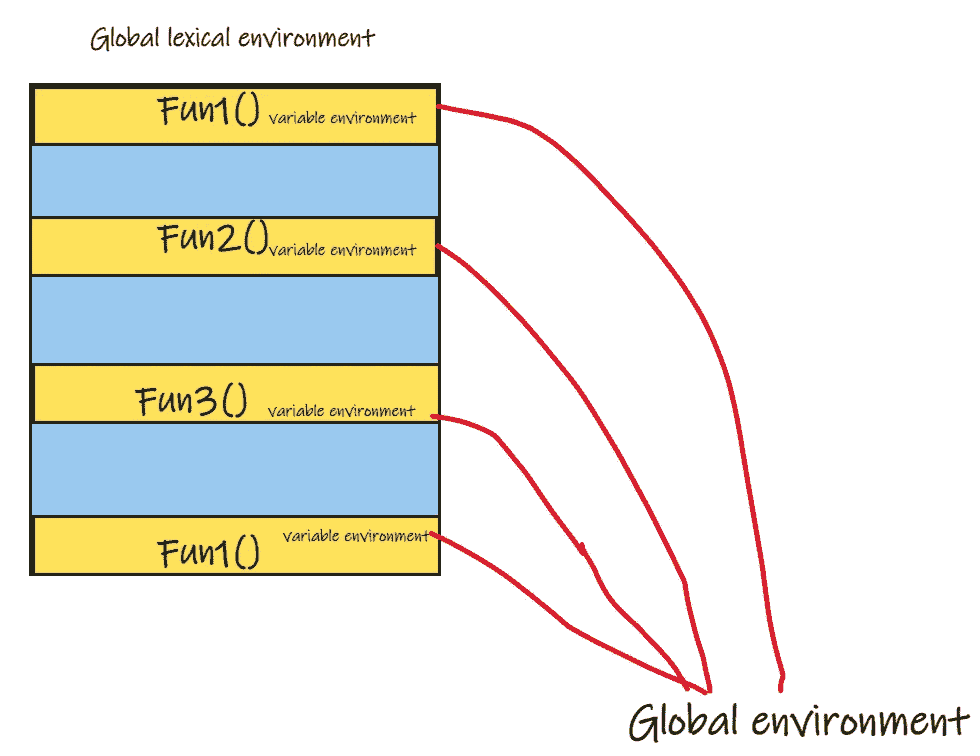
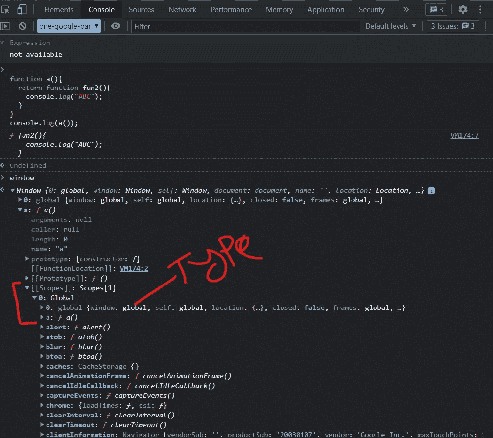
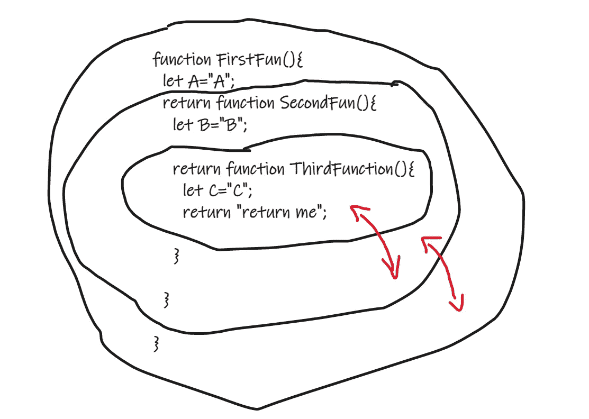
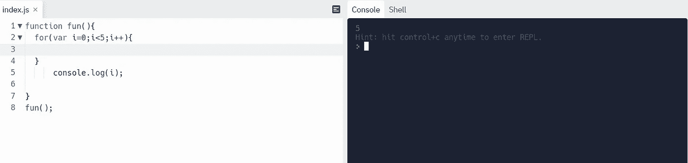
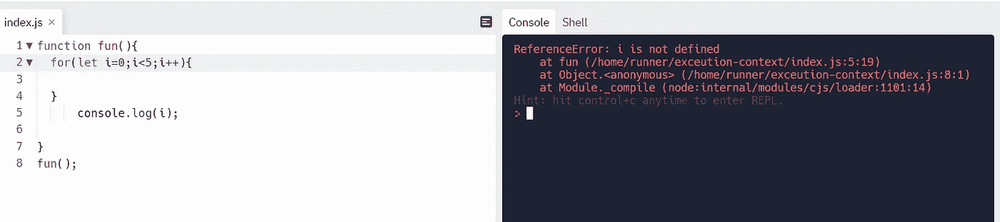

# 关于 JavaScript 中的作用域和作用域链，您只需要知道

> 原文：<https://javascript.plainenglish.io/this-is-all-you-need-to-know-about-scope-and-scope-chain-in-javscript-e751500bc255?source=collection_archive---------9----------------------->

## JavaScript 中的作用域和作用域链教程。

photo by [**Frederick Marschall**](https://unsplash.com/@freddymarschall) from [**unsplash**](https://unsplash.com/)

**作用域链:**我们知道，每个函数调用都会在调用栈中创建一个执行上下文，每个执行上下文都可以访问它的环境变量和一个与外界的链接，这意味着其他执行上下文和全局执行上下文。每当我们的代码在函数调用期间试图访问一个变量时，它就从局部变量开始搜索，并跳转到调用堆栈中的外部范围和其他执行上下文。

在上面的例子中，它从本地环境开始搜索，但是该函数发现打印的内容不是本地的，于是开始从全局环境中搜索，并且可以看到 **A** 并将其打印出来。在下图中，我们看到，每当我们找不到局部变量时，我们就会着眼于外部环境。

当一个函数被调用时，一个词法环境或新的作用域被创建，每个新创建的环境都有自己的变量环境，它指向外部作用域，直到到达全局作用域。

函数作用域: JavaScript 有一个基于函数的作用域，这意味着你声明一个新函数，它会为自己创建一个新的气泡。

**fun()** 的作用域气泡包括 **a，b，**和 **fun1()，**当为该函数创建作用域气泡时，无论声明何时发生。位于 **fun()** 内的 **fun1()** 也将有其作用域气泡，并且 **fun()** 内的任何声明在其作用域之外都是不可访问的。函数作用域鼓励这样一种思想，即所有变量都属于函数，并且可以在整个函数中使用和重用。

**块作用域:**块作用域可以定义为花括号内变量的作用域，在 ES6(2015) JavaScript 之前只有全局作用域和函数作用域。ES6 引入了两个重要的新 JavaScript 关键字:`let`和`const`。这两个关键字在 JavaScript 中提供了**块范围**。

*块范围用****var****关键字:*

*块范围用* ***让*** *和* ***常量*** *关键字:*

> 我是一名自由职业的全栈 web 开发人员和技术作家，请随时联系我🤓

在 LinkedIn 上关注我:

 [## 阿里·穆斯塔法-网络开发人员-自由职业者| LinkedIn

### 查看阿里·穆斯塔法在全球最大的职业社区 LinkedIn 上的个人资料。阿里有 4 个工作列在他们的…

www.linkedin.com](https://www.linkedin.com/in/ali-mustafa-195a321a0/) 

在 GitHub 上关注我:

 [## Ali11Mustafa -概述

### 热情，自我驱动，注重细节，有雄心和动力按时开发软件解决方案

github.com](https://github.com/Ali11Mustafa) 

*更多内容请看*[***plain English . io***](https://plainenglish.io/)*。报名参加我们的* [***免费周报***](http://newsletter.plainenglish.io/) *。关注我们关于*[***Twitter***](https://twitter.com/inPlainEngHQ)*和*[***LinkedIn***](https://www.linkedin.com/company/inplainenglish/)*。查看我们的* [***社区不和谐***](https://discord.gg/GtDtUAvyhW) *加入我们的* [***人才集体***](https://inplainenglish.pallet.com/talent/welcome) *。*