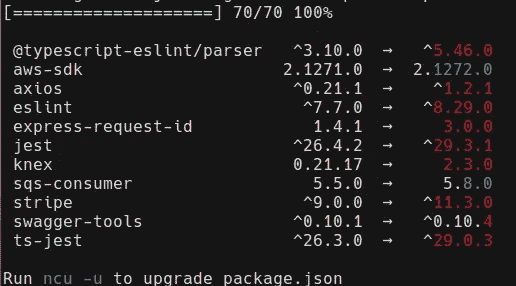
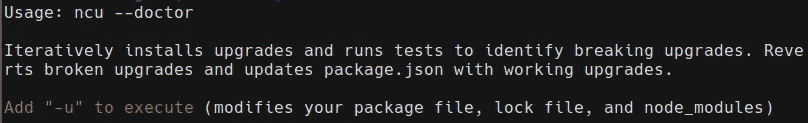

# 这就是如何更新您的节点依赖关系，而没有痛苦

> 原文：<https://javascript.plainenglish.io/this-is-how-to-can-update-your-node-dependencies-without-suffering-bec079274e6f?source=collection_archive---------14----------------------->

## 💻多亏了这个工具，我节省了一天的工作。


Photo by [Clément Hélardot](https://unsplash.com/@clemhlrdt?utm_source=medium&utm_medium=referral) on [Unsplash](https://unsplash.com?utm_source=medium&utm_medium=referral)

本周，在我作为后端软件工程师的工作中，我开始了一项与 T2 更新我们的节点版本和相应的依赖关系相关的任务。目前，我们正在使用节点 v16，很快标准将是节点 v18。

基于我之前在个人小项目中安装和管理节点依赖的经验，我相信**这将是一个简单的任务**，我很快就能解决。

然而，这是一个令人头痛和痛苦的坑，因为我不能只使用 **npm 更新**。谢天谢地，我终于找到了这个工具。

[](https://medium.com/codex/stop-kidding-yourself-its-never-just-5-minutes-when-you-write-code-dc0995cbbd37) [## 不要自欺欺人了——当你写代码的时候，从来都不是 5 分钟

### 目前，我是一名后端软件工程师。如果你在这个行业工作，可能你已经…

medium.com](https://medium.com/codex/stop-kidding-yourself-its-never-just-5-minutes-when-you-write-code-dc0995cbbd37) 

## 只进行“npm 更新”有什么问题？

起初，我想到使用 **npm 更新**，或者 **npm 安装**，然而，我对这种方法有一个相关的问题。这将是一个简单的更新，我必须确保我们的应用程序继续完美地工作。

我不能只使用安装或更新指令，因为有一些依赖关系**在新版本**中改变了它们的行为，所以如果我这样做，我公司的应用程序就会被破坏。

此外，当我在互联网上搜索解决方案时，我只找到了解决中断依赖关系或管理对等依赖关系的说明。


Photo by [Adrian Swancar](https://unsplash.com/@a_d_s_w?utm_source=medium&utm_medium=referral) on [Unsplash](https://unsplash.com?utm_source=medium&utm_medium=referral)

幸运的是，在一篇精彩的堆栈溢出文章中，我发现…

## Npm 检查更新

[**Npm 检查更新**](https://www.npmjs.com/package/npm-check-updates) 对于**升级我们的节点依赖**是一个神奇的工具。它有一个带有简单语法的清晰输出，并且它维护了现有的语义版本化策略。

我们可以安装它:

```
npm install -g npm-check-updates@latest
```

仅通过使用:

```
ncu
```

您可以**查看所有可以升级的依赖项**及其对应的最新版本。



Picture [self-made by author](https://medium.com/@jesuslagares)

此外，您还可以使用 too:

```
ncu -u 
```

要**直接更新你的 package.json】。**

但是，神奇的是，如果您使用以下命令:

```
ncu --doctor -u
```

有了这个命令， **ncu** 将迭代**为您之前运行的测试**安装升级，以识别破坏性升级。如果更新破坏了任何测试，它将恢复安装并保留以前的版本。



Picture [self-made by author](https://medium.com/@jesuslagares)

只需一个简单的命令，我就能完成任务要求我做的一切。一旦我应用了它，我就可以**更新我的节点版本**和依赖关系**，确保我的代码仍然工作**。此外，你也可以搭配**纱线**使用。是不是很奇妙？

尽管如果你打算使用它，我建议你留出大量的时间，因为它将测试你拥有的每个依赖的所有单元测试，但是这是值得的。

如果你想进一步了解这个漂亮的实用工具，我推荐[查看官网](https://www.npmjs.com/package/npm-check-updates)。

[](https://medium.com/codex/5-best-practices-that-you-should-take-into-account-before-pushing-your-code-ab94fbfc6a9a) [## 在发布代码之前，你应该考虑的 5 个最佳实践

### 😖否则你肯定会被解雇

medium.com](https://medium.com/codex/5-best-practices-that-you-should-take-into-account-before-pushing-your-code-ab94fbfc6a9a) 

> *你是不是想买个* [*中等会员*](https://medium.com/@jesuslagares/membership) *？如果你想在媒体上获得最好的内容，考虑一下* [*使用我的推荐链接*](https://medium.com/@jesuslagares/membership) *。同样的价格，你会支持我的工作。*

## 结论👋

谢谢大家！非常感谢您阅读这篇文章。如果你想了解更多关于技术和发展的知识，别忘了跟我来。我很想知道你对此的看法，所以不要花花公子**写在评论里**，我会读给你听。

如果这篇文章已经帮助你记住了，你可以**为它鼓掌**并分享给你的同志们。

## 关于作者🤓

嗨！很高兴见到你！我是**杰西·拉加雷斯**。目前，我是一名后端软件工程师，正在加的斯大学完成我的计算机科学学位。

我的两大爱好是**技术**和**交流**，所以我会抓住一切机会谈论或撰写关于技术的文章。我喜欢把复杂的概念转换成每个人都能理解的简单概念。

## 想要连接吗？📲

📸[**Instagram**](https://instagram.com/jesuslagares_)**|**💼[**LinkedIn**](https://www.linkedin.com/in/jesus-lagares/)**|**📹[YoutubeT16)|🐦](https://www.youtube.com/c/Jes%C3%BAsLagares) [**推特**](https://twitter.com/jesuslagares_)

📩**jesuslagaresgalan@gmail.com**

谢谢！❣️

*更多内容请看*[***plain English . io***](https://plainenglish.io/)*。报名参加我们的* [***免费每周简讯***](http://newsletter.plainenglish.io/) *。关注我们* [***推特***](https://twitter.com/inPlainEngHQ) ，[***LinkedIn***](https://www.linkedin.com/company/inplainenglish/)*，*[***YouTube***](https://www.youtube.com/channel/UCtipWUghju290NWcn8jhyAw)*，* [***不和***](https://discord.gg/GtDtUAvyhW) ***。***

***有兴趣缩放你的软件启动*** *？检查* [***电路***](https://circuit.ooo?utm=publication-post-cta) *。*