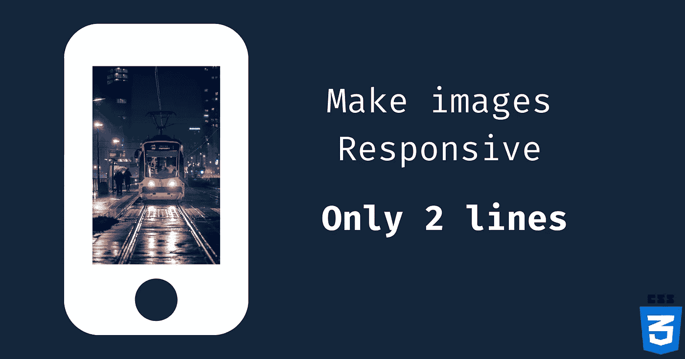
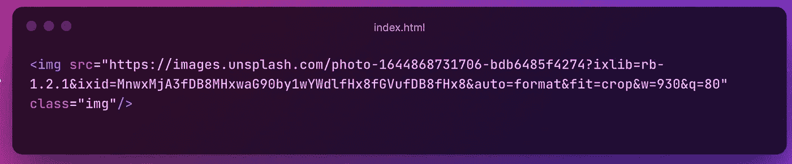

# 这就是你如何在 CSS 中使图像具有响应性

> 原文：<https://javascript.plainenglish.io/this-is-how-you-make-images-responsive-in-css-6518f2971d1f?source=collection_archive---------10----------------------->

## 一种简单的方法，只需 2 行 CSS 就能使图像具有响应性。

# 大家好👋

怎么了朋友们，这是**雪球**回来了。我是一个年轻的热情和自学前端网站开发人员，并打算成为一名成功的开发人员。

今天，我带来了一个很酷的 CSS 技巧，可以帮助你避免陷入麻烦。

# 我们走吧…

对于 web 开发人员来说，制作移动响应图像并使所有内容适合视窗是非常重要的。

让我们从 **Unsplash** 中选择一张图片吧——(任你选)。

Source: Unsplash

现在，是时候将图像添加到我们的 HTML 文件中了:

现在让我们先睹为快:

**我猜你已经尝试过调整图像大小了，是吗？
在这里，你可以注意到图像没有反应，变得不舒服😱在手机上看。**

现在，让我们拿出我们的超能力🔥CSS 的**和**给它一个亲切的外观。

这里我们给图像 100%的宽度和独立的高度，这里`**max-width**` **属性是完全可选的。**

以下是最终输出:

*“空白从来不是白的。”*

感谢您的阅读，祝您愉快！您的欣赏是我的动力😊—给它一个赞。

*   在 Twitter 上关注我— [@codewithsnowbit](https://twitter.com/codewithsnowbit)
*   在 YouTube 上订阅我— [用雪球编码](https://www.youtube.com/channel/UCNTKqF1vhFYX_v0ERnUa1RQ?view_as=subscriber&sub_confirmation=1)

**编码快乐！**

*更多内容请看**[***说白了。报名参加我们的***](http://plainenglish.io/) **[***免费每周简讯***](http://newsletter.plainenglish.io/) *。在我们的* [***社区***](https://discord.gg/GtDtUAvyhW) *获得独家获得写作机会和建议。****