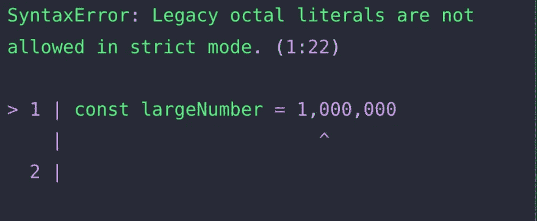
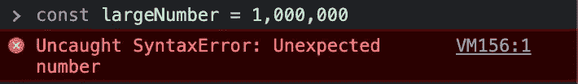
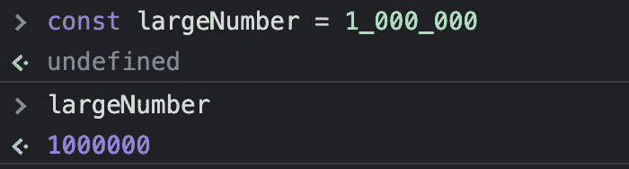

# 如何让 JavaScript 代码中的数字更具可读性

> 原文：<https://javascript.plainenglish.io/this-is-how-you-make-numbers-more-readable-in-your-js-code-336b59c1aa16?source=collection_archive---------17----------------------->


大家好👋

怎么了，朋友们？这里是**雪堆**。我是一个年轻的热情和自学的前端 web 开发人员，希望成为一名成功的开发人员。

今天，作为一名 JavaScript 开发人员，我在这里为你提供一些必须知道的技巧。

# 介绍

我们每天都与数字打交道，有些数字很小，但有些数字太大了(10000000000)。


不要担心写它们；你来对地方了。使用下面的技巧来保持代码的整洁。

# 让我们让数字更易读

我们一般用**逗号(，)**来分隔大数中的数字。但这是 JavaScript，所以你不能只用逗号分隔数字。

```
const largeNumber = 1,000,000 
```

如果在 JavaScript 中使用逗号分隔数字，您将会遇到以下错误👇



**让我们不用逗号分隔数字**

在 JavaScript 中，可以使用**下划线(_)** 来分隔数字。以下是你如何做到这一点。

```
const largeNumber = 1_000_000
```



**你和我一样懒吗？**

我写代码的时候懒得写这么长的数字。所以，我有一个好主意，如何写这些长数字，这有利于编写干净的代码。让我给你看看…

```
const largeNumber = 1e18
const secondLargeNumber = 4e12const aLargeNumber = 1e18 + 4e12
```

这里，模式是

```
const n = [starting number] e [number of zeros]
```

想试试这个吗？看看这把[小提琴](https://jsfiddle.net/mv6gs7tw/)

所以，这是一些让数字更易读的方法，你应该在你的下一个项目中使用。随意分享你想到的更多写数字的疯狂方法。

感谢您的阅读，祝您愉快！

您的赞赏是我的动力😊—给它一个赞。

*   在 Twitter 上关注我— [@codewithsnowbit](https://twitter.com/codewithsnowbit)
*   在 YouTube 上订阅我— [用雪球编码](https://www.youtube.com/channel/UCNTKqF1vhFYX_v0ERnUa1RQ?view_as=subscriber&sub_confirmation=1)

*更多内容请看* [***说白了就是***](http://plainenglish.io/) *。报名参加我们的* [***免费每周简讯***](http://newsletter.plainenglish.io/) *。在我们的* [***社区***](https://discord.gg/GtDtUAvyhW) *获得独家获得写作机会和建议。*