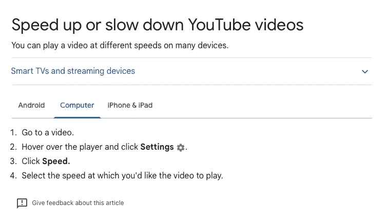
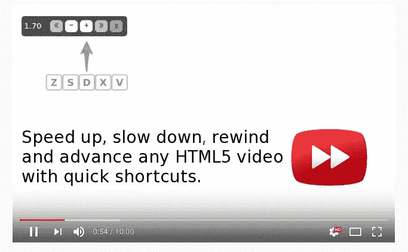

# 这个生活帮会让你在网络上节省几年时间

> 原文：<https://javascript.plainenglish.io/this-life-hack-will-save-you-a-few-years-on-the-web-eb10f70872ef?source=collection_archive---------11----------------------->

Photo by [Icons8 Team](https://unsplash.com/@icons8?utm_source=medium&utm_medium=referral) on [Unsplash](https://unsplash.com?utm_source=medium&utm_medium=referral)

几年前，有人告诉我这个生活帮，它彻底改变了我的生活。今天，我将与你分享。

## 思维实验

让我们想象一下，你平均每周花 8 小时观看 YouTube 视频。即每月 32 小时或每年 384 小时。所以看了 20 年 YouTube，384*20 = 7680 小时或 320 天(大约。1 年)。

但是等等，还有更多。你很可能不仅看 YouTube 视频，你还会看连续剧和电影，看在线培训视频，听播客，甚至学习新技能。也就是说，每周超过 8 小时，比你生命中的一年还多。

如果我告诉你你可以把时间减半呢？你可以做同样的事情，但是时间会更短。

这意味着两件事。您将:

*   能够减少你的屏幕时间，有更多的空闲时间，或者；
*   在同样的时间内做两倍的事情。

选择权在你。

## 但是你如何实现这一点呢？

解决方法很简单:提高你观看的视频的播放速度！

YouTube 允许你将视频加速到 2 倍的 T1，而网飞只能加速到 1.5 倍的 T3。然而，你总是可以安装一个浏览器扩展来加速视频，超越那些限制。

Speed up/slow down Youtube Videos — [Documentation](https://support.google.com/youtube/answer/7509567?hl=en&co=GENIE.Platform%3DDesktop&oco=0)

据我所知，每个浏览器都开发了一个奇妙的扩展，允许你这样做。

这里有一个用于 Chrome 的叫做[的视频速度控制器](https://chrome.google.com/webstore/detail/video-speed-controller/nffaoalbilbmmfgbnbgppjihopabppdk?hl=en)。而另一款针对 Safari 的叫做[加速](https://www.google.com/url?sa=t&rct=j&q=&esrc=s&source=web&cd=&cad=rja&uact=8&ved=2ahUKEwjt-_WwjoD6AhUI26QKHUVhCtIQFnoECAkQAQ&url=https%3A%2F%2Fapps.apple.com%2Fus%2Fapp%2Faccelerate-for-safari%2Fid1459809092&usg=AOvVaw1zBO61pB2p9abZ8plplGyE)。

这些扩展将在所有视频上覆盖一个速度控制器，甚至那些不允许速度被控制的视频😁

您甚至可以定义所有视频的默认速度，并使用键盘快捷键调整单个视频的速度。多牛逼啊！

Video Speed Controller — Using keyboard shortcuts

顺便说一下，你可以在手机上做同样的事情。

## 播客和有声读物呢？

你也可以加速它们！我通常听我最喜欢的播客，从 1.5x 到 2x，取决于这个人说话的速度。我也喜欢加快有声读物的速度，以便在空闲时间多看些书。

苹果播客应用程序可以让你达到 2 倍。如果你有 mp3 曲目，你可以从 AppStore/PlayStore 下载专门的应用程序来加速播放。

## 熟能生巧

我必须承认，当我发现这个生活帮的时候，我看不懂任何超过 **1.25x** 的东西。像任何技能一样，这需要练习，在某个时候，你将能够将这个极限推向 2 倍甚至更多，并打破你的记录！

总结之前的一个小趣闻，在使用这个技巧多年后，有时我会想为什么每个人都说得这么慢…

# 结论

我希望你能看到这个生活帮所提供的力量，我希望它能帮助你变得更有效率和更有成效，就像它帮助我一样。

如果你正在考虑在日常生活中实现这一点，一定要鼓掌👏🏼这个故事！

如果你喜欢我的内容，考虑订阅——没有垃圾邮件，我保证！

**保持安全，保持高效！** 🥳

**请在评论中与我们分享你富有成效的生活秘诀！**

 [## 成为有史以来最差的软件工程师:一个幽默的笑话

### 💡这个故事只是为了幽默。我们都需要时不时地开开玩笑，找点乐子。所以不要…

javascript.plainenglish.io](/become-the-worst-software-engineer-ever-a-humorous-take-c4d9eb3fc492)  [## 软件工程师如何被炒，快。

### 我以自由职业者的身份为一家中型公司工作，我们必须通过雇佣新的软件工程师来扩大我们的团队。但是…

javascript.plainenglish.io](/how-to-get-fired-as-a-software-engineer-fast-e99e6fe0d908) 

*更多内容看* [***说白了就是 io***](https://plainenglish.io/) *。报名参加我们的* [***免费周报***](http://newsletter.plainenglish.io/) *。关注我们关于* [***推特***](https://twitter.com/inPlainEngHQ) ， [***领英***](https://www.linkedin.com/company/inplainenglish/) *，*[***YouTube***](https://www.youtube.com/channel/UCtipWUghju290NWcn8jhyAw)*[***不和***](https://discord.gg/GtDtUAvyhW) *。**