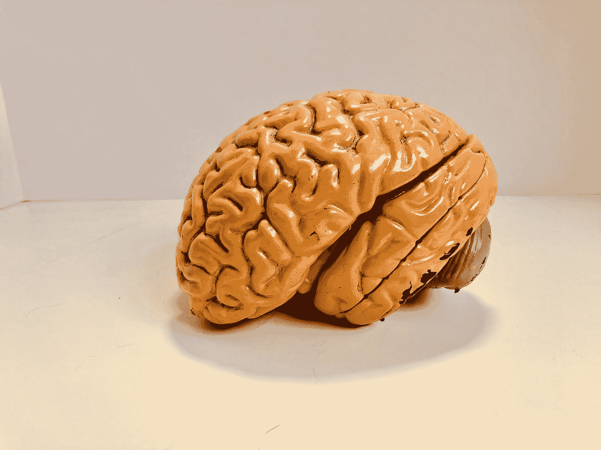

# 这项技术会把思想转换成文字！

> 原文：<https://javascript.plainenglish.io/this-technology-will-transfer-thoughts-to-texts-795c022a2d?source=collection_archive---------19----------------------->

## 在接下来的几年里，一扇新的窗口正在为技术人员打开！

Photo by [Natasha Connell](https://unsplash.com/@natcon773?utm_source=medium&utm_medium=referral) on [Unsplash](https://unsplash.com?utm_source=medium&utm_medium=referral)

甚至在几年前，将人脑连接到计算机来翻译思想被认为是未来的技术。然后我们听说了 Nuralink 这是艺龙面膜这一代人最炒作的项目之一，公司 CEO。

还有其他组织也在研究这项技术，但并不总是出现在新闻中，BrainGate 就是其中之一。它基本上是一个专门研究神经科学的合作研究组织。

# **BCI 技术的出现**

最近， **BrainGate** 研究人员启动了一项无线脑机接口(BCI)的人体试验，该试验表明人体无线发射器能够传递高带宽神经信号。

这些研究已经进行了很多年，但以前他们使用电缆将大脑信号传输到计算机中。这是他们第一次使用人工智能和小型发射器来翻译书写活动。

通过将发射器放在用户的头上，它连接到大脑皮层中的电极阵列。据说实验的准确率在 90–99%以上。

# **实验**

BrainGate 在一位 65 岁的瘫痪老人身上做了这个实验，他只是在思考单词，从来没有真正写过任何东西。他被要求集中足够的精力思考，通过想象写出他想要的东西。

计算机上已经有算法了。这些想法将信号从大脑传输到外部计算机，并将运动皮层信号翻译成文字。

这个过程也可以追踪 26 个字母和标点符号。“这个新系统既利用了皮质内电极记录的丰富的神经活动，又利用了语言模型的力量，当应用于神经解码的字母时，可以创建快速准确的文本，”该研究的第一作者、斯坦福大学神经修复研究员 Frank Willett 说。

BrainGate 已经研究这项技术好几年了，之前已经实现了将实际活动写入论文。

# **实现**

这项技术肯定会在医疗保健、行政管理和其他领域发挥作用。

BCI 能够帮助那些不能说话或身体瘫痪的人开口说话。在某一点上，这项技术将允许一个清醒但瘫痪的人通过思考鼠标的移动来控制电脑屏幕上的光标。

目前，它还不是一个产品。这项技术仍在学习中。研究人员这次能够使这一过程更快，并将在未来找到获得更好结果的方法。

它只是在进行实验，以衡量可能的最佳结果。电极不能捕捉许多大脑活动，还不能适应日常使用，并且其他因素与该过程有关。

# **风险因素**

随着技术的发展，它对人们来说也可能是脆弱的。这可能是侵犯个人信息和安全的一个潜在原因。

人类不习惯分享他们头脑中的每一个想法。然而，与 BCI 技术公司合作的公司将把这项技术商业化，用于他们的服务。

这些公司将能够在他们的数据库中保存你的秘密，这可能允许他们通过在大脑中植入单个芯片来控制你的部分思想。

# **好处&弊端**

BCI 有它自己的优点和缺点。它可能会成为人类科技的一次革命。脑机接口将能够向盲人的大脑传输视觉图像，让他看到，它可以直接向听不见的人的大脑传输数据，游戏玩家可以从大脑控制视频游戏，还有许多其他好处。

然而，研究仍处于初级阶段，它不成熟，不可实现，可能会有未被发现的副作用，头部只能跟踪一些信号，它会产生疤痕组织，当然还有安全入侵的风险。

神经技术是人类生活水平发展的又一步。用技术革新和解决问题的又一步。总会有妥协和优势，但最终，真正重要的是它给个人生活带来的价值。

## 参考资料:

1.  [https://ars technica . com/science/2021/04/new-high-bandwidth-wireless-BCI-helps-tetra plicats-use-table t-computers/](https://arstechnica.com/science/2021/04/new-high-bandwidth-wireless-bci-helps-tetraplegics-use-tablet-computers/)
2.  https://www . the brighter side . news/post/wireless-brain-implant-can-translate-your-thinks-to-text-with-94-accuracy

*更多内容请看*[*plain English . io*](http://plainenglish.io/)*。报名参加我们的* [*免费周报*](http://newsletter.plainenglish.io/) *。在我们的* [*社区*](https://discord.gg/GtDtUAvyhW) *获得独家的写作机会和建议。*