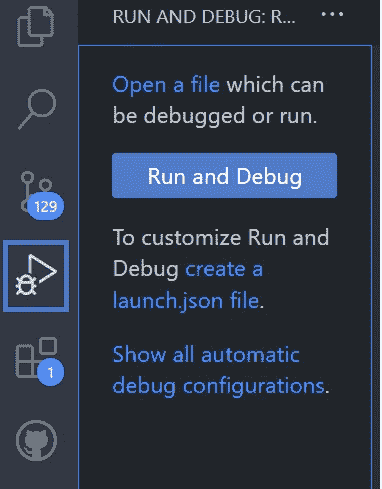
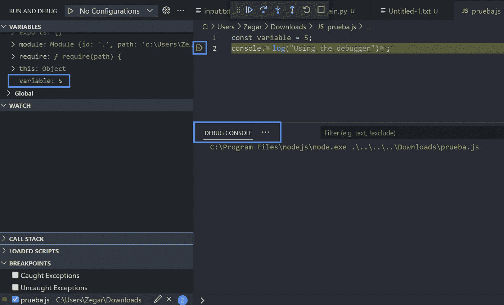

# 这个工具让我成为一名更好的软件开发人员

> 原文：<https://javascript.plainenglish.io/this-tool-is-making-me-a-better-software-developer-243ea598f5ec?source=collection_archive---------2----------------------->

## 如果你想写更高质量代码，🖱️现在就开始使用它


Photo by [Carlos Muza](https://unsplash.com/@kmuza?utm_source=medium&utm_medium=referral) on [Unsplash](https://unsplash.com?utm_source=medium&utm_medium=referral)

我在大学读书的时候，在一堂 C++课上学习了什么是调试器。在这些时候**我不太理解**，我认为它是一个**真正先进的工具**，只有当我面临记忆问题或相关事情时才会有用。

现在**，我每天在工作中使用它**，我鼓励我所有的同事使用它，如果他们想成为更好的开发者的话。根据我自己的经验，我可以肯定地说，如果你不知道如何使用这个强大的工具，**你就不能推进你作为软件开发人员的职业生涯**。

这就是我今天写这篇文章的原因，因为我不想让你浪费时间，这也是我向你展示这个神奇工具的原因。

> 我对调试器的看法是错误的，它是一个奇迹，你必须学会如何正确使用它。

[](https://medium.com/codex/this-is-why-you-should-start-using-design-patterns-in-your-code-6ec15e847c2e) [## 这就是为什么您应该开始在代码中使用设计模式

### 📋改进编码方式的 10 个重要理由

medium.com](https://medium.com/codex/this-is-why-you-should-start-using-design-patterns-in-your-code-6ec15e847c2e) 

## 什么是调试器？

一个**调试器**(众所周知的调试工具)是一个软件程序，它将允许我们**测试并找到我们代码**中的 bug 和错误。

使用该工具，我们可以根据具体情况停止或暂停程序**。此外，我们可以在程序运行时更改或检查变量的值。**

有了这个神奇的程序，我们**可以更好地控制我们的代码**并且很容易确定哪里有错误。使用它我们可以**准确地理解计算机如何看到我们的代码**。

您使用的调试器**将取决于您正在使用的编程语言或 IDE** ，但是除了在特定点停止之外，大多数调试器都能够以分步模式运行。

此外，使用一些编程语言，**很容易配置**并开始使用它们。例如，为了调试我的 NodeJS 代码，我只需将这个配置放在。json 文件:

```
{
    "version": "0.2.0",
    "configurations": [
        {
             "command": "npm run start",
             "name": "Run npm start",
             "request": "launch",
             "type": "node-terminal"
        }
    ]
  }
```

如果你想知道如何为你的 IDE 或者你喜欢的编程语言配置它，Google 将会是你的盟友。


Photo by [Firmbee.com](https://unsplash.com/@firmbee?utm_source=medium&utm_medium=referral) on [Unsplash](https://unsplash.com?utm_source=medium&utm_medium=referral)

## 为什么要掌握？

如果你想成为一名更好的开发者，并且一行一行地理解你的代码在做什么，你必须学会如何完美地使用调试器工具。我敢打赌你办公室里的每个高级职员都知道怎么做。

能够正确使用调试器工具将会在我们开发过程中的错误检测或解决过程中节省大量时间。但是，使用它还有许多其他好处:

*   你会更好地理解你程序的流程。
*   您可以在执行过程中改变变量值，这样您就可以轻松地进行测试。
*   你将能够**检查你代码的不同状态**，而不用改变你写的代码。
*   你可以在你想要的时候**停止执行**。
*   您可以只使用未完成代码行前的断点来测试未完成的代码。
*   调试帮助你将产生 bug 的复杂问题分解成简单的问题。
*   您也可以**调试您的测试**(例如使用 Jest)。
*   如果您目前使用 print 或 console.log 来检测错误，这将**节省您的大量时间**。

[](/discover-jest-in-3-minutes-a-simple-and-amazing-javascript-testing-framework-11abdc04a9c3) [## 5 分钟发现 Jest:一个简单而神奇的 JavaScript 测试框架

### 你想成为更好的 JavaScript 开发者吗？然后你必须了解测试，你必须了解…

javascript.plainenglish.io](/discover-jest-in-3-minutes-a-simple-and-amazing-javascript-testing-framework-11abdc04a9c3) 

## 我如何使用它？

在我的情况下，我每天都与 **JS** 和 **TS** 代码一起工作。为了在我的 VSCode 上使用它，我只需要**安装调试扩展**并**粘贴我之前在。当您点击“*运行并调试*”时，VSCode 为您创建的 json 文件**



Picture [self-made by the author](https://medium.com/@jesuslagares)

现在我只在我想检查是否有事情发生的地方放了一堆断点**和**在这些点停止执行**。当程序停止时，我可以看到我的变量的值(或者如果我想的话改变它),并使用调试程序提供的选项测试我的程序流。**



Picture self-made by the author

我通常在输出与我期望的不同时使用它们，或者当一个测试开始失败并且我不知道为什么的时候使用它们。

此外，当我必须将一些脚本应用到公司的生产数据库时，我使用调试器启动脚本，当脚本检索到将受脚本影响的用户时，我停止程序。

通过这样做，我可以确定我只改变我想改变的用户，并且不会有副作用发生。因此，我可以防止脚本中可能会损坏真实数据库的错误或缺陷。

[](https://medium.com/@jesuslagares/this-is-how-to-can-update-your-node-dependencies-without-suffering-bec079274e6f) [## 这就是如何更新你的节点依赖而不痛苦

### 💻多亏了这个工具，我节省了一天的工作。

medium.com](https://medium.com/@jesuslagares/this-is-how-to-can-update-your-node-dependencies-without-suffering-bec079274e6f) 

> *你是想买一个* [*中等会员*](https://medium.com/@jesuslagares/membership) *？如果你想访问媒体上最好的内容，可以考虑使用我的推荐链接**【[*。同样的价格，你会支持我的工作。*](https://medium.com/@jesuslagares/membership)*

## 结论👋

谢谢大家！非常感谢您阅读这篇文章。如果您想了解更多关于技术和发展的信息，请不要忘记**关注我**。我很想知道你对此的看法，所以不要花花公子**写在评论里**，我会读给你听。

如果这篇文章帮助你记住了，你可以**为它鼓掌**并与你的战友分享。

## 关于作者🤓

嗨！很高兴见到你！我是**赫苏斯·拉加雷斯**。目前，我是一名后端软件工程师，正在加的斯大学完成我的计算机科学学位。

我的两大爱好是**技术**和**交流**，所以我会抓住一切机会谈论或撰写关于技术的文章。我喜欢把复杂的概念转换成每个人都能理解的简单概念。

## 想要连接吗？📲

📸[**Instagram**](https://instagram.com/jesuslagares_)**|**💼 [**领英**](https://www.linkedin.com/in/jesus-lagares/) **|** 📹[Youtube](https://www.youtube.com/c/Jes%C3%BAsLagares)**|**🐦 [**推特**](https://twitter.com/jesuslagares_)

📩**jesuslagaresgalan@gmail.com**

谢谢！❣️

## 更多内容请访问 [PlainEnglish.io](https://plainenglish.io/) 。

报名参加我们的 [**免费每周简讯**](http://newsletter.plainenglish.io/) 。关注我们 [**推特**](https://twitter.com/inPlainEngHQ) ，[**LinkedIn**](https://www.linkedin.com/company/inplainenglish/)**，**[**YouTube**](https://www.youtube.com/channel/UCtipWUghju290NWcn8jhyAw)**，** [**不和**](https://discord.gg/GtDtUAvyhW) **。**

## 想用内容来扩展你的科技创业吗？检查[电路](https://circuit.ooo/?utm=publication-post-cta)。

我们提供免费的专家建议和定制解决方案，帮助您建立对您的技术产品或服务的认知和采用。