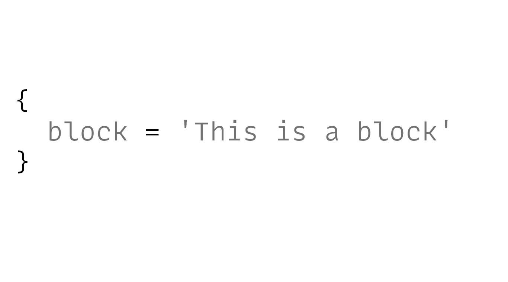
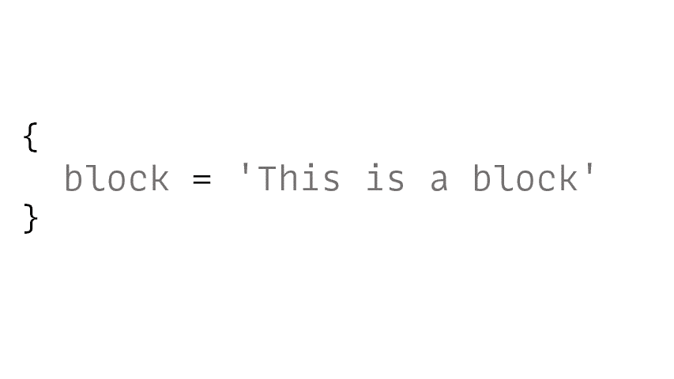
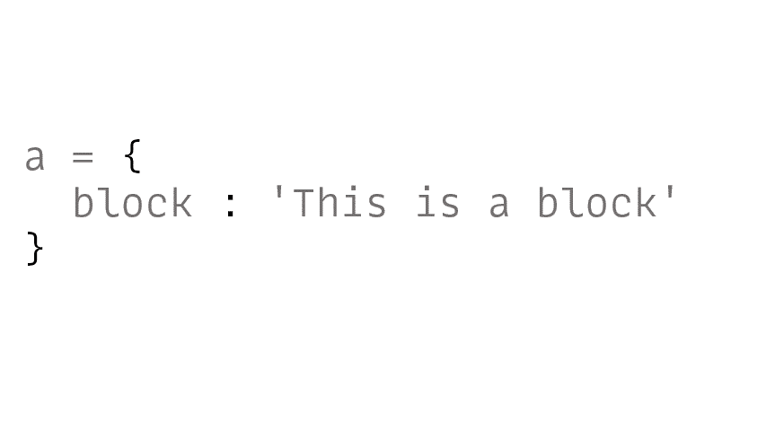
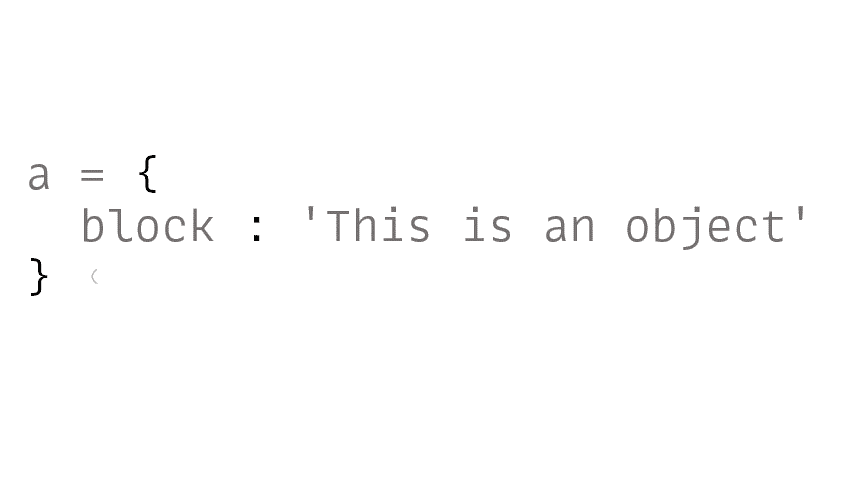
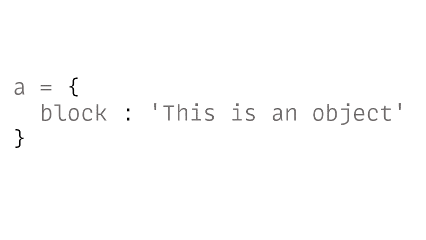
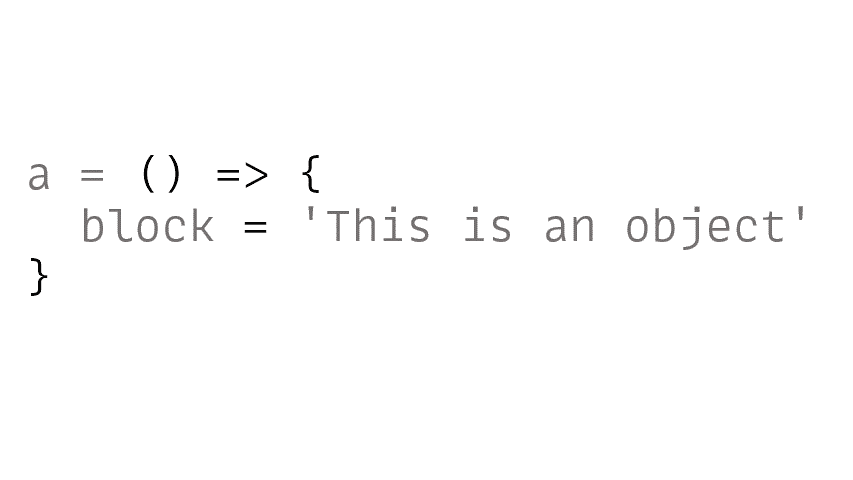
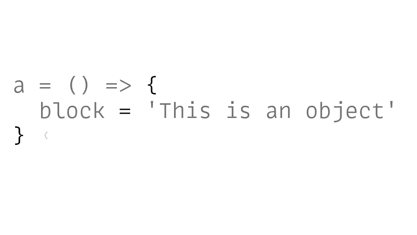
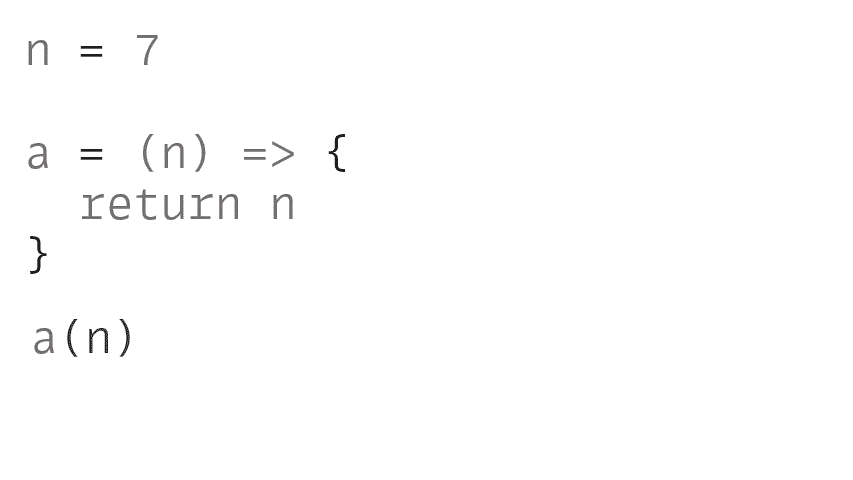

# 这将(永远)改变你看待代码的方式

> 原文：<https://javascript.plainenglish.io/this-will-forever-change-how-you-look-at-your-code-66fad47f82df?source=collection_archive---------0----------------------->

我们将开始一段从零到精通的旅程。

Photo By [Vladimir Fedotov](https://unsplash.com/@fedotov_vs) on [Unsplash](https://unsplash.com/photos/J6DGlnyOzuI)

到本文结束时，你将从一个仅仅使用 T4 JavaScript 的人变成一个深刻理解 JavaScript 的人。

一个不会被发生在它内部的怪异和外表的事情吓到的人。

这个概念将扩展您作为程序员的知识和能力，以其他现代和流行的编程语言无法比拟的方式使用 JavaScript。

你准备好了吗？

# 从前…有一个*块*

> “简单永远是一个秘密，一个深刻的真理，做事，写作，绘画。
> 
> 生活在它的简单中是深刻的。"
> 
> ― **查尔斯·布可夫斯基**

你一定在编程世界中多次听说过术语*代码块*，但是我想知道我们到底指的是什么。

在 JavaScript 领域，答案非常简单。

由于我们关注的是 JS，所以我们将坚持这个定义，即:*任何在* `{}` *下的东西都是一个* ***块*** *。*

哇，Som——它如何改变我对 JS 代码**“永远”的看法？**

坚持住。

我们才刚刚开始。

我们一个一个来。

所以，JS 中的 block 是属于`{}`的任何东西

我们在上面吗？

酷！

现在给它起个名字。

它变成了什么？

反对！

*对象*到底是什么？

不像其他语言(在那里你会得到关于对象的一些深奥的定义)，JS 中的一个对象(正是它让我爱上了 JS)，仅仅是一个*名称/值*对的集合(如果你想听起来更复杂，你也可以说*键/值对*)，就是这样。

给它加上`() =>`

它变成了什么？

一个函数！

*功能*到底是什么？

把一个*函数想象成一个简单的* ***【块】*** 加上一点点 ***额外的机制*** 。我们可以 ***调用*** (或者调用它)——使用分组操作符()——它可以执行某个任务(或者被执行)。

函数实际上是 JavaScript 中的(特殊)对象。

我们可以用点符号给这个函数添加一个属性。

它会成功的。

人们惊讶地发现我们可以将*属性*和*方法*附加到**函数**上。

在其他编程语言中，这是不可能的。

但是在 JavaScript 中，它*是。*

为什么？

因为*函数在 JavaScript 中是对象*。

函数的**名**和我们编写的**代码**(在*块内)*只是我们添加到它的*属性之一。*

该属性的独特之处在于——它是可调用的——这意味着您可以 ***调用*** (或*执行*)这段代码。

你和我在一起吗？

很好。

现在，我们知道一个函数可以接受一个 ***输入*** 值并返回一个 ***输出*** 值，也就是说，我们可以在函数周围传递值(原语)。

由于 JavaScript 中的 ***对象*** 是**原语**，它允许我们将它们传递给一个函数。

而且我们已经看到了*的功能是什么？— objects，*这允许我们将一个函数传递给另一个函数。

这个概念被称为 ***一级函数*** *。*

当你看到它的简单——它的美丽——当你最终得到它时，它会改变你的编程方式。

它可以打开解决问题的完全不同的方法的视野。

**一级函数**允许我们将*函数视为数据*——将它们赋给变量，将它们传递给其他函数，从函数返回它们，用一种文字语法动态创建函数，等等

我们可以像对待其他 ***类型、对象、字符串、数字或布尔值一样对待*函数*。***

块、对象和函数是一体的(在机制上有一点不同)。

一旦你完全接受了这个心智模型，并看到它是多么简单而强大——它将(永远)改变你看待 JavaScript 代码的方式。

# 感谢信

我想利用这最后的机会说声谢谢。

感谢您的光临！没有像你这样的人，我不可能做我现在做的事情。

我希望你能 [**加入我的**](https://polymathsomnath.medium.com/subscribe) **[**未来博客**](https://polymathsomnath.medium.com/subscribe) 中的** 并留下来，因为我认为我们这里有一些伟大的东西。我希望在未来的许多年里，我能在你的职业生涯中帮助你！

下次见。再见！

*更多内容请看*[***plain English . io***](https://plainenglish.io/)*。报名参加我们的* [***免费周报***](http://newsletter.plainenglish.io/) *。关注我们上*[***Twitter***](https://twitter.com/inPlainEngHQ)[***LinkedIn***](https://www.linkedin.com/company/inplainenglish/)*[***YouTube***](https://www.youtube.com/channel/UCtipWUghju290NWcn8jhyAw)**和* [***不和***](https://discord.gg/GtDtUAvyhW) *对成长黑客感兴趣？检查* [***电路***](https://circuit.ooo/) ***。*****