# three . js——一个 JavaScript 3D 库

> 原文：<https://javascript.plainenglish.io/three-js-a-javascript-3d-library-78fe2c2a9b15?source=collection_archive---------4----------------------->

## 浏览器中的 3D。

你可能想知道一些有三维视图的很酷的网站，对吗？

是在 **WebGL 的帮助下。**

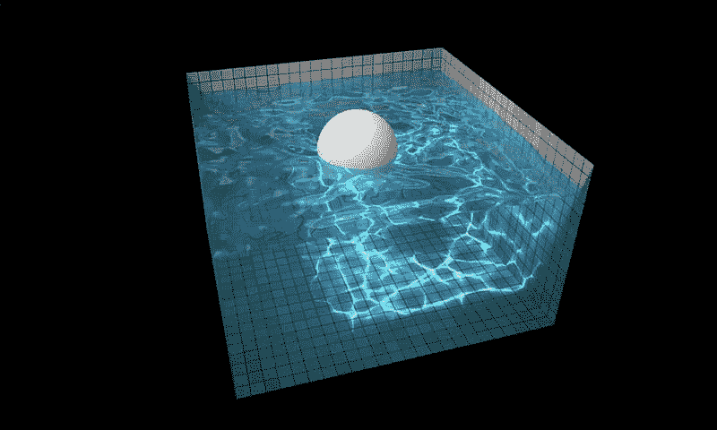

## **那么这个 WebGL 是什么？**

WebGL 是一个用于渲染交互式 2D 和 3D 图形的 JavaScript API。WebGL 与其他 web 标准完全集成，允许 GPU 加速使用物理和图像处理以及作为网页画布一部分的效果。(开放定义)

简单地说，你可以利用创造力在你的网站上建立一个 3D 效果。

# 但是等等，我说的是 **Three.js.** 那为什么我说的是 **WebGL？**

嗯，那是因为 **Three.js** 使用 **WebGL** 创建 3D 动画网站。

Three.js 实际上比我们想象的要简单，但是需要大量样板代码来呈现一些小立方体本身。

在学习一门新的编程语言时，我们通过打印最著名的单词 Hello World 来学习。

在 Three.js 中，我们首先创建一个立方体。让我们开始吧。

我们的`package.json`文件看起来是这样的。

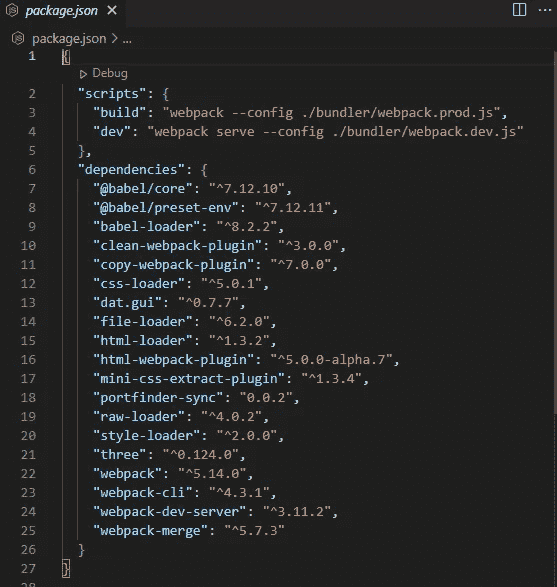

不要对这些依赖性感到困惑，我们使用的是 Webpack，它是一个 JavaScript 模块捆绑器。

你可以从这个 [***GitHub 资源库***](https://github.com/adarsh-gupta101/threejs_starter) ***中获取启动程序代码。您可以克隆存储库并运行 npm/yarn install 来安装依赖项。这看起来像很多代码，对吗？嗯，答案是三. js 需要一个本地开发服务器在本地运行。***

我们的 **HTML** 文件干净简单，我们只需要一个 **canvas** 标签来渲染其中的 3D 内容。

但是我们的 JavaScript 文件很重。

其实并不是。这只是 Three.js 的初始设置，我们来分解一下

首先，我们进口必要的东西。

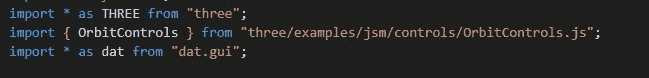

所以我们现在可以使用关键字`**THREE**`访问 Three.js 文件。

`**Orbitcontrols**`有助于调整窗口，我们稍后将研究它。 `**dat.gui**` 帮助您调整颜色高度等值。

因此，在深入理解这一部分之前，在 Three.js 中，我们创建一个几何图形和该几何图形的材质，并将其合并到一个网格中，并将该网格添加到我们的场景中

我们的立方体是一个`**boxGeometry**`，所以我们使用它。你可以在这里看到其他的几何图形。

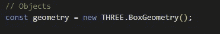

Boxgeometry

现在我们可以添加我们的材料。

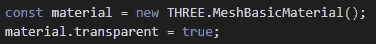

我们把它添加到网格中。

网格=几何体+材质

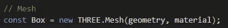

但是我们看不到我们的盒子，那是因为我们现在有了立方体，但是它不知道在哪里显示。这就是为什么我们需要一个**场景。**

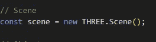

Scene part

这是我们的场景，现在我们可以将盒子添加到我们的场景中。

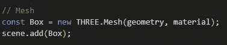

如果你正确地做了这些步骤，你仍然不会看到立方体。这是因为我们已经准备好了场景，但是我们需要一个**相机**和一个**灯光**和一个**渲染器**来查看立方体，相机给出快照，灯光将提供光线(明显的)，渲染器将使用 WebGL 渲染你的艺术

## 相机部分。

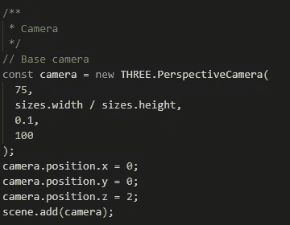

有这么多类型的相机可用，这里我们使用透视相机。第一个参数是视场，它决定了摄像机平截头体的垂直视场，然后我们有一个纵横比，然后是近点和远点(你可以把它想象成我们的眼睛)。最后，我们将摄像机添加到场景中

## 让那里有光…

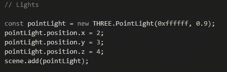

有许多灯可用，如**`**hemisphereLight**`**`**ambientLight**`等等，我们使用一个`**PointLight**`，你可以把它想象成一个火炬。我们设置默认的位置，它在原点上，然后我们把它添加到我们的场景中****

## ****现在是最后一部分****

****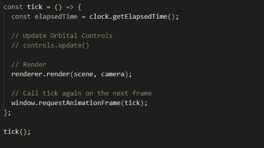****

****我们创建了一个`tick`函数，这是一个递归函数，我们得到的输出是这样的****

****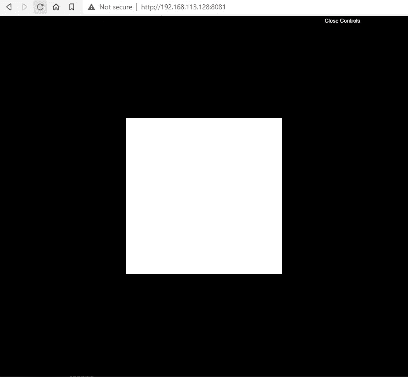****

****但是这里的 3D 在哪里？你说得对，我们想让它动起来，这样我们就可以旋转了。****

****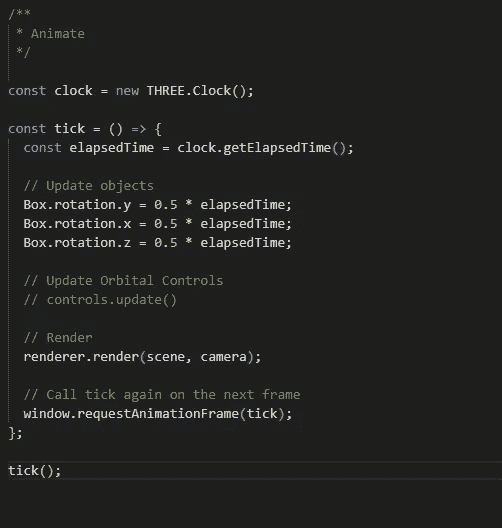****

****Tada…现在让我们在 2D 浏览器中看看 3D。****

****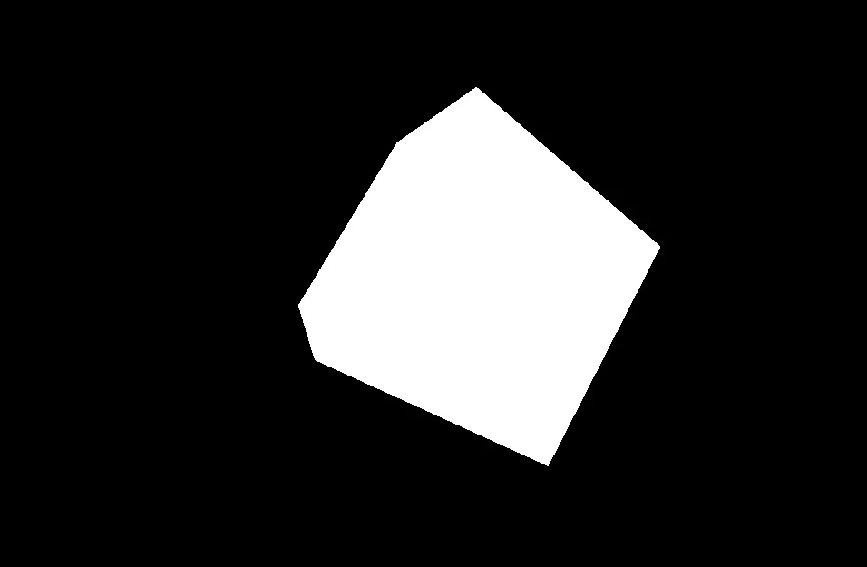****

****您可以在这里查看工作示例[。](https://jsfiddle.net/fxurzeb4/)****

## ****结论****

****用 Three.js 怎么才能走得更远来总结。****

****嗯，首先我会推荐你阅读 [**Three.js 官方文档**](https://threejs.org/) **。******

****但要获得真正的体验，你可以参加布鲁诺·西蒙的课程，他的课程非常棒，或者你可以谷歌一下，你可以获得大量免费资源(如果你知道你知道的话)****

****你打算什么时候开始 3D 体验？****

*****更多内容看* [*说白了. io*](http://plainenglish.io/) *。报名参加我们的* [*免费每周简讯*](http://newsletter.plainenglish.io/) *。在我们的* [*社区*](https://discord.gg/GtDtUAvyhW) *获得独家写作机会和建议。*****