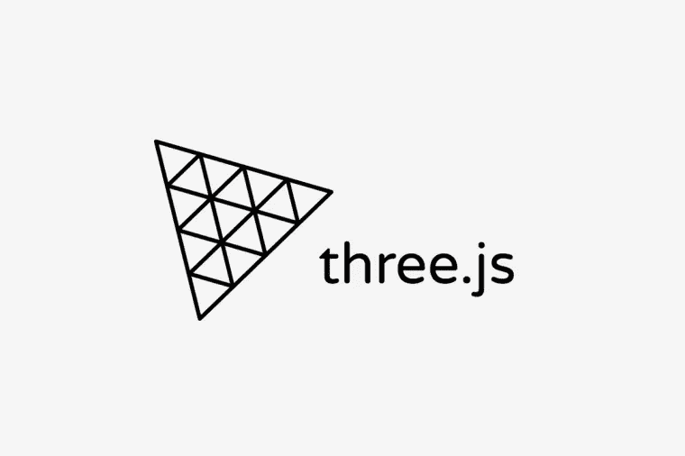
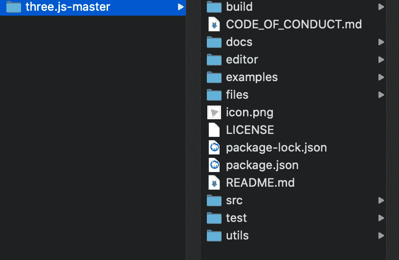
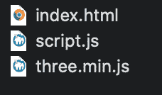
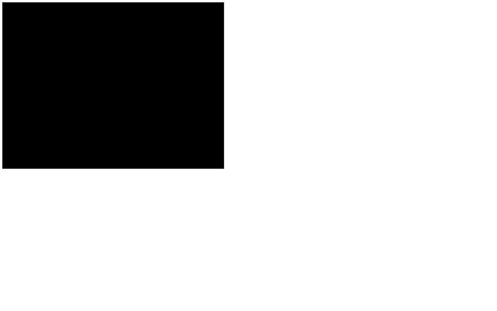
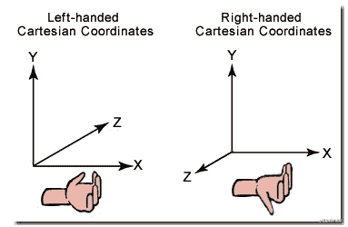
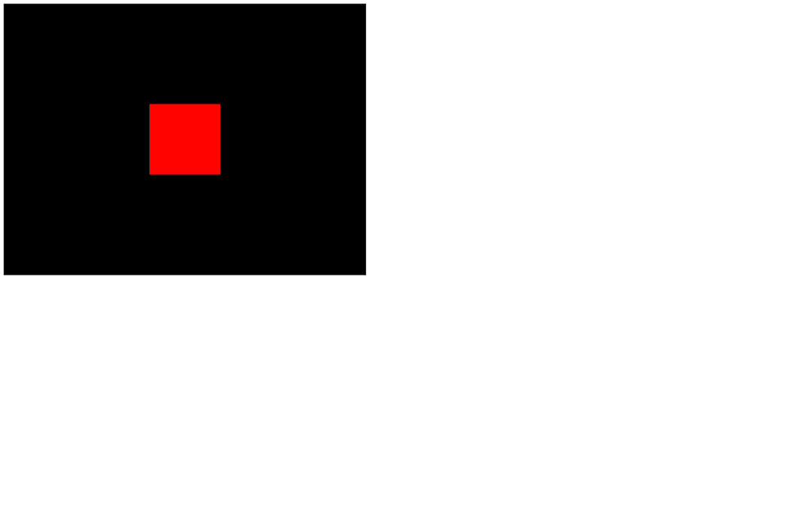

# 用 Three.js 构建基本的 3D 场景

> 原文：<https://javascript.plainenglish.io/three-js-lesson-1-building-basic-3d-scenes-with-three-js-e06d05c28feb?source=collection_archive---------1----------------------->



这是我们开始使用 Three.js 的第一课，我们回顾了它在 web 开发中最经典的用法，一个`<script>`标签。

# 准备基本文件

首先，我们创建一个`index.html`文件

```
<!DOCTYPE html>
<html lang="en">
<head>
    <meta charset="UTF-8">
    <meta name="viewport" content="width=device-width, initial-scale=1.0">
    <title>03 - basic scene</title>
</head>
<body>
    <script src="./script.js"></script>
</body>
</html>
```

然后创建一个`script.js`文件，里面的代码很简单，就一行

```
console.log('Hello Three.js')
```

接下来，我们双击`index.html`文件，不出所料，它将使用您计算机的默认浏览器打开。虽然 Three.js 可以在大多数浏览器中运行良好，但我还是强烈推荐使用 Chrome，因为它更适合我们开发和调试。

现在我们按键盘上的 F12，这将打开一个开发人员调试工具。

然后切换到控制台选项卡。在开发过程中，我们应该始终注意来自控制台的错误、警告和日志输出。

# 如何加载 Three.js

现在我们需要在网页中加载`Three.js`库。

打开 [Three.js](https://threejs.org/) 网站，点击下载按钮，下载最新的`Three.js`库，解压下载的 zip 文件。有很多文件，因为这是包含离线文档和所有示例源代码的整个存储库。在这一小节中，我们只需要一个文件。

解压缩后的文件夹将如下所示。



打开`build/`文件夹，将 three.min.js 文件复制到您的项目中。

复制后，您的项目文件夹现在应该有三个文件。



添加另一个`<script>`标签来加载 Three.js 库。

```
<script src="./three.min.js"></script>
<script src="./script.js"></script>
```

你需要确保`three.min.js`是在你的代码之前加载的，否则，它不会工作。

# 如何使用 Three.js

在我们的`script.js`文件中，我们现在可以访问名为`THREE`的变量。注意`THREE`是大写的。

如果用`console.log()`打印这个变量，会看到很多信息。

```
console.log(THREE)
```

变量`THREE`包含了可能在`Three.js`项目中使用的大多数类、方法和属性。

要使用一个类，我们需要首先实例化它。例如，要创建一个场景，编写代码`const scene = new THREE.Scene ()`。如果我们想要创建一个 3D 球体，编写代码`const sphereGeometry = new THREE.SphereGeometry(1.5，32，32)`。我们稍后将详细讨论这些类和初始化参数的含义。

# 创建我们的第一个 3D 场景

现在我们准备使用`Three.js`在网页中创建我们的第一个 3D 场景。

要创建一个 3D 场景，我们至少需要 4 个对象:

*   事件
*   一些 3D 对象
*   照相机
*   渲染器

## 事件

场景就像一个容器，我们在其中放置 3D 世界的元素，如模型、灯光、粒子等。然后，在某个时候，Three.js 会使用渲染器结合相机等各种因素将场景绘制到画布上。

要创建一个场景，使用类`Scene`。

```
// Scene
const scene = new THREE.Scene()
```

## 3D 对象

3D 对象可以是很多东西，比如一些最基本的几何图形、导入的 3D 模型、粒子、光照等。都是 3D 物体。

让我们从创建最简单的红色立方体开始。
立方体是一种叫做网格的物体。网格是几何图形和材料的组合。

Three.js 中内置了许多基本的几何体类型和基础材质，但让我们在第一课中保持简单，只创建一个立方体和一个基础材质。

要创建一个立方体，你需要使用`BoxGeometry`类，用 3 个参数对应盒子的大小。这是一个矢量大小，请不要将其解释为像素。

```
// Object
const geometry = new THREE.BoxGeometry(1, 1, 1)
```

为了创建基础材质，使用了 MeshBasicMaterial 类，在实例化它时，我们通过`{}`包含了一些用于初始化的参数，比如颜色属性。当然，我们也可以在初始化之后设置颜色属性。

Three.js 中指定颜色的方法有很多种，比如颜色 red 可以表示为十六进制数 0xff0000，也可以表示为字符串“#ff0000”，或者表示为颜色名比如“red”，这里我们用第一种。

```
// Object
const geometry = new THREE.BoxGeometry(1, 1, 1)
const material = new THREE.MeshBasicMaterial({ color: 0xff0000 })
```

最后，使用`Mesh`类，并将几何图形和材质作为参数传递。

```
// Object
const geometry = new THREE.BoxGeometry(1, 1, 1)
const material = new THREE.MeshBasicMaterial({ color: 0xff0000 })
const mesh = new THREE.Mesh(geometry, material)
```

现在，我们使用场景的`add`方法将这个网格对象添加到场景中。

```
scene.add(mesh)
```

请记住，如果我们只是创建一个 3D 对象，而不是将其添加到场景中，那么它是不可见的。

## 照相机

相机本身是不可见的，尽管它也是一个 3D 对象，需要添加到场景中。当我们渲染一个 3D 场景时，渲染器会从摄像机所在的角度来看它。

我们也可以在一个场景中有多个摄像机，就像电影中的多个摄像机位置一样，我们可以在它们之间切换。然而，通常我们只用一个摄像头。

Three.js 中的相机类型有两种，一种是透视相机，一种是等轴相机。一般情况下，我们也只需要使用 PerspectiveCamera(近大远小)。

为了创建一个相机，我们需要使用`PerspectiveCamera`类。当实例化这个对象时，我们需要提供两个基本参数。

*   FOV

FOV 是相机的视角，你一定听说过广角镜头吧？当我们使用广角镜头拍摄时，画面边缘会有很多失真，尽管有很多东西可以放入画面。FOV 用度表示，这里我们将使用 75 度角。

*   长宽比

大多数情况下，纵横比设置为画布的宽度除以画布的高度。

不要忘记将摄像机也添加到场景中！

```
// Sizes
const sizes = {
    width: 800,
    height: 600
}// Camera
const camera = new THREE.PerspectiveCamera(75, sizes.width / sizes.height)
scene.add(camera)
```

## 渲染器

渲染器的工作是将摄像机在场景中看到的内容渲染并绘制到画布上。

在我们希望渲染器渲染我们的场景之前，我们必须在 html 文件中创建一个画布。

将`<canvas>`标签添加到 html 的主体中。

```
<canvas class="webgl"></canvas>
```

要创建渲染器，我们必须使用`WebGLRenderer`类，这要求我们在实例化它时提供一个 canvas 对象参数，使用 JS 方法`document.querySelector`可以获得我们刚刚在 html 中创建的 canvas 对象。

将画布分配给一个变量是一个好主意，因为我们可能有其他的用途。

然后我们还需要使用`setSize`方法来更新渲染器的绘图大小。

```
// Canvas
const canvas = document.querySelector('canvas.webgl')// ...// Renderer
const renderer = new THREE.WebGLRenderer({
    canvas: canvas
})
renderer.setSize(sizes.width, sizes.height)
```

当所有这些代码都写好后，我们刷新当前页面，我们将看到一个 800 像素宽、600 像素高的黑色画布。



# 首次渲染

调用`renderer.render`方法，以场景和相机为参数，准备我们的第一次渲染:

```
renderer.render(scene, camera)
```

似乎有一些问题，画布里面什么也没有。这个问题正好帮助我们更好地理解 3D 世界运作的机制。因为我们没有指定 3D 立方体的位置，也没有设置摄像机的位置，所以它们都默认位于 0，0，0，这是场景的中心，也就是说，此时摄像机在立方体内部。通常，我们无法从内部看到 3D 对象。3D 对象有许多属性，如位置、旋转和缩放。位置是一个具有三个属性的对象，分别是 x 轴、y 轴和 z 轴。然后通过设置它们，我们可以移动摄像机。现在让我们将相机移动到 z 轴为 3 的位置。请注意，Three.js 使用右手笛卡尔坐标系。



```
const camera = new THREE.PerspectiveCamera(75, sizes.width / sizes.height)
camera.position.z = 3
scene.add(camera)
```



恭喜你，我们的 3D 场景已经渲染到画布上了，它看起来不是三维的，像一个正方形，这是因为相机与立方体在一条水平线上，所以我们只能看到立方体的一边。

别担心，在接下来的课程中，我们将学习更多关于位置、旋转和缩放属性的用法以及如何制作它们的动画。那时候，它们看起来会很“立体”。

写作一直是我的激情所在，帮助和激励他人给我带来了快乐。如果您有任何问题，请随时联系我们！

如果你想从我这里听到更多或阅读更多，可以考虑通过使用 [***此链接***](https://medium.com/@897083490/membership) 和 [***关注我***](https://medium.com/@897083490) 成为中等会员。

*更多内容看* [***说白了。报名参加我们的***](https://plainenglish.io/) **[***免费周报***](http://newsletter.plainenglish.io/) *。关注我们*[***Twitter***](https://twitter.com/inPlainEngHQ)*和*[***LinkedIn***](https://www.linkedin.com/company/inplainenglish/)*。查看我们的* [***社区不和谐***](https://discord.gg/GtDtUAvyhW) *加入我们的* [***人才集体***](https://inplainenglish.pallet.com/talent/welcome) *。***