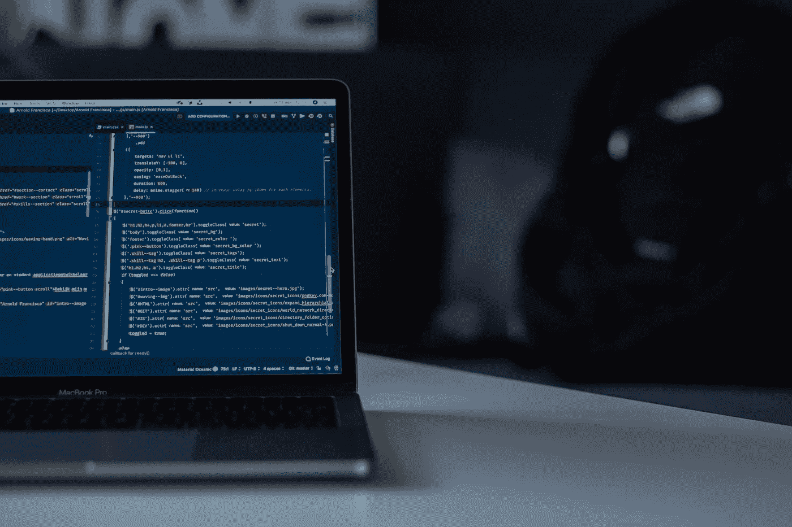

# 初学者在 Node.js 中要做的 3 个项目

> 原文：<https://javascript.plainenglish.io/three-projects-to-do-in-node-js-as-a-beginner-cd3221f5cadb?source=collection_archive---------2----------------------->

## 初学者友好的项目，可以在学习 Node.js 时尝试。

Photo by [Arnold Francisca](https://unsplash.com/@clark_fransa?utm_source=unsplash&utm_medium=referral&utm_content=creditCopyText) on [Unsplash](https://unsplash.com/s/photos/coding?utm_source=unsplash&utm_medium=referral&utm_content=creditCopyText)

构建项目是理解编程语言/框架/库的最佳方式之一。除非你实践你所学到的东西，否则参加课程或在线观看大量的教程是没有帮助的。请注意，我自己也是一个学习者和实验者，因此我在这里不是给任何人建议或指导，而是分享我的个人经验，这可能对你也有帮助。在继续之前，请确保您对 HTML、CSS、Node、Express 和 MongoDB(mongose)有一定的了解，以便构建这些项目。如果没有，你可以访问 Freecodeacademy 或 youtube 开始。不要再浪费时间了，作为初学者，让我们进入 Node.js 中要做的前三个项目。

## 项目#1:我的日志应用

这个项目是关于建立一个 web 应用程序，一个人可以添加，查看，更新和删除日志。这个项目是一个很好的起点，因为它处理 CRUD(创建、读取、更新、删除)操作。因此，基本上你需要一个数据库，你可以存储标题，内容的期刊和一个前端查看期刊，并采取输入的形式，以编写/编辑期刊。我构建了这个项目，作为我的 Udemy web 开发课程的一部分。以下是该项目的 Github 链接:[https://github.com/AliQumail/My-journal-app-using-node-js](https://github.com/AliQumail/My-journal-app-using-node-js)。

## 项目#2:基本银行系统

第二个项目是关于实现一个真实世界的系统。显然，要实现一个真正的银行系统所拥有的一切是不可能的。相反，它可以包括实现一些基本功能，如进行资金转账、记录每笔交易(汇款人姓名、收款人姓名、汇款金额、日期和时间)、查看用户详细信息和他们持有的余额等。此外，添加用户身份验证可以为您的项目增加更多价值。以下是该项目的 Github 链接(不包括用户认证):【https://github.com/AliQumail/Basic-Banking-System。

## 项目#3:酒店管理系统

构建管理系统可以进一步提高你的开发技能，因为它们不仅涵盖了所有四个 CRUD 操作，还处理了各种其他事情，比如添加表单和验证检查。在一个酒店/招待所管理系统中，它是一个全栈的 web 应用程序，用户可以在其中预订房间并填写详细信息(例如姓名、年龄、房间大小、预订日期等等)。预订完成后，可以使用管理仪表板来管理所有预订细节。除此之外，你可以建立一个完全不同的项目，如图书馆/大学管理系统。以下是该项目的 Github 链接:[https://Github . com/AliQumail/Hostel-management-system-using-Express-mongoDB](https://github.com/AliQumail/Hostel-management-system-using-Express-mongoDB)

此外，您还可以在 Node.js 中构建 API，并连接到一些前端库，如 React，或将第三方应用程序如谷歌/脸书登录集成到您的项目中。

我希望这篇文章证明是有帮助的。谢谢大家！

*更多内容看* [***说白了。报名参加我们的***](https://plainenglish.io/) **[***免费周报***](http://newsletter.plainenglish.io/) *。关注我们关于*[***Twitter***](https://twitter.com/inPlainEngHQ)*和*[***LinkedIn***](https://www.linkedin.com/company/inplainenglish/)*。查看我们的* [***社区不和谐***](https://discord.gg/GtDtUAvyhW) *，加入我们的* [***人才集体***](https://inplainenglish.pallet.com/talent/welcome) *。***