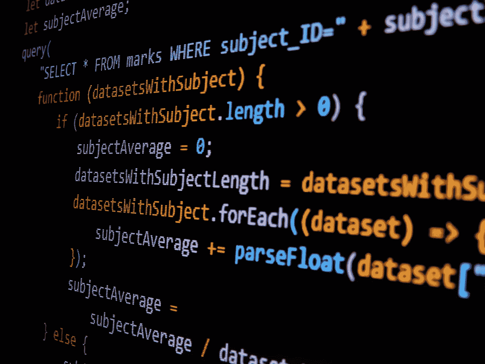

# 我在做项目时从 JavaScript 中学到的 3 件事

> 原文：<https://javascript.plainenglish.io/three-things-i-learned-in-javascript-while-working-on-a-project-2389141a5588?source=collection_archive---------13----------------------->

我正在开发一个定时器，在编写定时器的时候，我遇到了两个困难，我也学到了一个可能对你有益的重要的东西。所以不用等了，让我们来看看这些是什么。

Image by [Gabriel Heinzer](https://unsplash.com/@6heinz3r) on [Unsplash](https://unsplash.com/photos/g5jpH62pwes)

# 1.全局变量

看下面这支笔

正如你在第 122 行看到的，我声明了三个变量`timer_h`、`timer_m`和`timer_s`。我在`start_timer()`函数中初始化的`timer_h`、`timer_m`和`timer_s`分别有`setInterval(timer_hour, 3600000)`、`setInterval(timer_minute, 60000)`和`setInteval(timer_second, 1000)`三个值，点击开始按钮启动定时器。将声明变量以清除三个函数的`setInteval`。

现在提示是，我首先将这三个变量声明为`start_timer()`函数。现在，当我试图清除`stop_timer()`函数中的`setInterval`时，问题出现了，但是它们没有被清除，因为这三个变量是在一个函数中声明的，它们不能在作为`start_timer()`函数的函数之外使用。

现在，对于第一个技巧，您应该首先在全局范围内声明变量，以避免代码中出现任何错误，就像我遇到的问题一样。

# 2.创造性地思考

现在是我的第二个建议。我正在制作计时器，我制作了一个函数来增加时间，直到 59 秒，但是后来我制作了一个函数来增加分钟，在制作过程中，我将增加的机制与分钟的计算联系起来。结果是一半好，但非常复杂，9 分钟之后的分钟增量比 9 分钟之前的分钟增量更复杂。

那么解决办法呢？嗯，我想打破常规，复制秒递增的机制，将 60000 毫秒的`setInterval`设置为 1 分钟，并将`timer_second()`函数修改为 59 秒后变为 0。

现在的提示是，你应该跳出框框思考，很多时候这个功能可以通过一些其他的机制来实现，这些机制比我的场景中的当前机制更容易。

# 3.“退货”的使用

`return`函数返回指定的代码，并停止进一步执行使用它的函数的代码，但在许多情况下，您可以使用没有任何关联代码的`return`函数，并像我一样使用它来停止执行。

在点击按钮时启动、停止和重置计时器的机制，但在点击按钮时，它首先启动计时器，然后停止计时器，然后一起重置计时器。所以为了阻止这一点，我在`start_timer()`函数内的每个 if 块中使用了`return`函数(抱歉函数名放错了位置。实际名字是`timer_mechanism`。

所以对于第三个技巧，你应该使用一些功能而不是它们的指定用途，比如为了你自己的利益使用`return`功能。

我希望你喜欢这篇文章。请随意使用上面的笔，也可以给我更多文章的建议。

再见。

*更多内容看* [***说白了就是 io***](https://plainenglish.io/) *。报名参加我们的* [***免费周报***](http://newsletter.plainenglish.io/) *。关注我们关于* [***推特***](https://twitter.com/inPlainEngHQ) ， [***领英***](https://www.linkedin.com/company/inplainenglish/) *，*[***YouTube***](https://www.youtube.com/channel/UCtipWUghju290NWcn8jhyAw)*[***不和***](https://discord.gg/GtDtUAvyhW) *。**