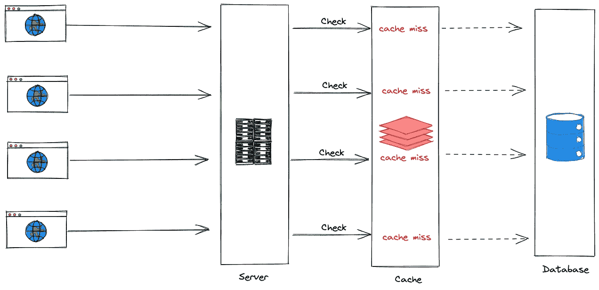

# 雷群问题 Node.js 和 Promise 的解决方案

> 原文：<https://javascript.plainenglish.io/thundering-herd-problem-solution-with-node-js-and-promise-e8bc55dc5105?source=collection_archive---------3----------------------->

> 在[计算机科学](https://en.wikipedia.org/wiki/Computer_science)中，当大量等待事件的进程或线程在事件发生时被唤醒，但只有一个进程能够处理该事件时，就会出现**雷群问题**。当进程醒来时，它们将各自尝试处理事件，但只有一个会胜出。所有进程都会争夺资源，可能会冻结计算机，直到群体再次平静下来。— [维基百科](https://en.wikipedia.org/wiki/Thundering_herd_problem)

对于 web 服务，当许多客户端请求相同的数据时，应该在服务器端缓存这些数据。问题是许多请求从缓存中读取空值，并试图从数据库中加载数据。因此，我们会有许多不必要的数据库负载，因为所有请求都对数据库执行相同的查询。

# 证明

我们使用一个返回 json 对象的基本 API 来演示。

当`GET /posts` API 被触发时，将调用`PostService`的`getPosts`函数。

`index.ts`

```
import express from 'express';
import postService from './post.service';

const app = express();

app.get('/', (req, res) => {
  res.json({ message: 'Hello World!' });
});

app.get('/posts', async (req, res) => {
  res.json({ posts: await postService.getPosts() });
});

app.listen(3000, () => {
  console.log('Server is listening on :3000');
});
```

`getPosts`是一个支持缓存的从数据库中检索数据的常用函数。

`post.service.ts`

```
import postRepository, { IPost } from './post.repository';
import cacheService from './cache.service';

const getPosts = async (): Promise<IPost[]> => {
  const cache = await cacheService.getPosts();
  if (cache) {
    console.count('Hit cache');
    return cache;
  }

  console.count('Hit database');
  const posts = await postRepository.getPosts();
  await cacheService.setPosts(posts);

  return posts;
};

export default {
  getPosts,
} as const;
```

看起来没问题，所以我们首先从缓存中检索数据。如果数据存在，我们立即返回；否则，我们从数据库中检索它，保存到缓存中，然后返回它( [cache-aside pattern](https://docs.microsoft.com/en-us/azure/architecture/patterns/cache-aside) )。).

当对服务功能的请求很多，但缓存中没有数据时，就会出现雷群问题。相同的查询将用于所有访问数据库的请求。



Thundering herd issue

当服务器最近重启时，我同时向`POST /posts` API 发送了 20 个请求:

```
#!/bin/bash
curl http://localhost:3000/posts &
curl http://localhost:3000/posts &
curl http://localhost:3000/posts &
curl http://localhost:3000/posts &
curl http://localhost:3000/posts &
curl http://localhost:3000/posts &
curl http://localhost:3000/posts &
curl http://localhost:3000/posts &
curl http://localhost:3000/posts &
curl http://localhost:3000/posts &
curl http://localhost:3000/posts &
curl http://localhost:3000/posts &
curl http://localhost:3000/posts &
curl http://localhost:3000/posts &
curl http://localhost:3000/posts &
curl http://localhost:3000/posts &
curl http://localhost:3000/posts &
curl http://localhost:3000/posts &
curl http://localhost:3000/posts &
curl http://localhost:3000/posts
```

之后，数据库将被多次命中

```
Server is listening on :3000
Hit database: 1
Hit database: 2
Hit database: 3
Hit database: 4
Hit database: 5
Hit database: 6
Hit database: 7
Hit database: 8
Hit database: 9
Hit database: 10
Hit database: 11
Hit database: 12
Hit database: 13
Hit database: 14
Hit database: 15
Hit database: 16
Hit database: 17
Hit database: 18
Hit database: 19
Hit database: 20
```

# 解决办法

要解决这个问题——雷霆万钧，如何应对是个好主意？我们需要解决太多缓存未命中的根本原因。
为了解决缓存未命中，我们将有两个标题:

*   缓存预热:尽可能减少缓存未命中，我们应该保证缓存中的数据始终存在——避免出现保留空间未被填满的情况。初始化、重新启动缓存服务器时缓存为空，或者缓存中的数据已过期。
*   缓存锁定:只有第一个请求可以访问数据库，其他请求将被锁定，直到第一个请求将结果更新到缓存。

我的服务器用的是 Node.js，那我就用 Promise API 实现缓存锁定。

更新发布服务:

```
import postRepository, { IPost } from './post.repository';
import cacheService from './cache.service';

let promise: Promise<IPost[]> | null = null;

const getPosts = async (): Promise<IPost[]> => {
  const cache = await cacheService.getPosts();
  if (cache) {
    console.count('Hit cache');
    return cache;
  }

  if (promise) {
    return promise;
  }

  try {
    console.count('Hit database');
    promise = postRepository.getPosts();

    const posts = await promise;
    await cacheService.setPosts(posts);

    return posts;
  } finally {
    promise = null;
  }
};

export default {
  getPosts,
} as const;
```

变量将作为一个锁。当缓存为空并且`promise`为空(第一个请求)时，我们访问数据库以获取帖子并生成帖子结果的承诺(将其存储在`promise`变量中)。得到帖子后，我们将它们保存到缓存中并释放锁柜。

另一个请求将从缓存中获取数据或等待相同的承诺，它们将永远不会触及数据库。
`promise = postRepository.getPosts();` —是的，我们不是`getPosts()`功能上的`await`。

再次运行测试，现在只有一个数据库命中:

```
Server is listening on :3000
Hit database: 1
```

# 结论

在实现缓存时，最著名的问题之一就是雷群或缓存踩踏。我们可以用很多方法解决这个问题，有时解决方案会基于你的编程语言。这个故事是 Node.js 和 Promise API 的一个例子。

参考:[雷霆万钧&承诺](https://instagram-engineering.com/thundering-herds-promises-82191c8af57d)

感谢您的阅读！

*更多内容看* [***说白了。报名参加我们的***](https://plainenglish.io/) **[***免费周报***](http://newsletter.plainenglish.io/) *。关注我们关于* [***推特***](https://twitter.com/inPlainEngHQ) ，[***LinkedIn***](https://www.linkedin.com/company/inplainenglish/)*，*[***YouTube***](https://www.youtube.com/channel/UCtipWUghju290NWcn8jhyAw)*，以及* [***不和***](https://discord.gg/GtDtUAvyhW) ***。*****

***有兴趣缩放你的软件启动*** *？检查出* [***电路***](https://circuit.ooo?utm=publication-post-cta) *。*