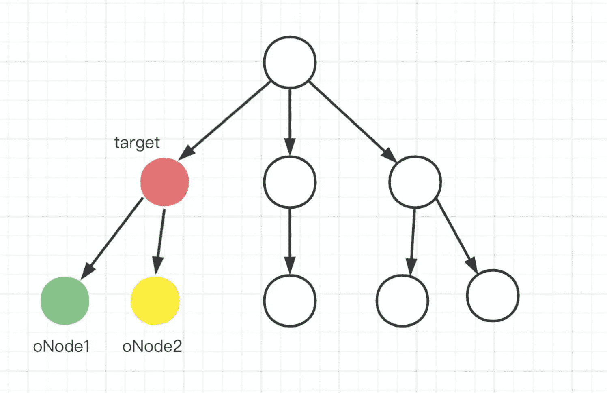
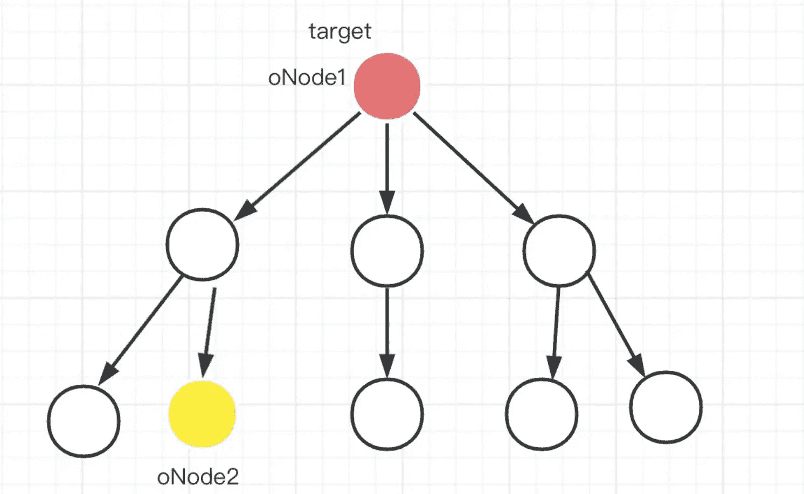
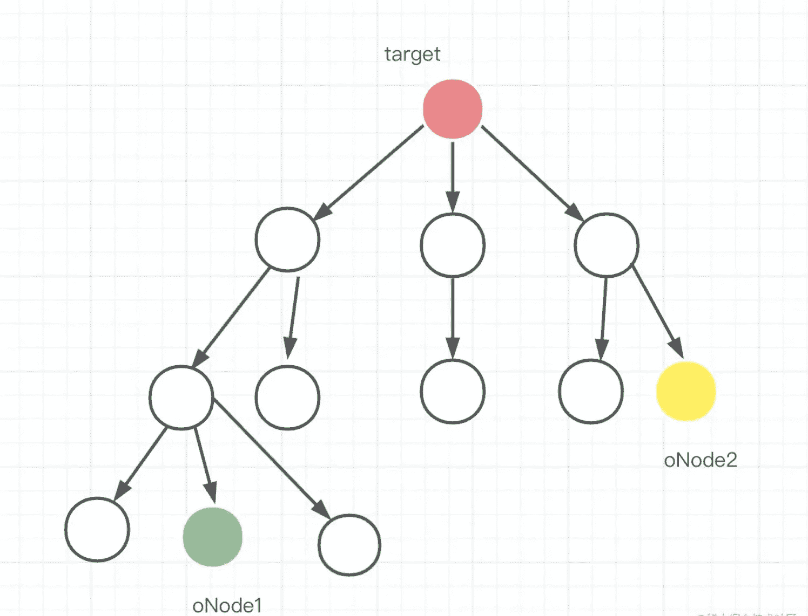
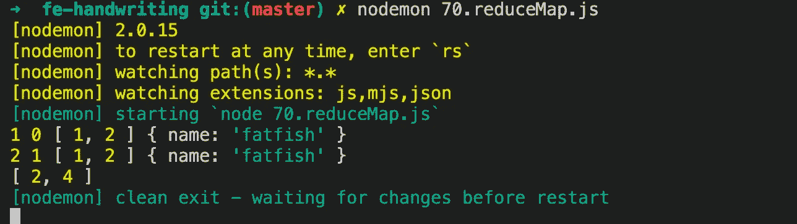

# 抖音面试:你有兴趣了解的 4 个前端问题

> 原文：<https://javascript.plainenglish.io/tiktok-interview-4-front-end-questions-youll-be-interested-to-know-about-dbb1e20c58f0?source=collection_archive---------7----------------------->

## 这是一次难忘的面试经历


Photo by [Andriyko Podilnyk](https://unsplash.com/ja/@andriyko?utm_source=medium&utm_medium=referral) on [Unsplash](https://unsplash.com?utm_source=medium&utm_medium=referral)

最近，我的好朋友正在换工作，并在网上收到了许多邀请。

其中一位来自一家叫做**抖音**的公司，你们可能非常熟悉。他们让我的朋友当场编写代码来实现 4 个复杂方法的功能。

# 1.尝试实现 Promise.all API

**Promise.all()** 方法将可迭代的承诺作为输入，并返回一个承诺，该承诺解析为输入承诺的结果数组。

当输入的所有承诺都已解析时，或者如果输入 iterable 不包含承诺，则返回的承诺将被解析。

它在任何输入承诺拒绝或非承诺抛出错误时立即拒绝，并且将拒绝第一个拒绝消息/错误。

# 自己实现一个

**有测试**

# 2.设计一个可以设置截止日期的本地存储 API

localstorage 不会像 cookies 一样自动过期，所以过期时间需要自己维护。

我的思路是:

使用 setItem 时，保存到期时间。使用 getItem 时，将时间与当前时间进行比较，如果大于当前时间，则返回值即可，否则需要通过 removeItem 移除该值并返回 null。

**有测试**

基本上符合问题的要求。当然，我们也可以处理异常，比如满空间、设置错误等。

# 3.查找两个节点中最近的公共父节点，包括节点本身

**简介:**

oNode1 和 oNode2 在同一个文档中，不会是同一个节点。

```
function findCommonParent(oNode1, oNode2) {
  // fill here
}
```

我相信你看到这个问题会用递归，但是没有明确的思路。

这个时候不要紧张。从问题中找出更多有效信息，尽量多用笔画(如果是现场面试，记得只带铅笔，有时候画多了思路就出来了)。

# 1.1 两个节点处于同一级别

让我们试着画出这两个节点之间可能的关系。如下图所示，它们的直接父节点就是答案。



# 1.2 两个节点是彼此的祖先

oNode1 是目标节点。当然反过来也是一样的。oNode2 也可以是 oNode1 的祖先。



# 1.3 两个节点之间没有关系

如下图所示，两个节点的距离很远，看似没有关系，但如果从其中任何一个向上搜索，肯定能找到包含 oNode1 或 oNode2 的点。



# 1.4 递归实现版本

根据上面的分析，相信你很快就能写出下面的代码。

# 1.5 遍历实现版本

递归很好理解，仅仅通过遍历就可以实现吗？事实上，递归问题往往可以通过遍历来解决。

# 4.使用 reduce 实现映射功能

这个问题会比较简单，我们直接写代码吧

```
Input: [1, 2, 3]
Output: [2, 4, 6]
```



# 最后

**感谢阅读。**我期待期待您的关注和阅读更多高质量的文章。

[](/i-lost-a-job-opportunity-just-because-of-promise-all-be396f6efe87) [## “我失去了一个工作机会，只是因为承诺。所有”

### 一次让我好难过的面试经历。

javascript.plainenglish.io](/i-lost-a-job-opportunity-just-because-of-promise-all-be396f6efe87) [](/interviewer-what-happened-to-npm-run-xxx-cdcb37dbaf44) [## 采访者:“npm 跑 xxx”怎么了？

### 一个大多数人都不知道的秘密。

javascript.plainenglish.io](/interviewer-what-happened-to-npm-run-xxx-cdcb37dbaf44) [](/interviewer-can-x-x-return-true-in-javascript-7e1d1fa7b5cd) [## 面试官:可以“x！== x "在 JavaScript 中返回 True？

### 你可能不知道的五个神奇的 JavaScript 知识点！

javascript.plainenglish.io](/interviewer-can-x-x-return-true-in-javascript-7e1d1fa7b5cd) [](/its-2022-don-t-abuse-the-arrow-function-anymore-905862a9c668) [## 现在是 2022 年，不要再滥用箭头功能了

### 不应该使用箭头函数的 4 种情况。

javascript.plainenglish.io](/its-2022-don-t-abuse-the-arrow-function-anymore-905862a9c668) 

*更多内容看* [***说白了就是***](https://plainenglish.io/) *。*

*报名参加我们的* [***免费每周简讯***](http://newsletter.plainenglish.io/) *。关注我们关于*[***Twitter***](https://twitter.com/inPlainEngHQ)，[***LinkedIn***](https://www.linkedin.com/company/inplainenglish/)***，***[***YouTube***](https://www.youtube.com/channel/UCtipWUghju290NWcn8jhyAw)***，以及*******不和****

****想扩大你的软件创业规模*** *？检查出* [***电路***](https://circuit.ooo/?utm=publication-post-cta) *。**