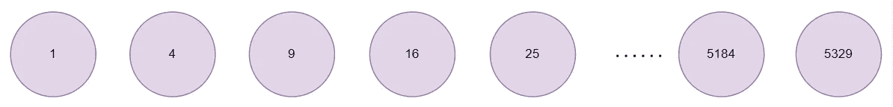
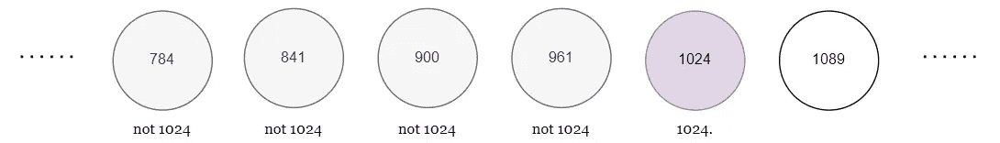
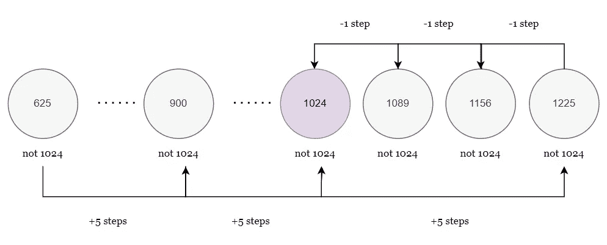
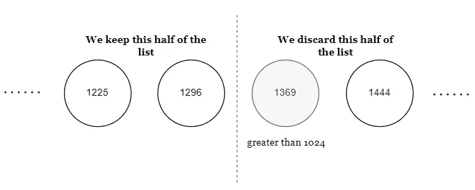
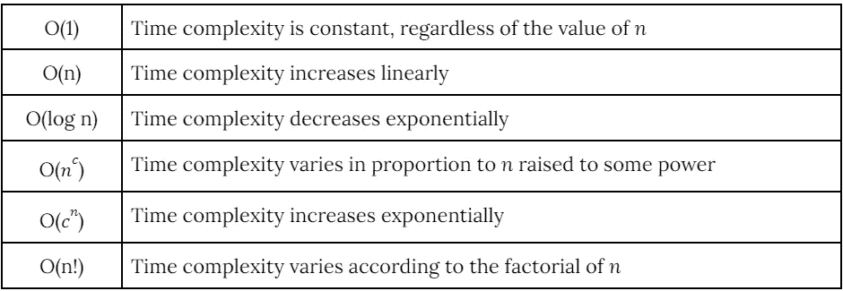

# 时间复杂性和大 O 符号介绍

> 原文：<https://javascript.plainenglish.io/time-complexity-demystified-420761946aa1?source=collection_archive---------13----------------------->

## 时间复杂性速成课程，并使用大 O 符号为下一次技术面试或考试做准备。

Photo by [Elena Koycheva](https://unsplash.com/@lenneek?utm_source=medium&utm_medium=referral) on [Unsplash](https://unsplash.com?utm_source=medium&utm_medium=referral)

# 什么是时间复杂度？

假设您在下列数字序列中搜索一个特定的数字，比如 1024:

A sequence of numbers (image by author)

有很多方法可以找到 1024。

一种方法是从列表的第一个元素 1 开始，一次遍历一个元素，直到遍历完 32 个不同的元素后找到 1024。

Traversing through every element, one step at a time, to find 1024

一步一步的遍历显然是很慢的。所以，也许你更愿意一次遍历列表中的多个步骤——假设一次遍历 5 个步骤。

按照这个新方法，你会在 25，100，225，400，625，900，然后 1225 着陆。意识到 1225 大于 1024，你会后退一些，到达 1156，然后 1089，然后*最后* 1024。

Traversing through the list five steps at a time, and then working backward one step at a time (image by author)

总之，如果选择这个方法，您必须遍历 10 个元素。那比 32 好多了，但还是显得慢。

不要线性遍历我们的列表，这需要很多步骤，也许我们可以直接跳到列表中间的元素——恰好是元素 37，或者 1369。

Halving the list multiple times to find 1024

然后我们跳到新列表的中间，重复这些步骤，直到列表中只剩下一个元素，这个元素是 1024。由于使用这种方法，我们的列表每次都会减半，因此会以指数方式变短，我们会发现 1024 比其他方法以指数方式快。

然而，如果我们只是意识到在我们的列表中，第一个元素显示第一个方块，第二个元素显示第二个方块，等等。我们会发现包含 1024 的元素一定是元素 32，因为 32 的平方是 1024。因此，我们只需一步就能找到 1024。

因此，对于一个问题，我们发现了四种不同的搜索算法，每种算法涉及不同数量的步骤，因此需要不同的时间来执行。这引入了**时间复杂度**的概念，它衡量一个算法与其他算法相比需要多长时间来执行。

# 大 O 符号

## 什么是大 O 记数法？

为了表达任何算法的最大时间复杂度，我们使用**大 O 符号。**大 O 符号将根据算法输入的大小 *n* 来表示时间复杂度。

下表总结了大 O 符号:

Table summarizing big O notation (image by author)

## 确定算法的时间复杂度

考虑我们用于搜索方块列表的上一个算法。这个算法只涉及一个步骤——求所需元素的平方根。即使我们的列表是其当前大小的十倍，该算法仍将只涉及一个步骤。也就是说，我们的输入列表的大小根本不会影响该算法的时间复杂度。因此，其时间复杂度被称为**O(1)。**

相比之下，我们使用的第一个算法来搜索我们的方块列表:线性搜索。显然，如果值为 1024 的所需元素位于元素列表的末尾，则会出现此算法的最坏情况情形。

由于我们的清单长达 72 个要素，我们使用它必须采取的最大步骤数将是 72 个。如果我们的列表是 *n* 元素长，那么最大步数将是 *n* 。如果我们的列表为 5 个 *n* 元素长，则最大数量将为 5 个 *n* ，依此类推。因此，我们的第一种方法的时间复杂度随 n 线性变化，为 **O(n)。**

我们的第二种算法虽然步骤更少，但仍然与 *n、*成线性关系，尽管它在元素中的传播速度更快。意识到这一点，我们应该注意到，它也有时间复杂性 **O(n)。**

相比之下，我们使用的第三种算法(首先将 1024 与排序列表中间的元素进行比较)会在每次到达某个元素时将列表分成两半。这样，列表的大小就成指数级减小，时间复杂度也就成了对数 **O(log(n))。**

# 摘要

算法的**时间复杂度**是运行时间的指标。大 O 表示法用输入的大小 *n* 来表示算法的时间复杂度。

感谢阅读！如果您希望看到其他一些重要的计算机科学概念得到澄清，请随时浏览以下链接。

 [## Python 中的面向对象编程简介

### 对象和类入门指南

代码:likeagirl.io](https://code.likeagirl.io/introduction-to-object-oriented-programming-in-python-607a5711e541)  [## 去神秘化的纠错

### 你的错误修正背后的直觉指南。

medium.com](https://medium.com/@thecoderhaven/error-correction-demystified-69f793d47db9) 

*更多内容请看*[***plain English . io***](http://plainenglish.io/)*。报名参加我们的* [***免费周报***](http://newsletter.plainenglish.io/) *。在我们的* [***社区***](https://discord.gg/GtDtUAvyhW) *获得独家获得写作机会和建议。*