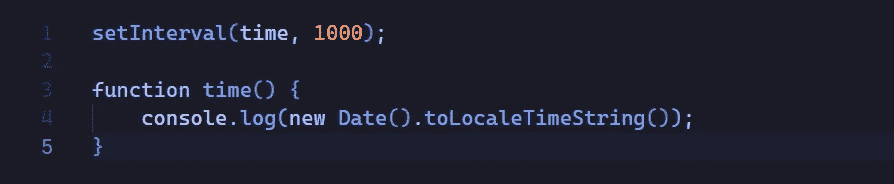
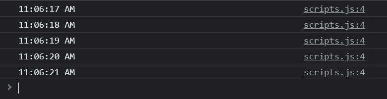
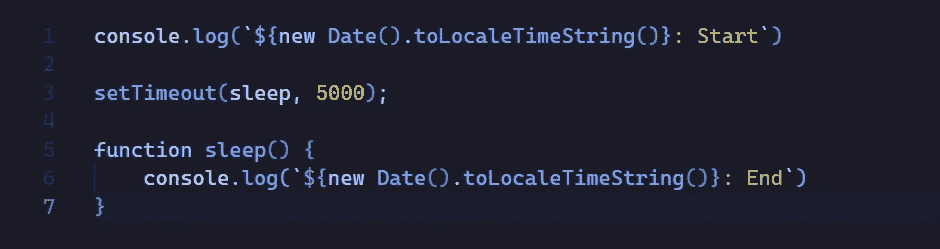
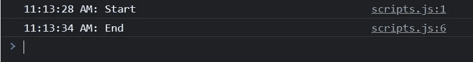
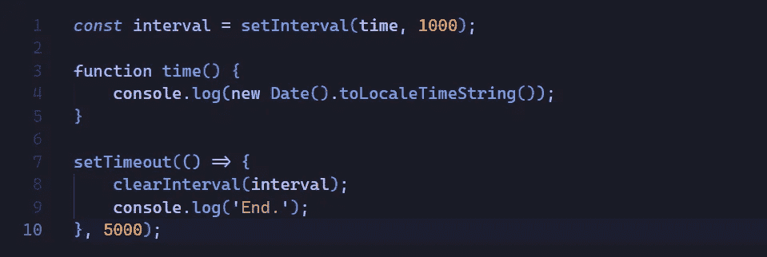
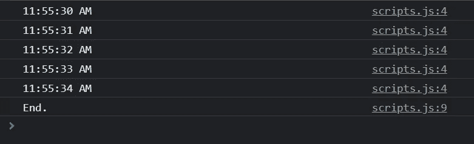

# JavaScript 中的定时事件、间隔和超时

> 原文：<https://javascript.plainenglish.io/timing-events-in-javascript-interval-timeout-1a5545df81dc?source=collection_archive---------17----------------------->

## Java Script 语言

## 如何在 JavaScript 中设置间隔和超时功能

Photo by [Aron Visuals](https://unsplash.com/@aronvisuals?utm_source=medium&utm_medium=referral) on [Unsplash](https://unsplash.com?utm_source=medium&utm_medium=referral)

间隔和超时是 web 开发中使用的强大工具，因为它是少数使用时间属性的 JavaScript 实现的方法之一。现在让我们来看看这两种方法，什么时候使用它们，以及如何取消它们的重复呼叫。

# setInterval()

设置一个时间间隔可用于在一段时间后刷新网站上的内容。如果您正在为一个时钟构建一个应用程序，设置每 1000 毫秒的时间间隔可能是您更新值的方法。

## 句法

`setInterval(function, miliseconds)`

## 因素

参数`function`是一个回调函数，每个`miliseconds`都会调用它。

参数`miliseconds`是`function`回调的周期值。

## 例子

我们可以构建一个简单的应用程序，它将运行一个每秒触发一次(1000 毫秒)的时间函数，并将当前时间记录到控制台。代码如下:

code example

以下是最终将被记录在控制台中的内容:

web console

# setTimeout()

该功能类似于前面的功能— `setTimeout()`。唯一不同的是，该功能仅在经过一段时间`miliseconds`后运行一次。

由于没有直接实现休眠方法，因此该函数更适合用作休眠函数。

## 句法

`setTimeout(function, miliseconds)`

## 因素

参数`function`是一个回调函数，每隔`miliseconds`调用一次。

参数`miliseconds`是`function`回调的周期值。

## 例子

我们可以构建一个简单的应用程序，运行 5s (5000ms)后触发的睡眠功能，并将开始时间和结束时间记录到控制台。代码如下:

code example

以下是最终将被记录在控制台中的内容:

web console

# clearInterval() & clearTimeout()

如果我们想消除重复或永远执行的间隔/超时，我们可以使用预构建的方法来取消它们。

## 句法

`clearInterval(interval)`

`clearTimeout(timeout)`

## 因素

参数`interval`是存储区间的变量。

参数`timeout`是存储超时的变量。

## 例子

下面是一个使用 timeout 在运行 5 次后清除时间间隔的示例。代码如下:

code example

以下是最终将被记录在控制台中的内容:

web console

# 结论

间隔和超时是非常有用的 web 工具，可以以多种方式使用。我希望您喜欢这篇文章，并在您的下一个 JavaScript web 项目中使用它们。

*更多内容请看*[***plain English . io***](https://plainenglish.io/)*。报名参加我们的**[***免费周报***](http://newsletter.plainenglish.io/) *。关注我们关于*[***Twitter***](https://twitter.com/inPlainEngHQ)*和*[***LinkedIn***](https://www.linkedin.com/company/inplainenglish/)*。查看我们的* [***社区不和谐***](https://discord.gg/GtDtUAvyhW) *加入我们的* [***人才集体***](https://inplainenglish.pallet.com/talent/welcome) *。**