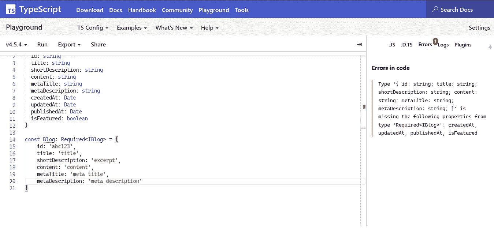
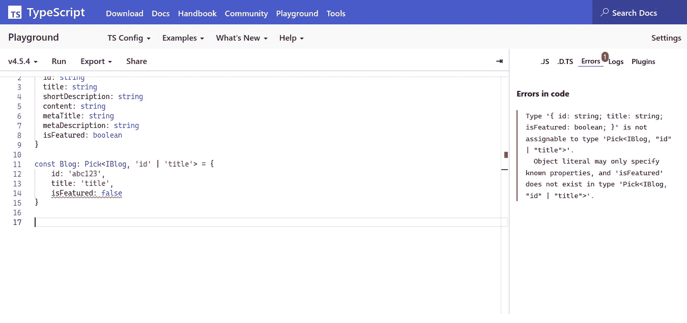

# 使用 TypeScript 中的实用工具类型增强接口的技巧

> 原文：<https://javascript.plainenglish.io/tips-for-making-interfaces-strong-with-utility-types-in-typescript-5775cd5b6f53?source=collection_archive---------18----------------------->


Photo by [Med Badr Chemmaoui](https://unsplash.com/@medbadrc?utm_source=medium&utm_medium=referral) on [Unsplash](https://unsplash.com?utm_source=medium&utm_medium=referral)

大家好！自从我回到这里已经有很长时间了。最近几个月我一直很忙。好了，先不说这个，让我们来了解一下 TypeScript 提供的一些惊人的知识。

在本节中，我们将介绍实用程序类型。如果你们都还在用 JavaScript，你们就找不到什么类型了吧？例如，任何有效载荷——假设我们知道:

```
function store (payload) {
  const store = new Blog
  store.title = payload.title
  store.shortDescription = payload.shortDescription
  store.content = payload.content
  store.metaTitle = payload.metaTitle
  store.metaDescription = payload.metaDescription if (store.save()) return true return false
}
```

> 阅读注意:如果我是一个新的 SE(阅读:软件工程师)，或者我是一个新加入项目的人，我会对这个功能感到困惑。因为到底什么是有效载荷，有哪些类型？您应该使用传统的方法进行跟踪，直到您可以使用现代的方法来调试有效负载和类型。

因此 TypeScript 可以通过使用类型和接口来处理这个问题。有了这些实用程序，您可以确定您使用的类型或他们使用的类型。**至少我一直用到了这个时候**。界面(基础)详情，可登陆官网。

好吧，看看这个。

让我们来定义博客界面。

```
interface IBlog {
  id: string
  title: string
  shortDescription: string
  content: string
  metaTitle: string
  metaDescription: string
  isFeatured: boolean
}
```

## 部分

我们可以选择使用有效载荷。我们可以部分确定。

```
const payload = { 
  id: 'abc123',
  title: 'Example Title',
  shortDescription: 'Example Excerpt',
  content: 'Example content',
  metaTitle: 'Example meta title',
  metaDescription: 'Example meta description'
}function updateStatus(payload: Partial<IBlog>) {
  return {
    id: payload.id,
    title: payload.title,
    content: payload.content
  }
}console.log(updateStatus(payload))or you can give strict define like thisfunction updateStatus(payload: Partial<IBlog, 'id' | 'title' | 'content'>) {
  return {
    id: payload.id,
    title: payload.title,
    content: payload.content
  }
}
```

然而，对于最后一个例子，你不能使用可变有效载荷。你还必须定义严格，以及有效载荷。

```
const payload = {
  id: 'abc123',
  title: 'Example title',
  content: 'Example content'
}console.log(updateStatus(payload)
```

## 必需的

偏科的反义词。有效负载的定义应该存在。

```
const Blog: Required<IBlog> = {
  id: 'abc123',
  title: 'title',
  shortDescription: 'excerpt',
  content: 'content',
  metaTitle: 'meta title',
  metaDescription: 'meta description'
}
```

您将会得到一个类似这样的错误:



## 只读

有效负载的定义应该是只读的。有效负载不能重新分配。

```
const Blog: Readonly<IBlog> = {
  id: 'abc123',
  title: 'title',
  shortDescription: 'excerpt',
  content: 'content',
  metaTitle: 'meta title',
  metaDescription: 'meta description',
  isFeatured: true
}Blog.title = 'title 2'
```

您将得到一条类似这样的错误消息。


**图片说明**:“不能分配给‘标题’，因为它是只读属性”

## 选择

拿你想要的有效载荷。

```
const Blog: Pick<IBlog, 'id' | 'title'> = {
  id: 'abc123',
  title: 'title'
}
```

如果您添加的有效负载与之前添加的不匹配，将会出现如下错误:



**图片说:**“Type“{ id:string；标题:字符串；is featured:boolean；} '不能赋给类型' Pick < IBlog，" id" | "title" >'。对象文本只能指定已知属性，并且“isFeatured”在类型“Pick < IBlog，" id" | "title" >”中不存在。

## 省略

去掉不必要的负载。

```
const Blog: Omit<IBlog, 'id' | 'title' | 'shortDescription' | 'content' | 'metaDescription' | 'metaTitle'> = {
  isFeatured: false
}
```

# 结论

实用工具类型是 TypeScript 提供的非常有用的功能。开发人员应该利用它们来避免硬编码类型。

# 警惕！

如果你们来自印度尼西亚，想要支持我越来越多的写作，希望你们能从钱包里拿出一点来。你可以通过一些方式分享你的天赋，

## 萨韦里亚

[https://saweria.co/pandhuwibowo](https://saweria.co/pandhuwibowo)


## 特拉克特尔

[https://trakteer.id/goodpeopletogivemoney](https://trakteer.id/goodpeopletogivemoney)


# 参考

[](https://www.typescriptlang.org/docs/handbook/utility-types.html) [## 文档-实用程序类型

### TypeScript 提供了几种实用工具类型来促进常见的类型转换。这些实用程序可用…

www.typescriptlang.org](https://www.typescriptlang.org/docs/handbook/utility-types.html) 

*更多内容看* [*说白了. io*](http://plainenglish.io/) *。报名参加我们的* [*免费每周简讯*](http://newsletter.plainenglish.io/) *。在我们的* [*社区*](https://discord.gg/GtDtUAvyhW) *获得独家写作机会和建议。*