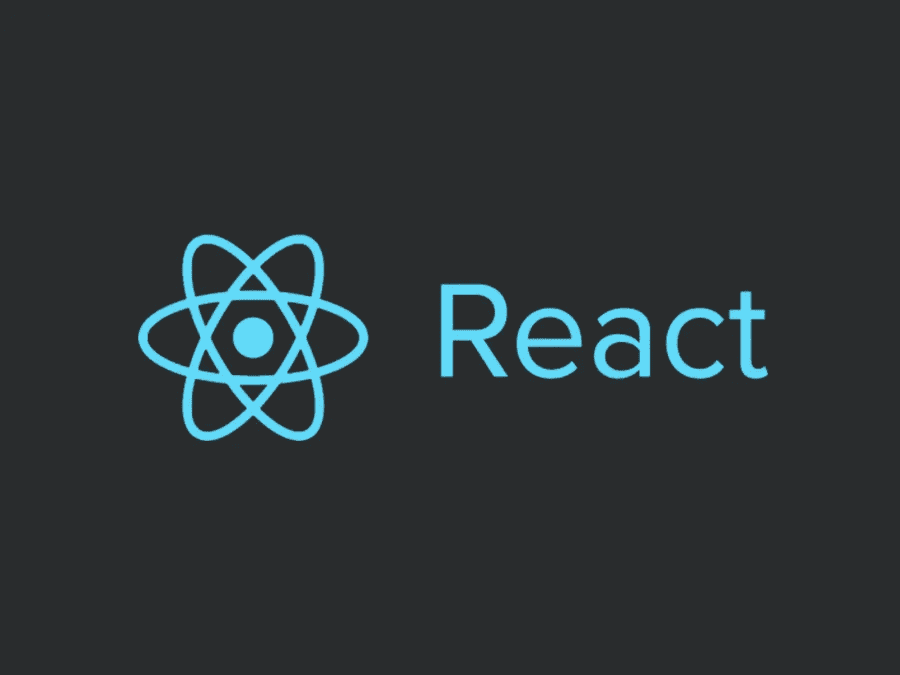

# 改进 React 代码的技巧

> 原文：<https://javascript.plainenglish.io/tips-to-improve-your-react-js-code-84ec28dc4d89?source=collection_archive---------16----------------------->

## 使用这些技巧来节省时间，使您的代码更加简洁。

在 React 上工作了几年后，我逐渐认识到一些技巧，如果使用得当，它们不仅可以节省大量时间，还可以显示出一定的专业水平。在本文中，我将着重介绍其中的几个，并尽力详细解释它们是如何工作的。

## 使用*对象析构*提取道具。

对象析构是一个有用的 JavaScript 特性，用于从对象中提取属性并将它们绑定到变量。

例如，如果您有一个如下定义的对象:

我们可以从对象中提取名字和姓氏属性，如下所示:

使用这个 JavaScript 特性，我们可以改进一个常见的 React JS 用例:

假设我们有一个名为的子组件:

不是像这样接收属性:

相反，您可以使用对象析构来改进代码:

## 将 Spread 运算符与 Object Destructuring 结合起来，将额外的属性从父组件传递到子组件。

通常你需要从父节点传递一些属性给子节点；比如 onClick 或者类名。这可以通过结合使用 [JavaScript 扩展操作符](https://www.geeksforgeeks.org/javascript-spread-operator/)和对象析构来实现。

例如，如果我们将附加属性从父组件传递到子组件，如下所示:

你可以像这样把道具传递给孩子的外容器:

我希望这些技巧可以为您节省更多的时间和代码，因为这是 React 开发人员需要做的两个常见操作。
快乐编码:)

*更多内容看* [***说白了就是 io***](https://plainenglish.io/) *。报名参加我们的* [***免费周报***](http://newsletter.plainenglish.io/) *。关注我们关于*[***Twitter***](https://twitter.com/inPlainEngHQ)*和*[***LinkedIn***](https://www.linkedin.com/company/inplainenglish/)*。加入我们的* [***社区不和谐***](https://discord.gg/GtDtUAvyhW) *。*