# 让你眼前一亮的十大精彩打字稿项目

> 原文：<https://javascript.plainenglish.io/top-10-awesome-typescript-projects-to-make-your-eyes-shine-7cc8b21b7dfc?source=collection_archive---------1----------------------->

TypeScript 是一种基于 JavaScript 的强类型编程语言，为您提供了更好的工具。下面，我将介绍十个让你眼前一亮的打字稿项目。

# [AVA](https://github.com/antvis/AVA)

> *🤖*自动化视觉分析框架。
> 
> 【https://github.com/antvis/AVA 

AVA 是一个更方便的视觉分析框架。AVA 的第一个 A 有许多意思。它指出，该框架的目标是成为一个自动化的、人工智能驱动的解决方案，支持增强分析。

它会根据数据选择不同的图表类型:

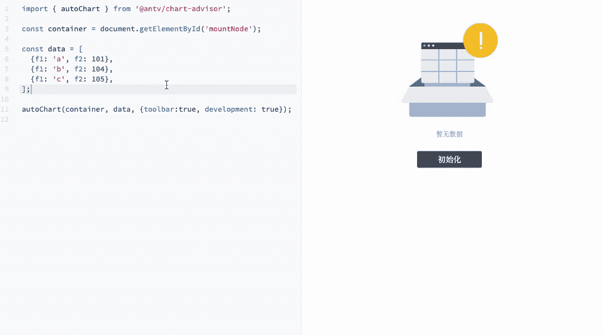

AVA 的框架可以说明如下:

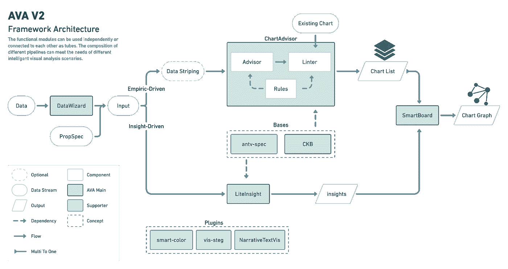

（photo via [https://ava.antv.vision/）](https://ava.antv.vision/%EF%BC%89)

# [粗糙](https://github.com/pshihn/rough)

> 创建具有手绘草图外观的图形。
> 
> [*https://github.com/pshihn/rough*](https://github.com/pshihn/rough)

**rough** 是一个小的(< 9 kB)图形库，可以让你以*草图*、*类似于*的风格进行绘制。该库定义了绘制直线、曲线、圆弧、多边形、圆和椭圆的图元。它还支持绘制 [SVG 路径](https://developer.mozilla.org/en-US/docs/Web/SVG/Tutorial/Paths)。

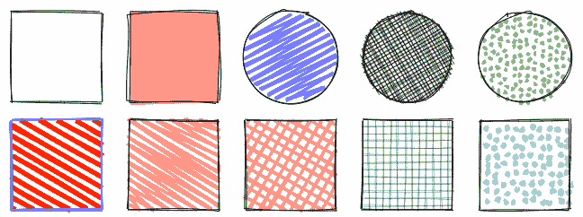

（photo via [https://github.com/rough-stuff/rough）](https://github.com/rough-stuff/rough%EF%BC%89)

除了生成简单的图形，rough 还可以用来生成复杂的图形，比如手绘风格图:

（photo via [https://github.com/rough-stuff/rough）](https://github.com/rough-stuff/rough%EF%BC%89)

# [excalidraw](https://github.com/excalidraw/excalidraw)

> 用于绘制手绘图表的虚拟白板。
> 
> [*https://github.com/excalidraw/excalidraw*](https://github.com/excalidraw/excalidraw)

Excalidraw 是一个用于绘制手绘图表的虚拟白板。协作和端到端加密。

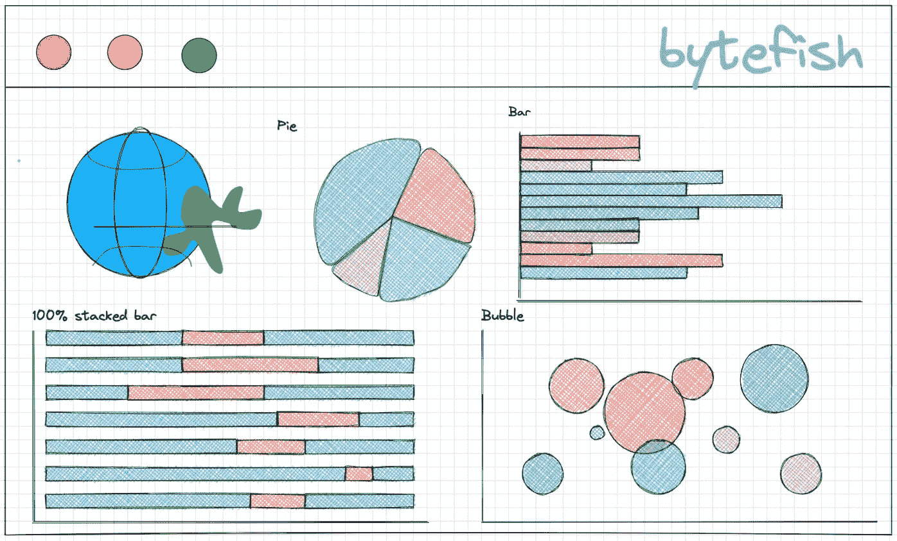

为了方便用户绘图，excalidraw 提供了很多开箱即用的图形库，安装后即可使用。你可以访问这个[页面](https://libraries.excalidraw.com/?theme=light&sort=default)来选择你需要的图形库。

# [可移动](https://github.com/daybrush/moveable)

> 可移动！可拖动！可调整大小！可扩展！可旋转！可战！易捏！可分组！可抓拍！
> 
> [*https://github.com/daybrush/moveable*](https://github.com/daybrush/moveable)

可移动是可拖动的、可调整大小的、可缩放的、可旋转的、可弯曲的、可挤压的、可分组的、可咬合的。它具有以下特点:

*   **可拖动**指拖动和移动目标的能力。
*   **可调整大小**表示目标的宽度和高度是否可以增加或减少。
*   **Scalable** 表示目标的 x 和 y 是否可以作为变换的尺度。
*   **可旋转**表示目标是否可以旋转。
*   **war able**表示目标是否可以扭曲(扭曲、弯曲)。
*   **可收缩**表示目标是否可收缩、可调整大小、可缩放和可旋转。
*   **可分组**表示目标是否可以成组移动，可拖动、可调整大小、可缩放和可旋转。
*   **可捕捉**指示是否捕捉到指引线。
*   **OriginDraggable** 表示是否拖动原点。
*   **可裁剪**表示是否裁剪目标。
*   **圆形**表示是否显示并拖动或双击边框半径。
*   支持 svg 元素(SVG，路径，直线，椭圆，g，矩形等)
*   支持主要浏览器
*   支持 3d 变换

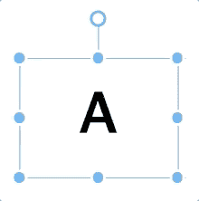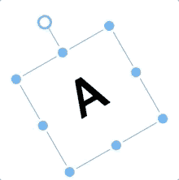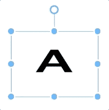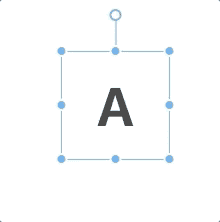

(photo via [https://github.com/daybrush/moveable](https://github.com/daybrush/moveable))

# [n8n](https://github.com/n8n-io/n8n)

> 免费开放的公平代码授权的基于节点的工作流自动化工具。跨不同服务轻松实现任务自动化。
> 
> [*https://github.com/n8n-io/n8n*](https://github.com/n8n-io/n8n)

n8n 是一个可扩展的工作流自动化工具。有了[公平代码](http://faircode.io/)分发模型，n8n 将始终拥有可见的源代码，对自己的主机可用，并允许您添加自己的定制功能、逻辑和应用程序。n8n 基于节点的方法使其高度通用，使您能够将任何东西连接到任何东西。

n8n 有 200 多个不同的节点来自动化工作流。这份名单可以在[https://n8n.io/integrations](https://n8n.io/integrations)找到

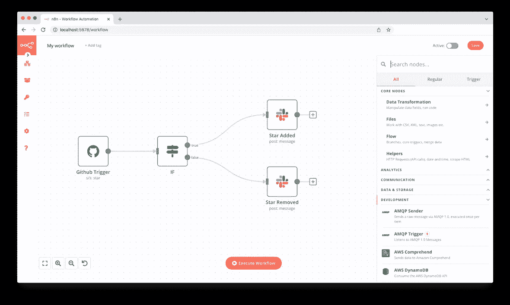

(photo via [https://github.com/n8n-io/n8n](https://github.com/n8n-io/n8n))

# [rrweb-io](https://github.com/rrweb-io/rrweb)

> 记录和重放网络。
> 
> [*https://github.com/rrweb-io/rrweb*](https://github.com/rrweb-io/rrweb)

`rrweb`是一个开源的 web 会话重放库，它提供了易于使用的 API 来记录用户的交互并远程重放。它主要由 3 部分组成:

*   [**rrweb-snapshot**](https://github.com/rrweb-io/rrweb/tree/master/packages/rrweb-snapshot/) ，包括快照和重建功能。快照用于将 DOM 及其状态转换为具有唯一标识符的可序列化数据结构；重建特性是将快照重建到相应的 DOM 中。
*   [**rrweb**](https://github.com/rrweb-io/rrweb) ，包括录制和回放两个功能。record 函数用于记录 DOM 中的所有突变；重放是根据对应的时间戳，将记录的突变逐个重放。
*   [**【rrweb-player**](https://github.com/rrweb-io/rrweb/tree/master/packages/rrweb-player/)，是 RR web 的播放器 UI，提供基于 GUI 的功能，如暂停、快进、拖放等，可以随时播放。

在网页中记录用户操作后，可以使用 rrweb-player 进行暂停、快进、拖放到任意时间点等播放功能。

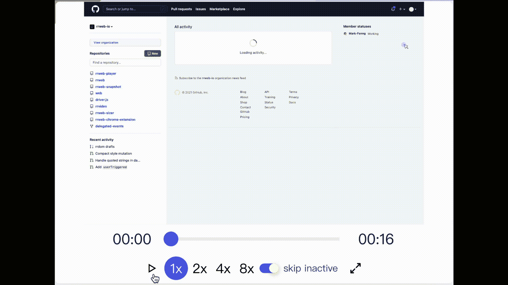

看完之后，如果你也想体验一下，可以用下面 3 个网上的例子:

*   [引导程序检验表](https://www.rrweb.io/demo/checkout-form)
*   [会话形式](https://www.rrweb.io/demo/chat)
*   [俄罗斯方块游戏](https://www.rrweb.io/demo/tetris?lan=en)

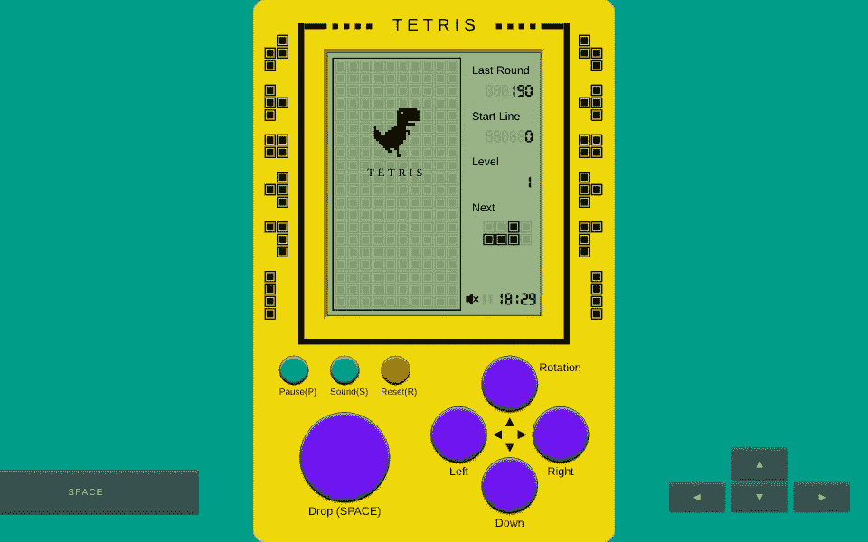

(photo via [https://www.rrweb.io](https://www.rrweb.io))

# [超级](https://github.com/vercel/hyper)

> 基于网络技术的终端。
> 
> [https://github.com/vercel/hyperT21](https://github.com/vercel/hyper)

Hyper 是一个基于电子的终端，建立在 HTML/CSS/JS 之上。完全可扩展，你可以从命令行安装主题和插件。

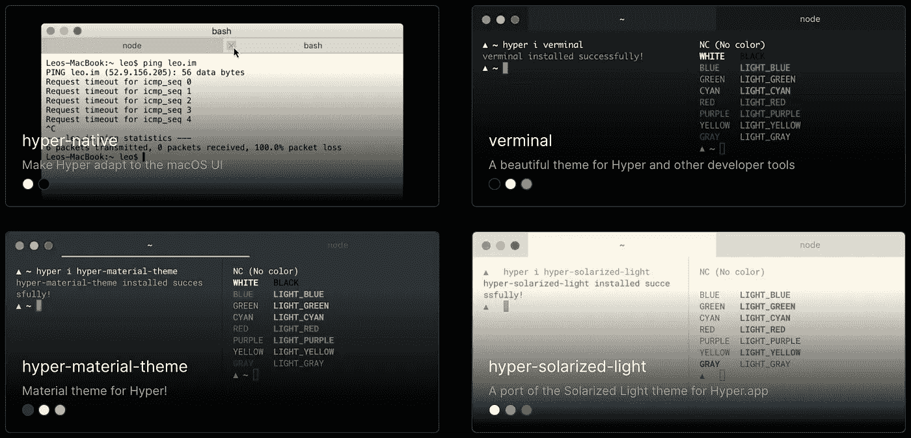

(photo via [https://hyper.is/themes](https://hyper.is/themes))

hyper 的目标是为命令行界面用户创建一个漂亮的、可扩展的体验，建立在开放的 web 标准之上。一开始，我们的重点将主要放在速度、稳定性以及为扩展作者开发正确的 API 上。

# [nocodb](https://github.com/nocodb/nocodb)

> 🔥 🔥 🔥开源 Airtable 替代方案——使用 REST APIs 将任何 MySQL、Postgres、SQLite 转换成电子表格。
> 
> [*https://github.com/nocodb/nocodb*](https://github.com/nocodb/nocodb)

NocoDB 是一个无代码的数据库平台，它允许团队通过熟悉而直观的电子表格界面来协作和构建应用程序。这甚至允许非开发人员或商业用户成为软件创作者。

NocoDB 的工作原理是连接到任何关系数据库，并将它们转换成智能电子表格界面！这允许您与团队协作构建无代码应用程序。NocoDB 目前与 MySQL、PostgreSQL、Microsoft SQL Server、SQLite、Amazon Aurora & MariaDB 数据库一起工作。它具有以下特点:

*   ⚡基本操作:创建、读取、更新和删除表、列和行
*   ⚡字段操作:排序、过滤、隐藏/取消隐藏列
*   ⚡多视图类型:网格(默认)、图库和窗体视图
*   ⚡视图权限类型:协作视图和锁定视图
*   ⚡共享基地/视图:公共或私人(有密码保护)
*   ⚡变体单元格类型:ID、LinkToAnotherRecord、查找、汇总、单行文本、附件、货币、公式等
*   带角色的⚡访问控制:不同级别的细粒度访问控制
*   ⚡和更多…

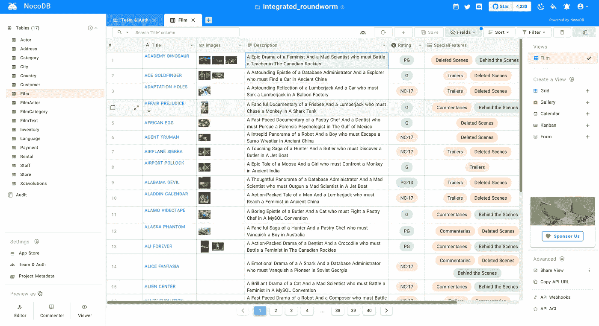

(Photo via [https://github.com/nocodb/nocodb](https://github.com/nocodb/nocodb))

# [tiptap](https://github.com/ueberdosis/tiptap)

> *网络工匠的无头编辑器框架。*
> 
> 【https://github.com/ueberdosis/tiptap】T5[T6](https://github.com/ueberdosis/tiptap)

Tiptap 是围绕 ProseMirror 的一个无头包装器，ProseMirror 是一个用于构建富文本 WYSIWYG 编辑器的工具包，已经在许多知名公司使用，如纽约时报、卫报和 Atlassian。

**Tiptap 是个聪明的编辑**。有了排版扩展，tiptap 就能理解*你的意思*并给你的文本添加正确的字符——就像你身边的一个“排版呆子”。

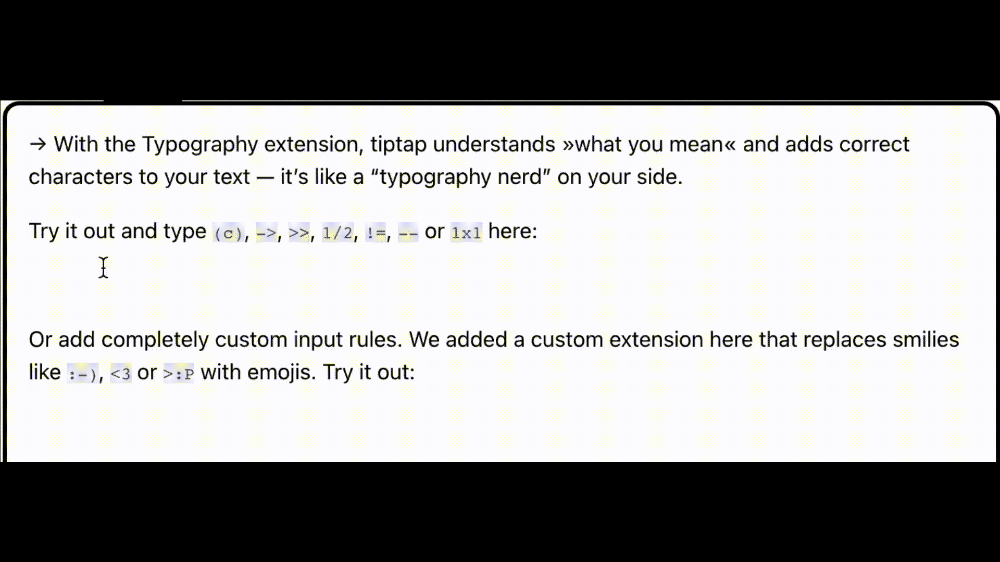

Tiptop editor 提供了你所期望的现代编辑器所能提供的功能，而且可能还不止这些。有了 **53 个扩展模块**，您可以探索更多。您可以访问此[页面](https://tiptap.dev/extensions)选择您需要的扩展名。

# NestJS

> 一个渐进式 Node.js 框架，用于在 TypeScript 和 JavaScript (ES6、ES7、ES8)之上构建高效、可伸缩的企业级服务器端应用程序🚀。
> 
> [*https://github.com/nestjs/nest*](https://github.com/nestjs/nest)

NestJS 是一个用于构建高效、可伸缩的服务器端应用程序的框架。它使用现代 JavaScript，用 [TypeScript](http://www.typescriptlang.org/) 构建(保留了与纯 JavaScript 的兼容性)，结合了 OOP(面向对象编程)、FP(函数式编程)、FRP(函数式反应编程)的元素。

在引擎盖下，NestJS 使用了 [Express](https://expressjs.com/) ，但是也提供了与广泛的其他库的兼容性，例如 [Fastify](https://github.com/fastify/fastify) ，允许轻松使用无数可用的第三方插件。

NestJS 的目标是提供一个开箱即用的应用程序架构，允许轻松创建高度可测试、可伸缩、松散耦合和易于维护的应用程序。该建筑的灵感很大程度上来自于棱角分明的。

这里有一个简单的例子:

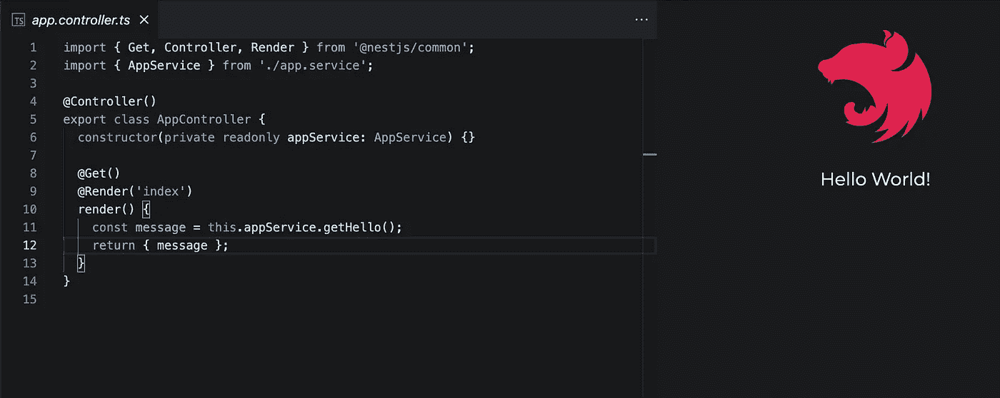

好了，这是我喜欢的 TypeScript 项目的介绍。如果有你喜欢的项目，记得加书签。也欢迎大家给我留言，推荐自己喜欢的 TypeScript 项目。

希望你会喜欢它们！

*更多内容看* [***说白了。报名参加我们的***](https://plainenglish.io/) **[***免费周报***](http://newsletter.plainenglish.io/) *。关注我们关于*[***Twitter***](https://twitter.com/inPlainEngHQ)*和*[***LinkedIn***](https://www.linkedin.com/company/inplainenglish/)*。查看我们的* [***社区不和谐***](https://discord.gg/GtDtUAvyhW) *加入我们的* [***人才集体***](https://inplainenglish.pallet.com/talent/welcome) *。***