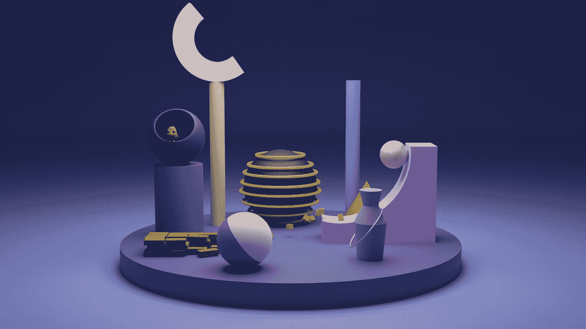
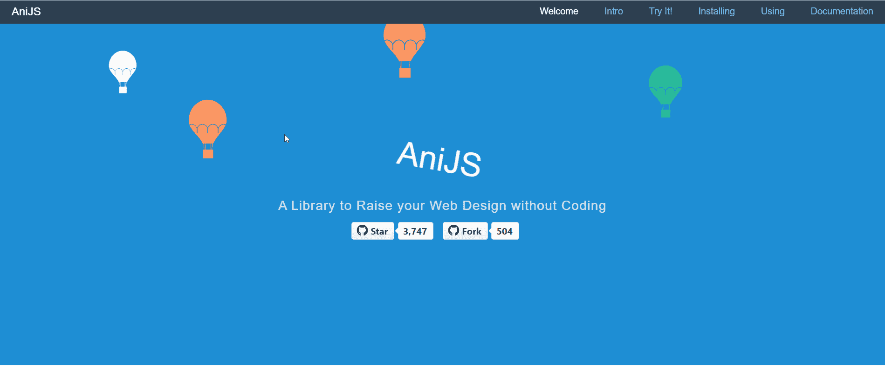
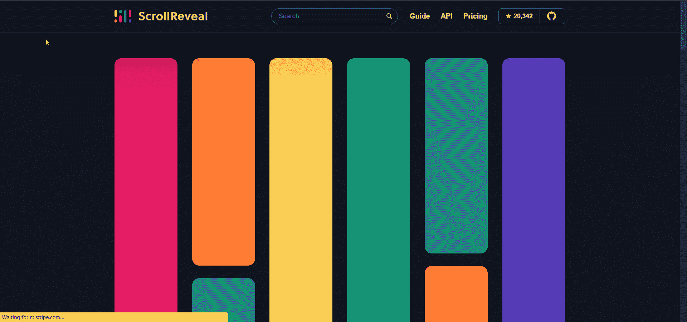

# 2022 年顶级 JavaScript 动画库

> 原文：<https://javascript.plainenglish.io/top-10-javascript-animation-libraries-f11e9bb6085a?source=collection_archive---------2----------------------->

## 10 个必看的 JavaScript 动画库及示例



Photo by [Shubham Dhage](https://unsplash.com/@theshubhamdhage?utm_source=medium&utm_medium=referral) on [Unsplash](https://unsplash.com?utm_source=medium&utm_medium=referral)

今天，用户体验变得非常复杂。许多网站使用动画为他们的用户提供更加身临其境的体验。然而，创建吸引人的动画，同时保持网站的性能和稳定性是一项艰巨的任务。

本文讨论了 10 大 JavaScript 动画库，用于创建高性能、高稳定性的精彩动画。这些库使得使用简单的代码创建复杂的动画成为可能。因为它们是 JavaScript 库，所以您可以轻松地将它们用于 React、Angular 或 Vue 等 web 框架。让我们开始吧。

# 1.简单而强大

Anime.js 是一个轻量级的 JavaScript 动画库，具有简单但强大的 API。它可以动画 CSS、SVG、DOM 属性和 JavaScript 对象。下面是一个使用 Anime.js 制作平滑 SVG 图标动画的例子。

Anime.js 中的动画效果是高度可定制的。动画目标、延迟和关键帧都可以指定。它们也有一套很棒的惊人效果，可以让多个元素通过后续动作和重叠动作产生动画效果。您也可以使用时间轴来同步多个动画。

有了所有这些特性及其优秀的文档，可以肯定地说 Anime.js 是最好的一体化动画 JavaScript 库之一。

[](https://github.com/juliangarnier/anime/) [## GitHub-juliangarnier/anime:JavaScript 动画引擎

### JavaScript 动画引擎。在 GitHub 上创建一个帐户，为 juliangarnier/anime 的发展做出贡献。

github.com](https://github.com/juliangarnier/anime/) 

# 2.grade 专业级动画

GSAP 库是创建在所有主流浏览器中都能工作的高性能动画的好方法。GSAP 和 Anime.js 一样，允许你制作 CSS、SVG 和通用对象的动画，尽管其中一些不能免费使用。下面是一个如何使用 GSAP 根据光标位置制作 CSS 遮罩动画的示例。

除了它们的核心特性，它们还提供了各种很酷的插件来帮助你创造身临其境的用户体验。例如，他们的 ScrollTrigger 插件允许你用最少的代码创建基于滚动的动画。

他们还提供了一套插件和工具，只提供给 GreenSock 俱乐部成员，你必须购买 GreenSock 会员资格才能访问它们。

据说 GSAP 比 jQuery 快 20 倍，在业界受到广泛信任，超过 1000 万个网站使用它制作高性能动画。

[](https://github.com/greensock/GSAP) [## GitHub-green sock/GSAP:green sock 的 GSAP JavaScript 动画库(包括 Draggable)。

### GreenSock 的 GSAP JavaScript 动画库(包括 Draggable)。- GitHub -格林索克/GSAP:格林索克的 GSAP…

github.com](https://github.com/greensock/GSAP) 

# 3.Mo.js —模块化运动图形

Mo.js 是一个支持 retina 的 javascript 运动图形库，具有简单的声明式 API，可以帮助您快速掌握您的运动项目。你不必担心大文件的开销，因为它是模块化的。

该库包括内置组件，如 Html、shape、swirl、burst 和 stagger，以帮助您立即开始制作动画。Mo.js 的爆发和形状漩涡效果非常适合创建点击动画效果。使用这些效果创建的点击动画效果的示例如下所示。

因为 Mo.js 不受屏幕密度影响，所以它们的效果在任何设备上都好看。

[](https://github.com/mojs/mojs) [## GitHub-mojs/mojs:web 的动画工具带

### 网络动画工具带。在 GitHub 上创建一个帐户，为 mojs/mojs 的发展做出贡献。

github.com](https://github.com/mojs/mojs) 

# 4.Typed.js 输入动画库

Typed.js 是一个非常棒的打字动画库，包括有用的定制特性，比如批量打字、智能退格和暂停打字。你可以在你的网站上流畅地打出任何一组字符串。他们的 GitHub 页面还包含预先编写的 React、Vue 和 WebComponent 代码。

> 提示:为了使 SEO 更加友好，您可以在页面上放置一个 HTML div 并从中读取内容，而不是使用 strings 数组来插入字符串，如前面的示例所示。

Typed.js 被许多网站使用，包括 Slack 和 GitHub，它是我个人最喜欢的在 web 应用程序中制作文本动画的方式。

[](https://github.com/mattboldt/typed.js/) [## GitHub - mattboldt/typed.js:一个 JavaScript 类型化动画库

### Typed.js 是一个类型化的库。输入任何字符串，看着它以你设定的速度键入，退格键是什么…

github.com](https://github.com/mattboldt/typed.js/) 

# 5.Three.js —令人兴奋的 3D 动画

Three.js 是一个基于 WebGL 的 3D 动画库。这个库允许你用一个相机创建一个场景，并在其中制作动画。使用该库的构造函数，您还可以向对象添加网格材质，以及向场景添加灯光和阴影。看看下面的例子，看看如何用 Three.js 制作一个基本的 3D 动画。

有大量的文档和可视化示例可以帮助您快速通过学习曲线。

毫无疑问，Three.js 是网络上最受欢迎的 3D 动画库，你可以通过访问他们的[网站](https://threejs.org/)看到一些用它创造的不可思议的体验。

[](https://github.com/mrdoob/three.js) [## GitHub-mrdoob/three . js:JavaScript 3D 库。

### JavaScript 3D 库该项目的目标是创建一个易于使用，轻量级，跨浏览器，通用…

github.com](https://github.com/mrdoob/three.js) 

# 6.Vivus.js —在 SVG 上绘制动画

Vivus.js 是一个轻量级的 javascript 动画库，专门为 SVG 绘制动画而设计。您可以从各种动画类型中进行选择，比如`Delayed`、`Sync`或`OneByOne`，或者您可以编写自己的定制脚本来绘制 SVG。您还可以使用简单的 JavaScript 函数覆盖每个路径的动画，以获得更大的灵活性。用这个库创建的 SVG 动画示例如下所示。

通过使用 Vivus 构造函数的 callback 参数，可以循环运行动画，如前面的示例所示。

如果您正在寻找一个无依赖性的 SVG 动画库，那么 Vivus 是不二之选。

[](https://github.com/maxwellito/vivus) [## GitHub - maxwellito/vivus:在 SVG 上制作绘图动画的 JavaScript 库

### 演示可在 http://maxwellito.github.io/vivus 玩它在 Vivus 即时 Vivus 是一个轻量级的 JavaScript…

github.com](https://github.com/maxwellito/vivus) 

# 7.tween . js-JavaScript/TypeScript 补间引擎

Tween.js 允许您使用优化的缓动功能在两个位置之间制作任何对象的动画。您可以定义动画的开始和结束坐标，并通过`chain`、`repeat`、`yoyo`、`delay`等功能对其进行进一步控制。要了解该库如何工作，请查看下面的补间动画示例。

Tween 也可以与 three.js 结合使用，以动画显示 3D 对象的位置。

由于其易用性和优化的性能，Tween.js 甚至被 Android 网站使用。所以，这是为你的网站添加简单补间动画的首选库。

[](https://github.com/tweenjs/tween.js) [## GitHub-tween js/tween . js:JavaScript/TypeScript 动画引擎

### 用于简单动画的 JavaScript 补间引擎，结合了优化的 Robert Penner 方程。更新 v18 中的注释…

github.com](https://github.com/tweenjs/tween.js) 

# 8.ani . js——不用编码就能提升你的网页设计

Ani.js 是一个简单而紧凑的动画库，即使对没有经验的开发人员来说也是理想的。

它使您能够定义动画并将其直接添加到 HTML 元素中。使用`data-anijs`标签可以轻松处理 CSS3 动画。下面的代码演示了使用 Ani.js 向元素添加 swing 动画是多么简单。

```
<div data-anijs="if: mouseover, do: swing animated"> ... </div>
```



Ani.js 支持编码人员和设计人员之间更好的协作，它在 iPad、iPhone、Android 和现代浏览器上运行良好。

[](https://github.com/anijs/anijs) [## GitHub - anijs/anijs:一个不用编码就能提升你的网页设计的库。

### 一个无需编码就能提升你的网页设计的库。最简单快捷的方法来提高你的网站！！！查看在线…

github.com](https://github.com/anijs/anijs) 

# 9.滚动显示—滚动动画时显示

Scroll reveal 是一个没有依赖关系的 JavaScript 库，当 web 元素滚动到视图中时，您可以使用它来制作动画。因为 ScrollReveal 使用 singleton 模式，所以我们可以从任何地方调用它们的`ScrollReveal()`构造函数，并且确信它将总是返回相同的实例。

您可以使用实例的`reveal()`函数创建动画，也可以定义动画选项，如`delay`、`easing`、`rotate`和`scale` ，以获得更大的灵活性。



但是，如果您想在商业网站上使用 Scroll Reveal 库，您必须购买商业许可证。

[](https://github.com/jlmakes/scrollreveal) [## GitHub - jlmakes/scrollreveal:当元素滚动到视图中时动画显示它们。

### 将元素滚动到视图中时制作动画。ScrollReveal 是一个 JavaScript 库，可以很容易地制作元素动画，因为它们…

github.com](https://github.com/jlmakes/scrollreveal) 

# 10.质子粒子动画库

质子是一个优秀的粒子动画库，允许您使用各种渲染器快速创建各种粒子效果。您可以创建火焰、烟花、子弹甚至爆炸等效果。您还可以模拟物理属性，如重力和布朗运动。

质子的渲染器包括画布渲染器、DOM 渲染器、WebGL 渲染器和像素渲染器，你也可以创建自己的渲染器。该库的许多类和函数也有很好的文档记录。

这个库的 3D 版本也可以用 three.js 创建，名为 [three.proton](https://drawcall.github.io/three.proton/) ，如果你正在寻找一个高效的粒子渲染库，proton 就是你要使用的。

[](https://github.com/drawcall/Proton) [## GitHub-draw call/Proton:Javascript 粒子动画库

### Javascript 粒子动画库。在 GitHub 上创建一个帐户，为 drawcall/Proton 开发做出贡献。

github.com](https://github.com/drawcall/Proton) 

# 结论

上面提到的十大 JavaScript 动画库是从众多可用的 JavaScript 动画库中挑选出来的，因为它们提供了性能、易用性和稳定性的最佳平衡。

每个动画库都有自己的优势，我希望这篇文章能够帮助您为自己的项目选择最好的 JavaScript 动画库。感谢您的阅读，祝您编码愉快！

*更多内容请看*[***plain English . io***](http://plainenglish.io/)*。报名参加我们的* [***免费周报***](http://newsletter.plainenglish.io/) *。在我们的* [***社区***](https://discord.gg/GtDtUAvyhW) *获得独家获得写作机会和建议。*