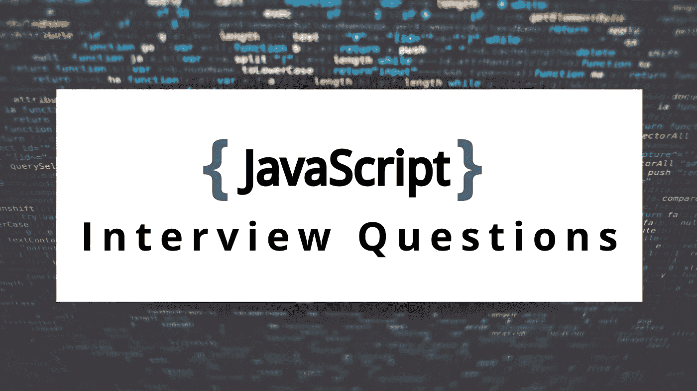

# 十大 JavaScript 面试问题

> 原文：<https://javascript.plainenglish.io/top-10-javascript-interview-question-a1bf5dae41f5?source=collection_archive---------1----------------------->



本文将讨论一些最常见的 JavaScript 面试问题。

## 1.ES6 版本引入了哪些功能？

*   Let 和 const 关键字。
*   箭头功能。
*   多行字符串。
*   析构任务。
*   增强的对象文字。
*   承诺。

## 2.var，const，和 let 的主要区别是什么？

*   用 **let** 和 **const** 声明的变量是块范围的；用**变量**声明的变量是全局作用域或函数作用域的。
*   **var** 变量可以在其作用域内更新和重新声明；**让**变量可以更新但不能重新声明；**常量**变量既不能更新也不能重新声明。
*   **var** 可以被提升到自己的范围顶部。当**变量**被初始化为未定义时， **let** 和 **const** 变量不被初始化(临时死区，TDZ)。
*   虽然 **var** 和 **let** 可以不进行初始化而进行声明，但是 **const** 在声明时必须进行初始化。

## 3.什么是承诺和异步等待？

*   **承诺**是在 JavaScript 中启用异步编程的一种方式。更一般地说，Promise 意味着一个程序调用一个函数，期望它将返回调用程序可以在进一步计算中使用的结果。
*   Async-await 也有助于异步编程。这是承诺的句法糖。Async-await 语法简单，很容易在一个函数中维护大量异步调用。此外，异步等待防止回调地狱。

```
const myPromise = new Promise((resolve, reject) => { 
 // condition
});
```

## 4.JavaScript 为什么是单线程的？

*   文档，为什么 JavaScript 是单线程语言— [链接](https://www.geeksforgeeks.org/why-javascript-is-a-single-thread-language-that-can-be-non-blocking/)。

## 5.JavaScript 如何维护并发性？

*   事件循环。
*   微观和宏观队列。
*   回电。
*   线程池和集群(多线程)。

## 6.什么是回调，它是如何在幕后工作的？

*   回调之所以可能，只是因为 JavaScript 支持一级函数。
*   作为参数传递给另一个函数或者可以在那个函数中执行的函数称为回调。
*   在 Node.js 中，它由 4 个默认线程组成，负责维护主堆栈和其他队列，大多数异步函数调用其他异步函数，然后调用回调。你可以把它想象成一个函数和回调的链。所有的异步和 IO 操作都不由主线程直接处理，所有的回调和异步调用都由 JS 引擎中的另一个队列处理。

## 7.我们有多少种方法来声明一个函数，它们之间有什么不同？

*   一个函数声明由一个 ***函数*** 关键字组成，后跟一个必需的函数名，一对括号中的参数列表。
*   **速记方法**定义可以在对象文字和 ES2015 类的方法声明中使用。
*   使用一对包含参数列表的括号定义了一个**箭头**函数。后面是一个粗箭头= >和一对大括号，用来分隔主体语句。
*   在一个**函数**表达式中，你将一个函数赋给一个变量。
*   可以使用**函数构造器**动态创建一个函数，但是它存在安全和性能问题，不建议使用。

## 8.下面代码的输出会是什么？

```
x = 5;
var x;
(function fun() { 
    {
        let x = 1;
        x++;
        console.log(x);
    }
    console.log(x);
})(); // output
2
5
```

## 9.下面代码的输出会是什么，为什么？

```
setTimeout(() => {
    console.log("Hi");
}, 0)
console.log("Hello");// output
Hello 
Hivar x = 5;
x = 0;
setTimeout(() => {
    console.log(x);
})
console.log("Hello");
x = x+1;// output
Hello
1
```

## 10.下面代码的输出会是什么，为什么？

```
fun2();
console.log(x);
console.log(y);
fun1();
const fun1 = () => {
    console.log("fun1")
}
function fun2(){
    console.log("fun2")
}
var x = 5;
let y = 7;// output 
fun2
undefined
ReferenceError: Cannot access 'y' before initialisation
ReferenceError: Cannot access 'fun1' before initialisation
```

这就把我们带到了终点！非常感谢你一直读到最后——如果这篇文章在任何意义上有所帮助，我会很感激一个跟随来帮助我达到我的目标。:)

请随时访问我的网站，如果您有任何关于 JS/DevOps 的疑问，请随时与我联系。

[https://ritikchopra . netlify . app](https://ritikchopra.netlify.app/)

祝你好运！
里提克·乔普拉😘

*更多内容看* [***说白了就是***](https://plainenglish.io/) *。报名参加我们的* [***免费每周简讯***](http://newsletter.plainenglish.io/) *。关注我们*[***Twitter***](https://twitter.com/inPlainEngHQ)*和*[***LinkedIn***](https://www.linkedin.com/company/inplainenglish/)*。加入我们的* [***社区不和谐***](https://discord.gg/GtDtUAvyhW) *。*