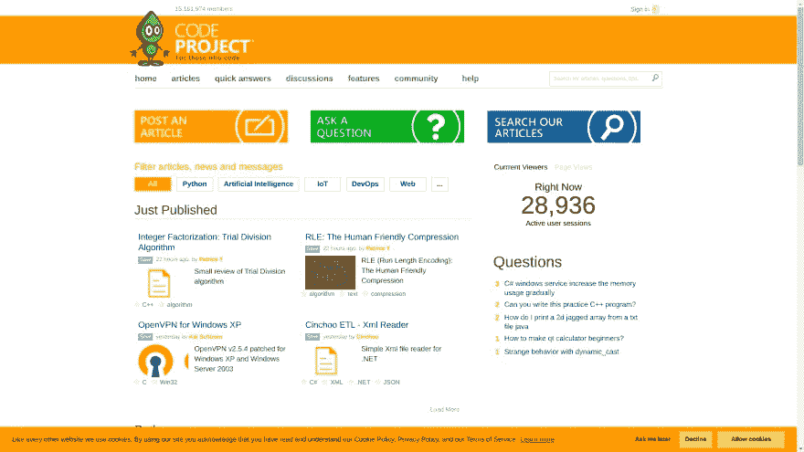
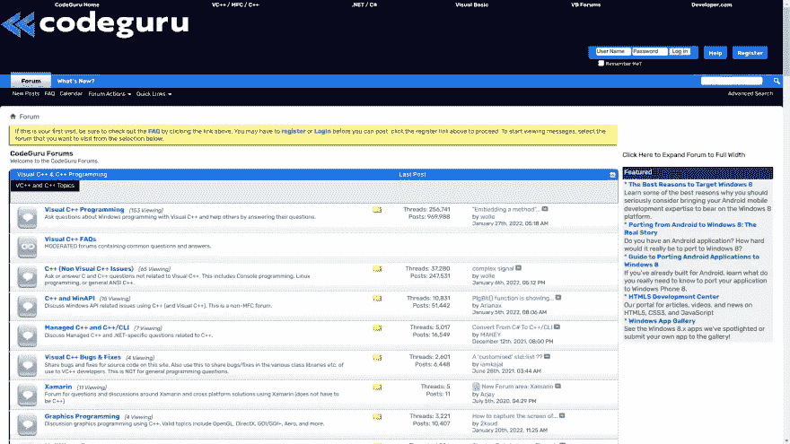
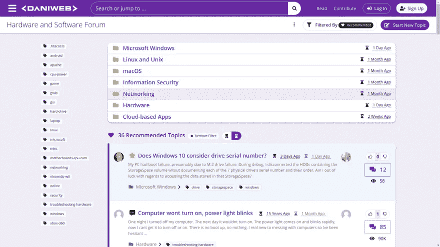
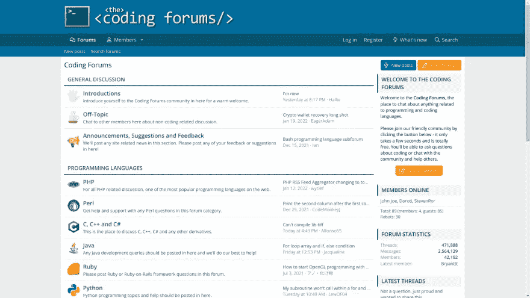

# 成为高效程序员应该参加的 10 个黑仔论坛

> 原文：<https://javascript.plainenglish.io/top-10-killer-forum-you-should-join-to-be-a-productive-programmer-c8fe2502cebd?source=collection_archive---------9----------------------->

## 如果你想成为一名高效的程序员，可以加入一些有用的论坛。

今天，速度是击败竞争对手的主要标准之一。我精心挑选了一些有用的论坛应用程序，它们可能会在你的开发人员工作流程中派上用场，并且可以非常快速地修复问题。

这些包括你作为程序员工作时可能需要的任何东西；网页开发，安卓开发，游戏开发，软件开发到作为开发者赚取被动收入。每个论坛将包括一个直接链接，描述以及图像预览。

# [网络矩阵论坛](https://webmatrices.com/t/programming)

这个论坛的很多帖子在谷歌上都有排名。另外，这个论坛**在新开发者**中很受欢迎。

它有最高的`**Daily Pageviews per Visitor: 6.1**`和`**daily time on site: 5:52**`。它也有相当多的内容。用户大多在这里谈论网页/应用程序开发、游戏开发和博客/SEO 相关的东西。

这个论坛也被选为学习 web 开发的最佳场所之一。

这个论坛也发展得非常快。如果你想了解网络开发框架(Django，Vue.js)，独立开发，通过开发被动创收，网络抓取，自动化，游戏开发和博客/SEO，建议你加入这个论坛。

# [代码项目](https://www.codeproject.com/)

这个论坛不知何故在网上很受欢迎。根据 Alexa rank 的数据，每位访问者的日浏览量为 1.53 次，每天在网站上的时间为 1.50 次。它的排名比网络矩阵略低。内容、问题和答案的数量也相当不错。人们通常在这里谈论 Python、C++和 AI 相关的东西。

# [Codeguru](https://forums.codeguru.com/)

这个网站对于学习操作系统相关的东西来说真是太棒了。每个访问者每天有 1.3 次页面浏览量，每天在网站上的时间是 1:26。大家讨论 C 编程，洋葱架构，。NET、VB.NET 和其他与操作系统相关的东西。如果你想了解操作系统，加入这个论坛会很棒。虽然这个论坛网站的 Alexa 排名有一个下降率，但我猜这个下降率很快就会改变。

# [丹尼威](https://www.daniweb.com/)

这个网站也在某种程度上与硬件和操作系统相关的东西。每位访问者的日浏览量和每日在网站上的时间分别为 1.3 和 1:34。成员们通常讨论 VB.NET、计算机硬件、Python 和操作系统相关的东西。如果你真的想深入操作系统、硬件开发和 C 编程，我建议你加入这个论坛。

# [the code forums](https://www.thecodingforums.com/)

这个论坛是这里提到的所有论坛中最小的一个，但是发展得非常好。1.4 日均访客浏览量和网站每日 0:57 是这个网站的 Alexa 报告。这里的人们谈论 Python GUI、Tkinter、HTML、CSS 和 Java。如果你是编程世界的新手，我建议你加入这个论坛。

对了，这是我上一篇文章的转贴。

*更多内容看* [***说白了。报名参加我们的***](http://plainenglish.io/) **[***免费周报***](http://newsletter.plainenglish.io/) *。在我们的* [***社区获得独家访问写作机会和建议***](https://discord.gg/GtDtUAvyhW) *。***