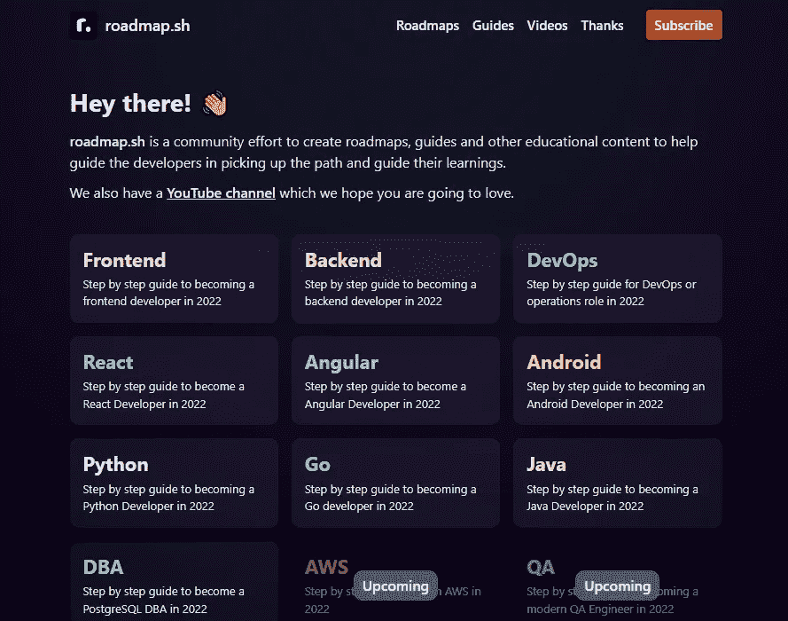

# 十大最受欢迎的 GitHub 回购排行榜

> 原文：<https://javascript.plainenglish.io/top-10-most-popular-github-repos-leaderboard-f7c5b6ab3908?source=collection_archive---------5----------------------->

## 反应不是第一位的？

是什么让一个开源项目**在回购的海洋中脱颖而出**并不是一个真正的**之谜**。让我们来看看哪些是最受欢迎的存储库，以及是什么帮助他们达到这样的数量。

free vs. paid learning resources

# 1.[自由代码营/自由代码营](https://github.com/freeCodeCamp/freeCodeCamp) (⭐341k)

> 人人都爱免费的东西

freeCodeCamp GitHub Repo

你不可能没有听说过 freeCodeCamp，但你可能不知道它是 GitHub 中最受欢迎的存储库。

freeCodeCamp.org 有几个免费的开发者证书。这些认证中的每一个都要求你完成五个必修的 web 应用程序项目以及数百个可选的代码任务，以帮助你做好准备。

他们提供的大量免费教育信息令人震惊，这也是他们排名第一的主要原因。

在黄金时代赠送免费的编码学习资源绝对是它们受欢迎的主要因素，因为人们喜欢免费资源的建议。

# 2. [996icu/996。重症监护室](https://github.com/996icu/996.ICU) (⭐261k)

> 工作/生活平衡储蓄器

996.ICU GitHub Repo

老实说，我甚至不知道这种回购的存在，但它确实非常有用。

996 这个术语。ICU 来自中文短语“按‘996’工作，在 ICU 生病”，这表明坚持“996”工作时间表(每周 6 天上午 9 点—晚上 9 点)会使你有被送入 ICU(重症监护室)的危险。

该库包含来自中国公司的多个列表，不强制 996 时间表覆盖 awesome 库。

# 3.电子书基金会/免费编程书籍 (⭐222k)

> 免费仍然是王道

[EbookFoundation Website](https://ebookfoundation.github.io/)

这个项目做的非常简单，它列出了按语言和流派分类的书籍和其他资源。你可以找到超过 36 种语言的书籍和超过 28 种语言的课程。

似乎向世界展示免费教育信息是一个知识库受欢迎的关键。

# 4.[jwa sham/编码-面试-大学](https://github.com/jwasham/coding-interview-university) (⭐210k)

> FAANG 访谈已解决

coding-interview-university GitHub Repo

你可能听说过这样一句话“科技面试比实际工作更难”，这是非常正确的，在一家大型公司准备面试是相当令人难以置信的。

该库涵盖了为硬编码面试做准备的所有步骤，因此会让你的面试官对你的数据结构和算法知识大吃一惊。

“出售”一个梦想或免费提供它是一种在互联网上获得人气的可靠方式。

# 5.vuejs/vue (⭐193k)

> Wait React 不是最流行的 web 前端框架吗？

Vue.JS Website

[Vue.js](https://vuejs.org/) 是一个用于创建用户界面的渐进式框架(发音/ **vju** /，如 view)。它是从头开始构建的，可以逐渐适应，并且可以根据需要在库和框架之间轻松扩展。

它由一个只关注视图层的可接近的核心库和一个支持库的生态系统组成，支持库可以帮助您处理大型单页面应用程序中的复杂性。

它简单易学，优秀的文档和友好的社区可能是它成功的原因。

# 6.辛德索胡斯/牛逼 (⭐190k)

> 牛逼就是牛逼

包括许多免费和优质的资源和平台，从编程语言、数据库到安全和区块链。

我最近发现的一个很酷的技巧是，如果你想在大多数技术栈中获得高质量的、有管理的信息，你只需搜索 awesome-${tech} GitHub repo，你就会有惊喜。

# 7.[kamranahmedse/开发者路线图](https://github.com/kamranahmedse/developer-roadmap) (⭐187k)

> 随处可见的职业路线图

[roadmap.sh Website](https://roadmap.sh/)

现在每个人都想开始编程，但是由于太多的资源和缺乏指导，他们偏离了方向。

这个库按照特定的工作职位(前端/后端/DBA…)、语言(Java/Python/Go…)或技术(React/Angular)提供了几个开发人员路线图。

# 8.facebook/react (⭐183k)

> React 怎么会在排行榜上这么靠后

[React Website](https://reactjs.org/)

每个人都知道[的反应](https://reactjs.org/)是不管你喜欢它还是讨厌它，它是一个**强大的**工具，可以快速构建 web 应用程序，并为新应用程序提供良好的开发者体验，但缺乏真正框架的指南&工具集。

编写 React 代码最令人满意，因为你可以在 [NPM](https://www.npmjs.com/) 上获得大量可靠的、社区构建的软件包，这些软件包完善了 React 生态系统。

# 9.[张量流/张量流](https://github.com/tensorflow/tensorflow) (⭐163k)

> 机器人无处不在

[TensorFlow Website](https://www.tensorflow.org/)

[TensorFlow.js](https://www.tensorflow.org/) 是**AI/ML/DL 的平台**，它利用 GPU 的强大功能和 [Nvidia CUDA](https://developer.nvidia.com/cuda-zone) 技术来开发&尽快训练你的 AI 模型。它用 Python 和 C++提供了一个了不起的 API，受到了全世界数据科学家的喜爱。

由于人工智能在过去几年中处于巨大的上升期，预计这样一个开源项目将获得关注和欢迎。

# 10.唐纳马丁/系统设计入门 (⭐162k)

> 架构很难，系统架构更难

软件工程中最难的工作之一是为大型应用程序设计复杂的、可伸缩的系统。

这个资源库**通过几个测验、交互式编码挑战和无数免费资源链接，为您准备系统设计面试，为您省去购买昂贵课程的麻烦。**

# 结论

在检查完所有这些库之后，我们可以得出结论，一个流行的开源项目至少需要以下一些特性:

*   免费学习资源
*   出色的文档
*   AI/ML/Blockchain 等新兴领域问题的解决方案

希望你喜欢这个前 10 名的列表和下面的评论。不要忘记👏并关注更多软件和编程相关的内容💜甚至 [**建立**一个从零开始的创业](/how-i-launched-a-saas-in-60-days-with-an-empty-pocket-313aa59c3e78)。

*更多内容看* [***说白了。报名参加我们的***](http://plainenglish.io/) **[***免费每周简讯***](http://newsletter.plainenglish.io/) *。在我们的* [***社区不和谐***](https://discord.gg/GtDtUAvyhW) *获得独家获得写作机会和建议。***