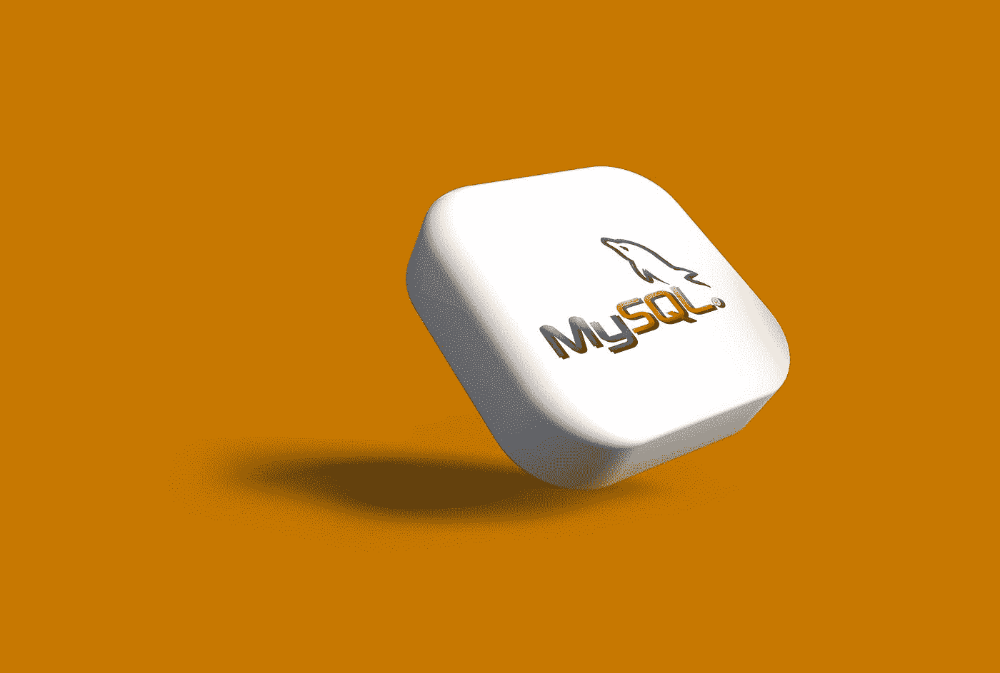
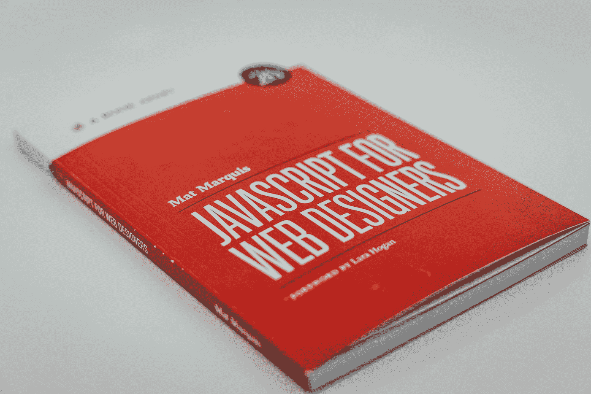

# 2023 年十大编程语言

> 原文：<https://javascript.plainenglish.io/top-10-programming-languages-2023-7a5ce7e96e0?source=collection_archive---------1----------------------->

## 2023 年最值得学习的编程语言

第一个计算机程序写于 1883 年。为了成为适应性最强、功能最强大的编程语言，几个世纪以来已经出现了数百种。有些经受住了时间的考验，似乎远远走在了时代的前面。

现在问题来了:这些编程语言中应该学习哪一种？因此，今天我们列出了 2023 年你应该学习的十大编程语言。

# 10。生锈

Photo by [AltumCode](https://unsplash.com/@altumcode?utm_source=medium&utm_medium=referral) on [Unsplash](https://unsplash.com?utm_source=medium&utm_medium=referral)

我们在 10 号有铁锈。当 C++的代码安全缺陷被发现时，包括 Dropbox、Firefox 和 Cloudflare 在内的许多企业都需要找到解决方案。Rust 在 2020 年进入画面。Firefox 开发了 Rust，一种通用的多范例编程语言，作为 C++的操作替代。但是 rust 不仅仅可以保护代码和内存。编译器的高性能使其成为处理大量数据的理想选择。Meta、Amazon Microsoft 和许多组织目前都依赖 rust 进行大量操作。在印度和美国，一名 rust 程序员每年能赚 90 万卢比，约合 11 万美元。

## 对扩展您的软件启动感兴趣吗？检查[电路](https://circuit.ooo/?utm=publication-post-cta)。

# **9。开始编程**

Photo by [Lewis Kang'ethe Ngugi](https://unsplash.com/@ngeshlew?utm_source=medium&utm_medium=referral) on [Unsplash](https://unsplash.com?utm_source=medium&utm_medium=referral)

Go 编程语言，也被称为 go Lang，是由 Google 创建的。它是一种简单但基于统计的编程语言，将 C 语言的简单性与高级内存安全和垃圾收集完美地结合在一起。当最初开发 Goaling 来支持网络和基础设施需求的编程时，它似乎是 Java 等高性能编程语言的一个可行的替代方案。目前 go Lang 有许多用途，包括云计算、服务器端脚本和 DevOps。Go 编程语言已经被谷歌、优步、Twitch 和 Dropbox 所采用。根据你的经验，一个印度的围棋开发者每年可以赚 100 万卢比，年薪 135，000 美元。

# 8.科特林

Photo by [Louis Tsai](https://unsplash.com/@louis993546?utm_source=medium&utm_medium=referral) on [Unsplash](https://unsplash.com?utm_source=medium&utm_medium=referral)

接下来是科特林。许多人认为，Kotlin 是下一个大事件，将超过 Java。Kotlin 相比 Java 简化了 Android 开发，Java 可以做的不仅仅是开发 Android 这两种 Android 中强大的编程语言是并排比较的，但是 Kotlin 是基于 Java 的。是的，JVM 运行 Kotlin。在我们的 Kotlin 与 Java 视频中，单击上面的眼睛按钮了解更多关于差异的信息。许多公司都使用 Kotlin，包括 Main。在印度，一个 Kotlin 开发者每年能赚 100 万卢比，而在美国，他们每年能赚 14 万美元。

# 7.结构化查询语言

Photo by [Rubaitul Azad](https://unsplash.com/@rubaitulazad?utm_source=medium&utm_medium=referral) on [Unsplash](https://unsplash.com?utm_source=medium&utm_medium=referral)

我们七点钟有 SQL 课。最成功的语言之一是结构化查询语言，它现在被认为是所有程序员的一项基本技能。数据表是使用数据语言 SQL 创建的。数据分析的一个重要组成部分是它存储数据、与数据库通信以及操纵数据以获得所需结果的方式。NTT 数据、微软、埃森哲和其他公司都使用 SQL。在印度，一名 SQL 开发人员挣 110 万卢比，而在美国，他们挣 10 万美元。

# 6.以打字打的文件

我们六点钟有打字稿。微软的 TypeScript 是另一种健壮的编程语言。类型脚本与 JavaScript 的相似之处在于它们遵循严格的语法规则，并拥有适用于任何规模的优秀工具。埃森哲、微软和其他公司都使用 TypeScript。在印度，打字稿开发人员年收入 220 万英镑。美国年薪 16 万美元。

# 5.迅速发生的

如果你想为苹果创造什么，斯威夫特是你的救星。作为最古老的编程语言之一，Objective C 在苹果公司首次使用时，要求程序员精通各种各样的库。修改目标 C 需要大量的时间和冗长。因此，苹果公司发展迅速，远离了目标 C，大大减少了为苹果设备创建软件和应用程序所需的工作量和时间。除了苹果公司，活跃的 Swift 用户还包括优步、罗宾汉和其他一些金融机构。苹果软件开发人员是薪酬很高的专业人士。相比之下，swift 开发人员在美国的年收入约为 90，000 美元，在印度为 100 万卢比。

# 4.C & C++

Photo by [Lewis Kang'ethe Ngugi](https://unsplash.com/@ngeshlew?utm_source=medium&utm_medium=referral) on [Unsplash](https://unsplash.com?utm_source=medium&utm_medium=referral)

C 和 C++领先于我们，是整个家族的基本编程语言。c 被称为“母体”编程语言。这种成熟的编程语言对新语言、编译器、数据库和微软视窗(一种最广泛使用的操作系统)的创建做出了重大贡献。另一方面，C++是 C 的更高级版本，支持面向对象编程。C++用于游戏、网页开发和许多其他事情。这些编程语言被微软、网飞和许多其他企业所使用。在印度，C 和 C++开发人员的年薪是 100 万卢比。美国年薪 12 万美元。

接下来是你期待已久的前三种编程语言。

# 3.Java Script 语言

Photo by [Claudio Schwarz](https://unsplash.com/@purzlbaum?utm_source=medium&utm_medium=referral) on [Unsplash](https://unsplash.com?utm_source=medium&utm_medium=referral)

排在第三位的是 JavaScript，它是改变互联网的适应性最强、最强大的编程语言。作为最流行的编程语言之一，JavaScript 在全球拥有最多的社区和活跃用户。令人惊讶的是，全球 65%的程序员使用 JavaScript，排名仅次于 Python (48%)，其次是 Java (33%)。第三，JavaScript 被网飞、Google Pay Buddy、bigbasket 等组织大量用于网络发展，而这只是冰山一角。在印度，一个 JavaScript 开发者每年能赚 160 万美元，而在美国，他们每年能赚 13.5 万美元。

# 2.Java 语言(一种计算机语言，尤用于创建网站)

Photo by [Michiel Leunens](https://unsplash.com/@leunesmedia?utm_source=medium&utm_medium=referral) on [Unsplash](https://unsplash.com?utm_source=medium&utm_medium=referral)

Java 位居第二。在所有语言中，Java 是 invincible.Java，由最大的社区库支持，并已进入每一个操作系统、移动应用程序、软件框架和大数据。framework.Java 已经使用 everything.Java，被许多 IT 巨头使用，如 Mang。在印度，一名 Java 开发人员年薪为 120 万美元，而在美国，他们年薪为 12 万美元。

# 1.计算机编程语言

Photo by [David Clode](https://unsplash.com/@davidclode?utm_source=medium&utm_medium=referral) on [Unsplash](https://unsplash.com?utm_source=medium&utm_medium=referral)

最后，Python 是我们首选的编程语言。Python 被广泛认为是最新的编程语言之一。事实上，它是一种经验丰富的编程语言，比 Java 要古老得多。Python 的开发只有一个目标:让它易于使用。Python 并不冗长，它伴随着最简单的语言结构。Python 最近在数据科学和数据分析领域建立了稳固的基础，它的操作可信度可与 Java 相媲美。蟒蛇耳朵很赚钱。在印度，一个 Python 程序员年薪 100 万美元，而在美国，他们年薪 15 万美元。我们 2023 年的顶级编程语言现在已经完成。

> 我希望这篇文章对你来说是有益的和有趣的，并且希望你获得关于过程编程和面向对象编程的知识。这是我最近的一些文章。(如果你喜欢我的文章，我希望有像你这样的读者，这有助于我鼓励你做出像这样的精彩文章，所以如果你关注我继续获得我的最新文章，我将不胜感激)你也可以访问我的网站[https://infoyl.com/blog/](https://infoyl.com/blog/)

 [## JAVA 死了吗？(撕😢JAVA)

### JAVA 会被 KOTLIN 取代吗？

medium.com](https://medium.com/codex/is-java-dead-rip-java-2d91aa663ddd)  [## Web 4.0 会是下一个大事件吗？

### 虽然仍然有点“地下”的想法，让我们看看 Web 4.0 可能会是什么样子。

javascript.plainenglish.io](/will-web-4-0-be-the-next-big-thing-8332bc1165e)  [## 现在是为谷歌工作的最好时机！🤴

### 为谷歌工作的 8 个理由

medium.com](https://medium.com/codex/now-is-the-best-time-to-work-for-google-71db9f4a4702)  [## Python 是未来吗？🤖

### Python 是未来的 9 个理由

python .平原英语. io](https://python.plainenglish.io/is-python-the-future-f6f3f0156288)  [## 解决您所有编程问题的 5 个最佳网站

### 编程查询的最佳网站

javascript.plainenglish.io](/5-best-websites-to-solve-all-your-programming-queries-fe7a1639b1d1) 

*更多内容请看*[***plain English . io***](https://plainenglish.io/)*。报名参加我们的* [***免费周报***](http://newsletter.plainenglish.io/) *。关注我们关于*[***Twitter***](https://twitter.com/inPlainEngHQ)[***LinkedIn***](https://www.linkedin.com/company/inplainenglish/)*[***YouTube***](https://www.youtube.com/channel/UCtipWUghju290NWcn8jhyAw)*[***不和***](https://discord.gg/GtDtUAvyhW) *。对增长黑客感兴趣？检查* [***电路***](https://circuit.ooo/) *。***