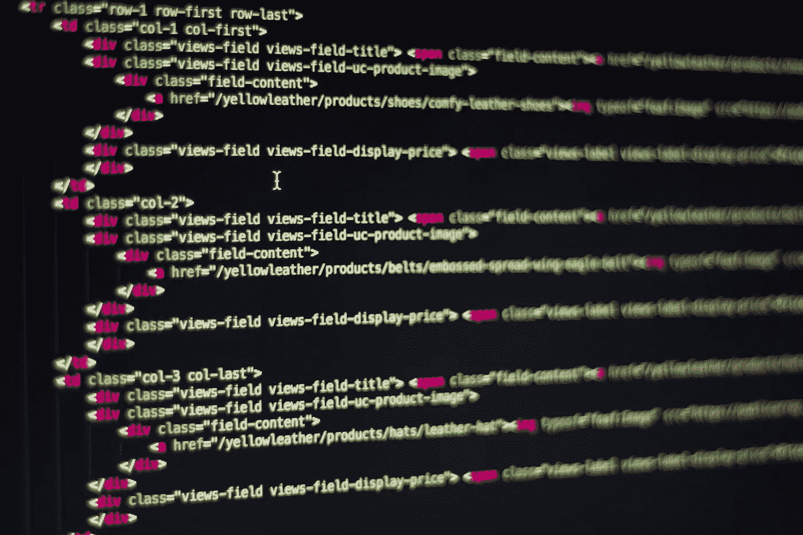

# 2022 年十大网络开发技术

> 原文：<https://javascript.plainenglish.io/top-10-web-dev-technologies-of-2022-aeb368740803?source=collection_archive---------10----------------------->


Photo by [Pixabay](https://www.pexels.com/@pixabay?utm_content=attributionCopyText&utm_medium=referral&utm_source=pexels) from [Pexels](https://www.pexels.com/photo/abstract-business-code-coder-270348/?utm_content=attributionCopyText&utm_medium=referral&utm_source=pexels)

每年的这个时候，我都会列出一些我想了解更多的技术，并在接下来的 12 个月里关注这些技术。因为在过去的两年里我一直非常专注于 web 开发，所以今年的列表将只包含 **web 开发**工具。

# 再搅拌

Remix 是一个全栈 JS 框架，由两个非常棒的 JavaScript 成员创建，更具体地说，是 React 社区。Remix 拥有“快速、流畅、有弹性的用户体验”。11 月，在它首次发布一周后，我写了一篇关于它的文章，所以我不会说太多细节，但我认为它有可能在未来变得更大。你可以在这里找到更多关于混音的信息。

[](https://towardsdev.com/remix-the-hottest-new-js-framework-winter-2021-4bee22a0761d) [## remix——最热门的新 JS 框架(2021 年冬季)

### Remix 是一个全栈网络框架，让您专注于用户界面，并通过网络基础工作回来…

towardsdev.com](https://towardsdev.com/remix-the-hottest-new-js-framework-winter-2021-4bee22a0761d) 

# 以打字打的文件

我能说什么呢…去年我冒险进入了黑暗面。我开始学习打字稿。TypeScript 今年榜上有名，因为它开始证明它不仅仅是一种时尚或家庭项目的工具。许多大型公司正在将他们的整个 JavaScript/Node.js 代码库转换到 TypeScript，因为它不仅允许开发人员更容易地理解他们没有编写的代码，而且还消除了许多进入生产的偷偷摸摸的错误。点击了解更多关于 TypeScript [的信息。](https://www.typescriptlang.org/)

# Next.js

Next 上榜并不是因为它是一项新技术(事实并非如此)，而是因为从事这项技术的优秀开发团队。在过去的几年里已经有了无数次的迭代，Next 真的成为了“生产就绪的全栈框架”之王，只有 Remix 紧随其后。我一直在推迟学习这项技术，但我认为今年我会制作我的第一个 Next 应用程序，它可能会被很好地记录在我的博客上。下面是 Next.js [文档](https://nextjs.org/)的链接。



Photo by [Pixabay](https://www.pexels.com/@pixabay?utm_content=attributionCopyText&utm_medium=referral&utm_source=pexels) from [Pexels](https://www.pexels.com/photo/business-code-coding-computer-270632/?utm_content=attributionCopyText&utm_medium=referral&utm_source=pexels)

# 顺风 CSS

现在，这个很酷。我们都使用过不同风格的 CSS:普通的 CSS 模块，CSS-in-JS，风格化组件，SCSS 等等。Tailwind CSS 允许你添加类名到 HTML 标签中，以指示应用的 CSS。例如，下面的`<p>`标签得到`text-lg`和`font-medium`。这会使文本变大，字体粗细适中。如果你问我的话，我会觉得这很简单。

```
<p class="text-lg font-medium">Hello</p>
```

这真的是一个很酷的想法，一旦你记住了基本的语法映射，设计组件就会变得非常快。点击查看文档[。版本 3 最近刚刚发布，增加了更多的功能，所以我肯定会在 2022 年使用 Tailwind。](https://tailwindcss.com/)

# 苗条的

Svelte 已经被宣布为 React 杀手，并在 2021 年掀起风暴。如果你不知道什么是 svelte，那么，它是*的另一个*前端 JavaScript 框架，如 React、Angular 和 Vue。我不知道是什么让每个人都为苗条身材神魂颠倒，但如果它真的有人们说的那么酷，那就值得我花时间深入研究。

斯维尔登[网站](https://svelte.dev/)声明:

> Svelte 是构建用户界面的一种全新方法。尽管 React 和 Vue 等传统框架在*浏览器*中完成了大部分工作，但 Svelte 将这些工作转变为*编译步骤*，这发生在你构建应用的时候。
> 
> Svelte 没有使用虚拟 DOM diffing 之类的技术，而是编写代码，当应用程序的状态改变时，以外科手术的方式更新 DOM。

苗条包括范围 CSS，下一级反应，和一个强大的视觉转换引擎。这肯定会是我在这个博客上谈论更多的东西，所以请继续关注，如果你像我一样对令人敬畏的前端技术感兴趣，请给我一个关注。

以下技术相当小众，直接基于生产级 JavaScript/TypeScript，所以要小心。😂😂

# 网络包

Webpack 是一个将 JS/TS 部署到 web 的捆绑工具。这是我今年的清单，因为我想让**真正**适应与 Webpack 相关的一切。随着我从中级开发人员发展到高级开发人员，很明显，捆绑和传输代码是一个我可以不断学习的领域。对我来说，Webpack 是这个旅程的开始。

# 巴比伦式的城市

Babel 是一个 JS 编译器，它允许开发人员利用 JS 的最新特性，同时仍然可以编译浏览器可用的 JavaScript。Babel 有大量的特性/插件，我想对编译过程感到舒适，以便在工作和我的副业项目中产生顶级的生产就绪代码。Babel 今年榜上有名，尽管它不是最热门的新事物，因为它仍然是一个高级 web 开发人员应该知道的突出领域。

# esbuild

esbuild 是一个非常快的 JavaScript 捆绑器。它出现在列表中是因为我已经在一个 TypeScript 项目中使用了它，并且亲眼看到了它有多快。关于 esbuild 没有太多要说的，除了它本质上是类固醇的 Webpack。我对捆绑过程了解得越多，就越能体会到 esbuild 带来的好处。

# 包裹

Parcel 是一个零配置的构建工具，它应该拥有一切。Parcel 的 JS 编译器是用 Rust 编写的，其编译速度惊人。根据包裹[网站](https://parceljs.org/):

> package 构建在 [SWC](https://swc.rs/) 编译器上，该编译器处理 JavaScript、JSX 和 TypeScript 的传输。在 SWC 之上，package 实现了依赖项收集、捆绑、范围提升、树抖动、节点仿真、热重载等等。

这个工具在我的列表中，因为我必须亲眼看看这个工具到底有多强大。

# 轻快地

Vite 类似于 Parcel，因为它是一个前端构建工具。我对它了解不多，但我听说过很多人非常喜欢 Vite。我想我会在下一篇文章中比较 Parcel 和 Vite，敬请期待。

如果你现在还不明白，我今年关注的许多工具都与构建、捆绑、编译和传输有关。今年我想让我的网络开发更上一层楼，这些是我接下来要学习的技能。

我很想知道在即将到来的一年里你对什么技术感兴趣，请在评论中告诉我！

如果你喜欢这篇文章，并且不是 Medium.com 的付费会员，请考虑使用我的链接，每月只需 5 美元。你将帮助我赚一些钱，你将获得无限的媒体文章:【https://medium.com/@jameschnebly/membership

*更多内容看* [***说白了就是 io***](http://plainenglish.io/) *。报名参加我们的* [***免费周报***](http://newsletter.plainenglish.io/) *。在我们的* [***社区获得独家访问写作机会和建议***](https://discord.gg/GtDtUAvyhW) *。*