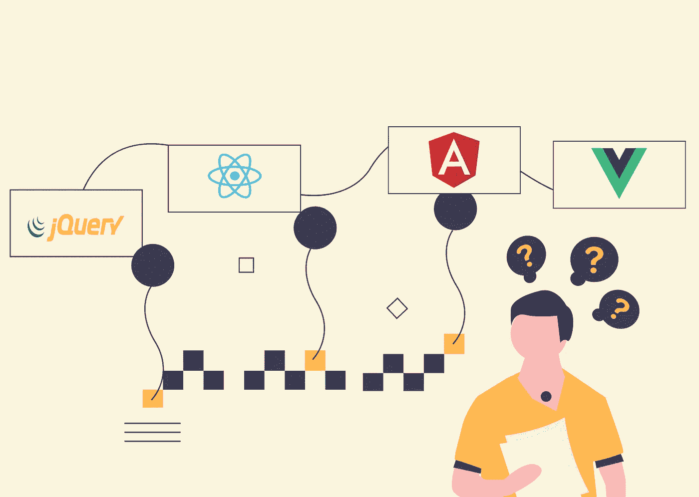
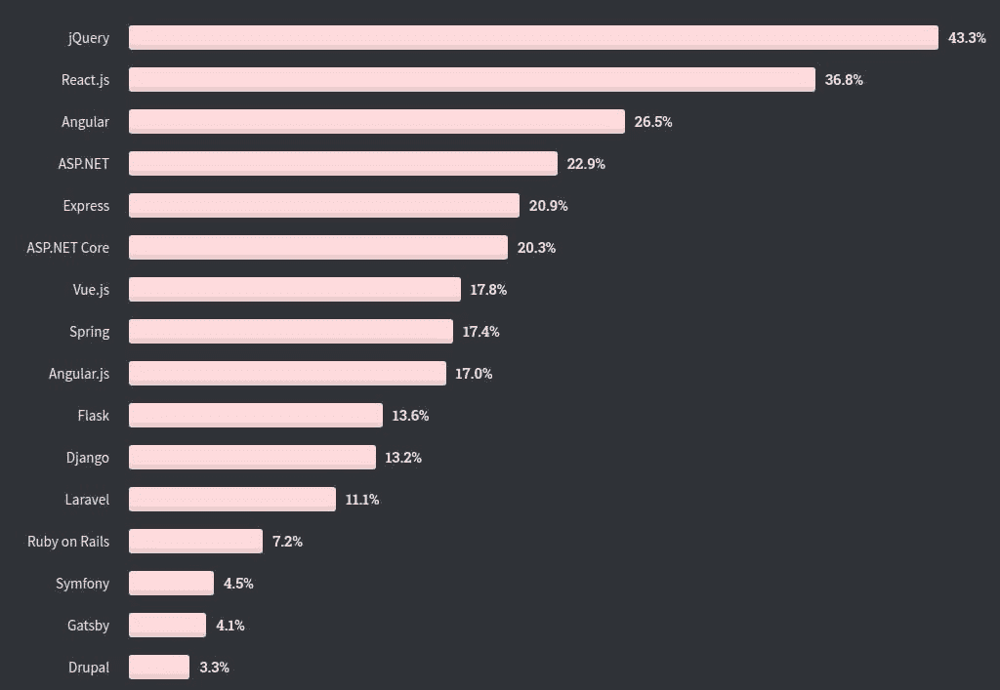
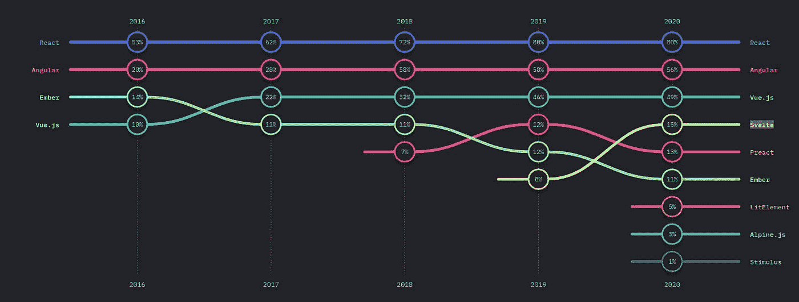
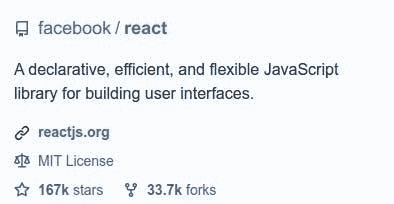
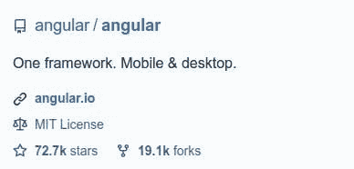
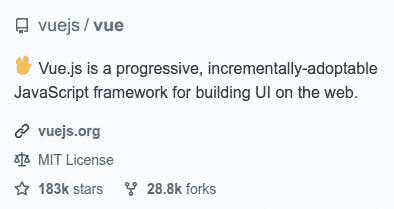
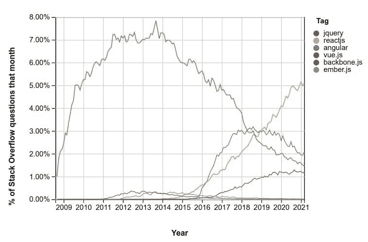

# 前三大前端框架:如何选择正确的框架

> 原文：<https://javascript.plainenglish.io/top-3-frontend-frameworks-how-to-choose-the-right-one-db4a70126b68?source=collection_archive---------15----------------------->



# 介绍

在 JavaScript 世界中，每天都有数百个框架、库和工具被创建和使用。有这么多选择是很好的；它提供了多种选择。但与此同时，这些选项给初学者造成了很多困惑。选择完美的库或框架已经成为一项非常困难的任务。在选择一个框架之前，必须考虑许多事情。

本文将研究一些最流行的 JavaScript 框架和库。我们将基于不同的方面来探索这些框架，比如它们的受欢迎程度、特性和学习曲线。这些观点将帮助你决定哪个框架最适合你。

此外，这里我只介绍了一些框架。但是还有更多，它们以自己的方式是有用和伟大的。我在这里没有提到它们并不意味着它们不好或者效率低。现在，人们倾向于使用流行的框架之一。

# 顶级前端框架和库

每年，**栈溢出开发者调查**和**JavaScript 状态调查**都会进行多次调查。经过这些调查，我们获得了许多真知灼见。我们还获得了全世界开发者使用的顶级框架和库的列表。

[专业人士对 Web 框架的栈溢出开发者调查](https://insights.stackoverflow.com/survey/2020#technology-web-frameworks-professional-developers2):



根据栈溢出开发者调查， **jQuery** 、 **React** 和 **Angular** 最受欢迎。然而，根据 JavaScript 调查的状态， **React** 、 **Angular** 和 **Vue.js** 位于顶部位置。除了这些， **Ember.js** 、**svelite**和 **Backbone.js** 也是广泛使用的框架。

[前端框架 JavaScript 调查状况](https://2020.stateofjs.com/en-US/technologies/front-end-frameworks/):



在这里，我将只比较 React、Angular 和 Vue.js。由于有如此多的选项可供选择，每个开发人员都在远离 jQuery，寻找更好的选项。

> 请注意，从现在开始，为了更好地理解，我将只使用“框架”一词。

# 角度对比反应对比 Vue

我们可以通过许多因素来比较这些框架。但是，我根据它们的受欢迎程度、功能和学习曲线对它们进行了比较。我已经试着让它尽可能的简单，所以在读完这篇文章后，你可以做出正确的决定。

# 1.流行

选择一个流行的框架是一个好主意，但这只是一个愉快的想法。在使用任何框架或考虑任何框架的用法之前，有必要查看该框架的社区和用法。你将要工作的公司肯定会考虑这一点。以防他们需要雇佣更多的人或者有人离开公司。

现在，正如我们所知，这三个框架都非常流行。如果我们看一下这些框架的 GitHub 统计数据，我们可以看到，即使 Vue.js 是所有其他框架中最新的，它也有 183K 颗星。然而，React 和 Angular 分别具有 167K 和 72.7K 的起点。



在我写这篇博客的时候，React 项目的贡献者有 1542 人。另一方面，Angular 有 1395 个贡献者，而 Vue 总共只有 399 个贡献者。如果我们看看使用情况，根据 GitHub，有 630 万人在使用 React。然而，只有 180 万人使用 Angular，只有 14.3 万人使用 Vue。与 React 相比，Angular 和 Vue 的使用次数似乎较低。但是，如果我们只考虑开发者社区，他们是非常高的。

[角度 Github 统计](https://github.com/angular/angular):



[Vue.js Github 统计](https://github.com/vuejs/vue):



而且，即使 Vue 是某些个人开发的，不像 React 和 Angular。它越来越受欢迎，并以其特性集吸引了许多开发人员。另一方面，React 和 Angular 得到了脸书和谷歌等大型科技公司的支持。

[前端框架的堆栈溢出趋势图](https://insights.stackoverflow.com/trends?tags=angular%2Creactjs%2Cjquery%2Cvue.js%2Cember.js%2Cbackbone.js):



# 2.特征

任何伟大的框架都不是成功的，只是因为它有大公司做后盾。我同意这一点，他们因此在一开始就获得了认可。但是这些框架之所以成功，是因为它们所提供的特性。

## 反应

每个框架和库都有自己独特的方式，React 也是如此。React 为前端开发引入了新的方法。React 是第一个引入基于组件的架构的公司，后来 Angular 也采用了这种架构。

React 有在 JSX 编写视图的特定需求，但是它相当容易使用。JSX 是 HTML/XML 与 JavaScript 结合的扩展。React 为组件之间的通信提供了单向数据绑定。

使用 React 的主要好处之一是虚拟 DOM。React 在内存中保存了 DOM 的一个轻量级副本。这个虚拟 DOM 使用 ReactDOM 库与原始 Dom 保持同步。对原始 DOM 的操作很慢，因此，为了使这个过程更快，首先要在虚拟 DOM 中做出不影响原始 DOM 的更改。一旦所有正在进行的进程完成，虚拟 DOM 将与原始 DOM 同步。

React 提供了组件级的状态管理。这意味着我们可以根据每个组件的需要来不同地管理状态。React 仅仅是一个库，所以为了扩展它的功能，我们需要使用许多其他的库。有些人认为这是一个好处，而有些人认为这是一个缺点。

## 有角的

Angular 有一些 React 提供的类似功能。除了这些特性，Angular 还提供了更多，因为它不仅仅是一个库，而是一个成熟的框架。很多开发者喜欢 Angular，只是因为大部分时间不用依赖任何第三方库或包。

而且 Angular 使用 TypeScript 作为开发语言。TypeScript 是 JavaScript 的超集。与 JavaScript 相比，Typescript 为开发人员提供了对数据类型的更多控制。Typescript 还帮助开发人员编写清晰易读的代码。

我相信依赖注入和数据绑定机制是主要特性，也是开发者喜欢 Angular 的原因。Angular 提供了四种类型的数据绑定。

1.  单向数据绑定/单向数据绑定
2.  双向数据绑定/双向数据绑定
3.  均匀装订
4.  属性绑定

Angular 不使用任何特殊格式的 HTML/XML。因此，我们可以编写普通的 HTML 文件，而无需学习 JSX 或任何其他新格式。Angular 还提供了有助于 DOM 操作的指令。

Angular 通过提供**@**[**angular**](https://hashnode.com/@angular-community)**/forms**作为核心模块之一，使得表单验证和处理变得更加容易。不仅如此，对于 HTTP 通信和路由等流程，Angular 不需要依赖任何第三方模块。

## vue . j

人们总是倾向于将 Vue 视为 React 和 Angular 的组合，因为它与 React 和 Angular 有一些相似的概念。Vue 提供了与 React 相同的逻辑和布局格式。Vue 还为模板插值提供了一些与 Angular 相同的绑定指令。

有 JavaScript 背景的人可以很容易适应 Vue，因为它的语法与普通 JavaScript 略有不同。Vue 也使用虚拟 DOM 概念进行操作。Vue 提供了 Vue 路由器、Vuex 等很多核心模块。

Vue 路由器提供路由机制，而 Vuex 为整个 react 应用程序提供状态管理。有一些状态，比如我们需要在整个应用程序中保持的登录状态。对于这种状态管理，我们必须在 React 的情况下使用外部模块。人们通常使用 Redux 来帮助 React 和 Angular 中的状态管理。然而，Vue 为这种状态管理提供了 Vuex。

Vue 比 Angular 限制更少，并且提供了更大的灵活性。要使用 angular，我们不必学习 JSX 或 TypeScript。每个框架确实都有自己的语法，但这比学习新概念要好。

# 3.学习曲线

一个人学习一个框架的快慢因人而异。不同编程概念和模式的知识在决定学习曲线时起着至关重要的作用。除了这些，JavaScript 知识也起着很大的作用。

精通 JavaScript 的人可以在学习了 Vue 的基本模板语法后开始使用 Vue。与 Angular 相比，Vue 中的数据绑定和状态管理更容易学习。React 会在易学的比较中排在第二位。JSX 语法在开始时似乎很难，但任何人经过一些练习后都可以很容易地适应它。此外，核心 React 库很容易，当我们试图学习应用程序级状态管理和路由等高级概念时，它只会变得有点困难。

Angular 一直被大家认为是一个难学的框架，我很认同。这样做的原因是，与 React 不同，Angular 包含其中的所有内容。所以，学习 Angular 的人，不仅仅是学习基本的数据绑定和接口更新。他们还学习了 HTTP 通信、可观察性和许多人们可能不熟悉的概念。

对于一些人来说，使用 TypeScript 可能是一个障碍，但是现在许多开发人员倾向于喜欢和使用 TypeScript。开发人员也在使用带有 React 和 Vue 的 TypeScript，主要是因为类型约束。

# 我怎么想？

我看到了 Mark Dalgleish 发的一条推文，他发了一条令人惊讶的推文，你可以在嵌入的推文中看到。我有我的观点和兴趣，每个人都有。但是我的想法和我的感受不应该真的与你有关。如果你还很迷茫，看看身边的统计数据和工作机会。


因此，如果我是你，我必须做出选择，我会先看统计数据，然后在我的国家、州或城市寻找工作机会。如果你有一个明确的目标，比如在一家特定的公司找到一份工作，那么就进入这家公司的技术团队。试着弄清楚他们用的是什么框架或库。总是会有太多的选择或者只有一个！所以决定并开始学习吧。如果你已经学会了一个框架，那么进入另一个框架会容易得多。

> *你越是征求别人的意见，你就越是迷茫！*

# 参考

特别感谢这些文章。

*   [棱角发育的好与坏](https://www.altexsoft.com/blog/engineering/the-good-and-the-bad-of-angular-development/)
*   [最好的前端 JS 框架](https://rubygarage.org/blog/best-javascript-frameworks-for-front-end)

```
**Want to Connect?**Let me know if you need any help or want to discuss something. Reach out to me on [**Twitter**](https://bit.ly/3KjwgZV) or [**LinkedIn**](https://bit.ly/3JbsPDm).
```

*更多内容看* [***说白了就是 io***](https://plainenglish.io/) *。报名参加我们的* [***免费周报***](http://newsletter.plainenglish.io/) *。关注我们关于*[***Twitter***](https://twitter.com/inPlainEngHQ)*和*[***LinkedIn***](https://www.linkedin.com/company/inplainenglish/)*。加入我们的* [***社区***](https://discord.gg/GtDtUAvyhW) *。*