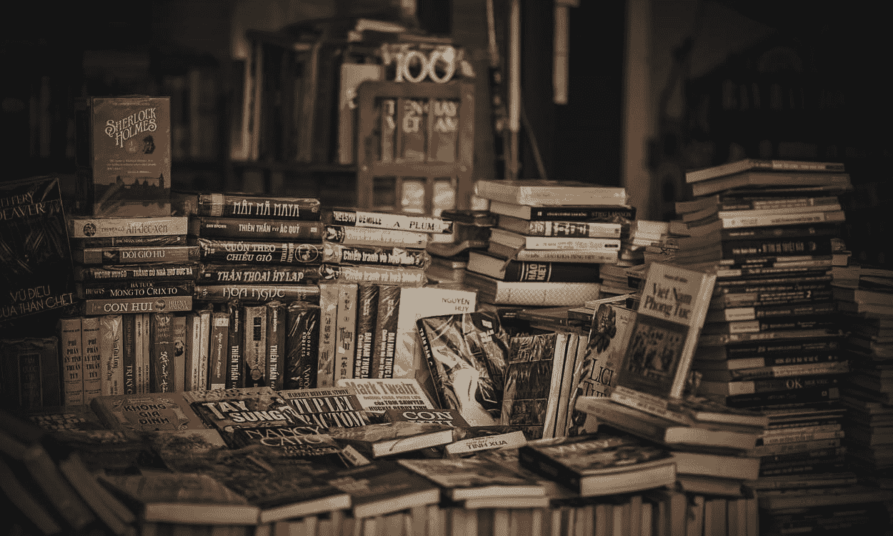

# 程序员应该阅读的 3 本“非技术性”书籍

> 原文：<https://javascript.plainenglish.io/top-3-non-technical-books-a-programmer-should-read-a8eb2929518a?source=collection_archive---------7----------------------->

## 这里有 3 本面向软件开发人员的非技术性书籍

[Pexels](https://www.pexels.com/photo/pile-of-assorted-novel-books-694740/)

谁不爱看书？尤其是程序员爱看。

除了程序员应该读的 [*技术书籍之外*](/3-books-every-programmer-should-read-97ac12422cfb) 到非技术书籍，可以帮助程序员自我提升，达到精神稳定。

这里有一些针对程序员生活的不同方面的书籍，以获得全面的成长和提高。

这些书是我根据个人意见精选的，我认为是最好的。这些书的所有观点和内容都归各自的作者和编辑所有。

## 不给 F 的微妙艺术

这本书是由著名作家马克·曼森写的，写得非常漂亮。这本书通常关注人类情感的各个方面，主要告诉读者如何过上幸福的生活。

程序员的生活中有许多问题，这本书只是告诉如何在这些问题中保持快乐。

它让你清楚地知道你在工作场所想要什么，你对生活有什么期望。这是我一直向我的朋友推荐的一本书，他们需要处理生活中的各种问题，并且在处理问题时仍然必须保持快乐。

## 金钱心理学

这本书是由摩根·豪斯尔和 [*编写的，程序员应该了解不同的金融术语*](/finance-for-programmers-1fa767e3d304) 以及真实的货币如何为人们工作。

这本书讲述了人们如何看待金钱的不同故事，以及他们对金钱的重要性有什么看法。

这是你一生中至少应该读一遍的书，它告诉你人类对钱的心理以及不同的人如何看待钱。这是一本非常短的书，你可以在 1 或 2 周内读完。

## 像和尚一样思考

这本书是由一位著名的播客作者杰伊·谢蒂写的，这本书对自我提高非常有帮助。

它只是提供了许多实用的步骤，读者可以遵循这些步骤来获得出家所需的所有技巧，并消除我们内心一直存在的消极和自我怀疑。

[*作为一个程序员，你必须停止比较*](/stop-comparing-yourself-to-other-programmers-bbc2d5e46840) ，开始为自己努力。这本书将帮助你对付各种坏思想。这是一本我会推荐给经常自我怀疑的人的书。

这些书真的很棒，你必须至少看一遍。快速声明*这篇文章不包含任何附属链接*或推广任何书籍。如果你想读任何一本书，你可以从你的朋友那里借或者从你所在地区的主要书商那里买。

关于我——我是*科技*和*自我提升* [*的顶级作家点击这里*](https://aniketz.medium.com/) *阅读更多我的文章。*

就这样，这是文章的结尾。希望它对你有价值。如果你喜欢这篇文章，点击这里订阅我的邮件列表。我会通过电子邮件给您发送技术相关的文章。

[**通过邮件获取我的文章点击这里**](https://aniketz.medium.com/subscribe) **|** [**购买 5 美元中等会员**](https://aniketz.medium.com/membership)

[如果你觉得这篇文章有价值，那么点击这里阅读更多我的技术文章](https://aniketz.medium.com/)

 [## 通过我的推荐链接加入 Medium-Aniket

### 作为一个媒体会员，你的会员费的一部分会给你阅读的作家，你可以完全接触到每一个故事…

aniketz.medium.com](https://aniketz.medium.com/membership) 

*更多内容请看*[***plain English . io***](http://plainenglish.io/)*。报名参加我们的* [***免费周报***](http://newsletter.plainenglish.io/) *。在我们的* [***社区不和谐***](https://discord.gg/GtDtUAvyhW) *获取独家写作机会和建议。*