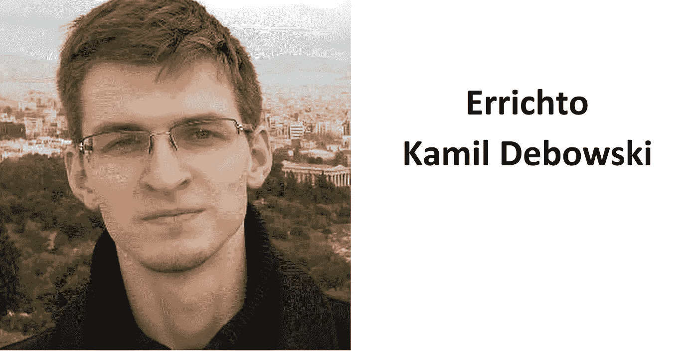

# 世界前三名程序员

> 原文：<https://javascript.plainenglish.io/top-3-programmers-of-2021-bb3b9b93ba4f?source=collection_archive---------7----------------------->

## 以下是排名前三的下一代程序员

Photo by [Alex Gorbi](https://unsplash.com/@rumcola?utm_source=medium&utm_medium=referral) on [Unsplash](https://unsplash.com?utm_source=medium&utm_medium=referral)

在开始这篇文章之前，我需要声明这个列表完全是由我的个人观点和不同编程内容的统计数据组成的。

你必须知道，有成千上万的程序员在他们所做的事情上是传奇人物，这个名单完全基于竞争性编程统计，而不是那些围绕区块链和价值数十亿美元的软件等领域建立王国的企业家。

此外，这些程序员是我最喜欢的程序员，因此我在这个列表中列出了他们的名字

*我没有推广任何程序员，这不是一篇付费文章*

## 3.林威廉

SRC-William Lin/YouTube/Under Fair use license

林威廉是一个 19 岁的男孩，目前在麻省理工学院学习计算机科学。他来自台湾。他是一个有竞争力的程序员，我真的很喜欢在他的 YouTube 频道上观看他的编程方式。

此外，他有关注世界范围内重大比赛的记录—

*   国际信息学奥林匹克竞赛获奖者
*   几轮 Google Kickstart 的赢家
*   Code Forces 国际特级大师(全球排名第 93 位)
*   Code Chef 7 星级程序员(全球排名第 25，国内排名第 1)

## 2.埃里希托

SRC-Errichto/YouTube/Under Fair use license

Errichto 是一个有竞争力的程序员，他在 Code Forces 和 YouTube 等不同的平台上对互联网做出了广泛的贡献。他以竞争性编程用户名 Errichto 为人所知，他的真名是 Kamil Debowski。他已经在世界上许多大型编码比赛中进入决赛。

成就—

*   Google Code Jam(世界上最大的编程比赛)的决赛选手
*   脸书黑客杯决赛选手
*   ICPC 的决赛选手
*   代码部队国际特级大师
*   Code Chef 7 星级程序员(全球排名第 94 位，国内排名第 3 位)

## 1.旅行者

SRC-Tourist/Under Fair use license

Gennady Korotkevich 的用户名 traveler 是下一代程序员中的传奇人物。他是白俄罗斯竞技程序员，赢得了所有为竞技程序员举办的最大的编程比赛。他也有自己的[维基百科](https://en.wikipedia.org/wiki/Gennady_Korotkevich)页面，记录了他 11 岁以来的所有胜利。

成就—

*   2014 年、2015 年、2016 年、2017 年、2018 年、2019 年、2020 年谷歌代码大赛冠军
*   2014、2015、2019、2020 年脸书黑客杯冠军
*   谷歌哈希码 2019 冠军
*   ICPC 奖获得者
*   IOI 奖获得者
*   ICFP 奖获得者
*   代码部队国际特级大师(全球排名 1)
*   Code Chef 7 星级程序员(全球排名第一，国内排名第一)

毫无疑问，这些程序员都是上帝级别的，在那些通过各种编程比赛不断努力将自己表现为国家最佳程序员的程序员中，没有排名。

[如果你觉得这篇文章有用，那么你可以点击这里订阅，通过电子邮件接收文章](https://aniketz.medium.com/subscribe)

[**通过邮件获取此类文章点击这里**](https://aniketz.medium.com/subscribe) **|** [**购买 5 美元中等会员资格**](https://aniketz.medium.com/membership)

[如果你觉得这篇文章有价值，那么点击这里阅读更多的技术文章](https://aniketz.medium.com/)

 [## 通过我的推荐链接加入 Medium-Aniket

### 作为一个媒体会员，你的会员费的一部分会给你阅读的作家，你可以完全接触到每一个故事…

aniketz.medium.com](https://aniketz.medium.com/membership) 

*更多内容请看*[*plain English . io*](http://plainenglish.io/)*。报名参加我们的* [*免费每周简讯*](http://newsletter.plainenglish.io/) *。在我们的* [*社区不和谐*](https://discord.gg/GtDtUAvyhW) *获得独家获得写作机会和建议。*