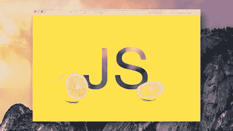
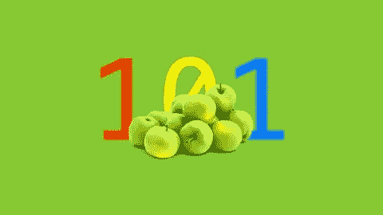

# 面向初学者的 40 大免费编程课程

> 原文：<https://javascript.plainenglish.io/top-40-free-programming-courses-for-beginners-bc39253e784c?source=collection_archive---------9----------------------->

今天我将向你介绍面向初学者的免费编程课程。

Photo by [Clément Hélardot](https://unsplash.com/@clemhlrdt?utm_source=medium&utm_medium=referral) on [Unsplash](https://unsplash.com?utm_source=medium&utm_medium=referral)

事不宜迟，我们来看看。

# JavaScript 基础知识

*   学习基本的 JavaScript 语法。
*   学习 JS 概念，如数组、对象、字符串。
*   练习 JS 的练习。
*   做项目，帮助你实践所学。

Javascript Essentials

[链接](https://www.awin1.com/cread.php?awinmid=6554&awinaffid=1036491&ued=https%3A%2F%2Fwww.udemy.com%2Fcourse%2Fjavascript-essentials%2F)

# Git & GitHub 速成班

*   了解如何创建您的第一个存储库。
*   将其克隆到您的计算机上并添加文件。
*   将项目变更推送到 Github。
*   学习使用 Git 的命令行。
*   了解如何查看新旧文件之间的差异。

Git & GitHub Crash Course

[链接](https://www.awin1.com/cread.php?awinmid=6554&awinaffid=1036491&ued=https%3A%2F%2Fwww.udemy.com%2Fcourse%2Fgit-and-github-crash-course-creating-a-repository-from-scratch%2F)

# Web 开发实践:HTML / CSS 从零开始

*   了解什么是网站，它是由什么组成的。
*   了解 HTML5 的基础知识。
*   了解 CSS3 的基础知识。
*   练习用 HTML CSS 构建网站界面。

Web Development By Doing: HTML / CSS From Scratch

[链接](https://www.awin1.com/cread.php?awinmid=6554&awinaffid=1036491&ued=https%3A%2F%2Fwww.udemy.com%2Fcourse%2Fweb-development-learn-by-doing-html5-css3-from-scratch-introductory%2F)

# 初学者 VS 代码

*   介绍 VS 代码的实用性。
*   如何在 Windows 和 Mac 上安装 VS 代码？
*   使用 VS 代码扩展来简化学习和生产力。
*   为开发人员介绍有用的扩展。

Beginner VS Code

[链接](https://www.awin1.com/cread.php?awinmid=6554&awinaffid=1036491&ued=https%3A%2F%2Fwww.udemy.com%2Fcourse%2Fbeginner-vs-code%2F)

# Sass 工作流

*   如何在电脑上安装 Sass？
*   了解基本和高级 SASS APIs。
*   通过实现 SASS 更快地开发项目。

Sass Workflow

[链接](https://www.awin1.com/cread.php?awinmid=6554&awinaffid=1036491&ued=https%3A%2F%2Fwww.udemy.com%2Fcourse%2Fsass-workflow%2F)

# devtools Pro:Chrome 开发者工具基础

*   在 DevTools 中导航，对 HTML / CSS 和 JavaScript 进行实时更改。
*   编写简单的 JavaScript 命令，学习如何调试代码的基础知识。
*   如何在不同设备上测试你的网站？
*   如何用审计分析和提高页面加载速度？

Devtools Pro: The Basics of Chrome Developer Tools

[链接](https://www.awin1.com/cread.php?awinmid=6554&awinaffid=1036491&ued=https%3A%2F%2Fwww.udemy.com%2Fcourse%2Fdevtools-2017-the-basics-of-chrome-developer-tools%2F)

# 网站开发人员的网站设计:建立漂亮的网站

*   为 web 开发人员提供设计指南。
*   如何正确运用色彩的力量？
*   立即免费访问课程电子书“使用 HTML5 和 CSS3 进行网页设计和开发的最佳资源”。
*   如何使用 8 个简单易用的技巧让你的网站转化得更好？
*   如何激励自己学习更多的网页设计知识？

Web Design for Web Developers: Build Beautiful Websites

[链接](https://www.awin1.com/cread.php?awinmid=6554&awinaffid=1036491&ued=https%3A%2F%2Fwww.udemy.com%2Fcourse%2Fweb-design-secrets%2F)

# 前端 Web 开发的基础

*   有了在本课程中获得的坚实基础，接触关于前端开发的 web 文章和资源将变得更加容易，有了必要的背景知识和行话，就可以充分利用它们，快速有效地学习。
*   为前端开发人员介绍有用的工具和库。
*   有了基础知识，世界就是你的了！扩展所学的基础知识，专攻其他领域(Angular、Ember.js、游戏、全栈开发)。
*   关于如何写求职信的说明以及网页开发常用的专业术语。

Foundations of Front-End Web Development

[链接](https://www.awin1.com/cread.php?awinmid=6554&awinaffid=1036491&ued=https%3A%2F%2Fwww.udemy.com%2Fcourse%2Ffoundations-of-front-end-development%2F)

# 完全初学者的 C++教程

*   学习计算机编程的基础知识。
*   面向对象编程指南。
*   C++的基础知识和语法。
*   你将能够开发强大的 C++程序。

C++ Tutorial for Complete Beginners

[链接](https://www.awin1.com/cread.php?awinmid=6554&awinaffid=1036491&ued=https%3A%2F%2Fwww.udemy.com%2Fcourse%2Ffree-learn-c-tutorial-beginners%2F)

# Vue.js 速成班

*   如何为你的项目安装 Vuejs？
*   使用 Vue 开发应用程序。
*   学习 Vuejs 的基础知识，如数据绑定、组件。

Vue.js Fast Crash Course

[链接](https://www.awin1.com/cread.php?awinmid=6554&awinaffid=1036491&ued=https%3A%2F%2Fwww.udemy.com%2Fcourse%2Fvuejs-fast-crash-course%2F)

# 掌握 HTML5 和 CSS3 的基础知识:初级 Web 开发

*   介绍基本的 HTML 和 CSS 来建立网站的界面和功能。
*   编写代码的软件以及如何构建网站的基本结构。
*   适合初学者。

Master the Basics of HTML5 & CSS3: Beginner Web Development

[链接](https://www.awin1.com/cread.php?awinmid=6554&awinaffid=1036491&ued=https%3A%2F%2Fwww.udemy.com%2Fcourse%2Fmaster-the-basics-of-html5-css3-beginner-web-development%2F)

# 初学 Photoshop 到 HTML5 和 CSS3

*   了解如何使用 Photoshop 和 Dreamweaver 设计和创建网站。
*   使用 HTML CSS 将设计文件转换为网站界面。
*   帮助您练习构建真实的项目。

Beginner Photoshop to HTML5 and CSS3

[链接](https://www.awin1.com/cread.php?awinmid=6554&awinaffid=1036491&ued=https%3A%2F%2Fwww.udemy.com%2Fcourse%2Fbeginner-photoshop-to-html5-and-css3%2F)

# 完全初学者的 Java 教程

*   如何安装 Java？
*   学习 Java 的基础知识。
*   Java 集合框架介绍。
*   获取学习 Java 的好书。
*   分享作者使用 Java 时的真实体验。

Java Tutorial for Complete Beginners

[链接](https://www.awin1.com/cread.php?awinmid=6554&awinaffid=1036491&ued=https%3A%2F%2Fwww.udemy.com%2Fcourse%2Fjava-tutorial%2F)

# Python 编程简介

*   面向初学者的 Python 基础介绍。

Introduction To Python Programming

[链接](https://www.awin1.com/cread.php?awinmid=6554&awinaffid=1036491&ued=https%3A%2F%2Fwww.udemy.com%2Fcourse%2Fpythonforbeginnersintro%2F)

# 面向网页设计初学者的 Photoshop

*   指导你使用 Photoshop 的功能来设计网站。

Photoshop for Web Design Beginners

[链接](https://www.awin1.com/cread.php?awinmid=6554&awinaffid=1036491&ued=https%3A%2F%2Fwww.udemy.com%2Fcourse%2Fphotoshop-for-web-design-beginners%2F)

# 面向初学者的 HTML

*   关于如何在网站设计和开发中使用 HTML 的介绍和教程，供初学者学习 web 编程。

HTML for Beginners

[链接](https://www.awin1.com/cread.php?awinmid=6554&awinaffid=1036491&ued=https%3A%2F%2Fwww.udemy.com%2Fcourse%2Fhmtl5-training%2F)

# JSON 速成班

*   学习 JavaScript 对象符号(JSON)。
*   学习 JSON 的语法。
*   如何在 JavaScript 和 C#中应用 JSON？

JSON Crash Course

[链接](https://www.awin1.com/cread.php?awinmid=6554&awinaffid=1036491&ued=https%3A%2F%2Fwww.udemy.com%2Fcourse%2Fjson-crash-course%2F)

# TypeScript 简介

*   学习编译、测试和运行 TypeScript。
*   如何使用 TypeScript 类？
*   使用 TypeScript 构建基本应用程序。

Introduction to TypeScript

[链接](https://www.awin1.com/cread.php?awinmid=6554&awinaffid=1036491&ued=https%3A%2F%2Fwww.udemy.com%2Fcourse%2Ftypescript%2F)

# 初级 PHP 和 MySQL 教程

*   如何安装 PHP 和 MySQL？
*   了解如何用 PHP 构建功能性网站。
*   了解如何在 MySQL 上存储信息。

Beginner PHP and MySQL Tutorial

[链接](https://www.awin1.com/cread.php?awinmid=6554&awinaffid=1036491&ued=https%3A%2F%2Fwww.udemy.com%2Fcourse%2Fphp-mysql-tutorial%2F)

# 学习颤振-初学者课程

*   指导 flutter 基础构建 Android 和 iOS 应用。

Learn Flutter — Beginners Course

[链接](https://www.awin1.com/cread.php?awinmid=6554&awinaffid=1036491&ued=https%3A%2F%2Fwww.udemy.com%2Fcourse%2Flearn-flutter-beginners-course%2F)

# 如何从零开始建立和制作一个 Wordpress 网站

*   初学者如何使用 wordpress 建立网站？

How To Build And Make A Wordpress Website From Scratch 2022

[链接](https://www.awin1.com/cread.php?awinmid=6554&awinaffid=1036491&ued=https%3A%2F%2Fwww.udemy.com%2Fcourse%2Fhow-to-build-and-make-a-wordpress-website-from-scratch-2017%2F)

# 了解 MongoDB 的基础知识

*   了解如何在计算机上安装 MongoDB。
*   介绍可以存储在 MongoDB 上的数据。
*   了解 MongoDB 中的常用命令。

Understand the Basics of MongoDB

[链接](https://www.awin1.com/cread.php?awinmid=6554&awinaffid=1036491&ued=https%3A%2F%2Fwww.udemy.com%2Fcourse%2Fmongodb-essentials%2F)

# JavaScript 基础知识

*   如何使用 JavaScript 创建和运行程序？
*   如何用 JS 写条件和循环？
*   如何调试 JavaScript？
*   用 JS 管理 DOM。
*   用 JS 写 HTML 验证函数。

JavaScript Fundamentals

[链接](https://www.awin1.com/cread.php?awinmid=6554&awinaffid=1036491&ued=https%3A%2F%2Fwww.udemy.com%2Fcourse%2Fjavascriptfundamentals%2F)

# npm —掌握基础知识

*   在项目创建和开发过程中理解和应用 npm 命令。

npm — Mastering the Basics

[链接](https://www.awin1.com/cread.php?awinmid=6554&awinaffid=1036491&ued=https%3A%2F%2Fwww.udemy.com%2Fcourse%2Fnpm-mastering-the-basics%2F)

# 软件测试简单

*   了解什么是软件测试。
*   如何使用 JIRA 和泽法进行项目测试？
*   理解项目的测试过程。

Software Testing Simple

[链接](https://www.awin1.com/cread.php?awinmid=6554&awinaffid=1036491&platform=dl&ued=https%3A%2F%2Fwww.udemy.com%2Fcourse%2Fsoftware-testing-simple%2F)

# 编写你的第一个游戏

*   指导你用 JavaScript 构建基于网络的游戏。

Code Your First Game

[链接](https://www.awin1.com/cread.php?awinmid=6554&awinaffid=1036491&platform=dl&ued=https%3A%2F%2Fwww.udemy.com%2Fcourse%2Fcode-your-first-game%2F)

# 从零开始成为一名 Android 开发者

*   如何搭建一个适合初学者学习编程的 Android app？
*   如何将您的应用上传到 Google Play。
*   分享一下你的面试经历。

Become an Android Developer from Scratch

[链接](https://www.awin1.com/cread.php?awinmid=6554&awinaffid=1036491&platform=dl&ued=https%3A%2F%2Fwww.udemy.com%2Fcourse%2Fbecome-an-android-developer-from-scratch%2F)

# 30 天内 8 个漂亮的 Ruby on Rails 应用程序& TDD

*   指导您使用 Ruby on Rails 构建 8 个真正的应用程序。

8 Beautiful Ruby on Rails Apps in 30 Days & TDD

[链接](https://www.awin1.com/cread.php?awinmid=6554&awinaffid=1036491&platform=dl&ued=https%3A%2F%2Fwww.udemy.com%2Fcourse%2F8-beautiful-ruby-on-rails-apps-in-30-days%2F)

# 用 HTML5 和 CSS3 在一周内建立你的第一个网站

*   帮助你理解 HTML CSS 构建网站界面的基础知识。

Build Your First Website in 1 Week with HTML5 and CSS3

[链接](https://www.awin1.com/cread.php?awinmid=6554&awinaffid=1036491&platform=dl&ued=https%3A%2F%2Fwww.udemy.com%2Fcourse%2Fbuild-your-first-website-in-1-week%2F)

# React vs Angular vs Vue.js 示例

*   如何使用 3 种不同的前端框架创建应用程序，React，Angular 和 Vuejs。从那里，它会帮助你有一个概览，选择哪一个适合你的技能。

React vs Angular vs Vue.js by Example

[链接](https://www.awin1.com/cread.php?awinmid=6554&awinaffid=1036491&platform=dl&ued=https%3A%2F%2Fwww.udemy.com%2Fcourse%2Freact-vs-angular-vs-vuejs-by-example%2F)

# Git 从 GitHub 开始

*   帮助您理解如何在项目创建和开发过程中使用 git。

Git Started with GitHub

[链接](https://www.awin1.com/cread.php?awinmid=6554&awinaffid=1036491&platform=dl&ued=https%3A%2F%2Fwww.udemy.com%2Fcourse%2Fgit-started-with-github%2F)

# 数据库设计和管理

*   指导你如何设计和管理数据库。

Database Design and Management

[链接](https://www.awin1.com/cread.php?awinmid=6554&awinaffid=1036491&platform=dl&ued=https%3A%2F%2Fwww.udemy.com%2Fcourse%2Fdatabase-design-and-management%2F)

# 实用 PHP:掌握基础知识，编写动态网站代码

*   了解 PHP 的基础知识。
*   每学完一门知识，都有习题可以练习。
*   学习 PHP 知识后用 PHP 搭建一个餐厅网站。

Practical PHP: Master the Basics and Code Dynamic Websites

[链接](https://www.awin1.com/cread.php?awinmid=6554&awinaffid=1036491&platform=dl&ued=https%3A%2F%2Fwww.udemy.com%2Fcourse%2Fcode-dynamic-websites%2F)

# 面向初学者的 jQuery 和 AJAX

*   面向初学者的 Jquery 和 AJAX 介绍。

jQuery and AJAX for Beginners

[链接](https://www.awin1.com/cread.php?awinmid=6554&awinaffid=1036491&platform=dl&ued=https%3A%2F%2Fwww.udemy.com%2Fcourse%2Fjquery-and-ajax-for-beginners-the-definitive-guide%2F)

# 构建您的第一个 React JS 应用程序

*   学习 React js 的基础知识。
*   如何用 React 建一个 SPA？
*   React 路由器教程。
*   如何为 react 项目设置 Tailwind CSS？

Build your first React JS Application

[链接](https://www.awin1.com/cread.php?awinmid=6554&awinaffid=1036491&platform=dl&ued=https%3A%2F%2Fwww.udemy.com%2Fcourse%2Fbuild-your-first-react-js-application%2F)

# 建立一个具有现代平面设计的响应网站

*   了解如何设计常见的网站组件。

Build a Responsive Website with a Modern Flat Design

[链接](https://www.awin1.com/cread.php?awinmid=6554&awinaffid=1036491&platform=dl&ued=https%3A%2F%2Fwww.udemy.com%2Fcourse%2Fbuild-responsive-website-designs-with-html5-and-css%2F)

# 引导程序 4 快速入门

*   了解 Bootstrap4 的基础知识，以及如何将它们应用到网站的设计和开发过程中。

Bootstrap 4 Quick Start

[链接](https://www.awin1.com/cread.php?awinmid=6554&awinaffid=1036491&platform=dl&ued=https%3A%2F%2Fwww.udemy.com%2Fcourse%2Fbootstrap-4%2F)

# 编程 101

*   二进制系统介绍。
*   了解基本网络结构。
*   了解编程语言的基础。
*   了解路由器、ISP、数据包和 HTTP。
*   编程语言的全面工作知识。

Programming 101

[链接](https://www.awin1.com/cread.php?awinmid=6554&awinaffid=1036491&platform=dl&ued=https%3A%2F%2Fwww.udemy.com%2Fcourse%2Fprogramming-101%2F)

# 数据库和 SQL 查询简介

*   数据库功能介绍以及如何使用 SQL 查询。

Introduction to Databases and SQL Querying

[链接](https://www.awin1.com/cread.php?awinmid=6554&awinaffid=1036491&platform=dl&ued=https%3A%2F%2Fwww.udemy.com%2Fcourse%2Fintroduction-to-databases-and-sql-querying%2F)

# 高级和面向对象的 JavaScript 和 ES6

*   本课程适合那些已经掌握了基本 JavaScript 知识，并希望学习更多 JavaScript 高级技术的人。

Advanced and Object-Oriented JavaScript and ES6

[链接](https://www.awin1.com/cread.php?awinmid=6554&awinaffid=1036491&platform=dl&ued=https%3A%2F%2Fwww.udemy.com%2Fcourse%2Fadvanced-and-object-oriented-javascript%2F)

相关文章:

*   [Udemy 上十大最佳网络开发课程](https://us.niemvuilaptrinh.com/article/top-10-best-web-development-courses-on-udemy)
*   [初学者学习编码的 15 大网站](https://us.niemvuilaptrinh.com/article/15-github-projects-for-web-developer)
*   [34 个免费学习编码的最佳网站](https://us.niemvuilaptrinh.com/article/34-ebooks-courses-free-for-learn-front-end)

# 摘要

我希望这篇文章能提供有用的免费编程课程，如果你有任何问题，请发邮件给我，我会尽快回复。希望大家继续支持网站，让我能写出更多好文章。祝您愉快！

*更多内容请看*[***plain English . io***](https://plainenglish.io/)*。报名参加我们的* [***免费周报***](http://newsletter.plainenglish.io/) *。关注我们关于*[***Twitter***](https://twitter.com/inPlainEngHQ)*和*[***LinkedIn***](https://www.linkedin.com/company/inplainenglish/)*。加入我们的* [***社区不和谐***](https://discord.gg/GtDtUAvyhW) *。*