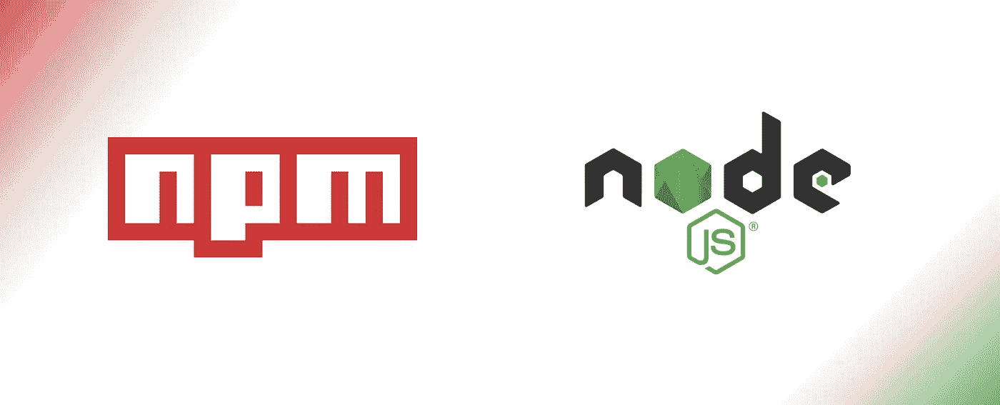
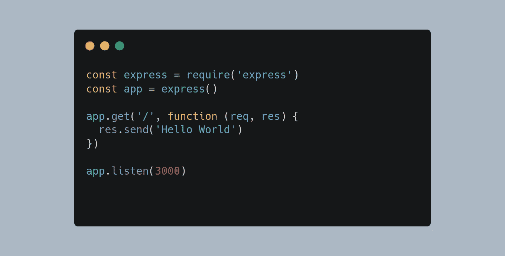
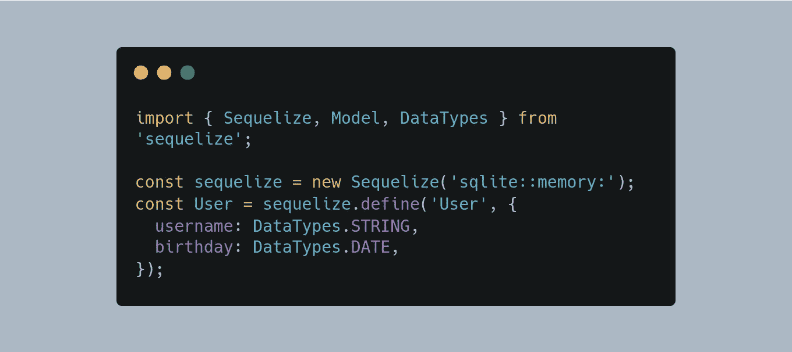
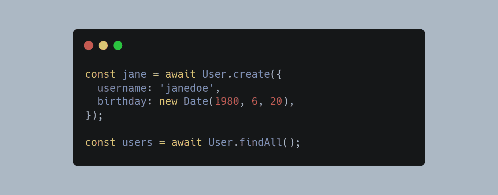
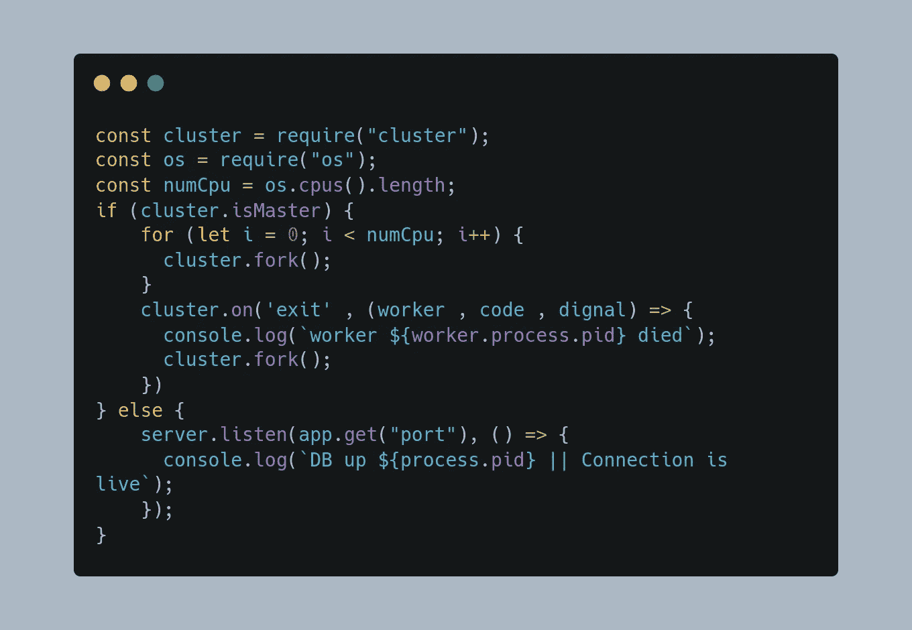
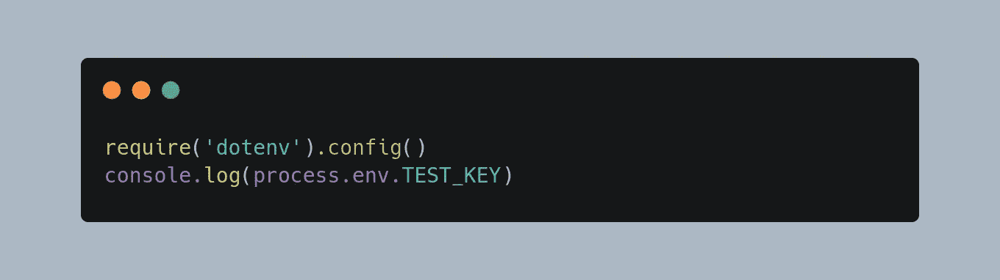

# Node.js 中最常用的 5 个包或框架

> 原文：<https://javascript.plainenglish.io/top-5-most-used-packages-or-frameworks-in-node-js-6f8f4946fcb3?source=collection_archive---------6----------------------->

## 您可以在项目中使用的最常用的 Node.js 包和框架。



在 [npmjs](https://www.npmjs.com/) 上有许多可用于 Node.js 的包，但我们肯定不会全部使用它们，所以今天我将分享一个最常用的 5 个包的列表，没有任何顺序，我只是分享一个任何 Node.js 开发人员大部分时间使用的包的列表，我还将分享一个代码片段，以了解如何在您的应用程序中使用它们。所以请放松，让火箭发射吧🚀

# 表达

[Express](https://www.npmjs.com/package/express) 是一个最小且灵活的 Node.js web 应用程序框架，它提供了一组健壮的特性来开发 web 和移动应用程序。它促进了基于节点的 Web 应用程序的快速开发。以下是快速框架的一些核心功能

这个包是最常用的包之一，如果你正在开发一个 web 应用程序，这将帮助你为你的 API 创建路径，这是为均值/MERN 应用程序，其中 **E** 代表Express。

**安装**

```
npm install express
```



Usage of Express.js

# 序列

[Sequelize](https://www.npmjs.com/package/sequelize) 是一款简单易用且基于承诺的 [Node.js](https://nodejs.org/en/about/) [ORM 工具](https://en.wikipedia.org/wiki/Object-relational_mapping)，适用于 [Postgres](https://en.wikipedia.org/wiki/PostgreSQL) 、 [MySQL](https://en.wikipedia.org/wiki/MySQL) 、 [MariaDB](https://en.wikipedia.org/wiki/MariaDB) 、 [SQLite](https://en.wikipedia.org/wiki/SQLite) 、 [DB2](https://en.wikipedia.org/wiki/IBM_Db2_Family) 、[微软 SQL Server](https://en.wikipedia.org/wiki/Microsoft_SQL_Server) 和[雪花](https://www.snowflake.com/)。

> ORM (Object-Relation Mapping)是一种工具，通过它我们能够使用面向对象的范例访问、更新或查询源数据，这是一种更容易和优化的访问数据库数据的方式

**安装**

```
# One of the following:
$ npm install --save pg pg-hstore # Postgres
$ npm install --save mysql2
$ npm install --save mariadb
$ npm install --save sqlite3
$ npm install --save tedious # Microsoft SQL Server
$ npm install --save oracledb # Oracle Database
```

## 声明模型



Defineing Models in Sequalize

## 执行查询



Execute Queries in Sequalize

# Pm2

[PM2](https://www.npmjs.com/package/pm2) 是 Node.js 应用程序的生产流程经理，内置负载均衡器。它允许您保持应用程序永远运行，无需停机即可重新加载它们，并简化常见的系统管理任务。

简而言之，它将允许应用程序无限期运行。当我们想要在服务器上部署任何基于 Node.js 的 web 应用程序时，通常会用到它。它还管理所有类型的日志。

**安装**

```
npm install pm2
```

要使用 pm2 启动应用程序

```
pm2 start app.js
```

# 串

您是否知道 Node.js 是一种单线程编程语言，这意味着默认情况下，它将使用您系统的单个内核来处理任何脚本，这对于任何多核系统来说都不是很有效，因此这里出现了 [Cluster](https://www.npmjs.com/package/cluster) ，这是一种用于 N [ode.js](http://nodejs.org/) 的可扩展多核服务器管理器。

简而言之，它可以使用多个工作进程同时处理多个请求。

**安装**

```
npm install cluster
```

**用途**



Usage of Cluster

# Dotenv

[Dotenv](https://www.npmjs.com/package/dotenv) 是一个零依赖模块，将环境变量从`.env`文件加载到`[process.env](https://nodejs.org/docs/latest/api/process.html#process_process_env)`中。将配置存储在独立于代码的环境中是基于[十二因素应用](http://12factor.net/config)方法的。

**安装**

```
npm install dotenv
```

**用法**

在你的项目的根目录下创建一个`.env`文件:

```
TEST_KEY="TESTKEY"
```

在您的脚本中使用:



```
# Output
TESTKEY
```

# **结论**

谢谢你一直读到最后。我希望这些软件包中的一些能对你的申请有所帮助。抱歉，如果我跳过了一些东西，请随意在评论中添加，如果你喜欢这篇文章并想要更多这样的东西，请鼓掌。🙇 🙇

[](https://www.linkedin.com/in/jaykishan-khemani-a0452850/) [## Jaykishan Khemani —解决方案工程师— GAMMASTACK | LinkedIn

### 查看 Jaykishan Khemani 在世界上最大的职业社区 LinkedIn 上的个人资料。Jaykishan 列出了 3 个工作…

www.linkedin.com](https://www.linkedin.com/in/jaykishan-khemani-a0452850/) 

*更多内容请看*[***plain English . io***](https://plainenglish.io/)*。报名参加我们的* [***免费周报***](http://newsletter.plainenglish.io/) *。关注我们关于*[***Twitter***](https://twitter.com/inPlainEngHQ)[***LinkedIn***](https://www.linkedin.com/company/inplainenglish/)*[***YouTube***](https://www.youtube.com/channel/UCtipWUghju290NWcn8jhyAw)*[***不和***](https://discord.gg/GtDtUAvyhW) *。对增长黑客感兴趣？检查* [***电路***](https://circuit.ooo/) *。***