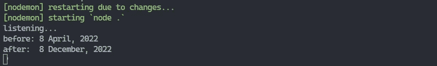

# 2022 年面向 Node.js 开发者的 5 个 NPM 包

> 原文：<https://javascript.plainenglish.io/top-5-npm-packages-for-node-js-developers-in-2022-5f88f7a112c3?source=collection_archive---------1----------------------->

## 节点. js

## Node.js 中有助于您的项目的所有最佳 npm 包的列表


Photo by [Paul Esch-Laurent](https://unsplash.com/@pinjasaur?utm_source=medium&utm_medium=referral) on [Unsplash](https://unsplash.com?utm_source=medium&utm_medium=referral)

Node.js 是一个 JavaScript 框架，在 2022 年仍然会越来越受 JavaScript 开发者的欢迎。成千上万的初创公司或大企业依赖于 Node.js 团队创造的工作。如果 Node.js 不存在，我们就不会有现在这么多的网站或软件，比如 Discord、Skype、PayPal、LinkedIn、优步、NASA，甚至 Medium。

因此，我为 modern Node.js 应用程序列出了 2022 年最佳的 5 个具有惊人开发人员体验和结果的 NPM 包。

## [#1 快递](https://www.npmjs.com/package/express)

Express 是一个免费的 NPM 包，用于管理路由/定制路由器，具有动态 Node.js 网站所需的所有其他功能。

例如，我们可以创建一个对索引页面的 GET 请求。首先，我们需要用参数调用包的 get 方法——destination & callback。

目的地是我们在浏览器中访问的请求路由，回调是我们连接后要调用的函数。参数 *req* 是请求本身，它包含关于被请求站点的信息。另一方面，参数 *res* 表示响应，如果我们需要发送一个 HTML 文档或者只是发送任何类型的数据，就会用到这个响应。

```
const **express** = require('express');
const **app** = express();**app**.get('/', (req, res) => {
    **return** res.send('welcome to index page!');
});
```


localhost:8080 with index route

完整文档:

[](https://expressjs.com/en/5x/api.html) [## 5.x API

### 注意:这是早期的测试版文档，可能不完整，仍在开发中。创建一个快递…

expressjs.com](https://expressjs.com/en/5x/api.html) 

## [#2 节点门](https://www.npmjs.com/package/nodemon)

Nodemon 是一个免费的 NPM 包，它并没有太多的内容，但是对于更快地编写您的项目是一个很好的支持。在一个普通的 Node.js 项目中，每次您希望在网站上看到更改后，您必须重新启动运行它的服务器并刷新网站。Nodemon 解决了这个问题，每次你对你的项目做一个改变，nodemon 在当前目录中感觉到它，并重新启动服务器和它显示的页面。

为了使用它，您需要更改 Node.js 项目设置。在您的 *package.json* 中，如果您有一个启动脚本，您需要用您想要启动的文件将它重写为一个 nodemon 启动脚本，或者写一个“.”这意味着使用您在项目创建中指定的默认文件(index.js):

```
"**scripts**": {
    "**start**": "nodemon ." // = nodemon index.js
}
```


console: npm start is executed

完整文档:

[](https://github.com/remy/nodemon#nodemon) [## GitHub - remy/nodemon:监视 node.js 应用程序中的任何变化，并自动…

### nodemon 是一个帮助开发基于 node.js 的应用程序的工具，它可以在以下情况下自动重启 node 应用程序

github.com](https://github.com/remy/nodemon#nodemon) 

## [#3 时刻](https://www.npmjs.com/package/moment)

Moment 是一个免费的 NPM 包，用于日期和时间解析、验证、操作和格式化。至于操作棒，你可以添加，减去，范围日期，并检测一个时间单位的开始或结束。例如，我们可以创建一个类似于普通 javascript 的时刻日期，然后调用一个带有两个参数的 add 函数:*多少* & *单位*。因此，如果我们想给某个日期加上 8 个月，我们可以这样做:

```
var **date** = moment();
date.**add**(8, 'months');
```



console: moment date after 8 months

完整文档:

 [## Moment.js | Home

### npm 安装力矩-存纱添加力矩安装-包力矩. js spm 安装力矩-存流星添加…

momentjs.com](https://momentjs.com/) 

## [#4 插座. io](https://www.npmjs.com/package/socket.io)

Socket.io 是一个免费的 NPM 包，用于在您的平台上创建和接收来自用户的实时套接字。Socket.io 非常适合构建需要实时活动的社交应用，例如消息应用。

首先，我们需要为 socket.io 创建一个 HTTP 模板服务器，以便以后使用。然后我们导入这个包，用一个*服务器*参数调用它。在一切都设置好并导入之后，我们可以为网站连接创建一个监听器(这可以在一个路由中)，它将在最终用户连接到一个网页之后执行。您可以在这里创建自定义事件，以便在路由之间发送数据。我们还可以使用一个 disconnect 监听器，每当有人关闭一个网页时，这个监听器就会被执行。

```
const **server** = require('http').createServer();
const **io** = require('socket.io')(server);**io**.on('connection', client => {
    // connect event
    console.**log**('user has connected'); // disconnect event
    **client**.on('disconnect', () => {
        console.**log**('user has connected');
    });
});
```


console: connect and disconnect event

完整文档:

 [## 简介|插座。超正析象管(Image Orthicon)

### 插座。IO 是一个库，可以在客户端和客户端之间实现低延迟、双向和基于事件的通信

socket.io](https://socket.io/docs/v4/) 

## [#5 Bcrypt](https://www.npmjs.com/package/bcrypt)

Bcrypt 是一个免费的 NPM 软件包，用于散列和去散列密码、API 密钥或普通字符串文本。对于散列密码，你需要准备好这 3 个值: *sal 轮*和*密码*本身。Salt rounds 是文本被散列的次数的数字，为了更安全，10 轮应该是默认值(salt rounds 将随时间缩放)。密码是您想要哈希的原始文本。密码哈希示例:

```
const **password** = "fuji_the_mountain";
const **saltRounds** = 10;bcrypt.**hash**(password, saltRounds, (err, hash) => {
    // store password to database
});
```


console: hashed password

至于密码去散列，如果您想要检查密码，例如在登录过程中，我们将使用比较功能，该功能将比较数据库中的散列密码与原始密码:

```
bcrypt.**compare**(password, hash, (err, result) => {
    // result returns true
});
```

完整文档:

[](https://openbase.com/js/bcrypt/documentation) [## bcrypt:文档| Openbase

### 一个帮助你散列密码的库。你可以在维基百科和下面的文章中读到 bcrypt:How…

openbase.com](https://openbase.com/js/bcrypt/documentation) 

## 结论

我在这里展示的包将帮助你完成下一个项目，并加快编码过程，这有时会非常累人。作为 Node.js 开发人员，这是你应该在 2022 年使用的前 5 个 NPM 包。

*更多内容请看*[***plain English . io***](https://plainenglish.io/)*。报名参加我们的* [***免费周报***](http://newsletter.plainenglish.io/) *。关注我们关于*[***Twitter***](https://twitter.com/inPlainEngHQ)*和*[***LinkedIn***](https://www.linkedin.com/company/inplainenglish/)*。加入我们的* [***社区不和谐***](https://discord.gg/GtDtUAvyhW) *。*