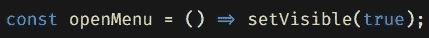

# 2022 年前 5 名 Visual Studio 代码黑客

> 原文：<https://javascript.plainenglish.io/top-5-visual-studio-code-hacks-2022-c01b417b9bb9?source=collection_archive---------1----------------------->

Visual Studio 代码已经成为当今最强大、超级轻量级的 T4 ide 之一。它具有难以置信的可扩展性和可定制性，可以满足您的所有开发需求。让我们来看看 Visual Studio 代码提供的一些最酷的模块。

# **1。主题**

VS Code 的一个亮点(不像它的大爹， *Visual Studio* )是能够在你的工作区定制配色方案和图标。在 [Visual Studio 代码市场](https://marketplace.visualstudio.com/vscode)中有大量的免费主题和图标(没有双关语的意思)图标集。

我绝对喜欢的图标主题，**材质图标主题**，包含了图标集历史上几乎所有*可以想到的映射到文件扩展名的图标(线索*胜过*对话)。*

无论如何，这里有一些链接指向一些很棒的主题。

*   [素材图标主题](https://marketplace.visualstudio.com/search?target=VSCode&category=Themes&sortBy=Installs)
*   [一个暗亲](https://marketplace.visualstudio.com/items?itemName=zhuangtongfa.Material-theme)
*   [GitHub 主题](https://marketplace.visualstudio.com/items?itemName=GitHub.github-vscode-theme)
*   [Monokai Pro](https://marketplace.visualstudio.com/items?itemName=monokai.theme-monokai-pro-vscode)
*   [原子一号黑暗主题](https://marketplace.visualstudio.com/items?itemName=akamud.vscode-theme-onedark)

# 2.字体

厌倦了 Visual Studio 代码中粗糙的 ol 字体？觉得*很难读懂*？好了，不要再看了！VS 代码字体定制*非常*可定制，能够给字体添加连字，使*非常*性感。嗯。

Fira Code font with ligatures enabled

看看这看起来有多棒——箭头函数看起来再好不过了，不是吗？

如果您想知道如何在 VS 代码中定制您的字体，请遵循以下步骤:

1.  从 Google Fonts 下载 [Fira 代码字体](https://fonts.google.com/specimen/Fira+Code)(免费！).你也可以下载 [JetBrains Mono](https://www.jetbrains.com/lp/mono/) ，无论你中了什么毒，我都不会评价；)
2.  安装您选择的`mono`字体
3.  接下来，转向 Visual Studio 代码。
4.  在 Windows 和 Linux 上点击`Ctrl+,`或在 Mac 上点击`Cmd+,`。
5.  在上面的搜索栏中，输入**字体**
6.  点击*编辑器:字体系列*设置

7.输入`Fira Code`并点击回车

8.在`Editor: Font Ligature`设置中，点击`edit settings.json`文件。

9.通过键入`“editor.fontLigatures”: true,`启用字体连字

10.维奥拉。现在，您的编辑器中已经有了那些花哨的操作符和其他东西！

# 3.扩展ˌ扩张

想要提高开发生命周期中的生产力吗？VS 代码使得用您选择的语言进行开发变得非常容易，包括 Visual Studio 代码中的*语法突出显示、*和*运行时间*，这些代码要么是由微软自己设计的，要么是其他第三方扩展。

我有几个最喜欢的，但也值得探索语言特定的扩展，这将提高您的工作流十倍。

# 4.快捷键

VS Code 的另一个重要特性是它的键盘快捷键，可以提高生产率，减少手工操作。其中之一，取决于操作系统是`Ctrl+K Ctrl+F`格式化选择或整个文件。

您甚至可以通过按键盘快捷键中的`Ctrl+K Ctrl+K`来创建自己的自定义键绑定。键入`Ctrl+Shift+P`打开命令托盘，键入**键盘快捷键**打开默认的按键绑定列表。您还可以修改它们，并为现有命令创建自己的自定义绑定，或者如前所述，创建新的键绑定。

你可以在这里找到快捷方式的打印输出。

# 5.指挥托盘

Visual Studio 代码的命令托盘，就像它所吹嘘的许多其他功能一样，是许多开发人员没有充分利用的一个工具。Command Pallet 加快了常见任务的速度，只需点击一两个按钮就可以完成许多操作。例如，如果你安装了一个格式化扩展，按下`Ctrl+Shift+P`打开命令托盘，输入 **Format** ，它将检索一系列格式化规则，例如，针对 JavaScript 或其他特定语言的格式化。

另一种特殊的工具是由 Flutter 提供的。你可以使用命令托盘，通过键入 *New Flutter…* **和**来启动一个新的 Flutter 项目，它应该会检索一个特定于 Flutter 的命令列表，瞧！你现在可以创建一个新的颤振项目——没有痛苦。

好了，朋友们，这就是我今天对 Visual Studio 代码和它的许多可用特性的全部介绍。

去关注我的推特吧

*递归* ☝️在这里。

*更多内容看* [*说白了. io*](http://plainenglish.io/) *。报名参加我们的* [*免费每周简讯*](http://newsletter.plainenglish.io/) *。在我们的* [*社区*](https://discord.gg/GtDtUAvyhW) *获得独家写作机会和建议。*