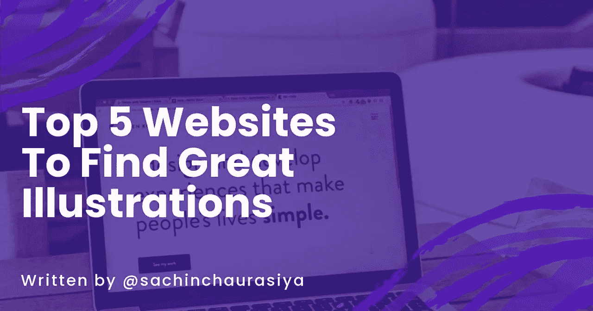
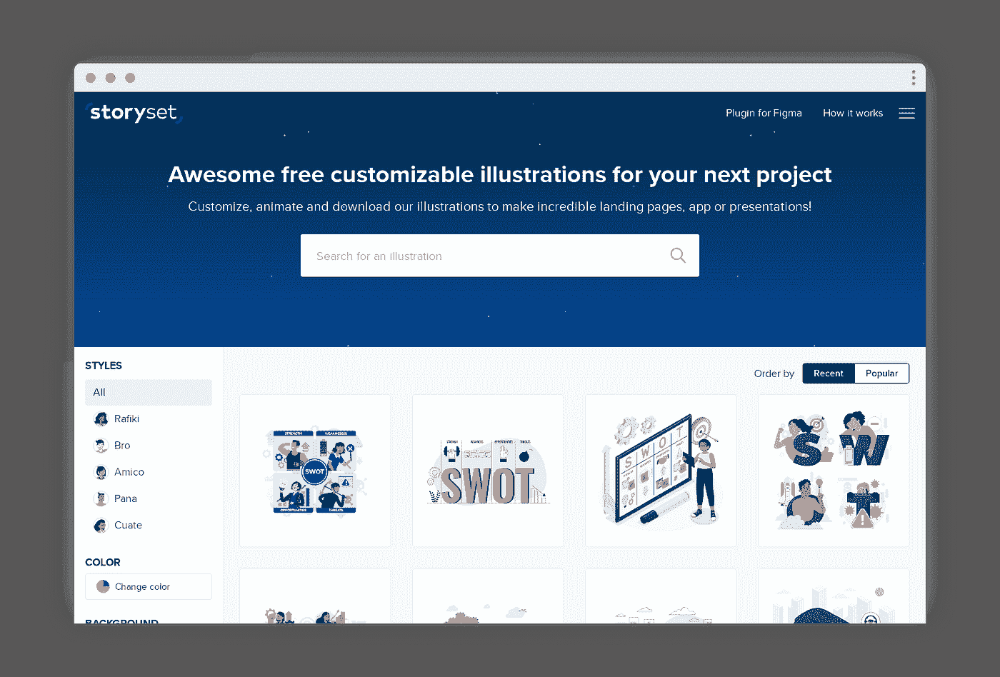
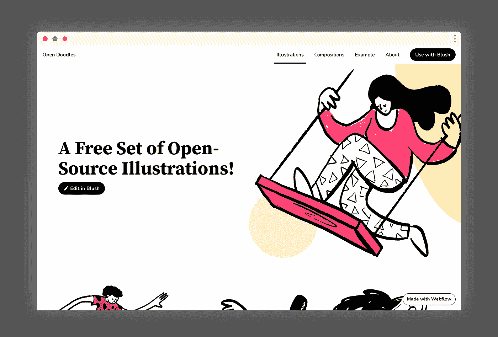
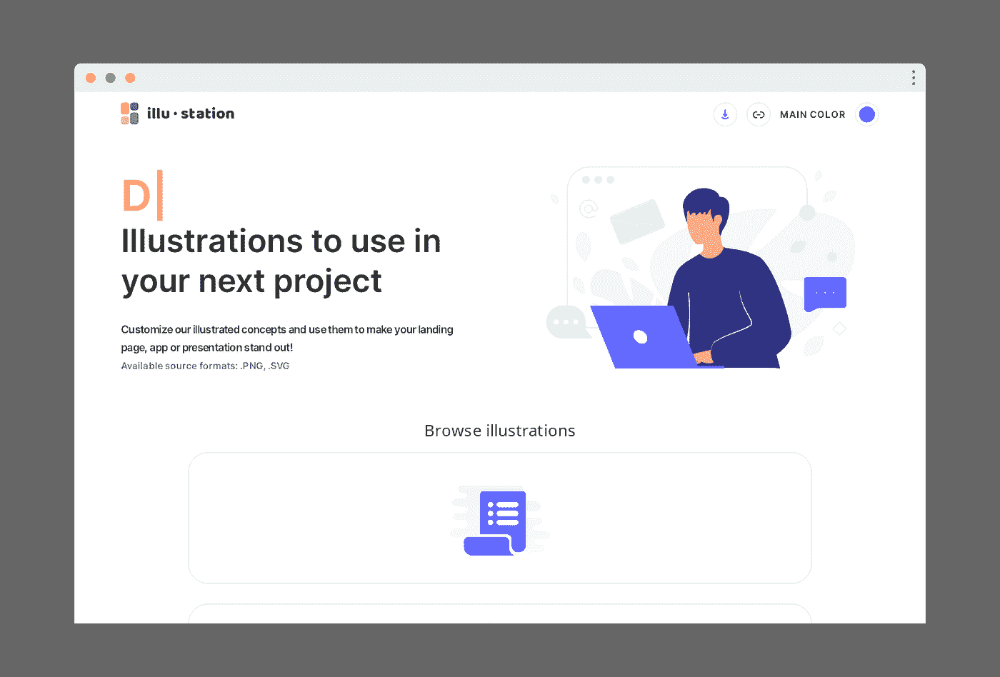
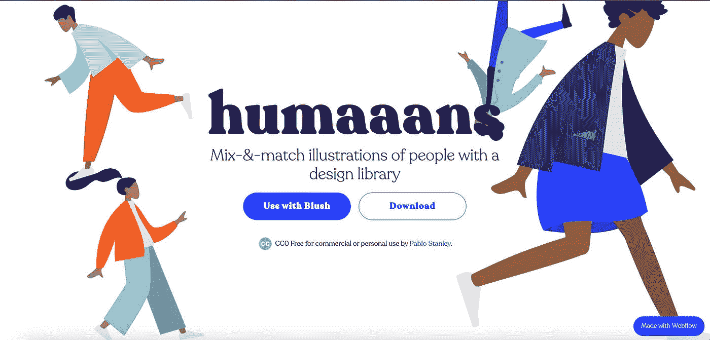
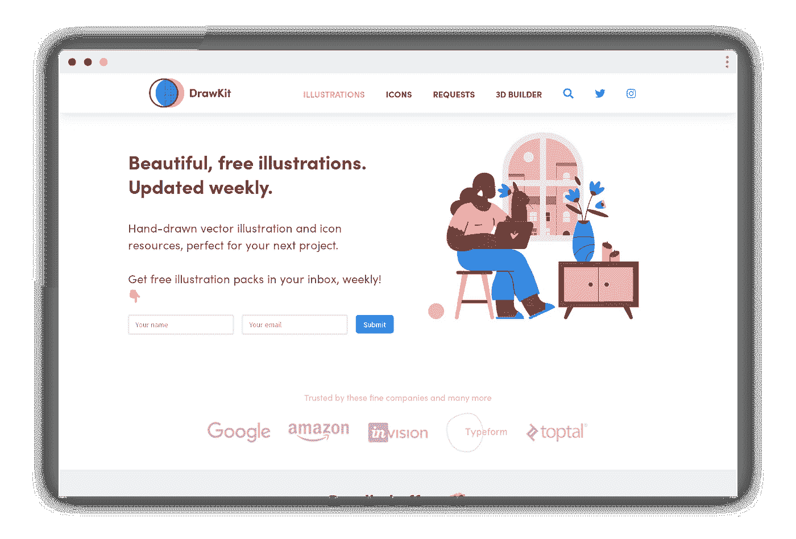
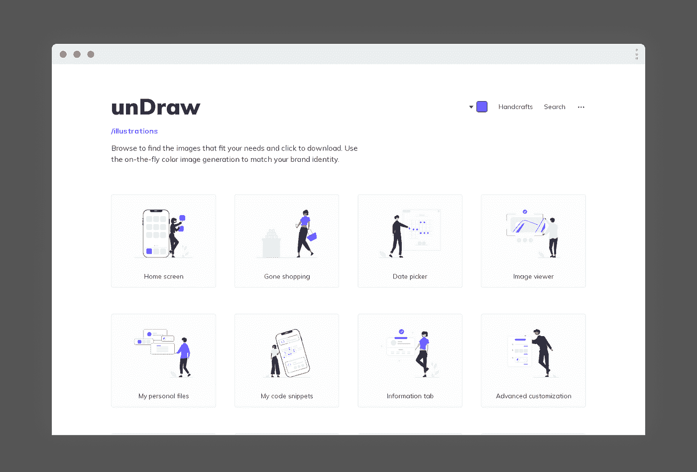

# 寻找优秀插图的 5 个网站

> 原文：<https://javascript.plainenglish.io/top-5-websites-to-find-great-illustrations-cd23a3493be9?source=collection_archive---------7----------------------->

## 排名前五的插图网站，在那里你可以为你的下一个项目找到不同种类的优秀插图。

当我们从事网站设计和开发时，我们可能需要添加一些插图来提供一些视觉效果，以便用户可以直观地看到我们正在设计和开发的内容。

要添加插图，我们需要找到或创建一个符合我们的要求。从头开始创建插图非常耗时费力，因此我们可以从免费的插图网站上获得插图，而不是自己创建插图(如果需要，我们可以购买付费的)。

在这篇文章中，我将分享 5 大插图网站，在那里你可以为你的下一个项目找到不同种类的伟大插图。

让我们开始吧。

# 故事集

Storyset 是一个很酷的插图集，为你的下一个项目提供动力。Storyset 中有 5 种不同的风格。你可以选择一个并自定义它，然后将其导出为 SVG 或 PNG。

您还可以应用动画并将动画导出为 HTML、GIF 或 MP4 视频格式。

**故事集链接:**

 [## 故事集:自定义，动画和免费下载插图

### 编辑和动画我们所有的定制插图，以提高您的项目完全免费。现在就开始在…中发挥创造力

storyset.com](https://storyset.com/) 

# 打开涂鸦

Open Doodle 是一个免费插图的开源集合。它允许你下载 SVG 和 PNG 格式的插图。

它还为你提供了[生成器](https://generator.opendoodles.com/)来使用现有的主题或通过创建你自己的主题来生成涂鸦。

**打开涂鸦的链接:**

 [## 打开无涂鸦的素描插图

### 一个供个人和商业免费使用的人物素描图片库。

www.opendoodles.com](https://www.opendoodles.com/) 

# 主题岛

Themeisle 是一个很好的网站，可以获得高质量的、免费的、令人愉快的插图，用于你的下一个项目。你只需要指定你的品牌颜色，然后它会用你的品牌颜色创建所有的插图。Themeisle 最大的优点是它允许你一次性下载所有的插图。

主题岛的链接:

 [## 免费插图-免费使用插图和矢量

### 查找并下载最受欢迎的插图，免费用于商业用途，高质量图像，专为创意制作…

themeisle.com](https://themeisle.com/illustrations/) 

# 人类

Humaaans 是一个很好的网站，可以通过设计库获得人们的插图。你可以使用腮红编辑器编辑所有的插图。你可以定制他们的位置、服装、颜色和发型来创造一些很酷的场景。您可以添加背景，并利用库的力量使其成为您自己的背景。

**人类链接:**

 [## Humaaans: Mix-&-Match 插图库

### mix-&-将人物插图与 VIsion Studio 和 Sketch 的设计库相匹配。

www.humaaans.com](https://www.humaaans.com//) 

# 绘图工具包

Drawkit 附带各种类型的插图，如**健康&医疗插图**、**数字营销插图**、**营销和广告插图、**等。Drawkit 有免费和优质插图。它还有一个图标集合，可以在您的下一个项目中使用。

**draw kit 的链接:**

 [## DrawKit -美丽的矢量插图

### 免费和优质的矢量 SVG 插图供您在下一个项目中使用，无需署名！向量…

drawkit.com](https://drawkit.com/) 

# 拉开

UnDraw 是一个开源的插图项目，有漂亮的 SVG 图像，你可以完全免费使用，没有归属。您可以创建自己的插图，并为 UnDraw 项目做出贡献。

【unDraw 的链接:

 [## 插图|未画

### 该设计项目为您可以想象和创造的任何想法提供了开源插图。创建漂亮的网站…

undraw.co](https://undraw.co/illustrations) 

# 摘要

总而言之，我们讨论了排名前 5 的插图网站，其中一些是开源的，一些是免费增值的。我经常在我的项目中使用 unDraw 和 humaaans。让我知道你用的是哪一个，如果这里没有提到，请添加评论，这样人们也可以了解这些网站。

这个话题到此为止。感谢您的阅读。

# *联系我*

[*LinkedIn*](https://www.linkedin.com/in/sachin-chaurasiya)*|*[*Twitter*](https://twitter.com/sachindotcom)

*原发布于*[*https://blog . sachinchaurasiya . dev*](https://blog.sachinchaurasiya.dev/top-5-websites-to-find-great-illustrations)*。*

*更多内容请看*[***plain English . io***](http://plainenglish.io/)*。报名参加我们的* [***免费周报***](http://newsletter.plainenglish.io/) *。在我们的* [***社区不和谐***](https://discord.gg/GtDtUAvyhW) *获得独家写作机会和建议。*