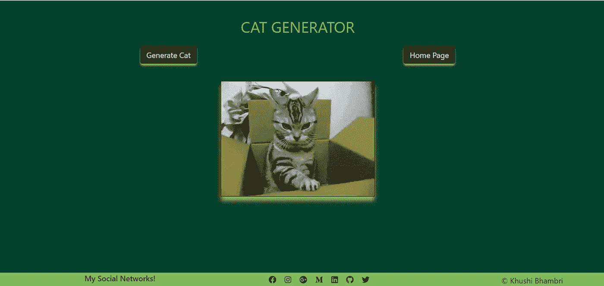
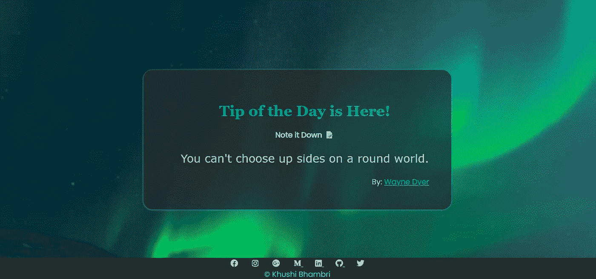
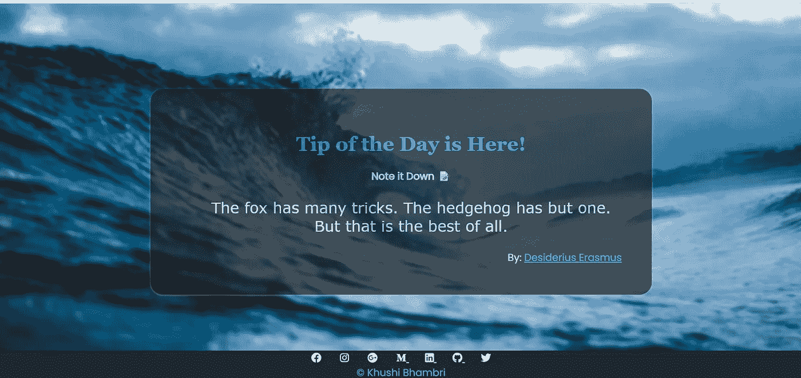
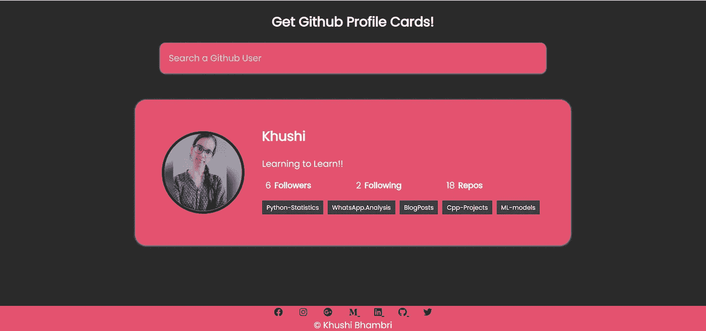
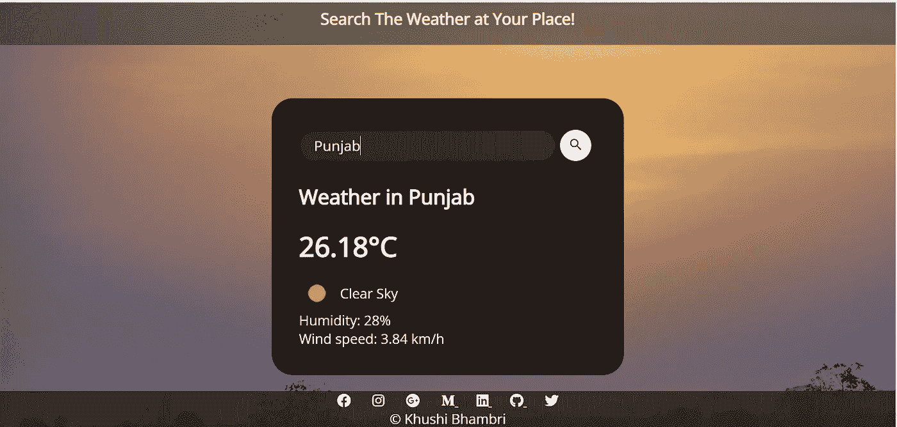
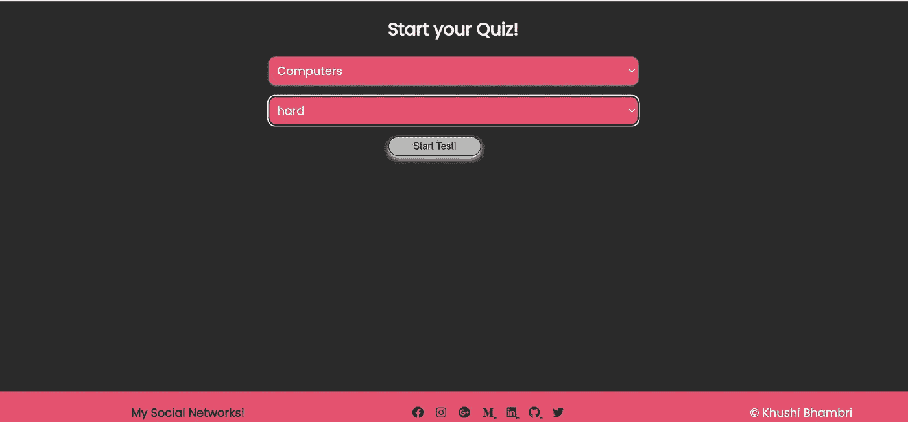
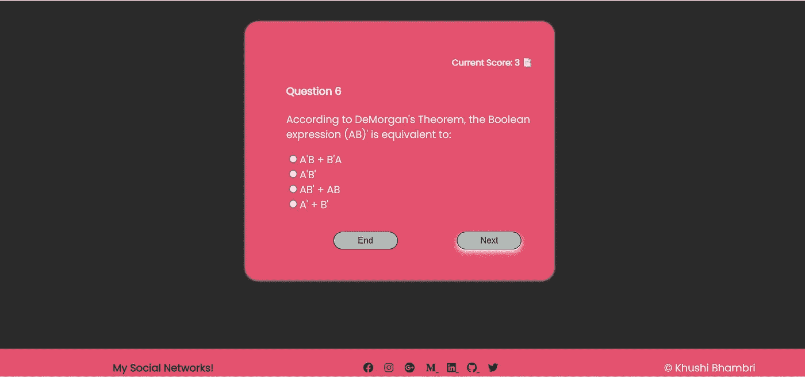
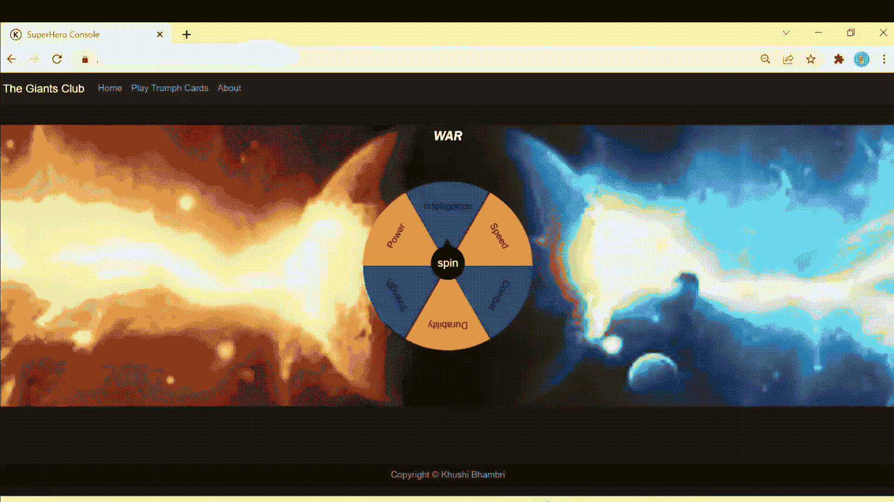
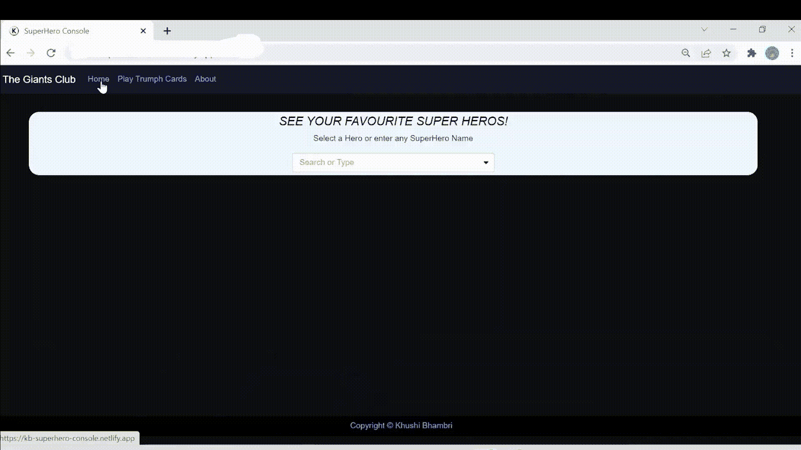

# 7 个使用 API 和 JavaScript 的初学者友好项目

> 原文：<https://javascript.plainenglish.io/top-beginner-friendly-projects-using-apis-f43356aeac7f?source=collection_archive---------2----------------------->

## 一些惊人的初学者友好的使用 API 的 Web 开发项目。

Photo by [Clément Hélardot](https://unsplash.com/@clemhlrdt?utm_source=medium&utm_medium=referral) on [Unsplash](https://unsplash.com?utm_source=medium&utm_medium=referral)

我还将分享这些项目的免费 API 的链接。

注意: **API(应用程序编程接口)**是一个中间软件或程序，它使两个应用程序能够相互对话和共享。公共 API 是开放的，可供任何外部开发人员或企业使用。

我们将从使用 API 的简单有趣的 Web 应用程序开始，然后转移到一些在新手简历上看起来很棒的有价值的项目。

## 1.卡特彼勒发电机:

这是最基本的 API 项目之一。调用 API，得到一个可爱的随机猫咪图片/Gif，漂亮的展示出来就大功告成了！

This is a Cat GIf :)

API 网址: [*点击这里*](http://thecatapi.com/api/images/get?format=src&type=gif)

## **2。随机图片供稿:**

我们可以成功地从 API 生成图像，现在让我们向前迈进一步。

我们将创建一个随机的美丽图像的饲料，如当用户向下滚动，他连续得到多个不同的图像。听起来不错吧？看起来也很棒！

Beautiful Random Images Feed

API URL: [点击这里](https://source.unsplash.com/random/)

## 3.每日提示:

享受随机图像库带来的乐趣？这里有更令人兴奋的东西。

是的，使用一个 API 来获取一些报价，并将它们显示为每日报价。有一些 API 提供每日报价作为响应，还有一些 API 在您每次通过请求获取报价时提供任意随机报价。

快速问题:无论你什么时候重新加载你的应用程序，你如何让一个持续的报价至少一天可见？(拿不到就在评论里问)。

它看起来是这样的:

I have used Unsplash API for Generating Random Background Images as well :)

API URL:[Zen quotes](https://zenquotes.io/api/today)， [AdviceSlip](https://api.adviceslip.com/advice) 。

## 4.GitHub 个人资料卡:

到目前为止，做得很好，现在是时候升级了！

GitHub 还为用户、头像、简历、存储库、追随者、关注、流行的回购、项目等提供 API。因此，我们可以使用任何 GitHub 用户的用户名来创建一个惊人的 GitHub 个人资料卡。

像这样:

API URL: [点击此处](https://api.github.com/users)

## 5.天气应用程序:

你有没有想过天气应用程序是如何预测天气的？他们没有自己的卫星，但他们可以访问一些天气 API，并在他们的应用程序上显示结果。

让我们创建自己的天气应用程序。我们需要的只是一个 API 和一个很酷的用户界面。

API URL:

 [## 天气 API

### 简单快速和免费的天气 API，你可以访问当前的天气数据，每小时，5 天和 16 天…

openweathermap.org](https://openweathermap.org/api) 

## 6.测验应用程序:

试过简介卡？让我们为用户做一些更具互动性的东西，一个问答游戏应用！。

最初，用户可以选择测验主题和难度，如下所示:

该应用程序可以获取问题、选择和正确的选择答案。我们可以随机选择正确的数字，并在剩下的 3 个位置填入错误的数字。该应用程序显示一张卡片，显示 1 个问题和按钮，以结束游戏或移动到下一个问题，分数也在每一个问题后改变。以下是我的见解:

API URL: [OpenDB](https://opentdb.com/api_config.php)

## 7.王牌:

呜哇！现在就让我们用 API 来构建一个有趣的、用户友好的、好玩的应用吧。

使用一些有趣的游戏 API 来为孩子们创建游戏，这是一个王牌游戏，它可以随机生成 2 张超级英雄卡，并根据用户的选择，在特定回合后提供分数并生成结果。

An awesome trump Card Game.

此外，我们可以使用这个 API 为超级英雄构建一个传记站点，显示他们的外貌、别名、Powerstats 等等。

这看起来很酷:

API 网址: [RapidAPI](https://rapidapi.com/jakash1997/api/superhero-search) ，[超级英雄](https://superheroapi.com/)

**奖励**:你也可以使用任何新闻 API 构建新闻 App。

我希望你喜欢这些迷你项目。你还有其他令人惊叹的 API 项目创意吗？添加评论。

## 进一步阅读

 [## 如何使用数据收集器创建亚马逊产品搜索 API

### API(应用程序编程接口)是两台或多台计算机之间的一种通信方式，目的是…

简明英语. io](https://plainenglish.io/blog/how-to-create-an-amazon-product-search-api-with-data-collectors) 

*更多内容请看*[***plain English . io***](https://plainenglish.io/)*。报名参加我们的* [***免费周报***](http://newsletter.plainenglish.io/) *。关注我们关于*[***Twitter***](https://twitter.com/inPlainEngHQ)**和*[***LinkedIn***](https://www.linkedin.com/company/inplainenglish/)*。查看我们的* [***社区不和谐***](https://discord.gg/GtDtUAvyhW) *加入我们的* [***人才集体***](https://inplainenglish.pallet.com/talent/welcome) *。**