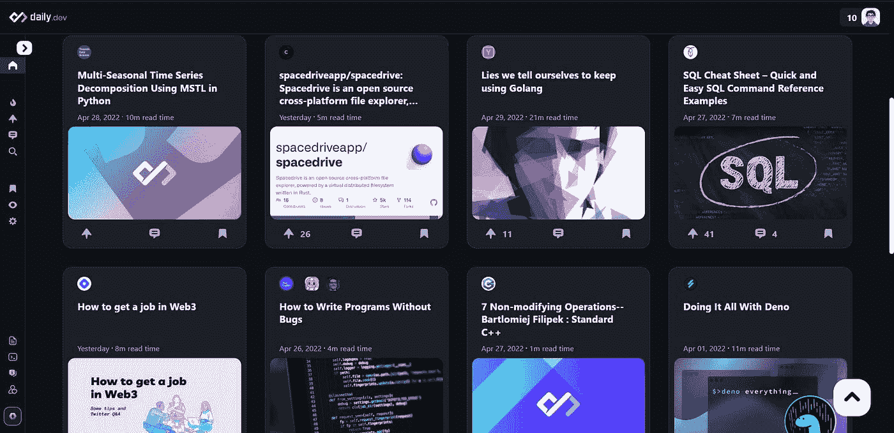
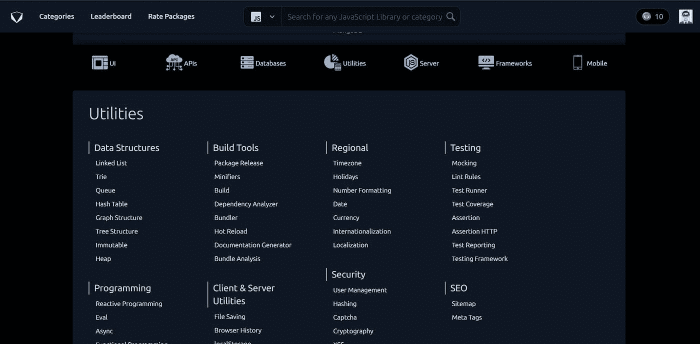
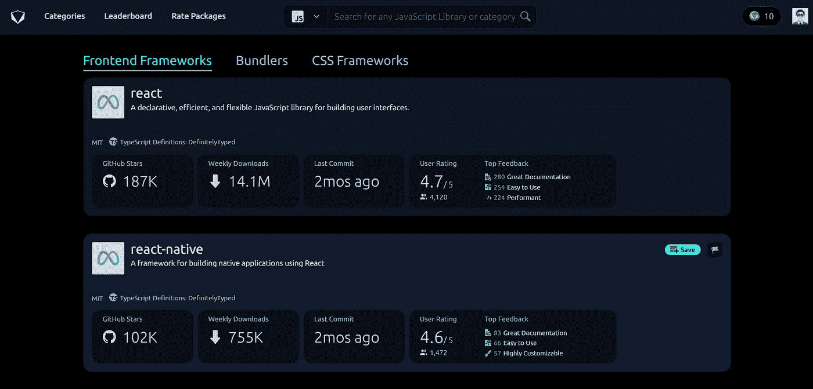
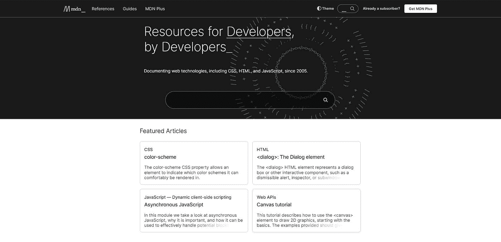
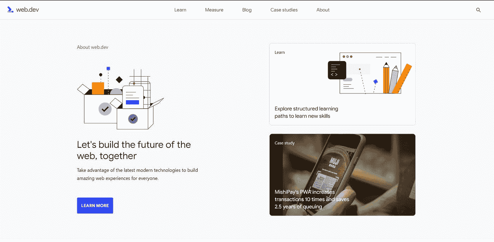
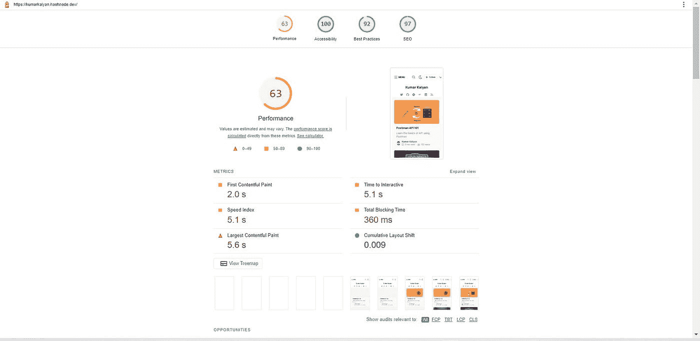
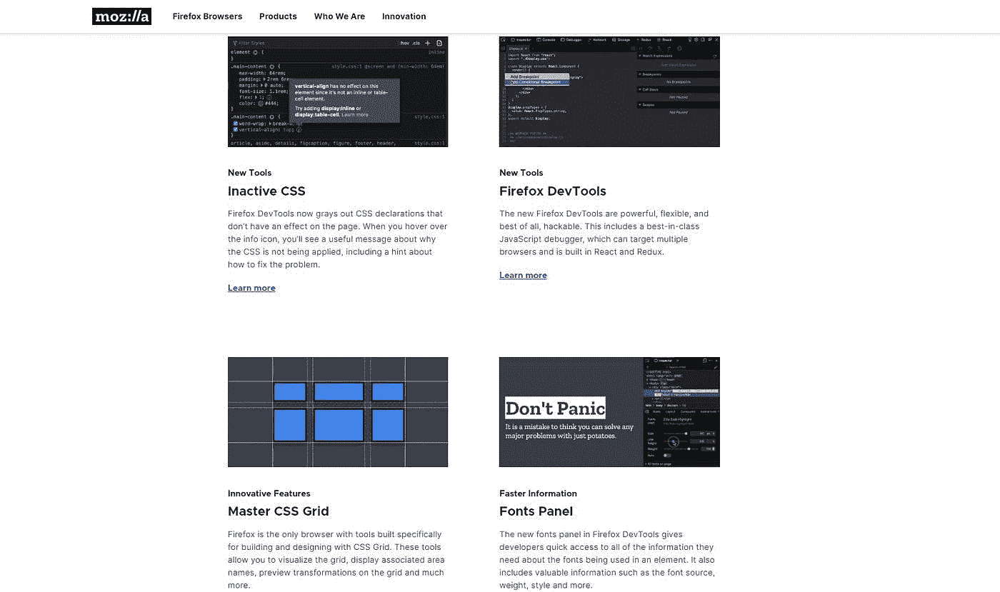
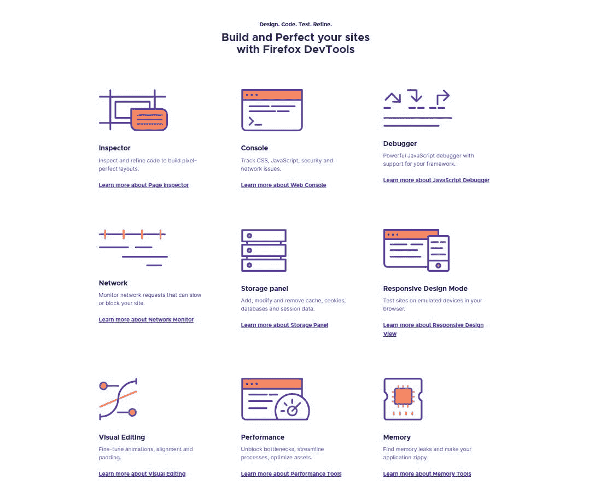

# 促进您的 Web 开发之旅的 5 种资源

> 原文：<https://javascript.plainenglish.io/top-five-resources-to-boost-up-your-web-developer-journey-55c92020eecb?source=collection_archive---------9----------------------->

## 最受欢迎的资源，将提高您的生产力，并帮助您在 web 开发领域保持更新。

# 介绍

Web 开发指的是构建、运行和设计网站，在这篇文章中，我将讨论一些最流行的 web 开发资源，它们将提高您的工作效率，并帮助您了解该领域的最新动态。我再次提到这些资源，因为我个人使用它们，我很确定你们也会喜欢这些！

# 1. [Daily.dev](https://app.daily.dev/)

一个被谷歌、苹果、网飞等大型科技巨头的开发者所信任的平台，在这里你可以找到关于计算机编程、软件技术、web 开发、机器学习、android、数据科学等等的最流行的文章和资源。我的一些博客也受到了关注。最棒的是，它是免费和开源的，任何人都可以对技术栈做出贡献。人们可以登录他们的网站或者将其添加为谷歌浏览器的扩展。

# 2.[开放式底座](https://openbase.com/)

当需要开发新的应用程序或向现有应用程序添加新功能时，选择正确的工具至关重要，要摆脱这一点，您可以选择 Open base。对于软件包、API、数据库、框架等等，Open base 就像 google 一样。它显示的信息包括每周下载量、GitHub 星级、新提交的内容添加到包中的频率，最重要的是其他开发者的真实评论。

# 3. [MDN 网络文档](https://developer.mozilla.org/en-US/)

Web 开发是一个庞大的主题，人们不可能记住每一个语法。MDN(Mozilla Developer Network)web docs 是一个免费的开源平台，由 Mozilla Foundation 支持，用于了解包含初学者友好到高级主题的 web 开发。

# 4. [Web.dev](https://web.dev/)

星期三 dev 也是一个案例研究、播客和文章的目录，关注的主题包括渐进式 web 应用程序、响应式 Web 设计、HTML 表单、布局模式、性能指标等等。此外，你可以使用他们的页面洞察工具来衡量你的网站的性能，这将有助于你修复你的应用程序的性能。

# 5. [Mozilla Firefox 开发者版](https://www.mozilla.org/en-US/firefox/developer/)

当需要调试时，没有比 Firefox Developer edition web 浏览器更好的选择了。它不仅仅是一个普通的网络浏览器，它是一个能让你像小菜一碟一样调试的怪兽。它是免费和开源的，具有包括非活动 CSS、firefox 开发工具、字体面板、样式编辑器等功能。

# 结论

好了，这就是这篇文章的全部内容，使用这些资源，请在评论区让我知道它们是如何帮助你的。如果你喜欢这篇文章，并发现它很有用，那么请随意与你的同行分享，不要忘记点击回复并关注我的页面，因为它是免费的，并有助于页面的增长。

# 连接

[推特](https://twitter.com/kumarkalyan_) [领英](https://www.linkedin.com/in/kumar009/)

*更多内容看* [***说白了就是***](https://plainenglish.io/) *。报名参加我们的* [***免费周报***](http://newsletter.plainenglish.io/) *。关注我们关于*[***Twitter***](https://twitter.com/inPlainEngHQ)*和*[***LinkedIn***](https://www.linkedin.com/company/inplainenglish/)*。加入我们的* [***社区***](https://discord.gg/GtDtUAvyhW) *。*