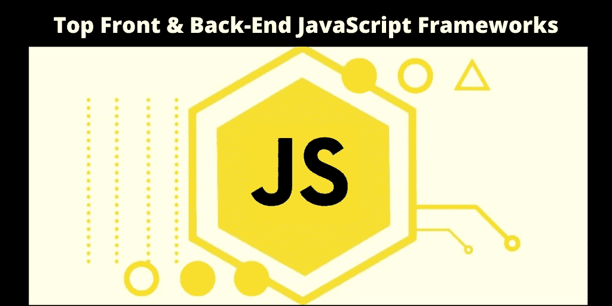
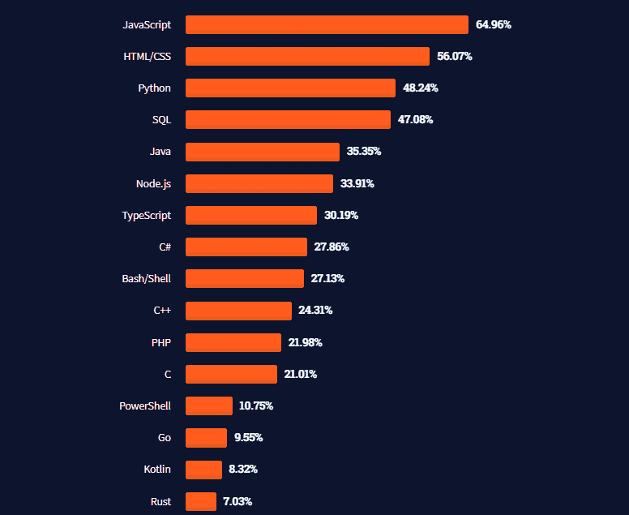
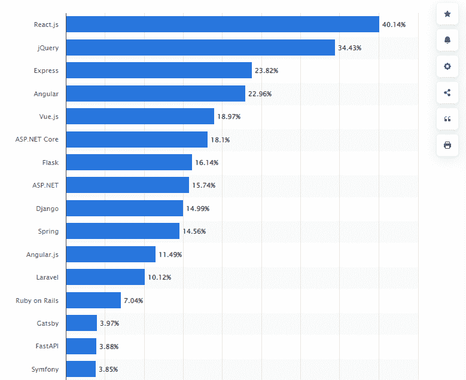

# 2022 年你不能错过的顶级前端和后端 JavaScript 框架

> 原文：<https://javascript.plainenglish.io/top-front-back-end-javascript-frameworks-that-you-cant-miss-in-2022-949fdf9e360d?source=collection_archive---------8----------------------->

## 以下是 2022 年 web 和 app 开发的最佳 JavaScript 框架。

Top Front & Back-End JavaScript Frameworks That You Can’t Miss In 2022

在这个现代世界中，智能手机的使用越来越多，这使得组织转向了数字平台。当涉及到开发网站或移动应用程序时，企业首先关注的是寻找最好但最可靠的编程语言，以帮助构建高性能的解决方案。

JavaScript 是最流行的编程语言之一，已经成为互联网上大多数网站的功能。JavaScript 是一种可供开发人员使用的脚本语言，用于构建动态内容和网站或基于 web 的应用程序，加载速度更快，并确保无缝的用户体验。

*根据 W3Tech 的调查，97.4%的网站已经使用 JavaScript 作为客户端编程语言。*

无论是移动应用程序开发、网页游戏还是桌面应用程序开发，JavaScript 的框架无处不在。你不必相信我们的话。下图显示 JavaScript 明显领先于其他语言。

[Image Source](https://insights.stackoverflow.com/survey/2021)

有了 JavaScript 的地位，全世界的开发者都信任这种语言来构建网站。但随着其框架和库的引入，构建具有强大功能的高质量应用程序已经成为可能。

如果你还在考虑是否应该雇佣一个 JavaScript 开发人员，那么你需要知道像谷歌和脸书这样的顶级品牌已经信任这个 JavaScript 框架来构建满足他们需求的应用程序。那么对于应用程序开发来说，你需要了解哪些顶级的 JavaScript 框架呢？

[*据调查*](https://www.statista.com/statistics/1124699/worldwide-developer-survey-most-used-frameworks-web/) *、React.js、jQuery、Angular、Express、Vue.js 等等都是你需要深入了解的顶级 JavaScript 框架。*

[Image Source](https://www.statista.com/statistics/1124699/worldwide-developer-survey-most-used-frameworks-web/)

JavaScript 提供了大量的框架，使您能够构建完美的应用程序。但是作为一个开发者或者创业公司，你一定很困惑 JavaScript 框架和库哪个才是最好的选择，哪个才是 app 开发的理想选择。因此，我们在这里向您解释所有的顶级框架及其优缺点，以帮助您做出明智的决定。

# **2022 年你需要知道的顶级 JavaScript 框架和库**

以下是最受欢迎的 JavaScript 框架和库，可帮助您创建应用程序:

## **1。React Native 用于跨平台应用开发**

[*人气*](https://github.com/facebook/react-native) *:明星 104k /被 992k 使用/叉子 22.3k /投稿人 2337*

React Native 是最受欢迎的 JavaScript 框架之一，直接来自脸书。它允许你用一个代码库为 iOS 和 Android 创建本地应用。React Native 简单易学，背后有一个庞大的开发者社区。

另外，如果你是一家创业公司，打算做一个跨平台的 app，那么 [**雇佣一个 React 原生开发者**](https://www.appsdevpro.com/hire-developers/hire-react-native-developers.html) 。专家将帮助你创建一个同时在 iOS 和 Android 上运行良好的应用程序。

React Native 的路线图包括将其特性集扩展为一个开源项目。最后，使用它不需要 Java 或 Swift 知识。然而，这个平台的一个缺点是还没有太多可用的插件。要解决这个限制，您需要使用它的 API 编写自己的插件。

如果你正在尝试使用 React Native 构建一个顶级的应用程序，那么下面是这个框架的利与弊的简要介绍:

**使用 React Native 的好处:**

*   使用 React Native，开发人员可以利用内置模板来节省时间和精力。
*   React 原生跨平台应用开发框架将帮助您交付具有原生体验的应用。
*   70–80%的代码库是高度可重用的。

**React Native 的限制:**

*   开发人员需要了解本机编码。

## **2。Vue.js 构建优秀的用户界面**

[*人气*](https://github.com/vuejs/vue) *:明星 198k /被 2.7M 使用/叉 32.6k /贡献者 338*

Vue.js 是一个流行的 JavaScript 框架，帮助开发人员创建用户界面和单页应用程序。凭借其声明式呈现和基于组件的架构，Vue.js 可以轻松创建复杂的应用程序。

此外，它的小尺寸使其成为应用程序开发的理想选择。Vue.js 也有详细的文档和教程，供那些想了解更多关于这个框架的人使用。

**vue . js 的好处:**

*   Vue.js 利用了一个虚拟 DOM。
*   该框架提供了广泛的组件选择，有助于开发可在 HTML 中重用的自定义元素。
*   Vue.js 中的数据绑定功能允许您操作 HTML 属性并为其赋值，更改样式，给类和其他东西赋值。

**vue . js 的局限性:**

*   缺少插件和可扩展性
*   有限社区
*   双向绑定的困难

## **3。Angular 是一个开源的 Web 应用开发框架**

[*人气*](https://github.com/angular/angular) *:明星 82.9k /被 2.4M 使用/分叉 21.9k /贡献者 1593*

Angular 是 2010 年发布的一个流行的开源 web 应用框架。它最初是由谷歌开发的。Angular 是用 TypeScript 编写的，用于创建单页应用程序。Angular 有一个基于指令的架构，并使用模型-视图-控制器(MVC)模式。

在你 [**雇佣 web 应用开发者**](https://www.appsdevpro.com/hire-developers/hire-web-app-developers.html) 之前，你需要知道 Angular 是应用开发的一个流行选择，因为它提供了广泛的特性，包括数据绑定、路由和依赖注入。另外，Angular 可以与各种编程语言一起使用，这使它成为开发人员的一个通用选项。

**棱角分明的关键亮点:**

*   AngularJS 是一个动态 web 应用的结构框架。
*   它使用 HTML 作为模板语言。
*   它扩展了 HTML 的语法，以便清楚地表达应用程序的组件。
*   它确保了高代码可重用性。

**角度的限制:**

*   它提供的文件不充分
*   它包括很高的学习曲线。

## **4。Cordova 是一个跨平台的应用程序开发框架**

[*人气:*](https://github.com/apache/cordova) *明星 412k /叉子 51k /投稿人 9*

Apache Cordova 是一个开源框架，允许您使用 HTML、CSS 和 JavaScript 创建应用程序。对于想要创建跨平台应用程序的开发人员来说，Cordova 是一个受欢迎的选择。使用 Cordova，您可以为 Android、iOS、Windows Phone 和其他平台创建应用程序。

要开始使用这个框架，你需要雇佣一个网页设计师，下载 SDK(软件开发工具包),并设置你的环境。一旦你完成了这一步，你就可以开始开发了。Cordova 附带了一些预构建的功能，如支持相机和加速度计等设备功能。

您还可以访问来自社区的各种插件，这些插件提供对设备硬件功能的访问，如蓝牙或 GPS。使用 Cordova 的主要优势之一是，它允许您使用 HTML/CSS/JavaScript 进行设计，而不是像其他一些框架要求的那样使用 Xcode 或 Java 代码，从而让您完全控制应用程序的外观。

**使用 Apache Cordova 的好处:**

*   适合跨平台 app 开发的框架。
*   快速部署更新并快速实施。
*   基本上是启动项目的理想选择。

**使用 Apache Cordova 的限制:**

*   它并不兼容所有的插件。
*   应用程序确保了不那么自然的感觉。

## **5。Ionic 是一个跨平台的应用开发框架**

[*人气*](https://github.com/ionic-team/ionic-framework) *:明星 47.7k /叉子 13.7k /投稿人 428*

Ionic 是用于开发应用程序的 JavaScript 开源框架。它是一个跨平台的框架，可用于开发 Android、iOS 和 Windows Phone 的应用程序。Ionic 基于 AngularJS 和 Apache Cordova。

Ionic 的主要特性是它的 UI 组件、手势支持和 CLI。爱奥尼亚也有一个很大的社区，这在你刚开始的时候会很有帮助。另一方面，这可能意味着定制你的应用程序更加困难。如果你不太熟悉 AngularJS，那么你可能需要更长时间才能开始使用 Ionic。

**使用爱奥尼亚的好处:**

*   Ionic 是一个轻量级的灵活框架。
*   它基于“写一次，到处运行”的概念。
*   它的学习曲线很低，适合紧急项目。
*   在短时间内推广你的项目。
*   易于扩展，易于在桌面上测试。

**使用离子框架的限制:**

*   它有几个相互冲突的插件。
*   不合适的本机函数。

## **6。Appcelerator Titanium 是一个跨平台的应用开发框架**

[*人气*](https://github.com/tidev/atom-appcelerator-titanium) *:明星 34/叉子 11 /投稿人 15*

基于 Mozilla 的框架，它允许你使用 JavaScript、HTML 和 CSS 构建跨平台的应用。类似于 PhoneGap，但具有更快的性能和更广泛的设备支持。Titanium 支持多点触摸事件、硬件按钮，甚至 iOS 特有的手势，如挤压和滑动。Titanium 可以在 Windows、Mac OS X、Linux、Android、iPhone 和 iPad 上运行。

值得 [**雇佣一个 app 开发者**](https://www.appsdevpro.com/hire-developers.html) 用 Appcelerator Titanium 创建一个 app。通过使用它的内置模块，可以很容易地与其他语言(如 C/C++或 Objective-C)进行接口，这使它非常适合于混合开发，在混合开发中，您可以将自己的代码与现有的库或框架结合使用。

在 Titanium 中开发的应用程序可以通过多个应用程序商店发布，包括 Android Market(适用于所有设备)、Apple App Store (iPhone/iPad)和 BlackBerry App World。

**使用 Appcelerator Titanium 的好处:**

*   广泛用于开发 iOS 和 Android 的应用程序。
*   它易于学习和获取。
*   提供一个大社区的支持。

**使用该框架的限制:**

*   没有很好的记录。
*   缺乏针对开发者的教程。
*   应用程序开发项目的资源有限。

## **7。Meteor.js 是 js 流行的前端框架**

Meteor.js 被认为是迄今为止最流行的前端框架之一。这个 JavaScript 框架加速了后端开发，并为需要在 Python 或 PHP 等语言之间切换的开发人员节省了知识获取时间。

此外，meteor 还允许前端开发人员在后端工作，而不必学习另一种语言，这是有益的，因为这将使他们有时间专注于他们最擅长的事情——设计！

此外，该编程工具使用户能够开发跨所有平台运行的全栈应用程序:移动、桌面和 web。

**使用 Meteor.js 的好处:**

*   与 Cordova、React 和 MongoDB 等工具和框架集成，以增强功能。
*   轻松创建适用于任何平台的应用程序。
*   帮助您实时重新加载浏览器

**使用 Meteor.js 的限制:**

*   这听起来很容易使用，但是没有反应式连接。
*   缺乏对加载文件顺序的控制机制。
*   没有本机服务器端呈现。

# **结论**

在这篇博客的最后，你会有一个流行的 JavaScript 框架列表，可以广泛用于应用程序开发。这个博客不是要宣布谁是赢家，而是要引导创业公司雇佣一个拥有正确技术的网络开发者。无论您有基本的、复杂的还是高级的应用程序开发需求，JavaScript 框架列表都将帮助您理解应用程序的理念。

为移动和 web 开发选择正确的 JavaScript 框架从来都不是一个特定框架能提供多少特性的问题。这都是关于框架的功能以及如何将其应用于应用程序开发概念。

如果您仍然不清楚应该选择哪个框架来创建应用程序，那么您可以联系我们或在下面提出疑问。

*更多内容请看*[***plain English . io***](https://plainenglish.io/)*。报名参加我们的* [***免费周报***](http://newsletter.plainenglish.io/) *。关注我们关于*[***Twitter***](https://twitter.com/inPlainEngHQ)**和*[***LinkedIn***](https://www.linkedin.com/company/inplainenglish/)*。查看我们的* [***社区不和谐***](https://discord.gg/GtDtUAvyhW) *加入我们的* [***人才集体***](https://inplainenglish.pallet.com/talent/welcome) *。**