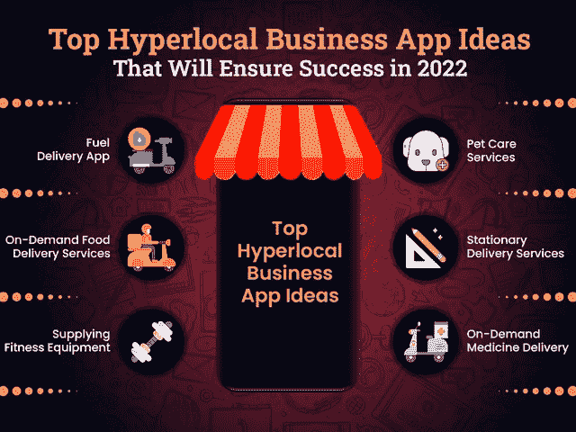

# 2022 年要考虑的顶级超本地商务应用创意

> 原文：<https://javascript.plainenglish.io/top-hyperlocal-business-app-ideas-to-consider-in-2022-317696d6b7c5?source=collection_archive---------6----------------------->

## 按需交付服务的顶级盈利超本地商业理念

随着疫情的严重打击，各种组织纷纷倒闭，人们失业，但要记住，每一场危机都会带来新的机遇。

新的一年开始了，千禧一代好奇地寻找新的机会。各行各业的企业都在寻找可以帮助他们恢复业务的点子。“超本地”正在成为 2022 年蓬勃发展的商业模式。

毫无疑问，新冠肺炎的影响仍然停留在我们身上，并深深地影响着人们的生活方式。因此，全球各地的消费者都在迅速改变他们的路线和购物习惯。无论是食品杂货、药品、勤杂工服务，还是任何介于两者之间的服务。人们希望在自己舒适的家中就能访问。这极大地推动了近年来超本地点播服务的发展。人们正在迅速转向超本地按需服务平台，以满足他们的本地需求。

互联网曾被用作帮助全球人们联系的工具。然而，现在它被用来使我们的日常生活更容易管理和更容易。尽管如此，超本地快递业务已经开始统治这个领域。它通过提供更便利和更容易的按需超本地服务，为零售部门的重组做出了重大贡献。

## **想知道如何？**

*根据最近的研究，到 2027 年，超本地市场规模将很快成为*[*【36，343 亿美元。*](https://www.alliedmarketresearch.com/hyperlocal-service-market) 有了这个，*未来超本地按需服务肯定会成为一件大事。*

此外，全球有超过 52 亿智能手机用户，他们 90%的时间都在访问应用程序。

而全球各地的人们已经开始倾向于使用移动应用来满足他们的日常需求。企业应该将此视为 2022 年的一个巨大机遇，这是有道理的。但是，如果你想知道如何开始，并成为这个进步行业的一部分？需要考虑哪些措施？那就不用担心了！

这里我们有你所有疑问的答案…是时候深入了解什么是超本地服务以及它们是如何工作的了？

## **以下是博客的主要亮点:**

*   *了解超本地交付业务模式及其运作方式？*
*   *为什么现在是为你的初创公司投资超级本地商务应用的理想时机？*
*   *2022 年创业的低成本超本地按需服务创意*
*   创造一个成功的超本地商业模式的主要特征是什么？
*   *2022 年创建一个超本地商业 App 需要多少钱？*
*   *结论:开始使用超本地交付应用程序，开启新机遇*

让我们深入了解每一点，以便更好地理解…

## **了解超本地交付业务模式及其运作方式？**

超本地商业模式基于一个简单的概念，即找到离我最近的按需服务。创建这个应用程序的简单动机是为了满足用户的迫切需求。换句话说，超本地服务正在抓住这些天的炒作。原因是，他们的目标是在最短的时间内提供服务。

此外，超本地快递业务正在迅速重塑零售业。它是一种数字商业模式，在这种模式下，当地的线下商店通过使用数字平台来处理用户的请求。

事实上，利用这项技术更有可能在业务中本地化。

有了正确的技术、特性和功能，超本地应用程序可以给本地业务带来完美的推动。此外，超局部模型增加了速度的便利性。但是在你进入 hyperlocal 应用程序开发过程之前，雇佣一个 [**应用程序开发公司**](https://www.xicom.biz/services/mobile-app-development/) 。他们消除了对这种商业模式如何运作的担忧。因此，对于愿意启动超本地服务的零售商或商业爱好者来说，请记住，这些都与地理和时间有关。因此，与其东张西望，不如让我们了解超本地服务平台是如何工作的…

## ***超本地市场商业模式如何运作？***

超本地市场商业模式是一种新的机制。它的简单方法是在最快的时间内满足用户的要求。在疫情期间，对这种商业模式的需求开始激增，并且没有下降的迹象。尽管那时一切都被重组了。但这里的问题是，在新冠肺炎之后，它会保持不变吗？简单的回答肯定是肯定的！

首先，本地服务的革命为我们的生活提供了极大的便利。此外，在某种程度上使用户访问一切变得更简单。不断发展的超本地商业模式让人们可以立即获得食品杂货、药品等。事实上，超本地平台已经成为许多电子商务解决方案的首选。

现在的问题是如何让它完美地工作？

要让你的超本地商业模式发挥作用，首先你需要选择一种超位置(最近的位置)技术。接下来，将用户与最近的服务提供商连接。app 中包含的相关产品的列表，客户可以通过它提出请求，并让它变得非常便于客户购物。

此外，用户可以在最快的时间范围内提出产品交付请求，而无需支付任何交付费用。

*听起来很简单！*

*但问题是，为什么现在是投资超本地化商业应用的时候了？*

## **为什么现在是投资超本地化创业应用的理想时机？**

随着商业环境和客户需求的不断变化，零售商和销售商不得不采用新的商业模式。考虑一下完全符合现代市场需求的业务方法。同时，为超本地化的按需服务开发应用程序，是释放新商机的完美途径。你也可以选择 [**雇佣**](https://www.xicom.biz/offerings/hire-mobile-developers/) 手机应用开发者，帮助你快速上手。你所需要的只是对你将要提供的服务类型有一个清晰的愿景。

> 你还在怀疑为什么超本地服务在这个疫情变得至关重要吗？以下是一些您需要了解的理由:

*   满足基本项目的迫切需要。
*   提供更快的交付，而不收取任何额外的交付成本。
*   允许客户访问 Google 搜索上的“靠近我”选项，增加了本地企业的搜索量。

## 以下是一些市场统计数据，可以帮助你逐步了解超本地化市场:

*   *根据*[*Globe newsweet*](https://www.globenewswire.com/news-release/2020/12/21/2148784/28124/en/Global-Hyperlocal-Services-Market-2021-to-2027-Opportunity-Analysis-and-Industry-Forecast.html)*预测，2021-2027 年，超本地服务市场将以 17.9%的 CAGR 速度增长。*
*   *比特币的市场规模在 2019 年为 13，242 亿美元，预计到 2027 年将达到 36，343 亿美元。*

当然，这些关于超本地商业模式的统计数据和事实正在影响你投资超本地商业模式。但问题是到底是什么想法？

# **面向 2022 年创业的低成本超本地按需服务高招**

毫无疑问，超本地市场企业通过提供不同类型的服务，在新冠肺炎占据了中心舞台。但要开始超本地业务，你需要决定你需要提供什么类型的服务，或者你擅长于此。一旦你决定了利基，找到目标受众，决定地理位置，并使之发生。从创业开始，你只需要在云上或一个应用程序上获得空间。

由于超本地市场是一个多方面的平台，因此，值得考虑你能在超本地商业应用下提供什么服务？

因此，如果你准备推出超本地业务，但不确定你可以在超本地市场应用程序下提供什么服务，那么我们在这里分享一些最赚钱的超本地业务想法，从 2022 年开始。

# **2022 年创业的低投资超本地商业应用创意**

*   **按需送药**

毫无疑问，在新冠肺炎期间，药品配送就是见证了巨大成功的一个环节。如果你还在使用传统的提供药物的方法，那么请记住这将不再有效。因为人们更喜欢在网上订购，并希望当天就能送货上门。因此，通过超本地市场模式启动一家 epharmacy 商店是有意义的。

*“根据调查报告，2018 年全球药物输送市场规模为 10，212.9 亿美元，预计到 2026 年将达到 18，015.4 亿美元。”*

这些庞大的统计数据肯定会鼓励你立即开始医药业务。然而，在你 [**雇佣移动应用开发者**](https://www.xicom.biz/offerings/hire-mobile-developers/) 来定制一个应用之前，确保你进行了市场调研，分析了市场需求。确保您列出了在集群区域订购最多、需求最大的药物。从长远来看，选择超本地化的医药业务是有成效的。

*   **按需送餐服务**

*根据一份调查报告，全球在线食品交付市场预计将从 2020 年的 1113.2 亿美元增长到 2030 年的 3.61%。*

此外，据估计，到 2023 年，在线食品交付销售额将增长到 2200 亿美元，初创公司可以抓住这一领域的潜在商机。

毫无疑问，由于疫情，食品配送服务的需求激增。但是，最近交付模式和车队类型的转变带来了巨大的成功。

要启动这个项目，你只需要与最近的餐馆和食品连锁店合作。通过本地协作，你可以确保食物在同一小时或同一天送达。此外，你可以承诺食物的新鲜度和质量。雇用一名应用程序开发人员来创建一个超本地交付业务应用程序将是 2022 年值得考虑的优秀应用程序想法之一。此外，您还可以涵盖烘焙食品、蛋糕、定制食品、家庭面包师、当地食品制造商等等。它将帮助您确保食品的超级快速交付，并确保最佳口味。

*   **按需清洁服务**

在这个新冠肺炎期间，当人们在家忙于工作时，打扫卫生总是被列在待办事项清单上。在那里，启动一项提供按需清洁服务的超本地业务将是 2022 年最值得考虑的创业想法之一。

你可以从观察邻居的需求入手，分析他们需要什么样的清洁服务。你可以雇佣一些人来代表这种反应，并开始提供广泛的清洁服务选择，如地毯清洁、汽车清洁、自行车清洁、沙发清洁服务、花园维护服务等等。

此外，服务质量将扩大你的业务的知名度。在开始这项业务时，要确保你的服务费具有竞争力。

*   **宠物护理服务**

如果你对宠物充满热情，为什么不把这种爱和关心变成一种职业呢？以宠物观察服务和提供宠物用品开始超本地业务将是一个伟大的商业想法。虽然市场上已经有许多提供宠物看护服务的应用程序。所以你需要一个商业理念和战略规划来帮助你在市场中脱颖而出。

*   **供应健身器材**

在疫情之后，健身爱好者现在害怕去健身房。大多数人共用同样的机器和设备，时不时需要消毒。健身爱好者现在需要拥有自己的个人设备和用品。

由于人们非常关心城市地区的健康，因此，这将是投资很少的初创公司的百万美元应用程序创意之一。你可以雇佣一家 [**应用程序开发公司**](https://www.xicom.biz/services/mobile-app-development/) 来帮助你定制应用程序，包括应用程序内培训课程、定制饮食、在线集体训练营等等。此外，你还可以添加励志名言、免费励志锻炼视频、制作营养小吃的想法等等。

*   **输油 App**

作为一家初创公司，开始按需燃油配送业务对于超本地创业公司来说可能是一个非常有利可图的想法。在专业人员的帮助下，商务爱好者可以启动他们的燃油配送应用程序，确保现场燃油配送服务。有了这个商业理念，你就可以允许用户通过选择车型来提前订购燃油。此外，随着多种支付功能的集成，您可以让它更完美地工作。

*   **文具递送服务**

如果你正在寻找低投资的超本地商业移动应用程序开发理念，那么固定交付是创业公司的一个绝妙想法。您可以在类别下添加各种产品，包括办公文具、学校用书、漫画书、公司文具、剪刀、购买磁带等。

由于来自世界各地的学生都在家管理他们的学习，因此，在网上购买文具已经成为人们的普遍做法。

总之，在我看来，这是一个很有前途的超本地商业理念，在这个时间点投资。

在开发超本地商业平台时，你可以考虑大量的应用创意。你所需要做的就是考虑正确的策略、特性和功能，让你的超本地商务应用获得成功。

*那么让我们来了解一下以最低投资开发一个超本地商务应用的参数…*

## **创造一个成功的超本地商业模式的主要特征是什么？**

无论你选择在 2022 年开始哪种超本地商业想法。创建一个成功的超级本地市场应用程序需要具备某些特性、功能和属性。我们来详细了解一下…

*   **详细的产品信息:**开发超本地商务应用程序最重要的部分是添加产品和服务的描述。允许用户检查服务和其他方面的所有细节，以避免任何混淆。
*   **简单的订购界面:**确保您的平台有一个简单易用的界面，允许用户快速将产品或服务添加到购物车中。此外，添加检查他们添加到购物车中的产品和服务的详细信息的功能。
*   **地理定位:**这是你的应用程序的主要功能，允许用户添加他们的位置，并帮助他们找到他们位置附近的服务。根据添加到应用程序的位置，平台将开始建议选项。
*   **内置追踪器:**通过这一功能，应用程序用户可以追踪服务提供商的实时位置，并能够估计交付时间。
*   **多支付整合:**当用户使用多种支付方式时， [**雇佣移动应用开发者**](https://www.xicom.biz/offerings/hire-mobile-developers/) 来增加多支付整合的功能是有意义的。这将允许用户通过多种方式进行支付，包括信用卡、借记卡、PayPal、Google Pay 等。
*   **推送通知:**这一功能将成为一个很好的用户保持工具，让您的客户了解最新信息并参与您的业务。此外，你可以向用户透露交易、折扣、优惠、优惠券等信息。
*   **评级和评论:**该功能将允许用户分享他们的体验。根据评级和评论，企业可以提高服务质量，并能够扩大业务。
*   **社交媒体登录:**确保用户可以通过使用脸书、Gmail 或 Instagram 的社交媒体登录，轻松上手应用程序。这将是访问应用程序最简单的方式。

有了这些功能，你就可以扩大成功的范围。但可以肯定的是，在你继续开发应用程序之前，你必须担心创建一个超本地商业应用程序的成本。

## **创建一个超本地商务 App 需要多少成本？**

当谈到开发超本地商业应用程序时，成本是初创公司的主要制约因素。公平地说，没有标准的应用程序开发成本。由于每个企业都有不同的 app 开发需求，因此，app 开发的每一个变异都会带来 app 开发成本的巨大差异。

因此，如果你认真寻找成本估算，那么你需要了解哪些方面实际上推动了应用程序开发成本。改变应用程序开发成本的主要因素有:

*   **特性和功能的复杂性:**你希望应用程序包含的特性和功能越复杂，应用程序的开发成本就越高。
*   **操作系统的选择:**您选择在哪个平台上启动应用程序会影响应用程序的开发成本。对于 iOS 来说，app 开发的成本相对高于开发一个 Android 的成本。而开发一个两个平台的 app 会更高。
*   **第三方集成:**为了让你的超级本地商务应用程序完美运行，你需要第三方集成或后端开发。服务器后端最初可能会有成本，但从长远来看，它会弥补成本。
*   **UI/UX 设计:**最复杂的应用程序设计将导致更长的应用程序开发时间，这将使你付出昂贵的代价。请始终记住，屏幕之间的导航简单而容易。

考虑到所有这些事实和因素，构建一个基本的超本地商业应用程序的平均成本将在 15，000 美元到 20，000 美元以上。另一方面，高级到高端版本的 hyperlocal 商务应用程序将在 20，000 美元到 25，000 美元+之间。

*虽然在你做任何决定之前，这些都是粗略的估计，但你可以预约一个免费的专家咨询时段。*

## **结论:准备好以最低的投资启动你的超本地化业务**

在这篇博客的最后，公平地说，超本地业务已经成为一个小时的迫切需要。如果你已经认识到超本地商业市场的潜力和未来，那么是时候开始使用超本地商业应用程序，使你成为这个行业的一部分。你可以雇佣一个 [**移动应用开发公司**](https://www.xicom.biz/services/mobile-app-development/) 来利用今天未来市场的潜力。

各种超本地创业公司已经在市场上推出，所以你需要在你的应用程序中有一个独特的策略和功能，以创造市场存在。如果你正在考虑投资任何超本地化的想法，那么只需考虑专业协助，就能拥抱你事业的成功。

========================================

*更多内容请看*[*plain English . io*](https://plainenglish.io/)*。报名参加我们的* [*免费每周简讯*](http://newsletter.plainenglish.io/) *。关注我们*[*Twitter*](https://twitter.com/inPlainEngHQ)*和*[*LinkedIn*](https://www.linkedin.com/company/inplainenglish/)*。加入我们的* [*社区不和谐*](https://discord.gg/GtDtUAvyhW) *。*