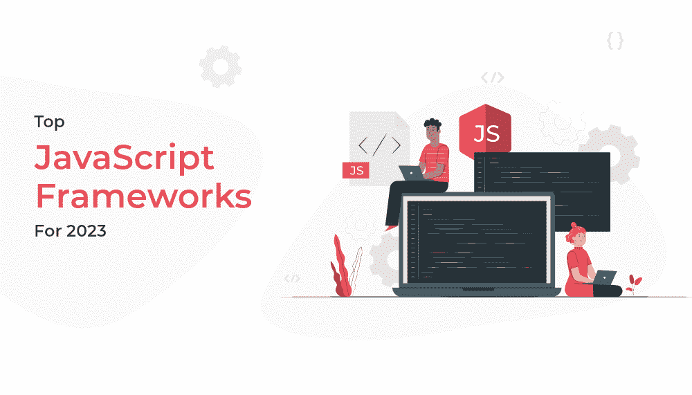
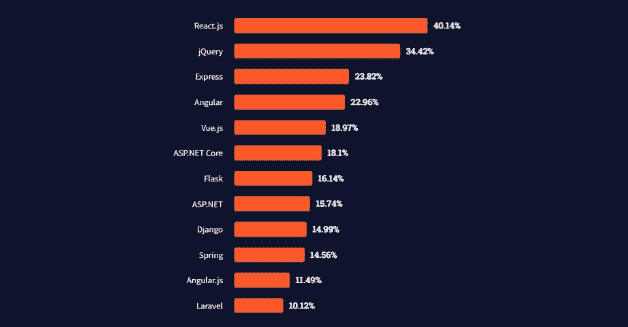
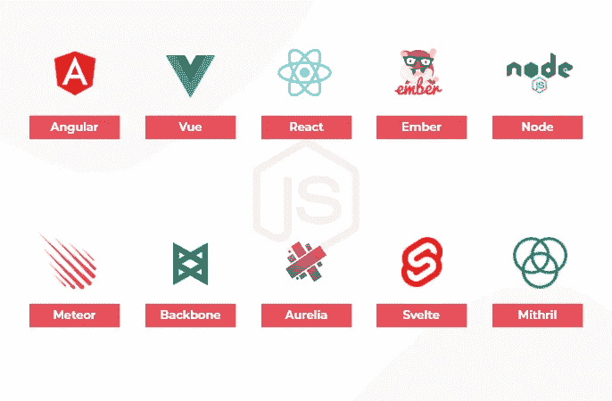

# 2023 年顶级 JavaScript 框架

> 原文：<https://javascript.plainenglish.io/top-javascript-frameworks-for-2023-c49d81aa6ebc?source=collection_archive---------5----------------------->

JavaScript Frameworks

JavaScript 是迄今为止世界上最流行的编程语言，它被用来创建交互式和动态的 web 体验，没有它是不可能的。

有许多框架可以帮助您充分利用 JavaScript 开发，但以下 10 个 JavaScript 框架是目前的精华。

React 最常被开发者用来创建顶级应用，其次是 jQuery 和 Express。

[Source](https://insights.stackoverflow.com/survey/2021#section-most-popular-technologies-web-frameworks)

您可以使用这些框架来构建新的应用程序和网站，或者向现有的网站和应用程序添加功能。

所以，让我们开始吧

# 什么是 JavaScript 框架？

JavaScript 框架是预先编写的代码和其他资源的集合，旨在支持应用程序，提供比基本 JavaScript 更高级的优势，并确保跨项目的一致性。

为了方便起见，它们通常被称为框架，因为它们在任何方面、形状或形式上都不像帐篷。

# 找出 2023 年的顶级 JavaScript 框架

JavaScript Frameworks For 2023

## 1.有角的

Angular 是最流行的 JavaScript 框架之一，它为单页面应用程序(SPA)开发提供了巨大的好处。它允许更容易的 DOM 操作，并且具有优秀的测试能力。

它简化了 DOM 操作，并提供了比其他库更好的性能。不过，这个库也有一些问题，包括潜在的性能问题。

## 特征

*   数据绑定
*   体系结构
*   速度和性能
*   依赖注入

## 2.vue . j

Vue 开发于 2014 年，它的创建与谷歌有着密切的联系。这种联系是因为 Vue 框架是由一位名叫尤雨溪的前谷歌员工设计的。

拥有许多与 Angular 和 React 框架相同的能力，Vue 仍然是轻量级和快速的，拥有从文档到教程的丰富资源库。

与其他框架相比，Vue 的组件更少，但由于其在处理复杂工作流方面的多功能性，它仍然具有开发人员所需的功能。

它不仅是一个优秀的前端工具包，也是一个优秀的后端工具包，因为它既可以作为服务器端渲染引擎，也可以通过 Vue-router 提供路由功能。

## 特征

*   组合 API
*   重用代码
*   多根组件

## 3.反应

React 是一个 JavaScript 库，可以用来创建 web 应用程序。它和许多其他库一样是免费和开源的，比如 AngularJS 和 jQuery 因此，它也可以在 GitHub 上免费访问。

React 框架是由脸书社区开发的，Jordan Walke 仍然被认为是它的原始作者。

React 既可以用来创建单页应用程序，也可以用来创建移动应用程序——据使用过它的人说，这是最容易使用的框架之一。

## 特征

*   单向数据绑定
*   虚拟 DOM
*   基于组件的体系结构
*   声明式用户界面

## 4.余烬

Ember 核心团队(由 Yehuda Katz 创建)于 2015 年创建了 Ember 框架。它很快成为一个受欢迎的免费开源项目——得到了世界各地成千上万开发者的支持。

由于具有双向数据绑定能力，许多人认为 Ember 在处理具有挑战性的 ui 时是值得信赖的。此外，有一些主要品牌，包括 LinkedIn、网飞和 Nordstrom，都使用 Ember。

## 特征

*   客户端渲染
*   URL 支持
*   高性能聚焦

## 5.节点. js

节点通常是服务器端的 JavaScript 运行时环境。它是免费的、开源的，可以跨平台运行。节点易于使用，具有高性能。

然而，尽管有这些品质，它在维护代码时也有它的缺点——由于它的复杂性。然而，即使存在这些缺陷，Node 还有许多其他方面值得一提，比如它的速度，这使它对在 web 浏览器之外运行 JS 很有吸引力。

这个框架有一个很大的社区，这意味着如果开发者需要任何帮助，可以获得大量的支持。你也可以在印度 [*雇佣 NodeJS 开发者*](https://www.quytech.com/hire-node-js-developers.php) 开发健壮的应用。

## 特征

*   高度可扩展
*   单线程的
*   事件驱动的
*   跨平台可扩展性

## 6.流星

由 Meteor Software 创建的这个 JavaScript 框架被赋予了一个合适的名字。该框架主要用于快速原型制作和制作跨平台代码。很容易理解，提供了很多便利。你不需要担心许可问题，因为它是免费的开源软件。

## 特征

*   用单一语言开发
*   实时应用程序开发
*   非常支持的社区

## 7.毅力

由 Jeremy Ashkenas 创建的 Backbone 是一个流行的免费开源框架，用于构建用户界面。它的主要优点是轻量级、快速、灵活和易于集成。

Backbone 是一个著名的 JavaScript 库，为 web 应用程序提供结构。因此，使用这些工具也可以创建单页应用程序。

这种方法最初只用于小项目时效果最好——除非你想找一些简单而没有深度的东西。Backbone 早已被正在构建客户端应用程序的初创公司和企业家所使用。它还有一个丰富的插件和扩展生态系统，可以很容易地在 GitHub 上找到。

## 特征

*   轻松的 API 集成
*   事件绑定
*   轻量级选手

## 8.蛹

虽然 Aurelia 框架一开始很难学，但它帮助我创建了更强大的网站。语法易于阅读，Aurelia 包含大量文档，这使得理解它如何工作变得更简单。

作为一个免费的开源框架——设计为一个现代前端框架——Aurelia 已经成为我的网站开发跨平台应用程序的优秀工具。

## 9.苗条的

Rich Harris 和 Svelte core 团队一起创建了这个免费的开源网络框架。由于它的框架，它的 JS 应用程序变得简单了；因此，开发快速且静态的 web 应用程序从未如此简单。

更重要的是，Svelte 最适合作为开发 web UI 组件的编译器。也就是说，它这样做根本不用担心 DOMs。

此外，它只需要更少的代码——这意味着节省了用其他不需要那么多细节的语言创建更多代码行所花费的宝贵时间。

## 10.秘银

Mithril 是一个 JavaScript 框架，它提供了一个简单的学习曲线，并且是轻量级的。它可能没有其他框架那么多特性，但是它仍然表现很好。Mithril 的用例有限，但它最适合单页应用程序开发。

## 特征

*   轻量级选手
*   粗野的
*   快的

# 总结一下！

既然我们已经讨论了顶级 Javascripts，您现在可以更好地理解如何根据您的业务需求使用任何框架。因此，在选择任何 javascript 框架之前，首先分析您的需求，以充分发挥它的潜力。你也可以 [*在印度*](https://www.quytech.com/hire-dedicated-developers.php) 雇佣开发人员来创建可扩展的应用程序，让你的业务更上一层楼。

> 另请阅读:[2023 年十大软件发展趋势](https://www.quytech.com/blog/software-development-trends/)

*更多内容请看*[***plain English . io***](https://plainenglish.io/)*。报名参加我们的* [***免费周报***](http://newsletter.plainenglish.io/) *。关注我们关于*[***Twitter***](https://twitter.com/inPlainEngHQ)[***LinkedIn***](https://www.linkedin.com/company/inplainenglish/)*[***YouTube***](https://www.youtube.com/channel/UCtipWUghju290NWcn8jhyAw)*[***不和***](https://discord.gg/GtDtUAvyhW) *。对增长黑客感兴趣？检查* [***电路***](https://circuit.ooo/) *。***