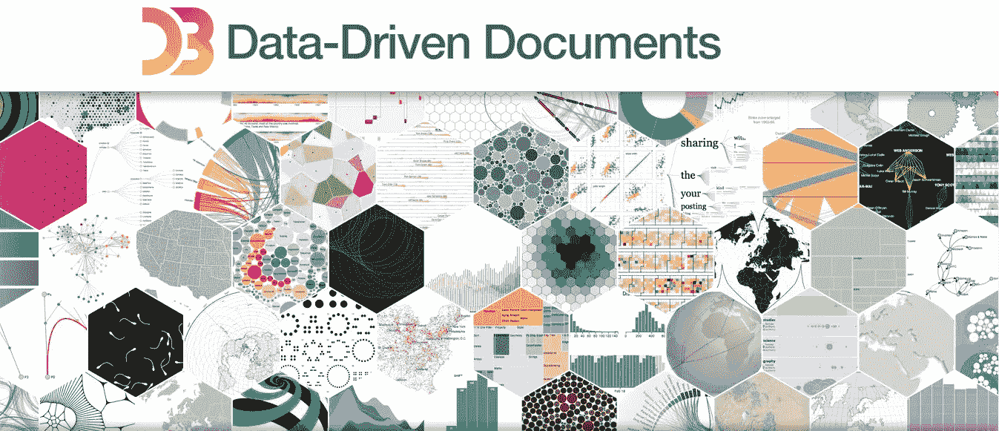
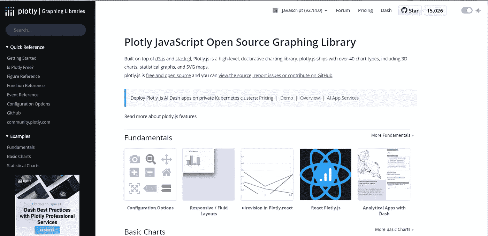
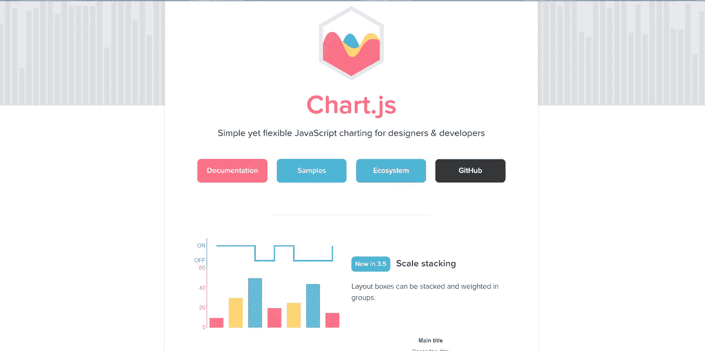
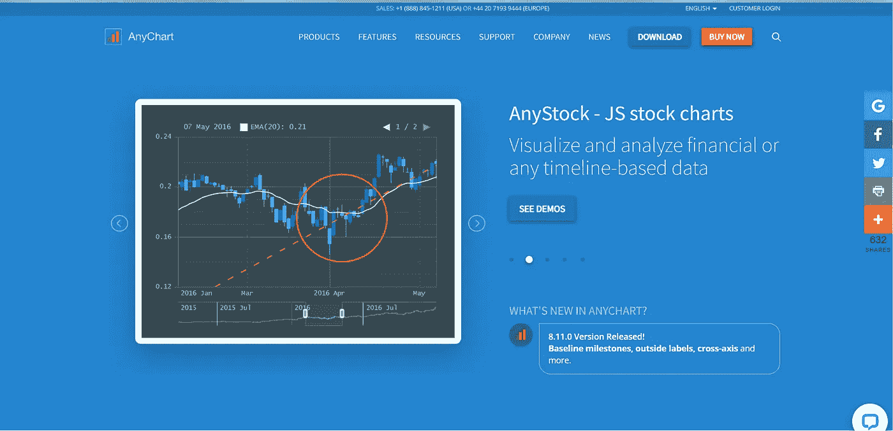
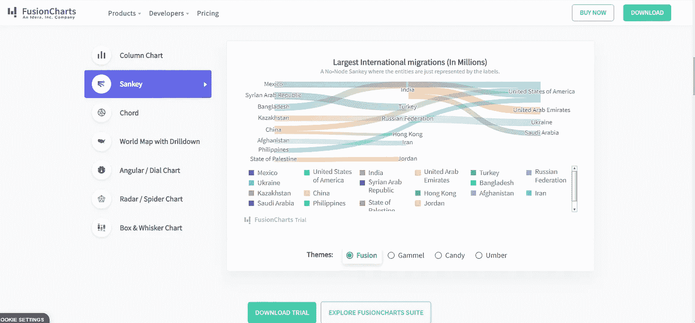
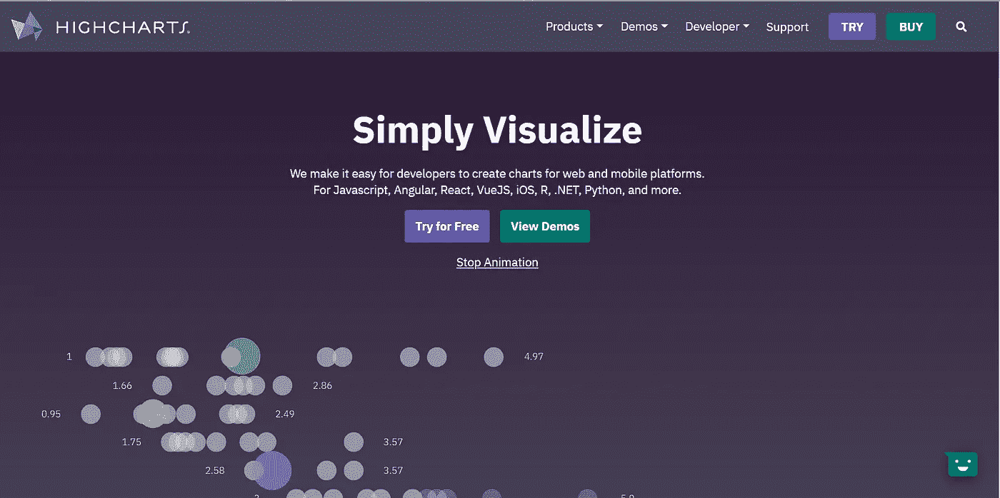
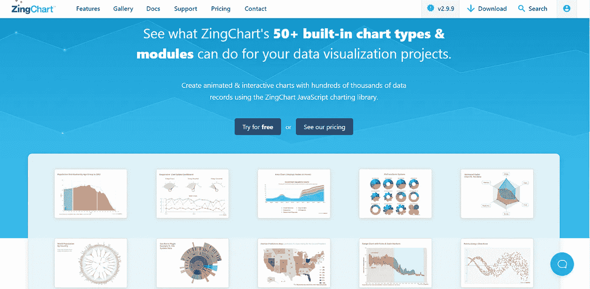

# 图表和图形的顶级 JavaScript 库

> 原文：<https://javascript.plainenglish.io/top-javascript-libraries-for-charts-and-graphs-946494761f9b?source=collection_archive---------8----------------------->

## 7 设计者和开发者应该使用的图表和图形的 JavaScript 库。

Photo by [Luke Chesser](https://unsplash.com/@lukechesser?utm_source=medium&utm_medium=referral) on [Unsplash](https://unsplash.com?utm_source=medium&utm_medium=referral)

全球数据消费正在稳步增长。2022 年，人类已经产生了 97 个 zettabytes。两年前，总数据量为 64 zettabytes。到 2025 年，it [预计](https://www.statista.com/statistics/871513/worldwide-data-created/)将飙升至 181 兆字节。人们很难处理和记忆如此丰富的信息。因此，数据可视化变得非常流行。将信息转换成图形、图表和仪表板简化了对信息的感知和理解。可视化也是前端开发的重要组成部分。让我们考虑七个用于图表和图形的 JavaScript 库。

每个 JavaScript 数据可视化库都有其独特之处。我们提供了十个最方便的程序的概述，这些程序可以解决几乎所有与转换信息相关的任务。它们将对[设计运营专家](https://andersenlab.com/blueprint/what-is-designops)当前和未来的项目有用。

# D3.js:数据驱动文档的完全自由

该库吸引了前端开发人员，因为它提供了数据可视化的完全自由。在其官方网站上，你可以找到样本，从传统的图表到复杂的地理定位元素(交互式地图)。当开发人员拥有 JSON、CSV、HTML、JavaScript 对象等格式的数据时，D3.js 将帮助可视化这些信息。

动态属性、进入和退出、强大的转换和其他特性使 D3.js 成为最强大的图表 JavaScript 库之一。该库支持许多图表类型(包括 Voronoi 图),但不提供现成的解决方案。开发人员检查样本，并找出如何在实践中实现一个想法。

学习如何使用 D3.js 需要时间，因为它有其特殊性。该软件包包括大约 30 个模块和 1000 多种方法。必要的教程在网上很容易找到。不要使用该库来处理旧版本的浏览器。从技术上讲，你可以做到这一点，但这很复杂。此外，还需要使用特殊的插件(例如 [aight](https://github.com/shawnbot/aight) )。

《纽约时报》、《优步》和《天气》已经在他们的网站上使用了 D3.js。

# Plotly.js:用于创建复杂科学图表的高级库

Plotly.js 的主要概要是创建无法在其他库中复制的复杂图表(三元图、热图、动画)。

Plotly.js 资源是有限的:它支持 20 种图表类型，并且它们被声明性地描述为 JSON 对象。该计划提供了许多现成的图表，可以出口到巴布亚新几内亚和 JPG。购买许可证后，可以导出到 EPS、SVG 和 PDF。

绘图主要是使用 SVG 绘制的，这保证了优秀的浏览器兼容性。3D 图表是用 WebGL 渲染的。如果您需要关于库功能的建议，请使用支持论坛。

# Chart.js:带有自定义图表的灵活库

Chart.js 允许您以八种方式可视化数据，从条形图和折线图到动画。图形可以被组合、定制和动画化。

要开始使用这个库，您需要在页面上包含一个脚本和一个节点来显示图表。Chart.js 支持现代浏览器，包括 IE11，所以不存在渲染性能问题。该库还可以完美地调整图形元素以适应设备窗口的大小(智能手机、平板电脑或 PC)。

Chart.js 有一个丰富的、记录良好的 API。它适合不需要大量信息图和附加设置的专家。对他们来说，简洁和信息丰富的可视化就足够了。

# AnyChart:成功可视化的现成数据库

AnyChart 是一个强大的交互式图表 JavaScript 库。它对于 web 平台、桌面和移动应用程序非常有用。它可以在任何平台和任何数据库上运行，并且可以在旧的浏览器上运行。

该库允许您创建 43 种类型的图表，从仪表板和折线图到雷达图和标签云。在 AnyChart 中，您可以使用 68 种现成的解决方案或创建自己的解决方案。创建的图像会被导入为 PDF、PNG、JPG 或 SVG 格式。

借助用户指南、JavaScript API 参考、AnyChart Playground 沙盒和带有详细解释的 Chartopedia，了解如何使用该库。博世、福特、三星、诺基亚、美国电话电报公司和其他公司都使用 AnyChart。

# FusionCharts:最古老和最完整的 JavaScript 数据可视化库

FusionCharts 已经存在了大约 20 年。[据官网](https://www.fusioncharts.com/)显示，来自 28000 家公司的 80 万开发者熟悉这个库。FusionCharts 是一个包含 100 多个图形和 2000 多个图表的存储库。它包含诸如直方图、树形图、饼图/甘特图/瀑布图等广泛使用的可视化方法。

图形使用 HTML5/SVG 和 VML 渲染，以兼容现代和传统浏览器(甚至 IE6)。创建的图形以 JPG、PNG、SVG 或 PDF 格式保存。图表适应不同的屏幕大小。如果你需要可视化方面的帮助，使用论坛、电子邮件和聊天。

来自 Atlassian、CISCO、Deloitte、脸书和其他大型组织的 IT 专家成功地使用了 FusionCharts。

# 高图表:个人和商业用途的动画图表

Highcharts 将网站和移动平台的数据可视化，并以股票和时间图、交互式地图、甘特图等形式呈现。图形元素是现成的，很容易定制到不同类型的设备。该库还提供了为图像添加注释的附加选项。

图表是在 HTML5 中构建的，并以 SVG (VML)呈现，因此它们可用于在标准和传统浏览器上运行的应用程序中可视化数据。图表在 IE6 和 IE11 中呈现。

创建的图表被导出为 PNG、JPG、PDF 或 SVG。当使用免费版本时，您可以在论坛和堆栈溢出上寻求帮助。购买许可证的商业用户通过电子邮件或 Skype 获得支持。BBC、Twitter、Visa、American Express 和其他公司都使用 Highcharts。

# ZingChart:数千条数据记录的动画视图

ZingChart 库使用 50 种内置图表类型和模块帮助您可视化信息。一组丰富的示例包括机器仪表板、雷达图、带有材料颜色的和弦图以及其他不常见的数据实现形式。如果有必要，您可以混合它们，以 3D 形式呈现它们，并添加动画。

图表是在 Ajax、JSON 和 HTML5 的帮助下创建的。渲染 100，000 个数据点用时不到一秒。该库还提供了与数据交互的工具(值框、工具提示、十字光标、缩放、滚动等)。它兼容所有浏览器。

辛查特已经跑了 14 年了。它吸引了来自威瑞森、沃尔玛、Adobe、艾默生和其他品牌的设计工程师。

# 结论

上面提到的用于图表和图形的 JavaScript 库各有优缺点。尝试与它们中的每一个一起工作，以便比较结果并选择一个合适的。通常，库的选择很大程度上取决于软件开发项目的需求。如果想要简单的图形，Charts.js 就可以了。Plotly.js 更适合复杂的科学数据。无论如何，最好的库是能更有效地解决特定问题的库。

*更内容于* [***普通英语***](https://plainenglish.io/) *。报名参加我们的* [***免费周报***](http://newsletter.plainenglish.io/) *。在*[***Twitter***](https://twitter.com/inPlainEngHQ)[***LinkedIn***](https://www.linkedin.com/company/inplainenglish/)*[***YouTube***](https://www.youtube.com/channel/UCtipWUghju290NWcn8jhyAw)*以及*[**T42 不和**](https://discord.gg/GtDtUAvyhW) *上跟随我们。对增长黑客感兴趣？查看* [***电路***](https://circuit.ooo/) *。**