# 让你成为超级英雄的顶级 JavaScript 一行程序

> 原文：<https://javascript.plainenglish.io/top-javascript-one-liners-will-make-you-a-superhero-af1363083354?source=collection_archive---------4----------------------->

## 你会用你的超级英雄编码技能给你的朋友和同事留下深刻印象。

Created by Kliton with Dalle-E-2 AI

JavaScript 一行程序基本上是一种编写 JS 语句的简洁方式，只需一行代码就能完成特定的任务。虽然听起来没什么，但请相信我，这些小代码片段可以产生巨大的冲击力。

# 从数组中获取唯一元素

如果你需要得到一个没有重复的数组，你可以使用这个简单的方法。

基本上，我们从数组开始创建一个集合，然后用 spread 运算符转换数组中的集合。

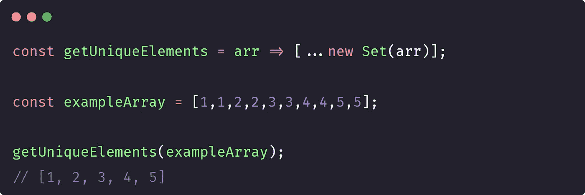

# 获取随机布尔值

这个函数将以 50%的概率返回 true 或 false。

为了实现这一点，我们使用 Math.random 创建一个介于 0 和 1 之间的随机数，然后我们检查是高于还是低于 0.5。

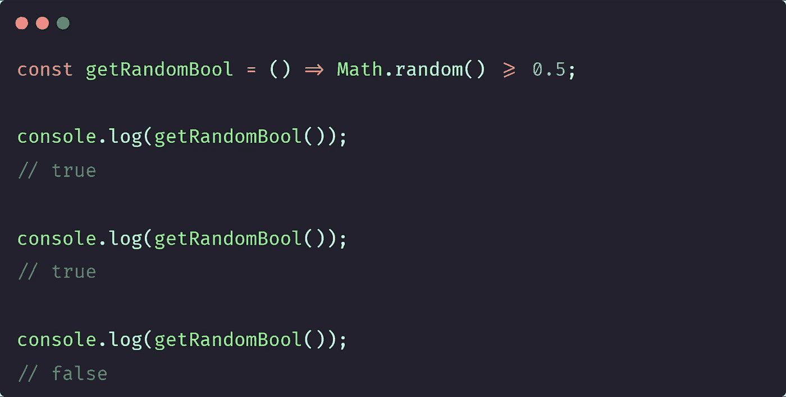

# 在两个数之间生成一个随机数

该函数将在提供的最小值和最大值之间生成一个随机数。

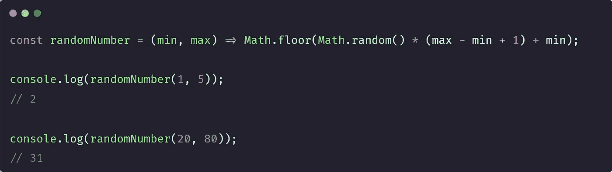

# 交换两个变量

你知道吗，你可以交换两个变量，而不需要第三个变量作为交换的`temp`值持有者，而且只需要一行就可以了。😃

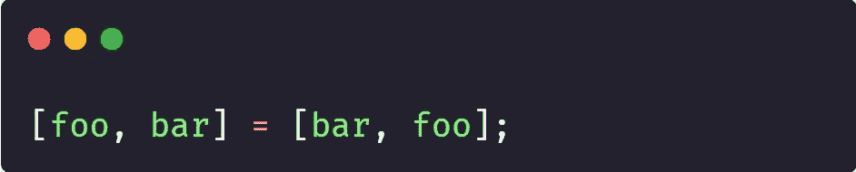

# 滚动到顶部

使用`scrollTo(x,y)` javascript 功能，您可以滚动到所需的坐标。

顶部坐标为(0，0)。

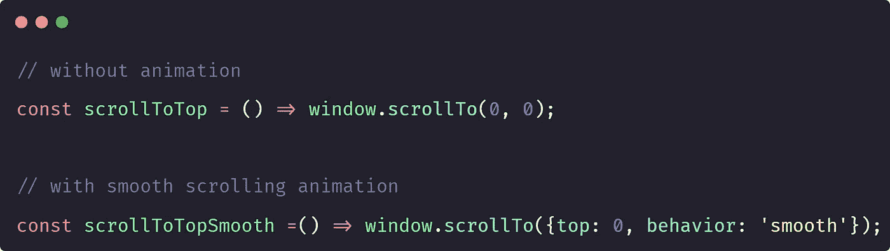

# 平均函数

我们使用 javascript 的 Array.prototype.reduce()函数创建一个 getAverage 函数。

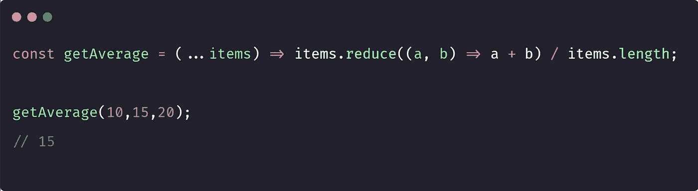

# 计算字符串中的字符数

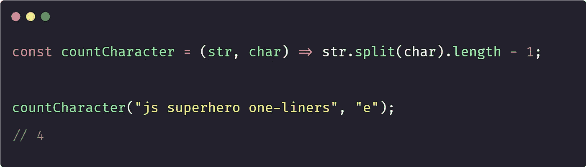

# 获取网页上的选定文本

我们可以使用浏览器的内置方法来获取网页上的选定文本。

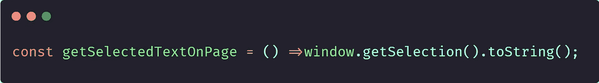

# 克隆阵列

我们可以通过多种方式克隆阵列，以下是我最喜欢的两种方式

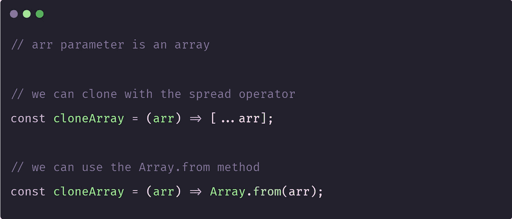

# 计算数组中某个值的出现次数

我们可以使用 array.filter 方法计算数组中某个值的出现次数。

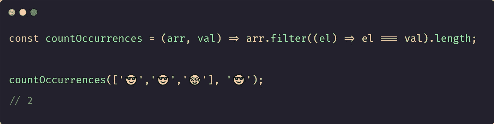

# 检查一个字符串是否是回文

如果从左到右读取的**字符串**等于从右到左读取的**字符串**，则称一个**字符串**为**回文**。

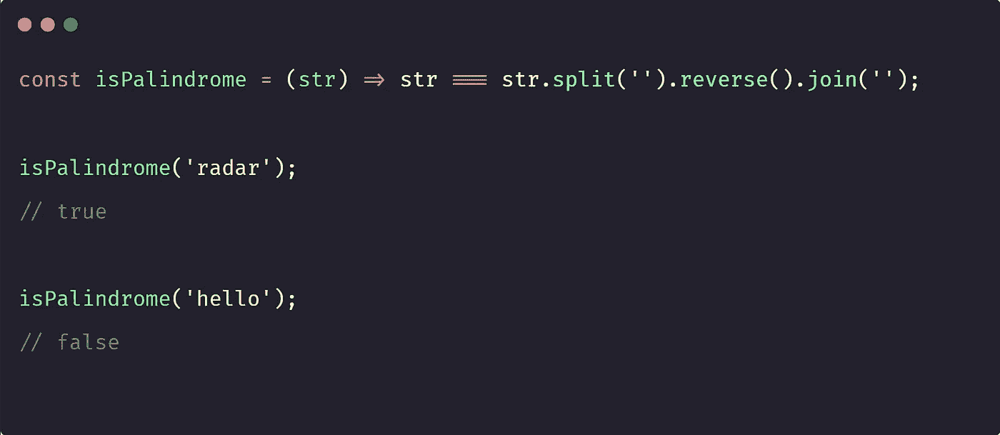

# 生成随机的十六进制颜色

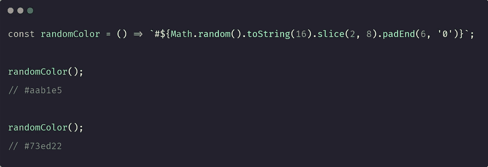

# 将字符串大写

如果你不想使用 CSS 来区分字符串的大小写，你可以使用这个一行程序

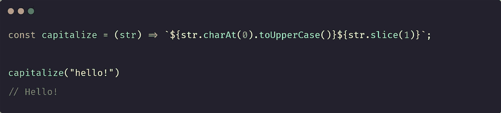

# 就是这样！

一行程序可能不会让你成为真正的超级英雄，但绝对会让你成为 JavaScript 巨星。

因此，走出去，开始写一些代码，将扭转乾坤！😎

*更多内容请看*[***plain English . io***](https://plainenglish.io/)*。报名参加我们的* [***免费周报***](http://newsletter.plainenglish.io/) *。关注我们关于*[***Twitter***](https://twitter.com/inPlainEngHQ)[***LinkedIn***](https://www.linkedin.com/company/inplainenglish/)*[***YouTube***](https://www.youtube.com/channel/UCtipWUghju290NWcn8jhyAw)***，以及****[***不和***](https://discord.gg/GtDtUAvyhW) **