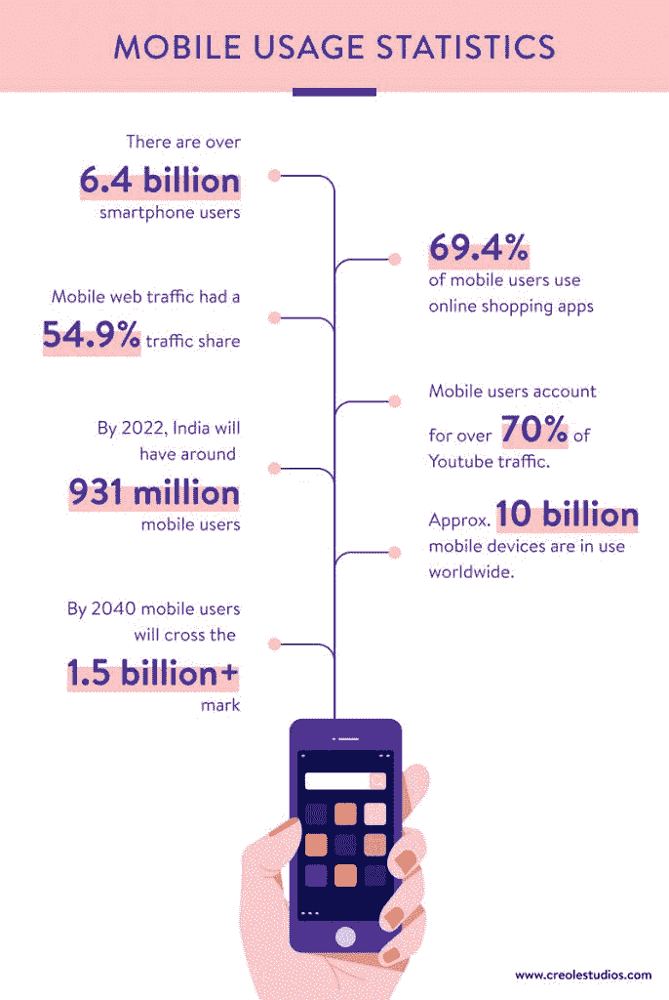
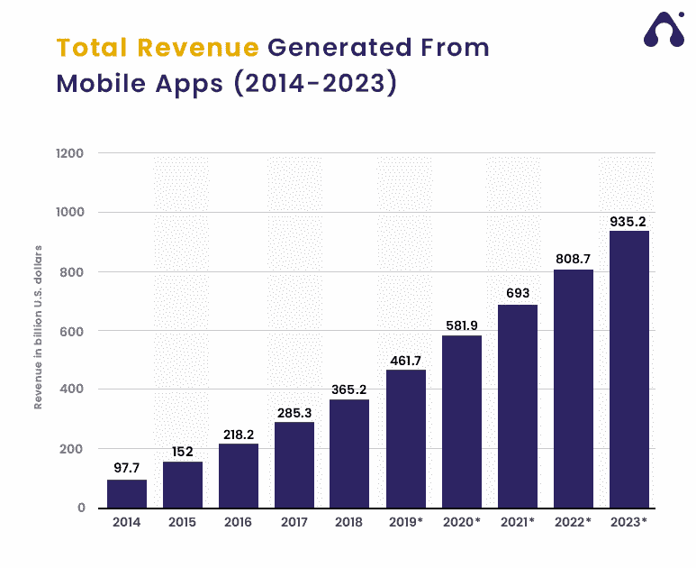

# 2022 年你不能错过的顶级移动应用开发框架

> 原文：<https://javascript.plainenglish.io/top-mobile-app-development-frameworks-that-you-cant-miss-out-on-in-2022-ed9d2d3b7a7e?source=collection_archive---------5----------------------->

智能手机正迅速成为每个人的内容消费和交流平台，使移动应用成为企业跟上消费趋势不可或缺的一部分。请看一些统计数据:

**Credit: Creolestudos**

因此，现在许多企业家希望拥有自己的商业应用程序，以获得最大的投资回报。看看移动应用产生的总收入:

**Credit: appventurez**

对于移动应用程序开发来说，使用正确的框架可能意味着成功与失败的区别。这些框架用于构建各种移动设备(包括平板电脑和智能手机)上可用的软件应用和产品。

它们允许你用相同的编程语言创建移动应用，而不是每次你想为不同的平台(Android，iOS 等)创建应用时都必须学习新的语言。).

本文概述了 8 大移动应用程序开发框架，并概述了它们的独特之处。

**Source: Statista**

阅读完本文后，您将获得决定哪个框架最适合您的下一个移动应用程序项目所需的所有信息。

## **1。颤动**

Flutter 是 Google 推出的一个新的移动开发框架，正在迅速流行起来。它结合使用 Dart 和 OpenGL 来创建快速、高质量的应用程序。如果你想用一个代码库开发一个跨平台的应用，那么 Flutter 是一个很好的选择。

该框架使用 Dart 作为其编程语言，并提供创建高质量 iOS 和 Android 应用程序所需的一切。你可以在印度雇佣 Flutter 开发者，因为你可以以合理的价格雇佣到经验丰富的开发者。

> **颤振的一些主要优点是:**

*   Flutter 的主要好处之一是它能够创建跨平台的应用程序，这意味着你可以创建在 Android 和 iOS 设备上都能工作的应用程序。
*   **热重新加载**:这个特性允许你修改你的代码，并立即在你的仿真器或设备上看到结果。
*   **丰富的小部件集合** : Flutter 附带了一组丰富的材质设计和 Cupertino (iOS)小部件，让你的应用程序具有专业的外观和感觉。
*   **快速开发**:借助 Flutter 的热重装功能，你可以快速迭代你的想法。

## **2。反应原生**

脸书开发了 React Native，作为用 Javascript 为 Android 和 iOS 创建原生应用的一种方式，使用 React 作为其视图层。与 Xamarin 需要学习一门新语言(C#)不同，React Native 更能媲美 PhoneGap/Cordova。

使用 React Native，您可以仅使用 JavaScript 构建本机应用程序。这项技术起初可能有点难以理解，但确实令人印象深刻。React Native 负责你的应用程序的大部分代码，甚至是像 GPS 定位和传感器读数这样的事情。

您将在程序中使用 HTML 标记来设计用户界面，其行为与本地应用程序完全一样。对于希望快速构建 MVP 的初创公司或希望比 Swift 或 Objective-C 更简单的开发人员来说，这是一个很好的解决方案。

此外，如果你需要从头开始的帮助，React Native 将与现有的 iOS 和 Android 代码一起工作。如果你想拥有安全且可扩展的应用，你可以 [**雇佣 react 本地开发者**](https://www.appsdevpro.com/hire-developers/hire-react-native-developers.html) 。

> **React Native 的一些主要好处有:**

*   有了 React Native，你只需使用一种技术就可以为 iOS 和 Android 创建应用。如果您需要对代码进行更新或修复，这将消除许多不必要的工作，因为您只需在一个地方更新它。
*   如果你有一个现有的业务和现有的代码库，使用 React Native 可能是一种不用从头开始就进入移动领域的方法。
*   React Native 是一个 JavaScript 库，因此它具有 JavaScript 的易用性、灵活性和强大功能。
*   它允许你编写一次逻辑，然后在 iOS 或 Android 应用程序中运行，而无需做任何更改，这意味着开发人员的维护时间更少。

## **3。科尔多瓦**

Cordova 是一个移动开发框架，使您能够使用 HTML、CSS 和 JavaScript 创建跨平台的移动应用程序。Cordova 最初由 Adobe Systems 创建，然后捐赠给一个开源基金会，它允许开发人员使用基于 web 的语言(如 HTML5、CSS3 和 JavaScript)编写应用程序。

然后可以使用 Cordova 的跨平台工具集将代码编译成不同平台的本机应用程序，如 Android、iOS 和 Windows Phone。因为每个平台都有自己的编程语言，所以用 JavaScript 编写代码大大简化了代码创建，因为它允许开发人员在多个平台上使用他们现有的 JavaScript 知识，而不必为每个平台学习其他语言。

> **科尔多瓦的一些主要优点是:**

*   **跨** - **平台**:有了 Cordova，你可以创建在 Android 和 iOS 设备上都能工作的应用。
*   开源:Cordova 是一个开源项目，这意味着你可以接触到一个大型的开发者社区，他们可以帮助你完成你的项目。
*   **易于使用** : Cordova 易于使用，并且有很多可用的文档。
*   大型社区:Cordova 有一个大型的开发者社区，他们可以帮助你完成你的项目。
*   强大的功能 : Cordova 有很多功能，比如地理定位、摄像头接入等等。

## **4。离子型**

随着 Ionic 6 的发布，Ionic 框架变得更加强大和易于使用。如果你正在寻找一种简单的方法来用一个代码库创建高质量的移动应用，那么 Ionic 框架是一个很好的选择。

Ionic 框架是一个流行的开源框架，使你能够用 HTML、CSS 和 JavaScript 创建跨平台的移动应用。它被许多大公司使用，如沃尔玛、NBC 和其他公司。

> **使用 Ionic 框架的一些主要好处是:**

*   **跨** - **平台**:你可以用 Ionic 框架创建在 Android 和 iOS 设备上都能工作的应用。
*   易于使用:Ionic 框架易于使用，网上有很多文档。
*   大型社区:有一个大型的开发者社区，如果你需要帮助，他们可以帮助你完成你的项目。
*   如果你正在寻找一种简单的方法来用一个代码库创建高质量的移动应用，那么 Ionic 框架是一个很好的选择！

## **5。Xamarin**

Xamarin 使您能够用 C#创建跨平台的移动应用程序。它由微软创建，被许多大公司使用，如可口可乐和亚马逊。微软在简化 Xamarin 工具的使用方面做得非常好——下载 Visual Studio Community Edition 是免费的。

它允许用户访问大多数企业客户需要的基本功能。它还配备了 Xamarin 测试云，允许开发人员在 45 个国家的数千台设备上运行自动化测试。

如果您希望创建一个本机应用程序，即一个使用设备操作系统特性和功能的应用程序，Xamarin 是一个很好的选择。当你 [**雇佣 Xamarin 开发者**](https://www.appsdevpro.com/hire-developers/hire-xamarin-developers.html) 时，你需要确保他们了解这个高级工具的所有特性，这样你就能根据自己的需求获得最好的应用。

> **Xamarin 的一些主要益处是:**

*   **跨** - **平台**:你可以用 Xamarin 创建在 Android 和 iOS 设备上都可以工作的应用。
*   **原生性能** : Xamarin 应用在 Android 和 iOS 设备上都有接近原生的性能和外观。
*   **强大的功能** : Xamarin 具有广泛的功能，如地理定位、摄像头接入等。

## 6。统一

Unity 是一个移动开发框架，可以让你用 C#创建 2D 和 3D 游戏。它由 Unity Technologies 创建，被许多大公司使用，如可口可乐、福特和亚马逊。如果你想创建一个 3D 游戏——一个使用 3D 图形和动画的应用程序，Unity 是一个很好的选择。

像纪念碑谷 2，Flappy Bird 和 Pokemon Go 这样的多平台游戏都是用 Unity 创作的。它也被用于一些当今最成功的增强现实(AR)应用程序中。

> **Unity 的一些主要优势有:**

*   **跨** - **平台**:你可以用 Unity 创建在 Android 和 iOS 设备上都能工作的应用。
*   原生性能 : Unity 应用在 Android 和 iOS 设备上都有接近原生的性能和外观。
*   **强大的功能** : Unity 具有广泛的功能，如地理定位、摄像头接入等。

## **7。原生脚本**

NativeScript 使您能够使用 JavaScript 和 TypeScript 创建跨平台的移动应用程序。它由 Telerik 创建，被许多大公司使用。NativeScript 支持 iOS、Android 和 Windows phone，另外还支持各种不同的模块，包括 AngularJS 和 Apache Cordova(PhoneGap 背后的核心技术)。

NativeScript 最好的一点是它的熟悉性；它使用开发人员已经知道的概念来帮助他们更快地掌握这门语言。如果你想创建一个真正的原生应用程序，NativeScript 是一个很好的选择，这种应用程序具有原生应用程序的所有功能，但具有跨平台的额外优势。

> **native script 的一些主要优势有:**

*   **跨** - **平台**:你可以用 NativeScript 创建在 Android 和 iOS 设备上都可以工作的应用。
*   **易于使用** : NativeScript 易于使用，网上有很多文档。
*   大型社区:有一个大型的开发者社区，如果你需要帮助，他们可以帮助你完成你的项目。

## 8。Phonegap

Phonegap 让你可以用 HTML、CSS 和 JavaScript 创建跨平台的移动应用。它由 Nitobi 创建，被许多大公司使用，如可口可乐、福特和亚马逊。如果你想创建一个跨平台的应用程序——一个可以在 Android 和 iOS 设备上运行的应用程序，Phonegap 是一个不错的选择。

它利用了原生功能，所以你的应用看起来和感觉上就像其他的原生应用一样。您还可以通过代码或插件来定位平台中的特定功能。

> **Phonegap 的一些主要优势有:**

*   **跨** - **平台**:你可以用 Phonegap 创建在 Android 和 iOS 设备上都可以工作的应用。
*   **易于使用** : Phonegap 易于使用，网上有很多文档。
*   大型社区:有一个大型的开发者社区，如果你需要帮助，他们可以帮助你完成你的项目。
*   轻而易举地创建一个应用程序——非常适合新手！

# **结论**

移动应用不仅仅是一种趋势，它们会一直存在。这个世界已经移动化，所有年龄段的用户都可以在旅途中查看他们的智能手机。对于寻求适应的企业主来说，拥有一个移动的存在是必不可少的。如果你不能在正确的时间和正确的地点接触到你的目标受众，那么你可能会错过潜在的销售机会。因此，如果你正在考虑为你的企业开发一个应用程序，但不知道从哪里开始，请查看我们的最佳框架综合列表。

毫无疑问，应用程序开发人员不仅在塑造商业成功方面，而且在塑造行业未来方面都发挥着至关重要的作用。为了 [**雇佣移动应用开发者**](https://www.appsdevpro.com/hire-developers/hire-mobile-app-developers.html) 在印度，一家企业必须与几家外包机构密切合作，这些外包机构通常为 Android 和 iOS 移动应用提供应用开发者。

开发人员可以按小时、周或月受雇，以便在指定的时限内完成项目。如果你打算创业或开发一款能吸引目标受众的应用，选择正确的技术平台非常重要，这将允许用户与他们需要的内容进行互动。上面提到的平台列表包括了这两个方面，并在这个过程中带来了数字化的好处。

*更多内容看* [***说白了就是 io***](https://plainenglish.io/) *。报名参加我们的* [***免费周报***](http://newsletter.plainenglish.io/) *。关注我们关于*[***Twitter***](https://twitter.com/inPlainEngHQ)*和*[***LinkedIn***](https://www.linkedin.com/company/inplainenglish/)*。查看我们的* [***社区不和谐***](https://discord.gg/GtDtUAvyhW) *加入我们的* [***人才集体***](https://inplainenglish.pallet.com/talent/welcome) *。*