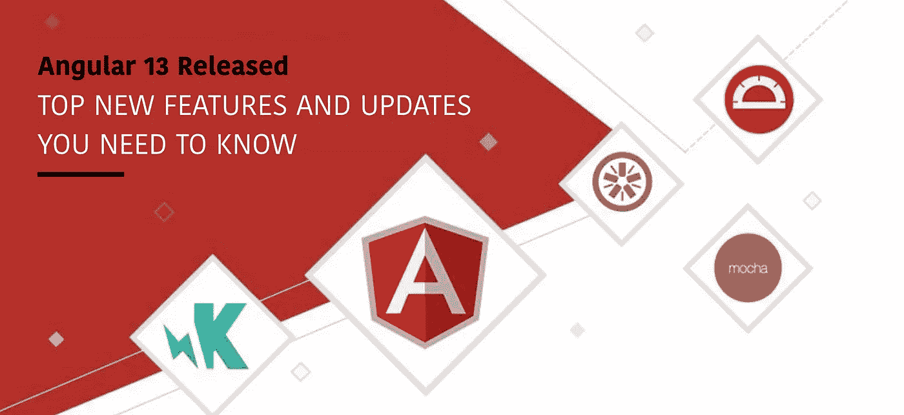

# 你需要知道的 Angular 13 的新功能和更新

> 原文：<https://javascript.plainenglish.io/top-new-features-and-updates-of-angular-13-that-you-need-to-know-7e5b9f56a821?source=collection_archive---------3----------------------->

## Angular 13 使开发强大和有吸引力的应用程序比以前更容易。

Angular 推出的新版本是 Angular 13。你可以意识到这是一个有效规划的版本，因为为了方便开发者，可以看到许多新的特性和改进的功能。

Angular 13 发布日期为 2021 年 11 月 3 日。Angular 的全新版本提供了许多有用的特性来加速开发过程。我们作为一家[Angular development company](https://www.technource.com/angularjs-web-app-development-company/)在下面的部分向您展示一些重要的特性。看看这个全新的版本，更新你的应用。

# Angular 13 中的主要新功能和更新

谷歌流行框架的最新更新现在在这里。因此，看看最精简和以前计划的 Angular 版本 13 的功能，现在更轻松地开发一个迷人和强大的应用程序。

# 简化的 API

在以前的版本中，缺少为开发人员创建代码的样板文件。但是，Angular 13 允许开发人员在其 Ivy 的帮助下动态编写代码。早先，开发人员必须将 ComponentFactoryResolver 注入到构造函数中来开发一个组件。但是现在，您不必为开发组件创建关联的工厂。您可以使用 viewcontainerref . create component 执行相同的操作。

# 角包格式的变化

APF(角度包格式)定义了角度框架包的格式和结构。这是一种在 web 开发生态系统中有效打包所有第三方库的有用方法。此外，新版 APF 带来了显著的变化。UMD 捆绑包已经停产了。APF 使用来自节点 JS 的子路径模式特性来利用包导出。因此，它在每个入口点显示几个可用的输出。

# 组件改进

Angular 13 在部件方面有许多改进。您可以找到更好的 ARIA 描述、更大的触摸目标尺寸、默认的表角色、滑块的强焦点选项、步进器更新和图标按钮的高对比度样式按钮。此外，Angular 开发人员可以使用假的鼠标按下事件。因此，无论何时屏幕上发生焦点和点击事件，应用程序都会在 v13 中正确地解释它们。这是 Angular 13 对开发人员很有帮助的特性之一。

# 100%常春藤

Angular 13 移除了视图引擎，因此 100% Ivy 是 Angular 13 的新功能之一。因此，在这个平台上可以实现更快的编译和更高的生产率。它为更多的优化和改进打开了大门。现在，开发人员可以确保动态组件的质量改进。

# CLI 中的新功能

CLI 是 Angular 最新版本的重要改进。它有助于标准化处理现代网络生态系统中出现的复杂性的过程。此外，CLI 大规模地最小化了这些复杂性。开发过程加快了，因为 Angular 13 框架将内置缓存作为默认特性。因此，你可以[雇佣 AngularJS 开发人员](https://www.technource.com/hire-angular-js-developer/)来快速开发你的项目。

# Internet Explorer 11 支持结束

您可以享受本地 web APIs 的好处和现代浏览器的功能，如 web 动画、Angular framework 和 CSS 变量，因为现在 Angular framework 已经删除了 IE 11 支持。因此，它允许更快的加载和更小的应用包大小。此外，用户体验得到改善，因为不需要独特的加载。对于仍在使用 internet explorer 11 的公司来说，这是一条至关重要的信息。

# 本地化方面的改进

有两个概念，一个是国际化，一个是本土化。国际化有时被称为 i18，这是一个为世界各地的人设计和准备项目的过程。本地化包括提取要翻译成不同语言的文本，以及针对特定地区格式化数据。在 Angular 13 新组件中，您可以看到本地化方面的改进。

# TypeScript 4.4 支持

Angular 不支持 TypeScript 4.2 和 4.3，但是 Angular 13 支持 TypeScript 4.4。这一改变对角度编码者很有帮助，因为他们可以保持代码的整洁和安全。一些变化是控制流分析、JavaScript 的拼写建议、作为索引签名的符号、类静态块、嵌入提示和精确的可选属性类型。更多的更新是 IntelliSense 改进、改进的类型保护检测以及默认为未知类型的 catch 变量。

# 框架和依赖关系更新

RxJS 7.4 是 Angular 13 中使用 ng new 构建的应用的默认版本。现有版本使用的是 RxJS v6.x，这些应用程序必须使用 npm install rxjs07.4 命令手动更新。此外，对 TypeScript 4.4 的支持也有助于依赖项的更新。Angular 开发人员可以期待更少的内存消耗、更少的相互依赖、更快、更优化的测试。

# 人体工程学 API

符合人体工程学的代码分割 API 和组件级的无粒度代码中断有助于改善 Angular 13 中的加载时间。您可以看到新版本的 ESBuild 带来的性能提升。它是一个非常快速的 JavaScript 包，与 Terser 一起优化全球脚本。而且，ESBuild 支持 CSS 源码图。此外，这个捆绑器支持其他语言，如 Vue，Svelte，和 EIM。

# 对 Adobe 字体的内嵌支持

以前，Angular 11 引入了对内嵌谷歌字体的支持，现在 Angular 13 正在扩展对 Adobe 字体的支持。借助内联字体，您可以提高应用程序的性能。改善 FCP(第一个内容丰富的油漆)。此外，对路由器的改进有助于避免替换浏览器 URL。

所以，如果你正在寻找什么是 Angular 的最新版本，这些要点将帮助你。让我们继续前进，知道如何更新 Angular 13。

# 如何更新新的 Angular 版本 13？

如果你想在新的 Angular 版本 13 中更新你的应用，你需要下载 Angular 12。现在按照指南在新的 Angular 版本 13 中更新您现有的应用程序。

# 包扎

现在你知道 Angular 13 中的重大更新和功能，所以你可以使用它们在短时间内构建一个令人印象深刻的应用程序。此外，您可以获得一个支持现代应用程序开发标准的应用程序，以吸引更多的流量到您的应用程序。联系一家 [JavaScript 开发公司](https://www.technource.com/javascript-development-company/)了解更多。

*更多内容看**[***说白了. io***](https://plainenglish.io/) *。报名参加我们的* [***免费周报***](http://newsletter.plainenglish.io/) *。关注我们关于*[***Twitter***](https://twitter.com/inPlainEngHQ)*和*[***LinkedIn***](https://www.linkedin.com/company/inplainenglish/)*。加入我们的* [***社区***](https://discord.gg/GtDtUAvyhW) *。**