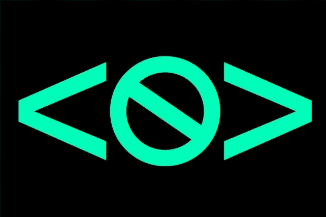

# 2023 年顶级无代码开发工具

> 原文：<https://javascript.plainenglish.io/top-no-code-development-tools-in-2022-fc179633682c?source=collection_archive---------0----------------------->

## 假设您正在创建一个应用程序，但是没有所需的编程专业知识。不用担心；在这里，您将了解一些最好的无代码开发工具。

By [Craig S. Smith](https://www.nytimes.com/by/craig-s-smith)

# 什么是无代码？

特别是，无代码工具是不需要编码，而是使用 GUI(图形用户界面)工具的编程风格和方法。

这句话表明，无代码工具并不依赖于用户的技能和专业知识来运行，而是采用更直接的方法来提高生产率。

操作无代码工具所需要做的就是点击、滚动和拖放。您可以使用无代码工具来创建您想要的任何东西。

# 面向开发人员的无代码

有很多种无代码工具，但无代码并不专注于某个特定的行业或工作领域。

所有非代码工具都有其用途，不管它们用在哪个领域。

无代码工具的类型如下:

*   应用程序/网站建设
*   入职/互动指南
*   声音
*   项目管理
*   营销
*   自动化
*   分析学
*   客户服务

# [网络流量](https://webflow.com/)

Webflow 是一个基于浏览器的可视化编辑工具，允许设计人员创建响应性网站。

有了 Webflow，定制一个网站就像拖动和点击一样简单，但又像编码一样容易控制。

您可以从头开始创建一个定制的响应网站，或者如果您喜欢节省时间，可以使用模板。

**定价:**0 美元起

# [扎皮尔](https://zapier.com/)

使用 Zapier，您可以将两个或多个应用程序链接在一起，无需编写一行代码就可以自动执行重复的任务。

Zapier 可以在事件发生时通知另一个应用程序，该应用程序可以执行特定的操作。

Zapier 提供了 2000 多个应用程序，如 Google Suite、Slack、Twitter 和 Gmail，创造了无缝体验。

**定价:**0 美元起

# [Bubble.io](https://bubble.io/)

使用 Bubble.io 强大的内部工具，您可以在几个小时内开发并发布整个 web 应用程序。

它既实用又简单。让你编辑主页的功能，使这个产品很酷，展示了创建和修改一个网站是多么简单。

**定价:**0 美元起

# [预览](https://previewed.app/)

开发人员和设计人员可以使用预览创建令人惊叹的应用营销视觉效果。

从广泛的模板中选择，在几分钟内定制它们，并下载您的精确像素设计。

**定价:**0 美元起

# [购物化](https://www.shopify.in/)

Shopify 允许任何人开设网上商店并出售他们的商品。Shopify 的销售点提供多种功能，帮助您直接向客户销售产品。

设置一个 Shopify 商店很简单，不需要任何编程知识就可以完成。

**定价:**29 美元起

# [充气台](https://www.airtable.com/)

Airtable 是一个数据库程序，也是一个在线协作工具。在您因为数据库这个词而认为它很无聊之前，请记住，Airtable 很简单，而且非常多样化。

你可以利用它来管理工作，记录和组织库存，计划一个仪式，等等。

**定价:**0 美元起

# [扩展。开发](https://extension.dev/)

您可以使用 Extension-dev 的低代码平台创建和发布浏览器扩展。

它们提供了一个示例扩展和模板库，可以让您立即入门，也可以从头开始。

**定价:**0 美元起

# [NoCodeAPI](https://nocodeapi.com/)

NoCodeAPI 让您可以设置 50 多个应用程序，包括 Google Sheets、Airtable、Google Analytics、Twitter、Telegram、Open Graph API、MailChimp 等，无需后端，从而节省您的时间和金钱。

**定价:**0 美元起

# [尾巴](https://devdojo.com/tails)

Tails 是一个 Tailwindcss 专用的页面生成器，有 220 多个组件用于增强您的内容。

这是创建一个华丽的登录页面的最佳选择。您可以组合和匹配 120 多个设计模块来开发完美的登录页面。

**定价:**0 美元起

# 结论

毫无疑问，无代码技术正在改变商业、工作、技术，甚至生活。

您可以通过查看这个列表并以不同的方式使用它们来利用这些工具。

**你可能也会喜欢这个**

 [## 2023 年每个开发者都必须知道的 8 个开源开发工具

### 在你的软件开发之旅中，你应该使用 8 种工具

medium.com](https://medium.com/the-modern-scientist/8-open-source-development-tools-every-developer-must-know-ce14e2762148)  [## 2023 年新手的 5 大编程语言

### 您选择的编程语言应该与您的技能相匹配

javascript.plainenglish.io](/the-top-5-practical-programming-languages-for-newbies-in-2023-983b10efc79e)  [## Web 开发人员的 9 个必备备忘单

### 作为开发人员，我们使用过许多语言，记住它们的所有方面是不可能的。拥有 MDN…

medium.com](https://medium.com/@cannon_circuit/10-must-have-cheat-sheets-for-web-developers-810c2afa1206) 

我希望你觉得读起来很有趣。如果你愿意支持我当作家，可以考虑报名参加 [**成为**](https://medium.com/@cannon_circuit/membership) **的中等会员。每月只需 5 美元，因为你可以无限制地使用 Medium。**

加入 4000 多名读者的行列，踏上成为无所不包的终身软件工程师和经理的旅程。今天开始免费阅读[**Codestar**](https://codestar.substack.com/)。 [🧑‍💻](https://emojipedia.org/technologist/)

*更多内容看* [***说白了就是 io***](https://plainenglish.io/) *。报名参加我们的* [***免费周报***](http://newsletter.plainenglish.io/) *。关注我们关于* [***推特***](https://twitter.com/inPlainEngHQ) ， [***领英***](https://www.linkedin.com/company/inplainenglish/) *，*[***YouTube***](https://www.youtube.com/channel/UCtipWUghju290NWcn8jhyAw)*[***不和***](https://discord.gg/GtDtUAvyhW) *。对增长黑客感兴趣？检查* [***电路***](https://circuit.ooo/) *。**