# 2022 年 Web 应用的顶级 Node.js 框架

> 原文：<https://javascript.plainenglish.io/top-node-js-framework-for-web-apps-in-2022-e538bae93c72?source=collection_archive---------0----------------------->

## 6 2022 年最佳 Web 应用 Node.js 框架

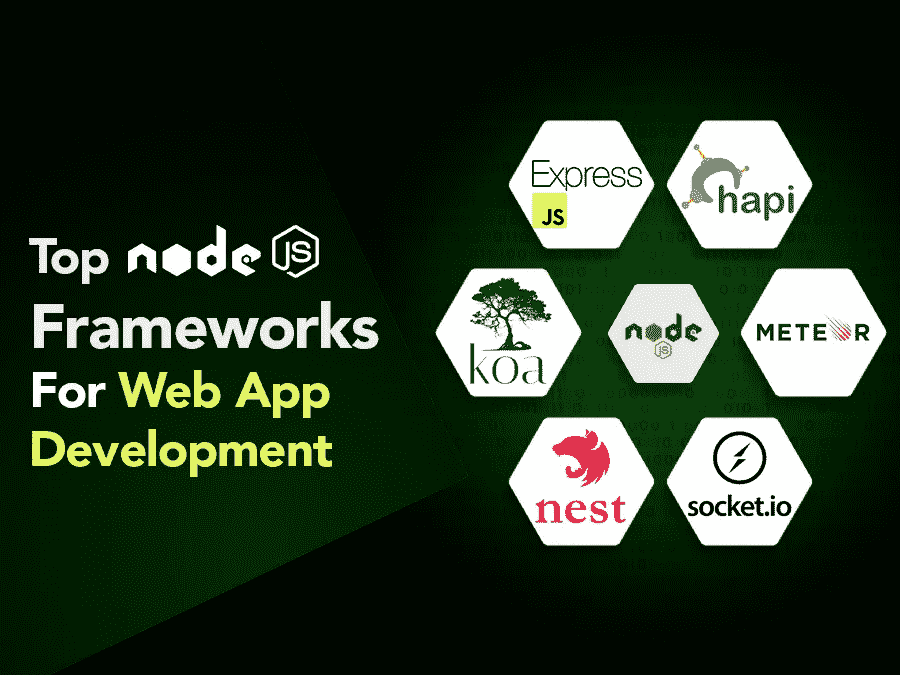

每年都有成千上万的技术、工具和框架出现在这个行业中，但很快就消失了。在应用程序开发的世界中，变化是唯一不变的事情。因此，随着新年的快速临近，每个人都在关注新的一年中冲击市场的新趋势和新技术，并让开发人员能够构建成功的 web 应用程序。

随着新冠肺炎疫情的严重打击，电子商务行业正以前所未有的速度增长，并激励世界各地的企业将其传统商业模式转移到虚拟市场。企业对创建确保无与伦比的用户体验的应用程序的需求日益增长，这实际上使他们陷入了两难境地，不知道应该选择什么技术才能在未来几十年的市场中生存下去…

考虑到这种激增的需求，开发公司一直在测试各种技术，以帮助他们构建面向未来的应用程序，并能够支持 web 应用程序开发的高级功能。

我知道，对于许多技术专家来说，简单的答案是使用 Javascript 的框架 Node.js 进行 web 应用程序开发。而这就是这样的调查报告所传达的…

*据一份调查报告显示，几乎 80%的*[](https://nodejs.org/en/user-survey-report/)**开发人员在他们的开发工作中更喜欢 Node.js。**

**根据市场调查报告，* [*五分之四的后端和全栈开发者*](https://nodejs.org/en/user-survey-report/) *将 Node.js 框架评为首选。**

*有了这些统计数据，可以说 Node.js 已经获得了全球开发者的关注。在我们进一步了解是什么让这个框架成为企业创建 web 应用程序的理想选择之前，有必要了解一下 Node.js 的基本情况。*

# ***了解 Node.js 作为 2022 年领先技术***

*Node.js 是最流行但发展最快的编程语言之一，通常用于 web 应用程序开发。但更多时候，人们认为 Node.js 是一个框架，而不是技术..*

*这似乎是一场永无止境的战斗..*

*然而，Node.js 实际上是一个 JavaScript 运行时环境，它提供了一个在服务器端执行 JavaScript 代码并使其可移植的平台。如果用简单的语言来说，Node.js 提供了一个开发人员运行程序的运行时环境。作为最快的服务器端 web 应用程序平台，它使开发人员更容易构建可伸缩的实时 web 应用程序。*

*但问题是，是什么让这项技术脱颖而出？*

## ***是什么让 Node.js 成为 Web 应用开发的值得选择？***

*作为一种快速发展的编程语言，Node.js 有多种框架可供选择。幸运的是，这些框架可以帮助你扩展、加速开发过程，并提高应用程序在不同项目中的性能。分开，下面是什么让 JavaScript 的 framework -Node.js 与众不同…？*

*   **Node.js 获得了巨大的欢迎，因为它确保了 web 应用程序开发过程的极其轻量级和灵活性。**
*   **Node.js 提供了丰富的 JavaScript 模块库，简化了应用程序开发过程。**
*   *由于其开源库，它在 web 和移动应用程序开发中变得非常流行。*
*   *Node.js 有清晰简洁的代码库，因此它最适合敏捷开发和原型开发。*
*   **基于 JavaScript 编程语言，拥有广泛的社区和支持。**
*   **Node.js 广泛用于更快地开发企业级可扩展应用。**

*如果您对 Node.js 的这些事实还不够信服，那么让我们深呼吸一下，深入了解一下 Node.js 的最新统计数据。*

## ***颇有见地的 Node.js 统计数据使其风靡全球***

*客户行为模式的转变无疑让企业重新思考其商业模式。随着对 [**web 应用程序开发解决方案**](https://www.xicom.biz/services/web-development/) 的需求不断增加，企业对于应该选择何种技术来构建确保出色用户体验的应用程序产生了极大的疑问。然而，有了这些统计数据，你就会清楚为什么 Node.js 成为 web 应用程序开发的热门选择…*

## ***关于 Node.js 的市场观察***

*   **根据调查报告，Node.js 降低了 58%的开发成本，是创业公司的首选。**
*   *根据报告，Node.js 可以将应用程序的性能提高 50%,因此 43%的 Node.js 开发人员使用它来开发企业应用程序。*
*   *Node.js 已被亚马逊、网飞、易贝、Reddit、LinkedIn、Tumblr 和 PayPal 等多个行业领导者采用。*
*   *83%的人主要将它用于 web 应用程序开发。*
*   **使用 Node.js 作为后端开发技术，PayPal 在部署 Node.js 后，其页面的平均响应时间减少了 35%。**
*   *根据 W3Tech 的数据，Node.js 被至少 3000 万个网站使用。*
*   **根据调查报告，Node.js 在 2018 年达到了 10 亿次下载，并且这个数字还在不断增加。**
*   **根据最新报告，在美国超过 63，000 个被检查的网站中，超过 37，000 个在 Node.js 上运行**

*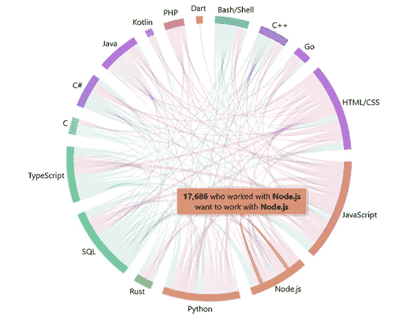*

*[Image Source](https://stackoverflow.blog/2021/08/02/2021-stack-overflow-developer-survey-results/)*

*希望通过这些调查报告、市场统计数据和 Node.js 的事实，你可以确定它正在 web 应用程序开发框架领域占据中心位置。然而，在你雇用 Node.js 应用程序开发公司之前，你们中的许多人想知道在 2022 年 web 应用程序开发应该使用哪个框架。Node.js 有各种各样的框架，但是每个框架都有自己的详细说明，并且用于不同的目的。那么如何为 2022 年的 web app 开发做出 Node.js 框架的完美选择呢？*

**以下是 2022 年 web 应用开发的顶级 Node.js 框架..**

**2022 年领先的 Web 应用开发 Node.js 框架:流行度、特性和用途**

## ***1。Express (** [**Github 人气**](https://github.com/expressjs/express) **: 55.5 k 明星| 9.4 K 叉子| 11.9M 用户使用)***

*在依靠 Node.js 的顶级框架进行网站和 web 应用程序开发的同时，Express 获得了顶级地位。Express 是 Node.js 的快速增长的 web 应用程序开发框架之一，因为它是高度轻量级的，使用起来非常灵活。由于它提供了 web 应用程序开发功能的基础层，使用 Express，应用程序开发过程变得更快、更容易。*

*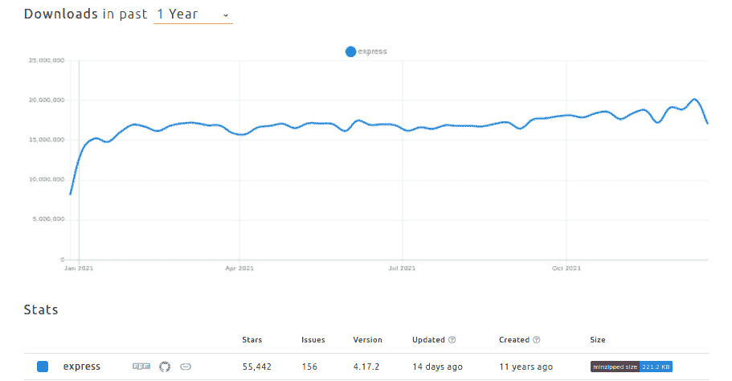*

*[Image Source](https://www.npmtrends.com/express)*

## ***快递的主要特点***

***-** Express.js 遵循 MVC 架构，使得 app 实现更容易。
-支持 14+引擎模板和 HTTP 方法。
-它能够编写健壮的 API 并注入重载包来帮助你扩展框架的功能。
- Express 包含充当路由表的路由库。*

*   ***Express 的优点
    -** 相对更容易学习和实现
    -短 app 开发周期的理想选择
    -灵活、轻量和可调整
    -支持 app 定制
    -确保高性能
    -超高测试覆盖率*
*   ***Express 的缺点
    -** 需要代码组织
    -对初学者来说很复杂*

## ***安装理念***

*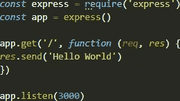*

*Credit: Author*

> ***何时使用快递？***

*它基于基于 JavaScript 的技术，称为 MEAN software stack，可用于 API 生成工具，因此可以轻松用于基于浏览器的企业级应用。*

***可用于:***

*   *单页应用程序开发*
*   *多页面应用程序开发*
*   *混合应用程序开发*

## ***2。Hapi.js (** [**Github 人气**](https://github.com/hapijs/hapi) **: 13.6 k 星| 1.3 K 叉|贡献者 209)***

*Hapi.js 是安全、最简单、最可靠的服务器之一，也是用于 web app 开发的 Node.js 开源框架。如果你选择雇佣一家 [**应用程序开发公司**](https://www.xicom.biz/services/mobile-app-development/) 来使用 Hapi.js 构建网络应用程序，你可以很容易地节省许可费用，因为它是免费使用的。它因开发代理服务器、REST APIs 和其他桌面应用程序而广为人知，因为它一直以其高端安全性而闻名。此外，为了使整个开发过程更加简单和快速，它提供了广泛的内置插件选择，因此可以降低使用非官方中间件为应用程序添加功能的风险。*

*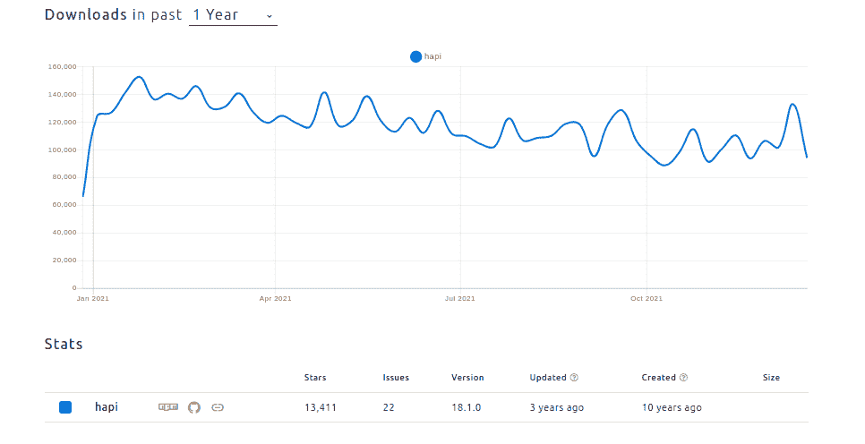*

*[Image Source](https://www.npmtrends.com/hapi)*

***hapi . js 的主要特性
-** Hapi.js 为您提供对处理请求的完全控制。
-hapi . js 的内置特性，如缓存、认证和输入验证，使得整个应用程序的开发速度更快。
——允许开发者编写健壮的 API，并能与其他工具集成。
-支持各种类型的数据库。
- Hapi.js 附带了一个 JavaScript 模板引擎，使得动态网页的渲染更加容易。
-node . js 构建实时应用的理想框架，因为它具有可伸缩的架构。*

*   ***hapi . js 的优点
    -** 架构是基于插件的，虽然它简化了实时应用的开发过程。
    -支持微服务和强大的库
    -网络服务器功能丰富，因此可确保出色的应用性能。*
*   ***Hapi.js 的缺点
    -** 基于 Hapi.js 的 app 需要手工测试
    -基于 hapi . js 的重构也需要手工练习。*

***安装指南***

*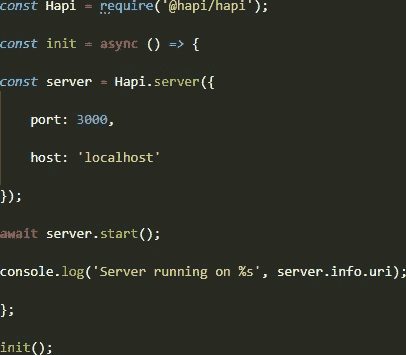*

*Credit: Author*

> ***什么时候用 Hapi.js？***

*因为它是开发安全、实时、可伸缩的社交媒体应用程序的理想框架。Rest，移动应用开发者可以用来创建代理和 API 服务器。*

***可用于:***

*   *网站开发*
*   *HTTP 代理应用程序*
*   *API 服务器*

## ***3。NestJS (** [**Github 人气**](https://github.com/nestjs/nest) **: 43.2 k 星| 4.6 K 叉| 116K 用户使用|贡献者 279)***

*web 应用程序的性能主要依赖于后端系统，为了创建一个引人注目的后端，NestJS 是一个开源的、可扩展的、通用的和进步的 Node.js 框架。近年来，NestJS 已经成为基于 TypeScript 语言的快速发展的 Node.js 框架之一。你可以雇佣 Node.js 应用开发者来编写可伸缩、可测试、松耦合的应用。*

*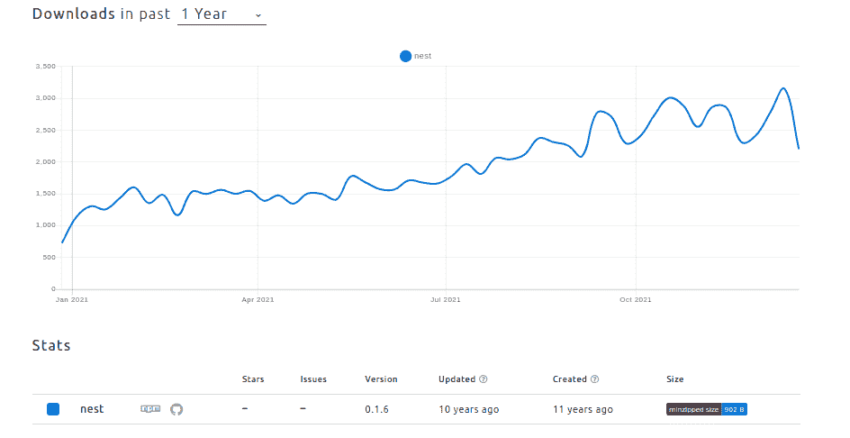*

*[Image Source](https://www.npmtrends.com/nest)*

***NestJS 框架的主要特点
-** NestJS 框架使用了许多编程范例，如 FP、OOP 和 FRP，使其更具可扩展性。
-它提供了一种模块化方法，将库排列在适当的模块中。
——它使用 TypeScript 作为自己的原生编程语言，因此，它与 Angular 完全兼容。
-它还使用了一些 Express 特性来简化开发过程。
-其简单易懂的命令行界面有助于开发人员将其与不同的工具无缝集成。*

*   ***NestJS 框架的优点
    -** 它是一种可扩展的技术
    -生态系统因开源库而充满活力
    -基于事件且实现快速
    -确保强大的企业支持*
*   ***NestJS 框架的缺点
    -** 有时，它经常表现出拥挤的性能
    -工具不成熟会减慢开发过程
    -在复杂的 UI/UX 设计中表现出设计问题*

***安装指南:***

*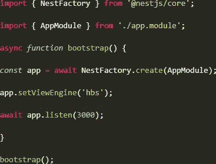*

*Credit: Author*

## ***什么时候用 NestJS？***

*Node.js 的这个框架主要用于编写可伸缩和可测试的应用程序。事实上，它将 node.js 的可伸缩性提高到了一个全新的水平。考虑到这一点，你可以雇佣一家 [**移动应用程序开发公司**](https://www.xicom.biz/services/mobile-app-development/) 来开发大型网络应用程序，因为它提供了处理复杂应用程序结构的完美平衡的效率。因此，您可以将此框架用于:*

*   *编写更干净和可重用的应用程序代码。*
*   *编写可伸缩的、可测试的和松散打包的应用程序。*
*   *使您能够编写具有更高级结构的代码，如过滤器、管道、拦截器等等。*

## ***4。meteor . js(**[**Github 人气**](https://github.com/meteor/meteor) **: 42.8 k 星| 5.2 K 叉|被 57 个用户使用|贡献者 646)***

*Meteor.js 是 Node.js 的全栈框架，可用于创建实时 web 和移动应用程序。由于它确保了应用程序的跨平台兼容性，因此被世界各地的企业普遍使用。使用 Meteor.js 最好的一点是，它可以与其他技术无缝集成，如前端框架和数据库系统，如 React、Vue、Angular 和 MongoDB。此外，Meteor.js 更接近 Node.js 进行后端开发，开发者无需使用多种编程语言就可以更容易地编写一个完整的网站。*

*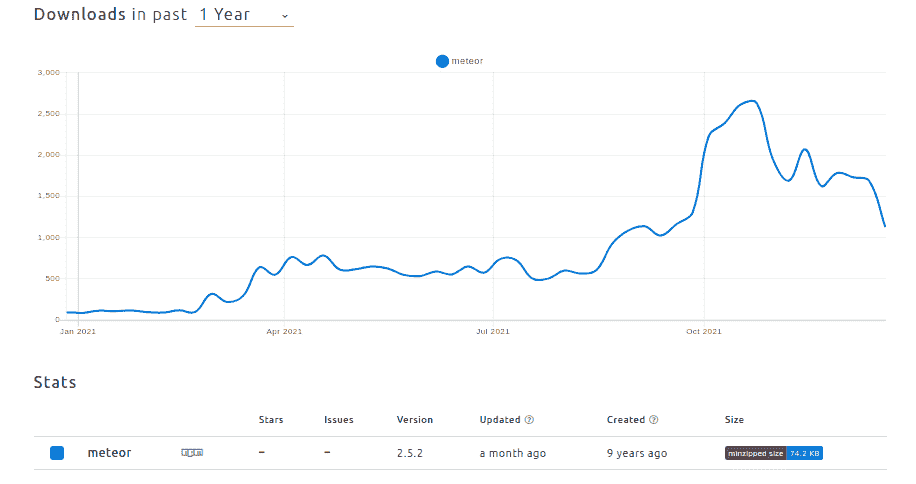*

*[Image Source](https://www.npmtrends.com/meteor)*

***meteor . js 的关键特性
-** 允许开发者为任何平台(iOS、Android 和 Web)构建应用。
-它可以很容易地与 NoSQL 数据库集成，包括 MongoDB。
- Meteor.js 是轻量级的，高度灵活的 web 应用程序开发。
-可与 Angular、React、Vue 等前 3 大前端 web 框架集成。
-它拥有一个快速增长的社区，是全栈开发者的理想选择。Meteor.js 包含了一组丰富的库，可以帮助开发者构建动态的 web 应用。*

*   ***使用 Meteor.js 的优点
    -** 该框架的轻量级架构受到开发者的赞赏。
    -meteor . js 的强大社区使其成为开发人员的首选。
    -丰富的库和包选择使得开发过程更加简单。
    -标语的无缝同步。*
*   ***使用 Meteor.js 的缺点
    -** 制作渐进式 web 应用的效率较低
    -没有网络连接灵活性
    -缺少小部件库*

***安装指南***

```
**curl https://install.meteor.com/ | sh**meteor create try-meteor**cd try-meteor**meteor**
```

***什么时候用 Meteor.js？***

*Meteor.js 是最容易学习的框架之一，具有快速原型和生成跨平台代码的能力，因此可以用于:*

*   *完成手机 app 开发。*
*   *完成 web 应用程序开发。*

## ***5。Koa.js (** [**Github 人气**](https://github.com/koajs/koa) **: 32.1 k 星| 3.1 K 叉| 197K 用户使用|贡献者 225)***

*如果您希望开发一个提供定制范围的 web 应用程序，那么 Koa.js 就是这样一个 Node.js 框架，它非常适合您的需求。尽管相对年轻，这个框架已经在 Node.js 框架列表中占据了最靠前的位置。虽然它是由 Express.js framework 的团队开发的，但它为您提供了一系列优秀的功能、处理错误的效率，并确保了 web 应用程序开发的轻量级架构。你可以 [**雇佣应用开发者**](https://www.xicom.biz/solutions/hire-developers/) ，因为它提供了各种各样的高效方法来加快制作服务器的过程，更加令人兴奋。*

*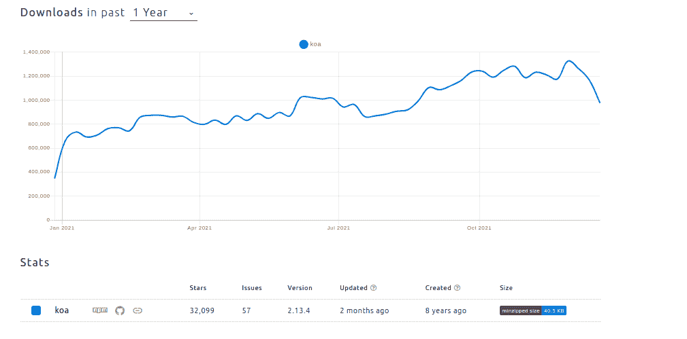*

*[Image Source](https://www.npmtrends.com/koa)*

***KOA . js 框架的主要特点
-** 了解市场不断变化的发展需求，为您提供一个现代的、面向未来的平台。
-它有内置的错误回调，防止网站或网络应用崩溃
-它使用上下文对象，可以毫不费力地处理请求和响应对象。*

*   ***使用 Koa.js 框架的优点
    -** 使用起来轻巧灵活
    -支持同步和等待关键字
    -生成器函数超越*
*   ***使用 Koa.js 框架的缺点
    -** 由于它相对较新，因此它的社区较小
    -与 express 风格中间件的兼容性几乎可以忽略。\*

***安装指南***

*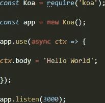*

*Credit: Author*

*什么时候用？*

*当 Koa.js 用于创建服务器、路由、处理响应和错误时，它可以用于:*

*   *开发前端系统*
*   *后端系统开发*
*   *混合系统开发*

## *6。socket . js([**Github 人气**](https://github.com/socketio/socket.io) **: 55 k 星| 9.9 K 叉| 26m 用户使用|贡献者 202)***

*如果你打算构建一个实时聊天应用，那么 Socket.js 是可以考虑的框架的理想选择。Socket.js 是 Node.js 框架之一，主要用于开发实时计算应用程序。该框架在开发人员中很有名，因为它提供了准确性，并使开发过程对开发人员来说更容易。因为它有简单明了的 API，所以开发者可以无缝地使用它进行应用开发。*

*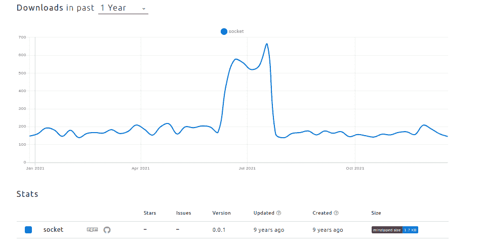*

*[Image Source](https://www.npmtrends.com/socket)*

***socket . js 的主要特性
-** 它支持自动重新连接
-无缝地为 web 应用程序添加实时功能
-将消息编码为命名的 JSON 或二进制事件
-它确保无与伦比的编码速度和可靠性
-使您能够开发即时消息和聊天应用程序，而无需处理复杂的编码。*

*   ***使用 Socket.js 的优点
    -** Socket.js 确保了 ap 的顺利认证过程
    -使 JSON 可序列化的对象没有任何麻烦
    -为 web Sockets 定制 URL 路由
    -协助多路复用
    -使用 Socket.js 可以进行实时数据分析
    -用于 web 应用程序开发既快速又安全*
*   ***使用 Socket.js 的缺点
    -** 让你的应用程序连接在服务器上保持打开
    -它缺乏创建需要定期更新的 web 应用程序。*

***安装指南***

*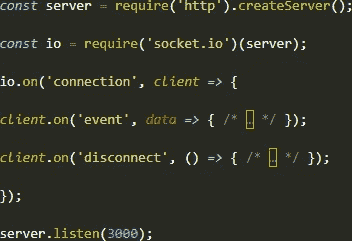*

*Credit: Author*

***何时使用？***

*Socket.js 是最好的实时双向基于事件的通信工具之一，允许开发人员向应用程序添加“实时分析”功能。然而，为了获得更好、更流畅的体验，最好雇用使用更小的套接字包并实时完成工作的移动应用程序开发人员。Rest Socket.js 可用于:*

*   *日志记录和调试*
*   *事件处理*
*   *广播*
*   *几个名称空间*
*   *错误处理*
*   *聊天应用开发*

*Node.js 框架的列表并没有到此结束。由于不同的业务有不同的开发需求，因此向专家咨询什么技术适合他们的业务需求并有助于节省开发成本和时间总是值得的。*

# ***结论***

*希望通过这篇博客指南，您对 Node.js 及其流行的框架有了详细的了解，这些框架已经发展到下一个级别。如果你想知道哪个 Node.js 框架会适合你的应用程序开发项目，那么就雇佣 [**web 应用程序开发公司**](https://www.xicom.biz/services/web-development/) 。正确使用 node.js 及其框架来构建强大的实时应用程序，肯定会帮助您在未来几年成为主导性的领导者。如果你有任何应用程序的想法，你想用流行的 Node.js 框架转换成一个健壮的解决方案，那么在下面留下一个查询。*

*======================================*

**更多内容看* [*说白了就是*](http://plainenglish.io/) *。报名参加我们的* [*免费每周简讯*](http://newsletter.plainenglish.io/) *。在我们的* [*社区不和谐*](https://discord.gg/GtDtUAvyhW) *获得独家获得写作机会和建议。**