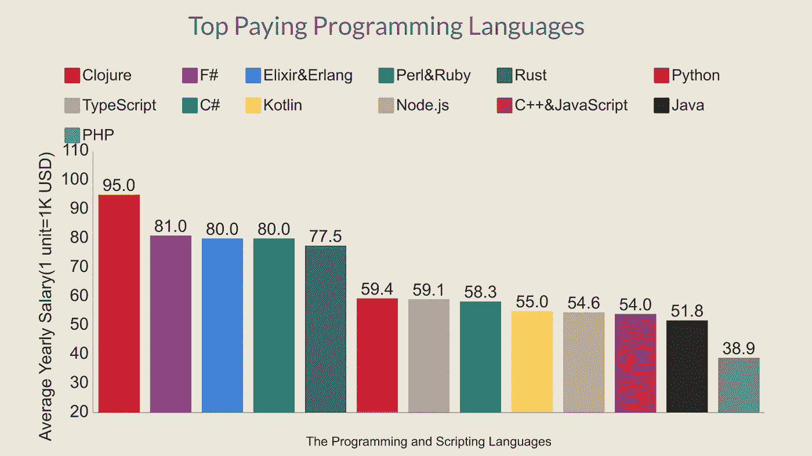
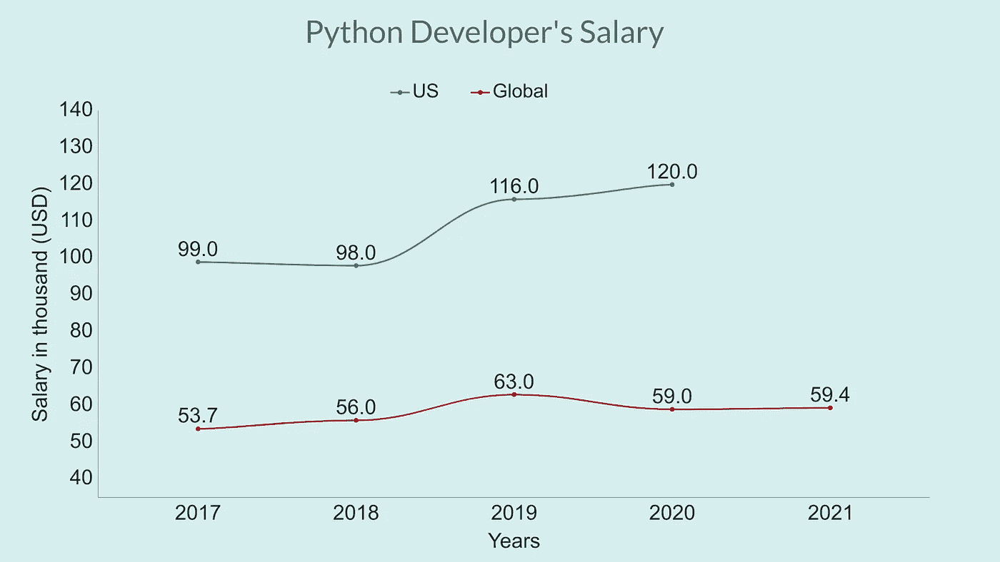
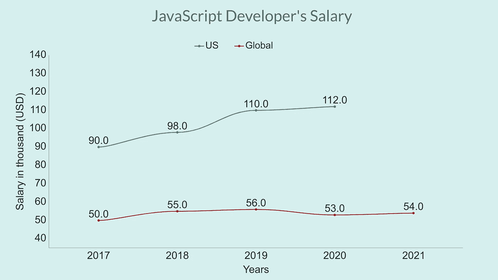

# 2021 年最受欢迎的编程和脚本语言

> 原文：<https://javascript.plainenglish.io/top-paying-programming-and-scripting-languages-of-2021-dfcd7557a26c?source=collection_archive---------7----------------------->

## 有些不是你想的那样

Photo by [Igal Ness](https://unsplash.com/@igalness?utm_source=medium&utm_medium=referral) on [Unsplash](https://unsplash.com?utm_source=medium&utm_medium=referral)

“顶级付费技术”对每个开发者来说都是一个非常有吸引力的名词。每个开发人员都想赚更多的钱，学一些高薪的东西。尽管我认为如果你在软件开发行业很熟练，无论你使用什么技术都可以赚很多钱。

但是，这篇文章是根据 Stack Overflow 的 2021 年开发者调查撰写的。这些数据是从世界各地的开发者那里收集来的。共有 46，693 名开发人员参与了此次调查。

我没有包括所有的语言。这里只提到一些顶级语言和一些流行语言。让我们开始吧。

# 顶级付费语言

Photo: Author, Data: StackOverflow

上图是根据全球开发商 Stackoverflow 的调查数据制作的。但是美国的平均工资比图表中的要高得多。

Clojure 是去年收入最高的语言。Clojure 是一种函数式编程语言，运行在 **JVM** 、 **CLR、**和 **JavaScript** 平台上。开发人员每年挣 9.5 万美元。

PHP 是上述列表中收入最低的语言。一个普通的 PHP 开发人员年收入为 38.9 万美元。

一些流行的语言如 Perl、Ruby、Rust、Go 都在榜单的前十名。

我不能在图表中包括所有的语言，因为那会很难理解。但是有一种语言的平均工资比 PHP 低。那是达特。Dart 开发人员每年挣 33000 美元。

另一个值得注意的重要事实是，Kotlin 开发人员比 Java 开发人员挣得多。

再来说说我最喜欢的两种语言，Python 和 JavaScript。

## 计算机编程语言

Python 是最流行的语言之一。这是因为它非常容易学习，并且用于开发网站和软件、任务自动化、数据分析、数据可视化等等。

我们来看看 Python 开发者最近五年的平均工资。

我们可以看到，美国开发者的平均工资远高于 global 的工资。Stackoverflow 没有公布 2021 年美国开发者的工资，所以我在这里无法把那个包括进去。

## Java Script 语言

Javascript！JavaScript 可能是目前世界上最流行的语言。

JavaScript 的受欢迎程度急剧增加，因为它无处不在。将所有 web 开发统一在一种编程语言下，而不是针对服务器端和客户端脚本的不同语言。

让我们看看 JavaScript 开发人员最近五年的工资。

# 一些重要的见解

但是今天我要讨论的是不同编程和脚本语言的平均工资是多少。但在开始之前，有一件事我应该弄清楚。

**首先**，工资多不代表需求多。相反，我发现情况往往相反。你可以在图表中看到。Python 和 JavaScript 是两种最流行的语言。但是他们不在名单的首位，对吗？

**其次**，你不应该通过调查来判断最好的开发者或者他们的薪水。一个优秀的 javascript 开发人员的薪水可能比这个列表中的其他人都高。

**第三**，美国和印度的开发者之间有巨大的薪资差距。所以，我经常发现，一项技术在印度越受欢迎，它的平均工资就比不太受欢迎的技术低。

*感谢阅读。请关注并订阅我的 Medium 个人资料，如果您不是 Medium 的成员，您可以从* [***这里***](https://thefemaleprogrammer.medium.com/membership) *成为 Medium 的一员。*

[这是我的另一篇文章:“跳槽”策略让我的工资翻了 3 倍](/changing-job-strategy-made-my-salary-3x-76ee44c53f50)