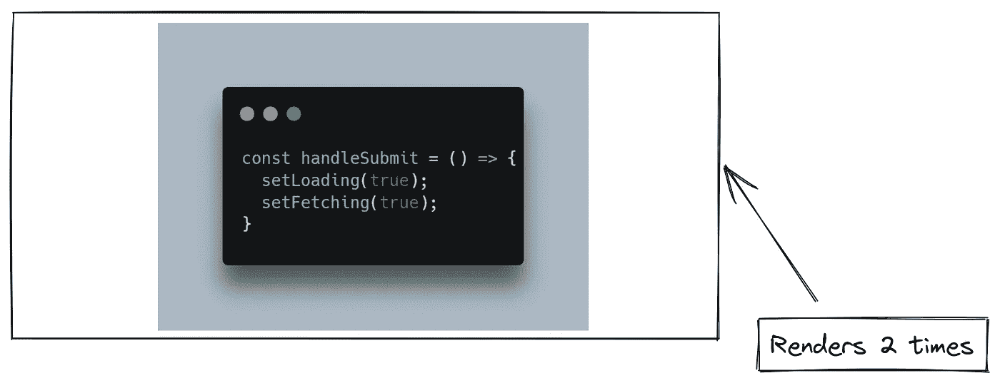
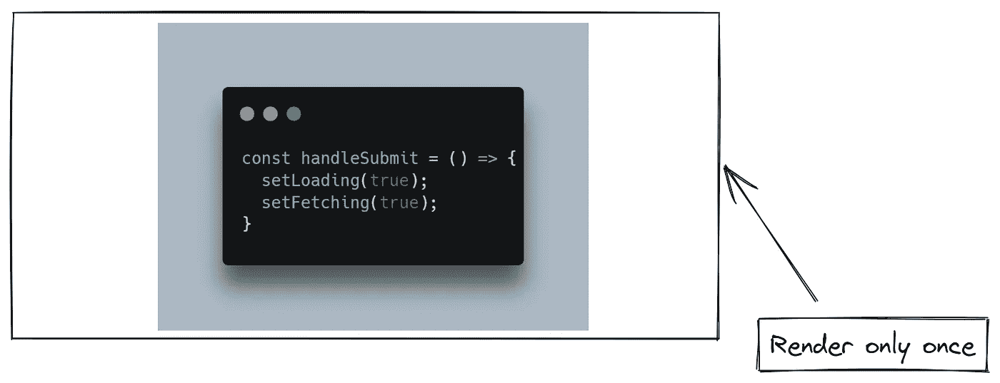
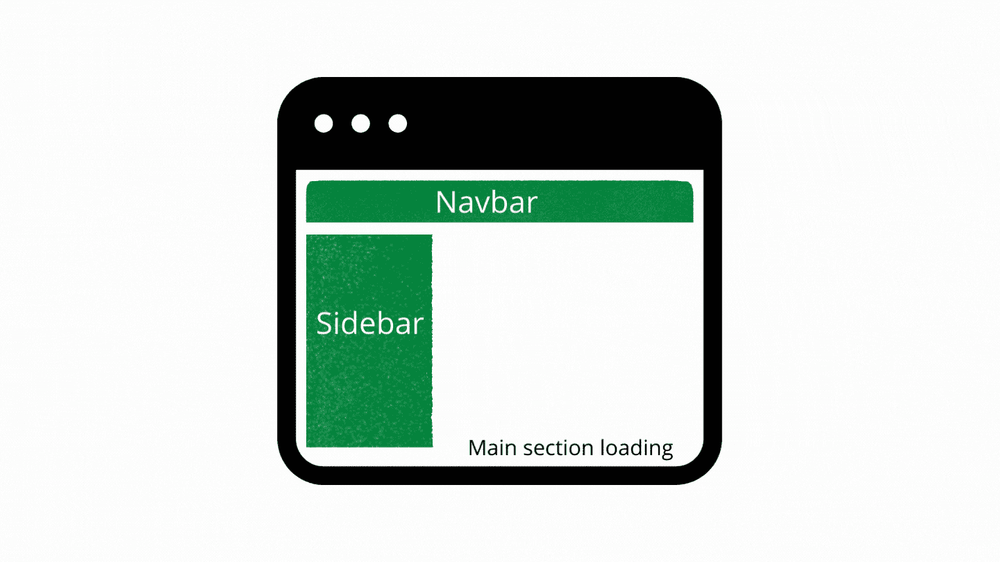
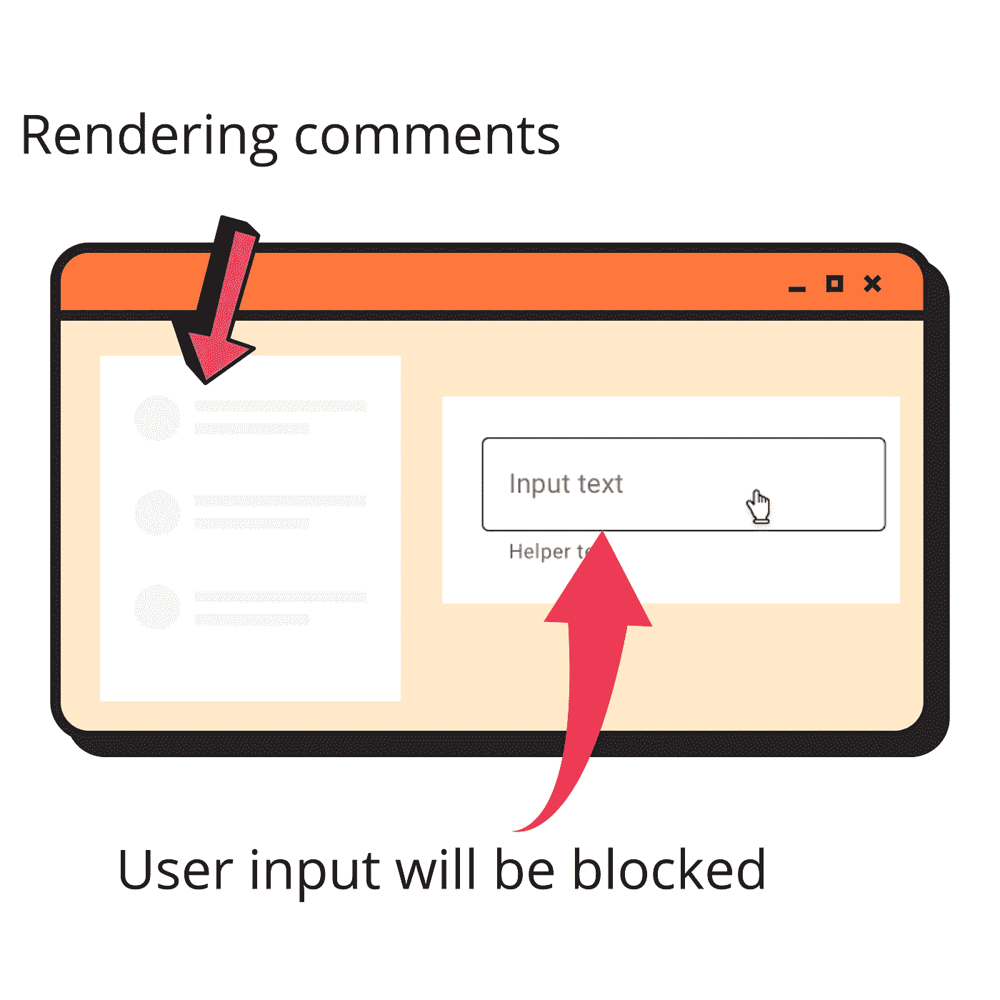

# 在不到 5 分钟的时间里解释了 18 个顶级 React 功能！

> 原文：<https://javascript.plainenglish.io/top-react-18-features-explained-in-less-than-5-mins-f0095d1fa22c?source=collection_archive---------2----------------------->

## 对变化的总体总结。

Source: Canva

最近 React 18 发布了，我也忍不住想试一试。我浏览了 React 官方网站上的变更日志、讲座和博客帖子，以了解这些功能。这篇博文将分享我的理解，并保持细节简洁，以呈现这些变化的总体总结。

事不宜迟，让我们直入主题吧！🦘

# React 18 有什么新功能？

React 核心团队努力支持 React 中的并发性，这实现了新的功能并有助于创建流畅的 UI。并发的一个基本属性是 React 中的呈现是**可中断的。** React 将决定何时开始、暂停和恢复更新。有了这个功能，它将等待整个树被计算，并在最后执行 DOM 操作。这种方法保持了主线程的自由，从而实现了流畅的用户体验。如果正在进行繁重的渲染，UI 仍然可以通过中断渲染过程来快速响应用户交互。

React 中的并发实现依赖于优先级队列和多重缓冲等概念。但是作为一个应用程序开发人员，你需要知道它的更高层次的细节，这是我们刚刚在上面学到的。v18 的许多功能在核心处使用了并发性，比如过渡和悬念。

**那么并发性会被打破吗？**

技术上说是的！由于并发性，React 呈现是可中断的，因此某些组件的行为可能会改变。但是正如 React 团队所说，

在我们的测试中，我们已经升级了数千个组件来响应 18。我们发现，几乎所有现有的组件都“能够”与并发渲染一起工作，没有任何改变。但是，其中一些可能需要一些额外的迁移工作。尽管这些变化通常很小，但您仍然有能力按照自己的步调做出改变。

# 新功能

1.  **改进的自动配料**

在 React 18 之前，状态更新的批处理仍然是可能的，但是只能使用 React 事件处理程序。默认情况下， *promises、setTimeout、本地事件处理程序*或任何其他事件中的更新不会在 React 中批处理。使用*自动批处理*，这些更新将被默认批处理。批处理意味着将所有更新操作发送到单个批处理中，以便只呈现一次 UI，而不是为所有更新操作重新呈现 UI。

No event batching for user handlers before React 18

Event batching with React 18

2.**服务器渲染悬念**

服务器渲染是一种技术，在这种技术中，服务器将计算出的 HTML 发送给客户端，以便用户看到一些东西。一旦发送了 HTML，服务器就会捆绑 JS 文件，并在后台将它们传输到客户端。在 JS 成功加载到客户端之前，UI 对用户没有响应。

在 React 18 之前，这种方法存在问题。假设在一个应用程序中，有一个组件比其他组件慢。在这种情况下，整个应用程序的 HTML 不会被加载，直到慢速组件的数据被获取。在 HTML 到达客户端之前，用户将会看到一个空白的屏幕，从而造成了糟糕的用户体验。

React 18 在服务器端渲染中对悬念 API 的支持解决了这个问题。我们现在可以暂停最慢的组件，并显示一个后备组件，直到它的数据到达。这将几乎立即向客户端发送 HTML，并显示最慢组件的后备组件。一旦组件有了数据，它的 HTML 将通过相同的流发送到客户机。

Using Suspense for data-heavy component

Using Suspense to show the fallback spinner for the Main section

3.**用于并发特性的新 APIs】**

React 引入了一些新的 API 来访问它的并发特性。API 如下—

React Concurrent APIs

React 引入了一个新概念——**转换**，区分紧急和非紧急任务。紧急任务是指需要对用户交互(如键盘点击、UI 交互等)做出即时响应的任务。而非紧急任务(或转换)不需要立即行动。这些可以推迟到紧急行动尽快完成。推迟紧急任务的非优先操作有助于创造流畅的用户体验。

例如:假设在一个网页上有一个评论组件和一个输入组件来写评论。因为 comments 组件使用 REST API 来获取结果，所以组件需要一段时间来加载和呈现数据。因为 comments 组件需要大量的呈现，所以在 comments 部分的呈现完成之前，input 组件是无意义的。现在，这就是我所说的创造“糟糕体验”的东西。您正在尝试单击输入组件来编写注释，但是它没有响应，因为 CPU 正忙于呈现注释组件。

User events will be blocked until the comments section is rendered completely (Before React 18)

这就是上面的转换 API 将提供帮助的地方。在它们的帮助下，您可以让 React 知道注释组件呈现是一个非紧急任务，它可能会因为紧急任务的发生而被中断，这里是输入组件交互。

封装在转换 API 中的任何更新都将被视为非紧急任务，React 将中断它以完成紧急任务。

以上是 React 18 的突出特点。这些特性无疑改善了开发者和用户的体验。请在评论中告诉我你喜欢这个博客。如果这分享了一些信息，请给一些掌声。

*我是一个 React 和 JavaScript 的人。我在媒体上与世界分享我的知识。请关注我以获取更多内容。也可以关注我的* [*推特*](https://twitter.com/utkarsh22garg) *。*

*更多内容请看*[***plain English . io***](https://plainenglish.io/)*。报名参加我们的**[***免费周报***](http://newsletter.plainenglish.io/) *。关注我们关于* [***推特***](https://twitter.com/inPlainEngHQ) *和**[***LinkedIn***](https://www.linkedin.com/company/inplainenglish/)*。加入我们的* [***社区***](https://discord.gg/GtDtUAvyhW) *。***